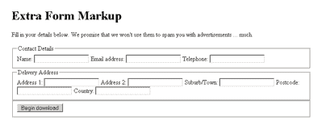
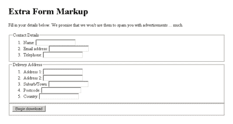
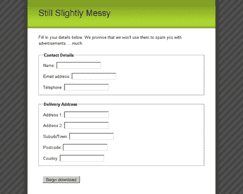

# 使用 CSS 文章的花式表单设计

> 原文：<https://www.sitepoint.com/fancy-form-design-css-2/>

***使用 CSS***

为了创建这些不同类型的`[form](https://reference.sitepoint.com/html/form)`布局，我们将使用相同的标记，但是使用不同的 CSS 规则。

在我们的例子中，HTML 看起来像这样:

```
<form action="example.php">   
<fieldset>   
<legend>Contact Details</legend>   
<ol>   
<li>   
<label for="name">Name:</label>   
<input id="name" name="name" class="text" type="text" />   
</li>   
<li>   
<label for="email">Email address:</label>   
<input id="email" name="email" class="text" type="text" />   
</li>   
<li>   
<label for="phone">Telephone:</label>   
<input id="phone" name="phone" class="text" type="text" />   
</li>   
</ol>   
</fieldset>   
<fieldset>   
<legend>Delivery Address</legend>   
<ol>   
<li>   
<label for="address1">Address 1:</label>   
<input id="address1" name="address1" class="text"   
type="text" />   
</li>   
<li>   
<label for="address2">Address 2:</label>   
<input id="address2" name="address2" class="text"   
type="text" />   
</li>   
<li>   
<label for="suburb">Suburb/Town:</label>   
<input id="suburb" name="suburb" class="text"   
type="text" />   
</li>   
<li>   
<label for="postcode">Postcode:</label>   
<input id="postcode" name="postcode"   
class="text textSmall" type="text" />   
</li>  

<li>   
<label for="country">Country:</label>   
<input id="country" name="country" class="text"   
type="text" />   
</li>   
</ol>   
</fieldset>   
<fieldset class="submit">   
<input class="submit" type="submit"   
value="Begin download" />   
</fieldset>  
</form>
```

这个 HTML 使用了我们在本章前面看到的完全相同的`fieldset-legend-label`结构。然而，您应该看到一个明显的附加内容:在`[fieldset](https://reference.sitepoint.com/html/fieldset)`元素内部是一个有序列表，它的列表项包围了我们正在使用的每个表单元素/标签对。

这个增加的原因？我们需要一些额外的标记，以便考虑到我们将在本章中对表单进行的所有样式。在标准的`fieldset-label`结构中没有足够的样式挂钩来允许我们提供健壮的边框、背景颜色和列对齐。

有一些多余的元素，我们可以添加到表单中，给我们额外的造型挂钩。我们可以将表单元素移动到它们的`[label](https://reference.sitepoint.com/html/label/)`元素中，并将`[label](https://reference.sitepoint.com/html/label/)`文本包装在一个`[span](https://reference.sitepoint.com/html/span)`中，或者将一个`[div](https://reference.sitepoint.com/html/div)`包装在每个表单元素/标签对周围。然而，除了它的存在之外，这些选择没有一个真正对标记有任何贡献。

使用有序列表的好处在于，它为表单的结构增加了额外的语义级别，并且使得表单在没有样式的情况下也能很好地显示(比如在 Netscape 4 等传统浏览器上，甚至是简单的移动设备上)。

如果没有应用 CSS 和有序列表，呈现的标记将如图 6 所示。


*图 6:没有任何多余标记的无样式表单([在新窗口查看大图](https://i2.sitepoint.com/graphics/forms_unstyled-no-lists.png))。)*

图 7 显示了当我们包含有序列表时，无样式表单的外观。


*图 7:每个字段集内包含有序列表的非样式表单
( [在新窗口中查看大图](https://i2.sitepoint.com/graphics/forms_unstyled-lists.png))。)*

我相信您会同意包含有序列表的表单版本更容易理解，因此更容易填写。

***在表单中使用列表*** *如果你强烈反对在你的 form.markup 中包含一个有序列表，你可以很容易地用其他的包装元素来代替它；您只需要在每个表单元素/标签对周围放置一个额外的容器，就可以随心所欲地设计表单的样式。*

您可能已经注意到的另外两个奇怪的 HTML:

*   每个表单输入都有一个复制其类型属性的类，例如`class="text" type="text"`。如果您需要设计表单元素的样式，这是一种方便的访问方式，因为 Internet Explorer 6 和更早的版本不支持 CSS 属性选择器(尽管 Internet Explorer 7 支持，所以在不久的将来您可能不需要包含这些额外的类)。
*   表单提交按钮包含在它自己的`[fieldset](https://reference.sitepoint.com/html/fieldset)`和`class="submit.`中，在一个表单的末尾你会经常有多个动作，比如“提交”和“取消”。“在这种情况下，能够对这些动作进行分组是非常方便的，而`[fieldset](https://reference.sitepoint.com/html/fieldset)`很好地做到了这一点。如果任何样式被应用于普通的`[fieldset](https://reference.sitepoint.com/html/fieldset)`元素，你通常会希望这些动作周围的`[fieldset](https://reference.sitepoint.com/html/fieldset)`有不同的样式，所以这个类对于区分我们的动作`[fieldset](https://reference.sitepoint.com/html/fieldset)`是必要的。里面的`[fieldset](https://reference.sitepoint.com/html/fieldset)`和`[input](https://reference.sitepoint.com/html/input)`有相同的类名，因为术语“提交”对它们都有意义，但是在 CSS 中通过在类选择器前面加上元素选择器很容易区分它们，正如我们将在下面看到的。

**应用通用表单样式**

不管我们选择哪种布局，都有许多样式可以应用到我们的表单中。这些样式主要围绕包含空格来帮助分隔表单元素和`[fieldset](https://reference.sitepoint.com/html/fieldset)`元素:

```
fieldset {   
margin: 1.5em 0 0 0;   
padding: 0;  
}  
legend {   
margin-left: 1em;   
color: #000000;   
font-weight: bold;  
}  
fieldset ol {   
padding: 1em 1em 0 1em;   
list-style: none;  
}  
fieldset li {   
padding-bottom: 1em;  
}  
fieldset.submit {   
border-style: none;  
}
```

`[fieldset](https://reference.sitepoint.com/html/fieldset)`上的`[margin](https://reference.sitepoint.com/css/margin)`有助于将每个`[fieldset](https://reference.sitepoint.com/html/fieldset)`组与其他组分开。所有内部的`[padding](https://reference.sitepoint.com/css/padding)`现在都从`[fieldset](https://reference.sitepoint.com/html/fieldset)`中移除了，因为稍后当我们开始浮动元素并给它们一个`[width](https://reference.sitepoint.com/css/width)`时，它会引起问题。由于`[padding](https://reference.sitepoint.com/css/padding)`不包括在`[width](https://reference.sitepoint.com/css/width)`中，如果你有`100%`和一些`[padding](https://reference.sitepoint.com/css/padding)`的宽度，它可以打破你的表单的尺寸。移除`[padding](https://reference.sitepoint.com/css/padding)`也有助于解决浏览器之间关于`[fieldset](https://reference.sitepoint.com/html/fieldset)`默认内部间距的不一致。

为了帮助定义一个视觉层次，清楚地显示在`[legend](https://reference.sitepoint.com/html/legend)`下分组的`[fieldset](https://reference.sitepoint.com/html/fieldset)`中的每个`[label](https://reference.sitepoint.com/html/label/)`，我们给我们的`[legend](https://reference.sitepoint.com/html/legend)`元素一个 `<font code="">of `bold`。我们还必须替换从`[fieldset](https://reference.sitepoint.com/html/fieldset)`上的`[padding](https://reference.sitepoint.com/css/padding)`移除的间距，因此我们给`[legend](https://reference.sitepoint.com/html/legend)`一个`1em`的`[margin-left](https://reference.sitepoint.com/css/margin-left)`。</font>`

为了关闭出现在有序列表中的自然编号，我们在`[ol](https://reference.sitepoint.com/html/ol)`上将`[list-style](https://reference.sitepoint.com/css/list-style)`设置为`none`，从而删除了这种列表中通常存在的任何项目符号格式。然后，为了重新创建我们从`[fieldset](https://reference.sitepoint.com/html/fieldset)`中移除的内部间距，我们给有序列表一些`[padding](https://reference.sitepoint.com/css/padding)`。没有`[padding](https://reference.sitepoint.com/css/padding)`放在列表的底部，因为这将被最后一个列表项的`[padding](https://reference.sitepoint.com/css/padding)`占用。

为了将每个表单元素/标签对与其他对分开，我们给包含列表项一个`1em`的`[padding-bottom](https://reference.sitepoint.com/css/padding-bottom)`。

最后，为了去掉 submit 按钮作为表单元素组的外观，我们需要去掉它周围的边框`[fieldset](https://reference.sitepoint.com/html/fieldset)`。该步骤通过使用`fieldset.submit`选择器瞄准它并将`[border-style](https://reference.sitepoint.com/css/border-style)`设置为`none`来实现。

在应用了所有这些标记并添加了一些通用的页面布局样式之后，我们最终得到了图 8——一个开始成形的表单，但是仍然有点混乱。


*图 8:应用了常规样式但没有布局样式的表单*

现在我们可以继续添加一些布局样式了！

**Go to page:** [1](/fancy-form-design-css) | [2](/fancy-form-design-css-2/) | [3](/fancy-form-design-css-3/) | [4](/fancy-form-design-css-4/) | [5](/fancy-form-design-css-5/) | [6](/fancy-form-design-css-6/) | [7](/fancy-form-design-css-7/)

## 分享这篇文章