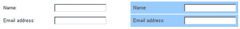
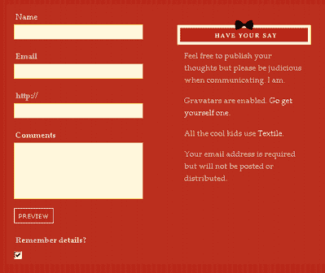
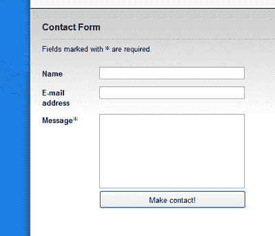
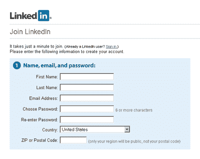

# 使用 CSS 文章的花式表单设计

> 原文：<https://www.sitepoint.com/fancy-form-design-css/>

作为 [CSS 主题周](https://www.sitepoint.com/css-theme-week-more-css-than-you-can-handle)的一部分，本周的每一天，我们都会发表一篇由我们编辑精心挑选的文章。

**表格。还有哪个词能让成熟的网页设计师如此恐惧？**

我认为表单作为不可驯服的丑陋必需品的名声来自两个原因:

*   表单元素源自本机操作系统小部件，这使得它们很难设计样式。
*   表单通常对网站的功能至关重要——它们通常被用作搜索框、查询表单或购物车结帐台——并且需要尽可能平稳地运行以满足用户的期望。

然而，仍然有可能将这两点结合到设计一个适合站点其余部分风格的表单中。这一章是从[*CSS*](https://www.sitepoint.com/books/cssdesign1/)的艺术与科学开始的，它将探索如何设计一个好看的表单，并为你提供必要的代码，我们将一起完成。你也可以[下载这篇文章](https://www.sitepoint.com/books/cssdesign1/)的 PDF 格式。

##### 可访问的表单标记

在我们开始研究表单布局之前，我们需要制作一些真正可靠的标记，为我们提供一个框架，我们可以在其中添加一些样式。

表单代表了您的网站中的一个区域，您必须投入时间和精力来确保用户的可访问性。尽管表单代表了网页上可能发生的一些最复杂的交互，但在许多情况下，这些交互只是通过可视化的方式来表示——通过表单元素与其`[label](https://reference.sitepoint.com/html/label)`的接近度，或者通过边框和背景颜色来分组。屏幕阅读器等辅助技术的用户可能看不到这些视觉线索，因此通过确保可访问性来支持这些用户是至关重要的。提供可访问表单背后的关键概念是对其所有部分和`[input](https://reference.sitepoint.com/html/input)`元素进行描述性标记。

特别是，这意味着正确使用两个元素:`[label](https://reference.sitepoint.com/html/label)`和`[legend](https://reference.sitepoint.com/html/label)`。

还有一种错误的想法，认为保证表单正确显示的唯一方法是使用表格。这里为表单复制的所有代码都是基于标准的语义标记，所以您现在没有理由依赖表格了！

***标注表格元素***

无论您如何设计表单元素及其`[label](https://reference.sitepoint.com/html/label/)`的样式，它通常都符合某种模式:

*   表单元素本身
*   元素的文本标签
*   元素及其文本描述之间的联系

这种联系是通过视觉对准、视觉分组或一些其他视觉指示器来实现的。在图 1 中，您可以看到左边的表单纯粹通过对齐在字段元素和它的标签之间建立了一个连接，而右边的表单通过使用颜色指示了一个更明确的连接。


*图 1:表单中的可视连接([在新窗口中查看大图](https://i2.sitepoint.com/graphics/forms_connection.png))。)*

当在创建表单时为辅助技术的用户提供便利时，有一个主要问题需要考虑。如果没有邻近或分组的视觉提示，看不到网页的用户如何在表单元素和文本标签之间建立联系？

答案是`[label](https://reference.sitepoint.com/html/label/)`元素。`[label](https://reference.sitepoint.com/html/label/)`是一个应用于表单元素的特殊元素，允许其文本描述在语义上链接到元素本身，因此任何辅助技术(如屏幕阅读器)在遇到其伙伴表单元素时都可以读出该文本。

为了使用一个`[label](https://reference.sitepoint.com/html/label/)`，将文本描述包装在一对`[label](https://reference.sitepoint.com/html/label/)`标签中，然后给`[label](https://reference.sitepoint.com/html/label/)`添加一个`[for](https://reference.sitepoint.com/html/label/for)`属性。属性`[for](https://reference.sitepoint.com/html/label/for)`的值应该是您想要创建连接的表单元素的`[id](https://reference.sitepoint.com/html/core-attributes/id)`:

```
<label for="firstName">First name</label>
<input id="firstName" name="firstName" type="text" />
```

现在，当 screenreader 遇到`firstName`字段时，它还会向用户读出文本“First name ”,这样他或她就知道该在该字段中键入什么。`[label](https://reference.sitepoint.com/html/label/)`不必靠近表单元素，也不必按任何特定的顺序排列——只要`[label](https://reference.sitepoint.com/html/label/)`的`for`属性包含有效的引用，就能理解这种关系。然而，在源顺序中，将`[label](https://reference.sitepoint.com/html/label/)`放在表单元素之前通常最有语义意义。

一个`[label](https://reference.sitepoint.com/html/label/)`应该应用于任何没有自动包含描述性文本的表单元素，例如:

*   复选框
*   单选按钮
*   `[textarea](https://reference.sitepoint.com/html/textarea)`年代
*   文本字段
*   `[select](https://reference.sitepoint.com/html/select)`盒子

提交按钮和提交图像不需要`[label](https://reference.sitepoint.com/html/label)`元素，因为它们的描述分别包含在它们的`[value](https://reference.sitepoint.com/html/input/value)`和`[alt](https://reference.sitepoint.com/html/input/alt)`属性中。

当然，您可以使用 CSS 轻松地设置`[label](https://reference.sitepoint.com/html/label/)`中文本的样式，因此您可以像使用`[span](https://reference.sitepoint.com/html/span)`、`[p](https://reference.sitepoint.com/html/p)`或`[div](https://reference.sitepoint.com/html/div)`一样格式化表单中的`[label](https://reference.sitepoint.com/html/label/)`文本，但是使用`[label](https://reference.sitepoint.com/html/label/)`的好处是比这些元素更容易访问。

***分组相关元素***
[图例](https://reference.sitepoint.com/html/legend)与`[fieldset](https://reference.sitepoint.com/html/fieldset)`齐头并进。事实上，一个传说可以成为子*的唯一元素是*一个`[fieldset](https://reference.sitepoint.com/html/fieldset)`。一个`[fieldset](https://reference.sitepoint.com/html/fieldset)`集合了一系列相关的表单元素。例如，“街道地址”、“郊区”、“州”和“邮政编码”都可以归在“`postal address`”下您可以创建一个将所有这些元素分组的`[fieldset](https://reference.sitepoint.com/html/fieldset)`，并给它一个合适的`[legend](https://reference.sitepoint.com/html/legend)`来描述这个组:

```
<form action="example.php">
<fieldset>
<legend>Postal Address</legend>
<label for="street">Street address</label>
<input id="street" name="street" type="text" />
<label for=" suburb">Suburb</label>
<input id="suburb" name="suburb" type="text" />
<label for="state">State</label>
<input id="state" name="state" type="text" />
<label for="postcode">Postcode</label>
<input id="postcode" name="postcode" type="text" />
</fieldset>
</form>
```

现在`[legend](https://reference.sitepoint.com/html/legend)`已经与`[fieldset](https://reference.sitepoint.com/html/fieldset)`中的所有表单元素相关联，当使用屏幕阅读器的人关注其中一个表单元素时，屏幕阅读器也会读出`[legend](https://reference.sitepoint.com/html/legend)`文本:“邮政地址；郊区。”
当您有两组除了组类型之外非常相似的元素时，screenreader 指定`[legend](https://reference.sitepoint.com/html/legend)`和`[fieldset](https://reference.sitepoint.com/html/fieldset)`的好处就显而易见了:

```
<form action="example.php">
<fieldset>
<legend>Postal Address</legend>
<label for="street">Street address</label>
<input id="street" name="street" type="text" />
<label for=" suburb">Suburb</label>
<input id="suburb" name="suburb" type="text" />
<label for="state">State</label>
<input id="state" name="state" type="text" />
<label for="postcode">Postcode</label>
<input id="postcode" name="postcode" type="text" />
</fieldset>
<fieldset>
<legend>Delivery Address</legend>
<label for="deliveryStreet">Street address</label>
<input id="deliveryStreet" name="deliveryStreet"
type="text" />
<label for="deliverySuburb">Suburb</label>
<input id="deliverySuburb" name="deliverySuburb"
type="text" />
<label for="deliveryState">State</label>
<input id="deliveryState" name="deliveryState"
type="text" />
<label for="deliveryPostcode">Postcode</label>
<input id="deliveryPostcode" name="deliveryPostcode"
type="text" />
</fieldset>
</form>
```

如图 2 所示，有了`[fieldset](https://reference.sitepoint.com/html/fieldset)`的`[legend](https://reference.sitepoint.com/html/legend)`元素，很容易直观地确定哪些字段属于哪个组，甚至在非样式表单上也是如此。


*图 2:使用`[fieldset](https://reference.sitepoint.com/html/fieldset)`和`[legend](https://reference.sitepoint.com/html/legend)`元素进行分组的无样式表单([在新窗口中查看大图](https://i2.sitepoint.com/graphics/forms_unstyled-fields.png))。)*
但是，你会问，用`h1`元素代替`[legend](https://reference.sitepoint.com/html/legend)`元素难道不能达到同样的视觉效果吗？
是的。然而，使用`[legend](https://reference.sitepoint.com/html/legend)`的意义在于，如果没有适当的语义分组和标记，屏幕阅读器用户会对为什么他或她被要求输入两次“地址 1”感到困惑。通过包含的`[legend](https://reference.sitepoint.com/html/legend)`，用户将知道第二个“地址 1”实际上属于另一个组——递送地址的组。
因此，通过结合`[label](https://reference.sitepoint.com/html/label/)`和`[legend](https://reference.sitepoint.com/html/legend)`，我们让视障用户能够更轻松地导航和填写表单。通过使用这种组合作为表单的基本结构，您将确保它们不仅看起来很棒，而且还易于访问！

##### 表单布局

有几种不同的方法可以用来设计表单。您选择的方法取决于表单的长度、它的用途、每个必须填写表单的人使用它的频率，当然还有网页的总体美观。
每行一个表单元素通常被认为是最有效的，因为大多数西方语言的网页被设计成垂直滚动而不是水平滚动。这使得用户可以很容易地遵循完成的路径，并把注意力集中在一次输入一条数据上。
对于从左到右阅读系统中的每个表单元素，合理的做法是以三种方式之一放置相应的`[label](https://reference.sitepoint.com/html/label/)`:

*   在表单元素的正上方
*   在单独的左列中，左对齐
*   在单独的左列中，右对齐

每种方法都有自己的优点和外观，所以在决定如何为特定页面设计表单时，请考虑这些选项。位于表单元素正上方的标签被证明是用户处理得最快的。标签和元素之间的紧密组合通过允许用户同时观察两者来减少眼球运动——这里有一篇由 [UXmatters](http://www.uxmatters.com/MT/archives/000107.php) 发表的优秀文章。然而，这种类型的定位是相当功利的，并不是最美观的布局。它还有一个缺点，就是占据了三种布局中最垂直的空间，会让一个很长的表单变得更长。一般来说，顶部放置的标签对于用户熟悉的短表单很有效——参见图 3 中的评论表单，它来自对话网站的前身。


*图 3:位于表单元素上方的标签*
位于元素左侧一列中的标签看起来更有条理和整洁，但是这些标签中文本的对齐方式也会影响表单的可用性。
文本右对齐可以在标签和元素之间创建更强的分组。然而，标签参差不齐的左边缘会使表单看起来混乱，降低用户自己浏览标签的能力，正如卢克·乌鲁布莱夫斯基在他的[文章中所讨论的那样。](http://www.lukew.com/resources/articles/web_forms.html)在左对齐的列中，标签立即变得更容易扫描，但是它们与相关表单元素的分组变得更弱。用户不得不花费更多的时间将标签与其元素相关联，从而导致表单完成速度变慢。在图 4 中可以看到一个左对齐标签的例子。


*图 4:标签定位在一列中并左对齐— [蓝衣男子](http://www.themaninblue.com/contact/)*
图 5 中所示的右对齐列布局允许标签和元素之间更快的关联，因此它也更适合用户会重复访问的表单。这两种布局都具有占用最小垂直空间的优点。


*图 5:位于一列中并右对齐的标签—[LinkedIn](https://www.linkedin.com/register)*

**Go to page:** [1](/fancy-form-design-css) | [2](/fancy-form-design-css-2/) | [3](/fancy-form-design-css-3/) | [4](/fancy-form-design-css-4/) | [5](/fancy-form-design-css-5/) | [6](/fancy-form-design-css-6/) | [7](/fancy-form-design-css-7/)

## 分享这篇文章