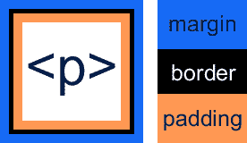
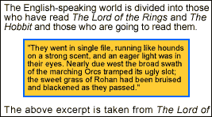

# 使用 CSS 的花式段落

> 原文：<https://www.sitepoint.com/fancy-paragraphs-css/>

长长的文本看起来很枯燥。用户通常不想费力地阅读这些句子，你花在精心构思这些句子上的所有时间都白费了。

但是只需要一些我们在这里讨论的简单的 CSS 技巧，你就可以把你的页面分开，这样它们看起来就不会那么令人生畏了。更好的是，您只需编写一次代码，然后您就可以在整个站点中多次重用它。

我假设您已经对 CSS 有了基本的了解。如果没有，那么马特·密茨凯维奇的文章[级联样式表(CSS)](http://webmasterbase.com/article/43) 应该会给你需要的入门知识。

##### 边距、填充和边框

如果你已经掌握了 HTML 表格中单元格填充、单元格间距和边框的概念，那么放松一下——这没什么不同。下图显示了边距、填充和边框属性与段落(或任何其他元素)的关系。



边距定义了边框之外的空间。填充定义了边框和内容之间的空间。

虽然这里没有显示，但是背景色填充了段落的边界。通过控制填充和边距的值，您可以完全控制段落周围的间距。但它并不止于此；CSS 还让你能够单独控制每一边的值！让我们看看怎么做。

***上下左右***

为了进一步增强你的控制，CSS 提供了表格所没有的功能。CSS 允许您通过以下 12 个属性分别控制块每一边的边框、填充和边距值:

```
padding-top 

padding-bottom 

padding-left 

padding-right 

margin-top 

margin-bottom 

margin-left 

margin-right 

border-top 

border-bottom 

border-left 

border-right
```

设置这些属性的不同组合的决定将取决于您要实现的目标，以及哪些属性提供了您需要的控制。请记住，上面列出的特定边(左或右)属性在旧浏览器中不起作用。

##### 将它投入使用

让我们来看一个例子，看看如何使用它。我们将增加一个段落的趣味，使它看起来像下面这样。



***边境***

 **对于边框，我们使用的设置是 2 像素宽，纯色，RGB 颜色值为 0066FF。我们用来实现这一点的 CSS 规则是:

```
p.excerpt{ 

border: 2px solid #0066FF; 

}
```

利用此规则的(X)HTML 代码是:

```
<p class="excerpt">They went in single file, running....</p>
```

当以这种方式使用它时，border 属性为您设置了 12 个独立的属性。

下面的规则允许您单独设置它们，但达到与上面的规则相同的效果。

```
p.excerpt{  

border-top-width: 2px;  

border-right-width: 2px;  

border-bottom-width: 2px;  

border-left-width: 2px;  

border-top-style: solid;  

border-right-style: solid;  

border-bottom-style: solid;  

border-left-style: solid;  

border-top-color: #0066FF;  

border-right-color: #0066FF;  

border-bottom-color: #0066FF;  

border-left-color: #0066FF;  

}
```

正如您所看到的，在这种情况下使用 border 值要容易得多，但是额外的控制在您需要的时候是可用的。

另一个选择是:
`p.excerpt{  
border-top: 2px solid #0066FF;  
border-bottom: 2px solid #0066FF;  
border-left: 2px solid #0066FF;  
border-right: 2px solid #0066FF;  
}`

正如我前面提到的，您使用的代码将取决于您想要实现的目标。

***后台***

设置背景颜色很容易。只需将背景色属性设置为您想要的值—在本例中，我使用的 RGB 值是 FFCC33。我们的规则现在变成了:

```
p.excerpt{  

border: 2px solid #0066FF;  

background-color:#FFCC33;  

}
```

根据上面的规则，我们的段落看起来像这样:

**的间距**

 **现在剩下要做的就是设置间距来完成效果。我们将在所有四个边上使用相同宽度的填充，因此我们不需要特定于边的属性。当填充设置为 5 像素时，我们的规则变为:

```
p.excerpt{  

border: 2px solid #0066FF;  

background-color:#FFCC33;  

padding: 5px;  

}
```

为了获得我们想要的边距效果，我们需要在左边和右边使用 20 个像素，但是在顶部和底部只使用 5 个像素，所以我们需要单独设置每个属性:

```
p.excerpt{  

border: 2px solid #0066FF;  

background-color:#FFCC33;  

padding:5px;  

margin-top:5px;  

margin-bottom:5px;  

margin-left:20px;  

margin-right:20px;  

}
```

就是这样！我们的段落现在脱颖而出，很好地打破了我们沉闷的页面内容，没有任何负面影响。非 CSS 浏览器会忽略 CSS，不会抛出任何错误。

你可以下载上面例子的 XHTML 或者[样式表](https://ww.sitepoint.com/files/excerpt.css)。你可以随心所欲地使用它，享受 CSS 带来的乐趣！

##### 进一步阅读

*   [http://www.bluerobot.com/](http://www.bluerobot.com/)–样式表上写得很好的信息。
*   [https://www.w3.org/Style/CSS/](https://www.w3.org/Style/CSS/)–W3C CSS 网站，包括所有的规范。
*   http://www.wired.com/最近更新了他们的网站，使用纯 CSS。值得一看。
*   [http://www.htmlhelp.com/reference/css/](http://www.htmlhelp.com/reference/css/)——网页设计小组“级联样式表指南”** 

## **分享这篇文章****