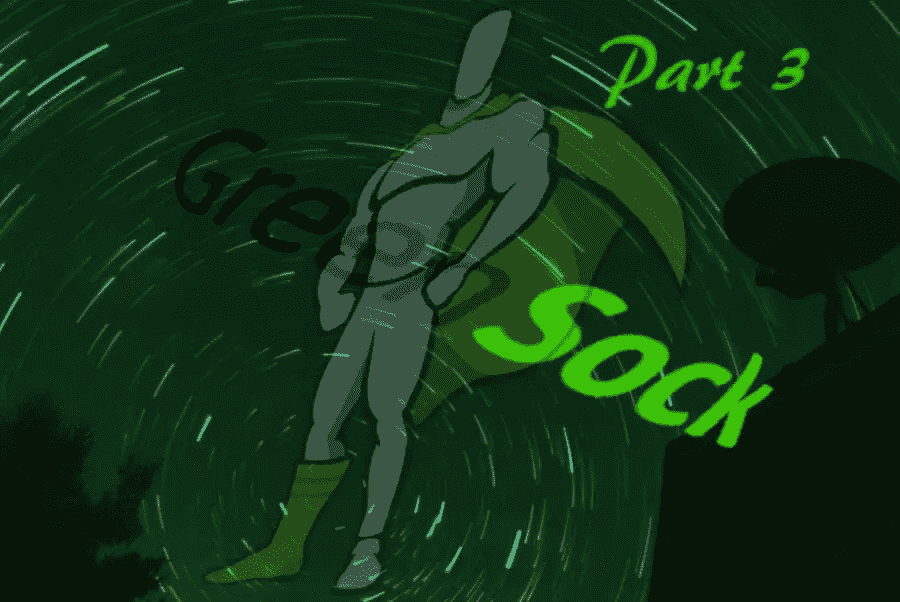

# GreenSock 插件让精彩的网络动画变得简单

> 原文：<https://www.sitepoint.com/fancy-web-animations-made-easy-greensock-plugins/>



这个 GreenSock 教程系列的第三部分的目的是向你介绍一些令人惊奇的 GreenSock [插件](https://greensock.com/docs/Plugins)。

您将使用:

*   Bezier 插件沿弯曲的 Bezier 路径激活属性
*   GSAP 的可拖动工具可以拖动屏幕上的元素，ThrowPropsPlugin 可以使元素平滑停止
*   动态绘制 SVG 笔划的 DrawSVGPlugin
*   MorphSVGPlugin 将任何 SVG 路径变形为任何其他路径，即使两条路径的点数不同
*   和 SplitText 实用程序来创建有趣的动画文本效果。

在本教程结束时，你将能够创建复杂类型的网页动画，所用时间只是不使用 GreenSock 插件时所需时间的一小部分。

要了解 GreenSock 的基础知识，包括如何使用 TweenMax 对简单动画进行排序和交错，请阅读这篇由多个部分组成的文章的第 1 部分。

如果你想重温格林斯托克强大的时间轴(TimelineLite 和 TimelineMax)，请查看第二部分。

GreenSock 文章是 CSS:动态 DOM 动画库系列的一部分。以下是我在以前的文章中提到的内容:

*   [*用 Anime.js 制作 DOM 动画*](https://www.sitepoint.com/animating-the-dom-with-anime-js/) 讲述了如何最好地利用网络上的动画，以及何时可以考虑使用 JavaScript 动画库来代替仅使用 CSS 的动画。然后重点介绍 Anime.js，这是一个免费的轻量级 JavaScript 动画库
*   [KUTE.js 的有趣动画效果](https://www.sitepoint.com/fun-web-animation-effects-with-kute-js/)向您介绍 kute . js，这是一个免费且功能丰富的 JavaScript 动画库
*   [使用 Velocity.js(无 jQuery)让您的网站变得互动有趣](https://www.sitepoint.com/how-to-use-velocity-js-without-jquery/)向您展示如何使用 Velocity.js，一个开源、健壮的免费动画库，来创建高性能的 web 动画。
*   [GreenSock for 初学者:网络动画教程(第 1 部分)](https://www.sitepoint.com/web-animation-tutorial-part-1)是 GreenSock 的概述，也称为 GSAP(green sock Animation Platform)，在这里我讨论了库的模块和许可模型。我还向您展示了如何使用 GSAP TweenMax 编写简单的补间、补间序列和交错动画
*   初学者的绿袜子(第二部分):GSAP 的时间线深入研究 GSAP 的时间线功能，教你如何在一条时间线或多个嵌套的时间线内组织你的动画。

## 沿着格林索克的 BezierPlugin 路径的动画

[沿路径的运动](https://www.chromestatus.com/feature/6190642178818048)包括物体沿预定路径运动，如曲线路径或之字形路径等。在正确的上下文中，它对于真实的动画来说是至关重要的。

使用 [SMIL(同步多媒体集成语言)](https://en.wikipedia.org/wiki/Synchronized_Multimedia_Integration_Language)这种动画是可能的，但现在已经被否决了。

沿着一条道路前进的未来似乎是 CSS，但是尽管这个特性在一些浏览器(主要是 Chrome 和 Opera)中得到[支持，在制作网站中采用它可能是一个冒险的举动。](http://caniuse.com/#search=motion)

对于一致的浏览器支持和易于实现，GSAP 的 [BezierPlugin](https://greensock.com/docs/Plugins/BezierPlugin) 是一个极好的选择。

这是 TweenMax 附带的一个免费插件。我们来试试吧！

### 格林索克的贝齐尔·布鲁金基础

要开始使用 GSAP 的 BezierPlugin，只需[下载 TweenMax](https://greensock.com/tweenmax) 并将其包含到您的项目中，就像您在 HTML 文档底部处理任何外部 JavaScript 文件一样。

基本语法如下所示:

```
TweenMax.to(document.getElementById('myDiv'), 5, {
  bezier:[
    {left:100, top:250}, 
    {left:300, top:0}, 
    {left:500, top:400}
  ], 
  ease:Power1.easeInOut
});
```

上面的代码片段在`.myDiv`元素上实现了 TweenMax `to()`方法。在这些属性中，您可以看到`bezier`属性，它的值被设置为一个对象数组。每个对象包含几个坐标的值。该示例使用了`top`和`left`属性，但是您也可以使用`x`和`y`。

如果您有一个很长的坐标列表，最好将它们缓存在一个变量中，并在函数中使用该变量而不是对象本身，如下所示:

```
const points = [
  {left:100, top:250}, 
  {left:300, top:0}, 
  {left:500, top:400}
];

TweenMax.to(document.getElementById('myDiv'), 5, {
  bezier: points, 
  ease:Power1.easeInOut
});
```

如果你使用`x`和`y`来设置你的坐标，记住这些值指的是元素的位置，而不是画布本身。例如，`x: 10`将元素从当前位置向右移动 10。后面的点仍然相对于元素的初始位置，而不是先前指定的点。

如果您希望元素从一组坐标平滑地移动到下一组坐标，BezierPlugin 提供了两个选项:

*   将`type`属性设置为`'soft'`。这样，您提供的坐标就像磁铁一样，将元素吸引向它们。但是，元素不会通过指定的点
*   将`type`属性设置为默认值`'thru'`，并为`curviness`属性指定一个值。这个特殊的属性让你定义贝塞尔曲线上的张力:0 相当于一条直线，1 是正常的弯曲度，2 是正常值的两倍，等等。只有当您将`type`属性设置为`'thru'`时，`curviness`属性才适用。

您还可以将`autoRotate`属性设置为`true`，这样可以使元素根据其在贝塞尔路径上的位置旋转。

下面是这些属性如何工作的演示:选择一个`curviness`值，选中或取消选中复选框来设置`autoRotate`属性，并使用适当的单选按钮选择`'thru'`或`'soft'`。

请注意，`type`属性的默认值是`'thru'`，当您选择`'soft'`时，设置`curviness`值的下拉框将被禁用:

在 [CodePen](https://codepen.io) 上通过 SitePoint ( [@SitePoint](https://codepen.io/SitePoint) )看笔[GSAP·贝齐尔·布鲁金](https://codepen.io/SitePoint/pen/EvpWdr/)。