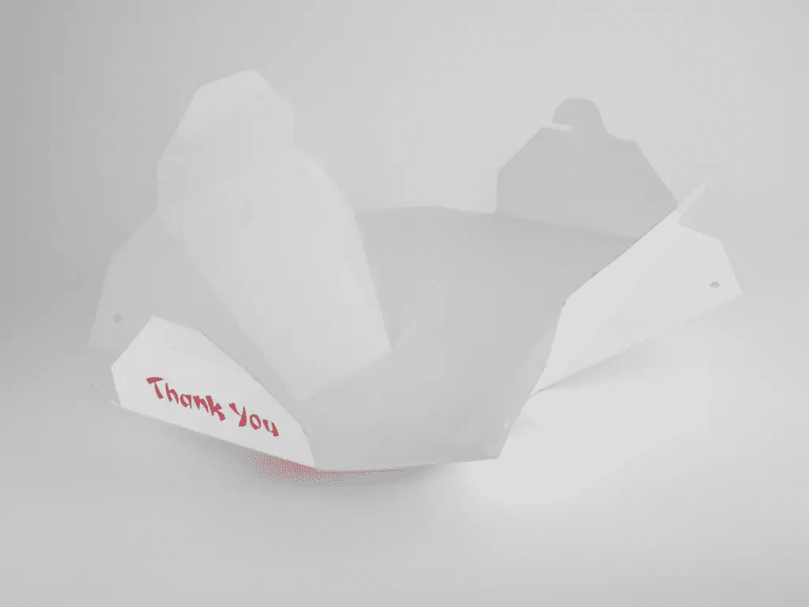
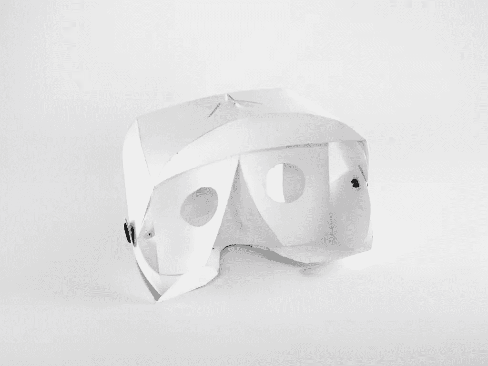
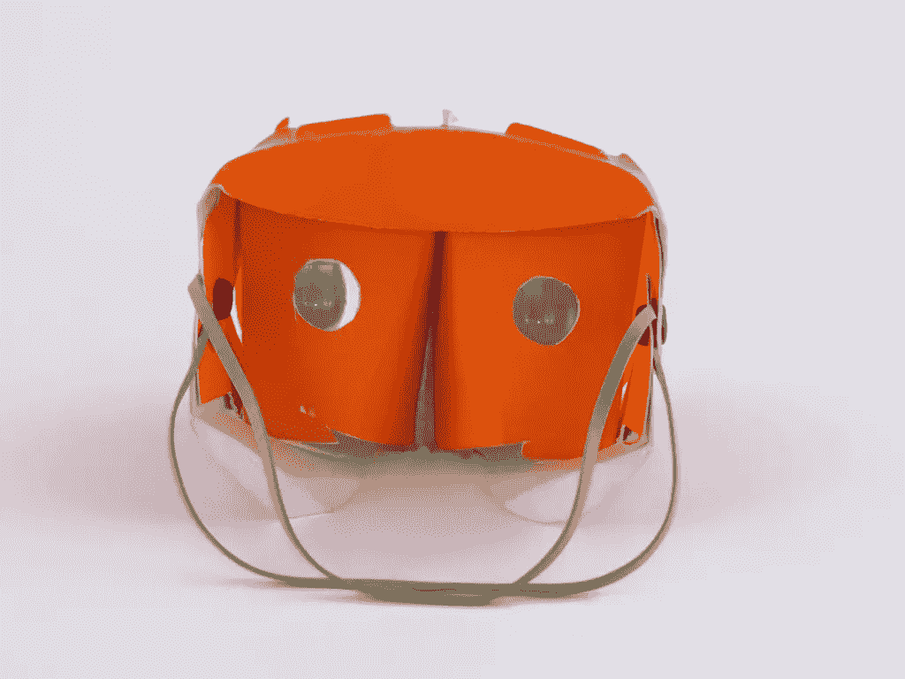
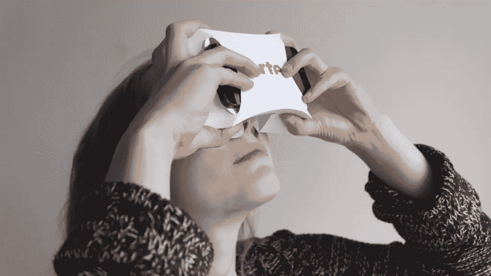
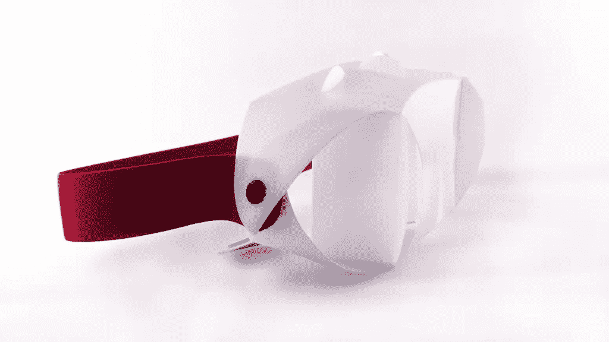

# 快餐包装如何影响移动虚拟现实

> 原文：<https://www.sitepoint.com/fast-food-packaging-influenced-mobile-virtual-reality/>

一年前，我在柏林的两位老朋友汤姆·库比希克和奈登·纳伊德诺夫联系了我。奈登曾声称要在智能手机上实现虚拟现实。

汤姆和奈登都在游戏行业工作，汤姆是“摩根工作室”的大型项目经理，奈登是天才开发人员。

90 年代，我在柏林 IPK 弗劳恩霍夫研究所的虚拟现实部门工作。当时虚拟房地产的最大问题之一是展示你的作品需要庞大而昂贵的设备。我认为这就是为什么虚拟现实从来没有产生它在早期可能产生的影响。对我来说，这是在接下来的几年里更加专注于其他设计领域的动力。

*回到发明*。奈登设想了一个带有两个镜头的 3D 打印盒，你可以将智能手机插入其中，从而将其转换为头戴式显示器(HMD)，使你能够潜入虚拟现实。显示器上可以看到并排分成两个屏幕的实时动画，给人的感觉是坐在过山车上，沿着轨道赛车。

这是一种非凡的体验，站在一个房间里，有一种身临其境的感觉，没有电缆，只有普通电话的帮助。

智能手机上虚拟现实的可能性立即改变了我的游戏规则，我再次被迷住了。

汤姆、奈登和我成立了“i-mmersive”公司，目的是开发新的移动 VR 应用程序、交互原理和必要的硬件。

mmersive 开发的 VR 应用效果很好——有很好的帧速率，奇妙的传感器实现和令人信服的图形。你可以在 google play 上下载一些简单的应用程序。事实证明它们很受欢迎，有些已经被下载了 100，000 多次。[过山车应用可以在 Google Play 上找到](https://play.google.com/store/apps/details?id=com.iphodroid.Rollercoaster)

然而，现有的电话支架并不令人满意。我们做了一些研究，市场上为数不多的 VR 智能手机支架都太大、太重、太贵。

所以我们决定建造我们自己的。

从一开始，我们就看到了对低成本支架的需求。首先是因为媒体的影响力。“移动虚拟现实”是如此之新，只有极客才会在不知道它如何工作的情况下花钱购买智能手机支架。其次是因为有必要向尽可能多的人展示智能手机的可行性。一种方法是免费分发智能手机 VR 支架作为营销工具。

与此同时，我的日常工作是设计快餐包装，并对中国纸板面盒和折叠它们背后的智慧着迷。
:这些盒子在交付时是平的，但可以在五秒钟内折叠起来。我们决定利用该原理设计一款智能手机 VR 支架。

第一个原型不稳定，不够简洁，所以看不到 3D 效果。由于智能手机支架是光学仪器，所以需要很高的精度。

我们的第一个原型有一个焦距调整，结果证明是无用的，因为镜头有一个固定的焦距。我们必须确保人们能够在支架下戴眼镜。

几个月和 50 个版本之后，我们增加了两个更小的部分，所以镜头的位置足够精确。3D 效果第一次可见，但只对我们的一些测试人员可见。我们不得不更深入地研究立体视觉的光学现象，并将两眼之间的距离确定为关键点。

立体效果只有在聚焦的物体和你的两个瞳孔之间画出三角形时才起作用，这类似于虚拟相机和物体之间的三角形。

接下来几周，我的爱好是测量我遇到的每个人的瞳孔距离。经过大约一百次测量，我们确定了正确的平均值。下一件重要的事情是镜片的直径——镜片越大，需要平衡的眼距差异就越大。

我们找到了一家镜头供应商，这种镜头的投影比谷歌在纸板支架上使用的 24 毫米镜头好得多。第一款智能手机支架是由一张纸板折叠而成，用两个塑料铆钉封闭，有一个滑雪眼镜般的橡胶带。

但它仍然没有解决够得着的问题——它工作得很好，但仍然需要两分钟才能折叠，而且剪切图案对于标准信件来说太大了。我们交谈过的所有客户都说，在这种情况下，它不适合作为营销工具。大约在那个时候，谷歌发布了“ [Cardboard](https://www.google.com/get/cardboard/) ”，它与来自 refugio 的 tinker-kit 非常相似(甚至是一个副本)。这次发布的好处是，谷歌向大众介绍了“智能手机上的虚拟现实”这个术语，让我们更容易交流我们的产品。

现在，我们必须在可用性和设计上击败谷歌，新的挑战是一键折叠支架的想法，它可以重新折叠并存放在你的上衣口袋里。所有这些都是免费或低成本的，并且能够装入标准信封。

在开发第一个 mmersive 支架时，我们发现在形状上添加圆形折叠可以极大地增加稳定性，并且利用纸板的柔韧性，我们还可以实现弹簧自动展开的效果。结果是一个减少了的固定器，有几个圆形部分折叠，当顶部和底部被按下时会弹出。更好的是，它可以用标准信件发送。

下一个挑战是智能手机的前滑入式插槽。我们至少需要匹配 iPhone 5–6 和所有其他 4–4.7 英寸显示屏的手机。许多迭代是必要的，结果是一个(乍一看)看起来随机的形状，非常好。

对于我们与 ARTE 的第一个项目，我们开始与柏林的一家印刷公司进行大规模生产。这意味着该产品完全是“德国制造”。这是一个打印产品，机构是很容易定制的客户需求和企业设计从 1000 单位以上。下一代智能手机支架将会有橡胶带，允许免提游戏。

“i-mmersive”的下一步将是发布我们的第一款游戏，基于过山车应用程序和我们的持有者的“专业”版本。

许多大玩家都将移动虚拟现实视为二维媒体时代之后的下一步。i-mmersive 的目标是成为这一发展中的顶级智囊团之一，传播思想，发现新的交互方法和显示设备，并使我们的产品走向成熟。

## 分享这篇文章