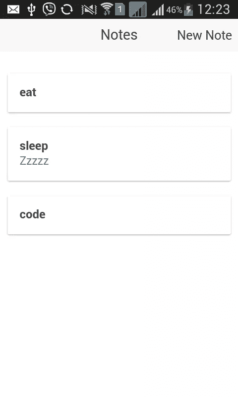

# 使用 LokiJS 为 Cordova 应用程序提供快速、轻量级的数据存储

> 原文：<https://www.sitepoint.com/fast-lightweight-data-storage-for-cordova-apps-with-lokijs/>

在本教程中，我们将使用 Cordova 和 [LokiJS](http://lokijs.org/) 创建一个笔记应用程序。我们将使用 [Ionic 框架](http://ionicframework.com/)来处理应用程序结构和 UI 交互。这是最终应用的外观:



## What Is LokiJS?

LokiJS 是一个快速的内存中面向文档的数据存储，适用于 node.js、浏览器和 Apache Cordova，提供了一个全面的 API 来存储和检索数据。与 localStorage 不同，使用 LokiJS 不需要 stringify 进行存储和访问。默认情况下，LokiJS 将数据存储到 localStorage，但您可以使用其他具有“持久性适配器”的存储方法，包括“IndexedAdapter”，它使用 IndexedDB 来实现持久性。在本教程中，我们将使用[文件系统适配器](https://github.com/cosmith/Loki-Cordova-Fs-Adapter)，它使用保存在文件系统中的 JSON 文件来存储数据。

## 设置

首先使用以下命令通过 npm 安装 Cordova 和 Ionic:

```
npm install -g cordova ionic
```

安装完成后，创建一个新的 Ionic 项目:

```
ionic start loki-notes blank
```

这将使用空白模板创建一个新的 Ionic 项目。还有其他可用的模板，如“标签”和“侧菜单”，但我们将坚持使用空白的一个。

打开 *loki-notes* 目录，安装需要的平台。

```
cd loki-notes
ionic platform add android
```

### 安装依赖项

该应用程序将依赖于以下图书馆，我已经包括每个安装说明后。

#### LokiJS

用于存储应用程序数据。

```
bower install lokijs --save
```

#### 洛达什

用于截断注释描述。

```
bower install lodash --save
```

#### 洛基-科尔多瓦-fs-适配器

由 LokiJS 用来将数据存储到文件系统中。不幸的是，这个库在 bower 或 npm 中都没有索引，所以你必须从 Github 下载[并保存到 *www/js* 目录。](https://raw.githubusercontent.com/cosmith/loki-cordova-fs-adapter/master/bin/loki-cordova-fs-adapter.js)

#### Cordova 插件文件

LokiJS 文件系统适配器的依赖性。

```
cordova plugin add cordova-plugin-file
```

#### Cordova 外挂程式相机

用于捕捉每个笔记附带的照片。

```
cordova plugin add cordova-plugin-camera
```

一旦你完成了所有依赖项的安装，将它们添加到主 cordova JavaScript 文件之后的 *www/index.html* 文件中。

```
<script src="js/app.js"></script><!-- the main cordova JavaScript file-->

<script src="lib/lokijs/src/lokijs.js"></script>
<script src="lib/lokijs/src/loki-angular.js"></script>

<script src="js/loki-cordova-fs-adapter.js"></script>

<script src="lib/lodash/dist/lodash.min.js"></script>
```

注意 **cordova-plugin-file** 和 **cordova-plugin-camera** 是 cordova 插件，所以我们不需要在*index.html*文件中链接它们。插件的 API 暴露在全局范围内，所以我们可以从任何 JavaScript 文件中调用它们。

当我们在这里时，让我们参考一下我们将很快创建的控制器和服务。

```
<script src="js/controllers/NoteController.js"></script>

<script src="js/services/NoteService.js"></script>
<script src="js/services/CameraService.js"></script>
```

## 构建应用程序

### 服务

服务将通用功能封装在一个功能中。这允许我们在调用我们正在使用的库中的不同函数时有更简洁的代码。服务存储在 *www/js/services* 目录下。

#### 照相服务

创建相机服务(*www/js/services/camera service . js*)负责包装对相机插件的调用，并添加以下代码:

```
(function(){

  angular.module('starter')
  .service('CameraService', ['$q', CameraService]);

  function CameraService($q){

    var me = this;

    me.options = {
      quality: 80,
      correctOrientation: true
    };

    function getPicture(){

        var q = $q.defer();

        me.options.encodingType = Camera.EncodingType.JPEG;
        me.options.sourceType = Camera.PictureSourceType.CAMERA;

        navigator.camera.getPicture(
          function(result){
            q.resolve(result);
          },
          function(err){
            q.reject(err);
          },
          me.options
        );

        return q.promise;
      }

    return {
      getPicture: getPicture
    }
  }

})();
```

分解上面的代码，我们首先将所有东西包装在“IIFE”(立即调用的函数表达式)中，以避免将代码暴露给全局范围。

```
(function(){
    ...
})();
```

然后我们创建相机服务。这使用了名为`$q`的内置角度服务，它允许异步调用函数。这意味着我们不必等待相机插件在应用程序完全响应之前返回结果。一旦从默认相机应用程序中选择了一张照片，它就会将控制权交还给该应用程序。

```
angular.module('starter')
  .service('CameraService', ['$q', CameraService]);

function CameraService($q){
    ...
}
```

在`CameraService`函数中，我们指定相机的默认选项。我们指定了两个选项。`quality`允许我们设置最终照片的质量(质量越低意味着文件越小),以及`correctOrientation`,它根据拍照时相机的方向自动校正照片方向。

```
var me = this;

me.options = {
  quality: 80,
  correctOrientation: true
};
```

`CameraService`有一个方法`getPicture`，它启动设备中的默认相机应用程序。在函数的开始，我们通过调用`defer`方法来启动`$q`服务。之后，我们指定几个选项。`encodingType`设置照片的格式，而`sourceType`允许我们指定照片的来源，在这里是相机。指定选项后，通过调用`navigator.camera.getPicture`启动默认相机应用。它接受三个参数:成功回调函数、错误回调函数和相机选项。然后，我们使用揭示模块模式向外界公开这个函数。

```
function getPicture(){

  var q = $q.defer();

  me.options.encodingType = Camera.EncodingType.JPEG;
  me.options.sourceType = Camera.PictureSourceType.CAMERA;

  navigator.camera.getPicture(
    function(result){
      q.resolve(result);
    },
    function(err){
      q.reject(err);
    },
    me.options
  );

  return q.promise;
}

return {
  getPicture: getPicture
}
```

#### 短信服务

注释服务(*www/js/services/noteservice . js*)封装了所有的 LokiJS 函数调用。

```
(function(){

    angular.module('starter')
    .service('NoteService', ['$q', 'Loki', NoteService]);

    function NoteService($q, Loki){

        var db;
        var notes;

        function initialize(){
            var adapter = new LokiCordovaFSAdapter({"prefix": "loki"});
            db = new Loki('notes_db', {
                autosave: true,
                autosaveInterval: 1000,
                adapter: adapter
            });
        }

        function getNotes(){

            return $q(function(resolve, reject){

                db.loadDatabase({}, function(){
                    notes = db.getCollection('notes');

                    if(!notes){
                        notes = db.addCollection('notes');
                    }

                    resolve(notes.data);
                });
            });

        }

        function addNote(note){
            notes.insert(note);
        }

        function updateNote(note){
            notes.update(note);
        }

        function deleteNote(note){
            notes.remove(note);
        }

        return {
            initialize: initialize,
            getNotes: getNotes,
            addNote: addNote,
            updateNote: updateNote,
            deleteNote: deleteNote
        };
    }

})();
```

分解上面的代码。我们使用 LokiJS 提供的`Loki`服务与数据库进行交互。

```
(function(){

    angular.module('starter')
    .service('NoteService', ['$q', 'Loki', NoteService]);

    function NoteService($q, Loki){
        ...
    }

})();
```

在`NoteService`函数中有两个变量。`db`存储对我们正在使用的当前数据库的引用，而`notes`存储对当前集合的引用。集合只是表的一个花哨术语。

```
var db;
var notes;
```

`initialize`函数初始化数据库，首先创建 Cordova 文件系统适配器的一个新实例。它接受一个包含我们想要传入的选项的对象。在这种情况下，我们希望指定使用的前缀。接下来，我们创建一个新的 Loki 实例。它接受数据库的名称作为第一个参数，数据库选项作为第二个参数。对于选项，我们将`autosave`设置为`true`。这是因为 lokiJS 不会自动将数据保存到您选择的持久性适配器中。一切都存储在内存中，直到您在`db`中调用`saveDatabase`方法。将`autosave`设置为`true`意味着它会在后台自动调用`saveDatabase`方法。当您将`autosave`设置为`true`时，需要一个名为`autosaveInterval`的附加选项。这是 LokiJS 应该保存数据的时间间隔(以毫秒为单位)。在下面的示例中，间隔设置为 5000，这意味着它将每 5 秒保存一次。

```
function initialize(){
    var adapter = new LokiCordovaFSAdapter({"prefix": "loki"});
    db = new Loki('notes_db', {
        autosave: true,
        autosaveInterval: 5000,
        adapter: adapter
    });
}
```

`getNotes`方法加载存储在`notes`集合中的数据。如果 notes 集合尚不存在，它将创建一个。注意，我们将所有内容都包装在对`$q`服务的调用中。语法与相机服务不同，但思想基本相同。

```
function getNotes(){

    return $q(function(resolve, reject){

        db.loadDatabase({}, function(){
            //retrieve data from notes collection
            notes = db.getCollection('notes');

            if(!notes){
                //create notes collection
                notes = db.addCollection('notes');
            }

            resolve(notes.data);
        });
    });

}
```

`addNote`、`updateNote`和`deleteNote`函数充当 LokiJS API 的包装器，用于插入、更新和删除数据库中的数据。所有这些都接受一个包含注释数据的对象作为参数。

```
function addNote(note){
    notes.insert(note);
}

function updateNote(note){
    notes.update(note);
}

function deleteNote(note){
    notes.remove(note);
}
```

向外界暴露一切:

```
return {
    initialize: initialize,
    getNotes: getNotes,
    addNote: addNote,
    updateNote: updateNote,
    deleteNote: deleteNote
};
```

### 控制器

这个应用程序的唯一控制器是负责处理应用程序中 UI 交互的 note 控制器。

```
(function(){
    angular.module('starter')
    .controller('NoteController', ['$scope', '$ionicModal', '$ionicPlatform', 'CameraService', 'NoteService', NoteController]);

    function NoteController($scope, $ionicModal, $ionicPlatform, CameraService, NoteService){

        var me = this;
        me.notes = [];

        $ionicPlatform.ready(function(){
            NoteService.initialize();

            NoteService.getNotes().then(function(notes){
                me.notes = notes;
            });
        });

        $ionicModal.fromTemplateUrl('new-note.html', {
            scope: $scope,
            animation: 'slide-in-up'
        }).then(function(modal){
            $scope.new_note_modal = modal;
        });

        $ionicModal.fromTemplateUrl('image-modal.html', {
            scope: $scope,
            animation: 'slide-in-up'
        }).then(function(modal){
            $scope.image_modal = modal;
        });

        me.truncate = function(string){
            return _.truncate(string, {length: 35});
        };

        $scope.deleteNote = function(note){
            NoteService.deleteNote(note);
        };

        $scope.newNote = function(){
            $scope.note = {};
            $scope.isUpdate = false;
            $scope.new_note_modal.show();
        };

        $scope.viewNote = function(note){
            $scope.note = {};
            $scope.note = note;
            $scope.isUpdate = true;
            $scope.new_note_modal.show();
        };

        $scope.takePicture = function(){
            CameraService.getPicture().then(function(photo){
                $scope.note.photo = photo;
            });
        };

        $scope.saveNote = function(){
            if($scope.isUpdate){
                NoteService.updateNote($scope.note);
            }else{
                NoteService.addNote($scope.note);
            }

            $scope.note = {
                title: '',
                text: '',
                photo: null
            };

            $scope.new_note_modal.hide();
        };

        $scope.viewImage = function(image){
            $scope.note.photo = image;
            $scope.image_modal.show();
        };

        $scope.closeModal = function(modal){
            $scope[modal + '_modal'].hide();
        };

    }

})();
```

分解上面的代码。首先，我们创建`NoteController`并导入我们需要的所有服务。

```
(function(){
    angular.module('starter')
    .controller('NoteController', ['$scope', '$ionicModal', '$ionicPlatform', 'CameraService', 'NoteService', NoteController]);

function NoteController($scope, $ionicModal, $ionicPlatform, CameraService, NoteService){
    ...
})();
```

下面是对每一个的简要描述:
–`$scope`:允许我们获取和设置当前范围的数据。然后可以在视图中使用这些数据。
–`$ionicModal`:用于创建模态。
–`ionicPlatform`:用于监听爱奥尼亚`ready`事件。
–`CameraService`:早先创建的相机服务。这允许我们调用相机插件提供的 API。
–`NoteService`:我们之前创建的便签服务。这允许我们调用 LokiJS 提供的 API。

声明一个`me`变量，该变量将被用作控制器的引用。

```
var me = this;
```

将一个空数组附加到`notes`对象，并监听`$ionicPlatform`中的`ready`事件。当该功能被触发时，意味着设备准备就绪。它只在应用程序启动时触发一次，所以这是初始化数据库和获取 notes 集合中存储的数据的最佳位置。

```
me.notes = [];

$ionicPlatform.ready(function(){ //when the device is ready
    NoteService.initialize(); //initialize the database

    //get all the notes from the notes collection
    NoteService.getNotes().then(function(notes){
        me.notes = notes; //assign it to the controller
    });
});
```

初始化用于创建新便笺和查看附加到便笺的图像的模式。

```
//modal for creating new note
$ionicModal.fromTemplateUrl('new-note.html', {
    scope: $scope,
    animation: 'slide-in-up'
}).then(function(modal){
    $scope.new_note_modal = modal;
});

//modal for viewing image attached to note
$ionicModal.fromTemplateUrl('image-modal.html', {
    scope: $scope,
    animation: 'slide-in-up'
}).then(function(modal){
    $scope.image_modal = modal;
});
```

向控制器添加截断方法。这只是限制了一个字符串的字符数。这使用了 lodash 中的`truncate`方法，该方法接受您想要处理的字符串作为其第一个参数，并接受一个包含选项的对象。在这种情况下，我们希望将字符数限制为 35 个字符减去用于指示字符串已被截断的 3 个字符。默认情况下，lodash 使用三点( *…* )。

```
me.truncate = function(string){
    return _.truncate(string, {length: 35});
};
```

给当前作用域附加一个`deleteNote`函数。它接受一个包含特定音符数据的对象作为其参数。它所做的只是从`NoteService`中调用`deleteNote`方法。

```
$scope.deleteNote = function(note){

    NoteService.deleteNote(note);
};
```

每当点击*新音符*按钮时，就会调用`newNote`函数。这将清空当前存储在`$scope`中的纸币，并将`isUpdate`设置为`false`。这将作为一个开关，用于确定当前纸币是否为已有纸币(见`saveNote`方法)。最后，它打开了创建新便笺的模式。

```
$scope.newNote = function(){
    $scope.note = {};
    $scope.isUpdate = false;
    $scope.new_note_modal.show();
};
```

每当用户双击特定音符时，就会调用`viewNote`功能。首先重置存储在作用域中的注释，并为其分配一个新值。它将`isUpdate`设置为`true`,因为我们正试图打开一个现有的便笺，因此可以理解用户正试图查看或更新它。最后给出了模型。

```
$scope.viewNote = function(note){
    $scope.note = {};
    $scope.note = note;
    $scope.isUpdate = true;
    $scope.new_note_modal.show();
};
```

当用户点击新笔记模式标题上的照相机图标时，调用`takePicture`功能。它启动默认的相机应用程序，当一张照片被选中时，将其分配到当前范围。

```
$scope.takePicture = function(){
    CameraService.getPicture().then(function(photo){
        $scope.note.photo = photo;
    });
};
```

`saveNote`功能将便笺保存并更新到数据库。它使用`isUpdate`属性来确定是否要更新或创建存储在`$scope`中的当前便笺。完成后，我们清除便笺并关闭新的便笺模式。

```
$scope.saveNote = function(){

    if($scope.isUpdate){
        NoteService.updateNote($scope.note);
    }else{
        NoteService.addNote($scope.note);
    }

    $scope.note = {
        title: '',
        text: '',
        photo: null
    };

    $scope.new_note_modal.hide();

};
```

`viewImage`功能以全屏模式显示图像附件。

```
$scope.viewImage = function(image){
    $scope.note.photo = image;
    $scope.image_modal.show();
};
```

`closeModal`函数关闭被指定为参数的模态。

```
$scope.closeModal = function(modal){
    $scope[modal + '_modal'].hide();
};
```

### 视图

应用程序中有一个视图，notes 视图，因此创建 *www/templates/notes.html* 并添加以下内容。

```
<ion-view title="Notes" ng-controller="NoteController as note_ctrl">
    <header class="bar bar-header bar-stable">
        <h1 class="title">Notes</h1>
        <button class="button button-clear" ng-click="newNote()">New Note</button>
    </header>

  <ion-content class="has-header padding">
    <div class="card" ng-repeat="note in note_ctrl.notes">
      <div class="item item-text-wrap" on-double-tap="viewNote(note)" on-drag-right="deleteNote(note)">
        <strong>{{note.title}}</strong>
        <div class="description">{{note_ctrl.truncate(note.text)}}</div>
      </div>
    </div>
    <div class="card" ng-if="note_ctrl.notes.length === 0">
        <div class="item item-text-wrap">
            No notes yet
        </div>
    </div>
  </ion-content>

  <script id="new-note.html" type="text/ng-template"> <ion-modal-view>
    <ion-header-bar class="bar-stable">
      <button class="button button-clear icon ion-camera" ng-click="takePicture()"></button>
      <h1 class="title">New Note</h1>
      <button class="button button-clear" ng-click="closeModal('new_note')">Close</button>
    </ion-header-bar>
    <ion-content>

      <div class="list">
        <label class="item item-input item-stacked-label">
          <span class="input-label">Title</span>
          <input type="text" ng-model="note.title">
        </label>
        <label class="item item-input item-stacked-label">
          <span class="input-label">Note</span>
          <textarea ng-model="note.text"></textarea>
        </label>
      </div>

      <div class="padding" ng-if="note.photo">
        <button class="button button-clear icon ion-image" ng-click="viewImage(note.photo)"></button>
      </div>

      <div class="padding">
        <button class="button button-positive button-block" ng-click="saveNote()">
          Save
        </button>
      </div>

    </ion-content>
  </ion-modal-view> </script>

  <script id="image-modal.html" type="text/ng-template"> <div class="modal image-modal transparent"
       ng-click="closeModal('image')">
        
    </div> </script>
</ion-view>
```

分解上面的代码。首先，我们将所有东西包装在一个`<ion-view>`标签中。这是视图内容以及任何导航和标题栏信息的标准容器。我们已经指定了两个属性，`title`，它是您想要赋予视图的名称，以及`ng-controller`，它允许我们指定用于这个视图的控制器。给出了一个别名`note_ctrl`,这样我们就可以通过使用别名来引用控制器附带的任何数据或函数。

```
<ion-view title="Notes" ng-controller="NoteController as note_ctrl">
</ion-view>
```

标签为应用程序创建了标题，并包含一个显示当前页面标题的元素和一个创建新注释的元素。一个`ng-click`属性指定当这个按钮被点击时，它将执行附属于`$scope`的`newNote`功能。

```
<header class="bar bar-header bar-stable">
    <h1 class="title">Notes</h1>
    <button class="button button-clear" ng-click="newNote()">New Note</button>
</header>
```

`<ion-content>`用于指定视图的主要内容。在这种情况下，主要内容是当前保存在数据库中的笔记列表。

为此，我们创建了一个带有类`card`的`<div>`，并使用`ng-repeat`指令为存储在`notes`数组中的每个音符重复该元素。每张卡里面都有一个`<div>`，里面有一个`item`类。这是一个容器，可以容纳你想添加到卡片中的任何内容。这里我们只是输出笔记的标题和描述。

`on-double-tap`属性指定每当用户双击项目时执行的功能。这将调用`viewNote`函数，该函数打开查看便笺的模式。`on-drag-right`属性指定当项目被拖动到右边时执行的功能。这是一个常见的移除动作，所以我们给它附加了`deleteNote`功能。如果数据库中当前没有注释，我们声明还没有注释。

```
<ion-content class="has-header padding">
<div class="card" ng-repeat="note in note_ctrl.notes">
  <div class="item item-text-wrap" on-double-tap="viewNote(note)" on-drag-right="deleteNote(note)">
    <strong>{{note.title}}</strong>
    <div class="description">{{note_ctrl.truncate(note.text)}}</div>
  </div>
</div>
<div class="card" ng-if="note_ctrl.notes.length === 0">
    <div class="item item-text-wrap">
        No notes yet
    </div>
</div>
</ion-content>
```

在 Ionic 中，使用一个类型为`text/ng-template`和必需属性为`id`的`<script>`标签来创建模态。然后内容被包装在一个`<ion-modal-view>`标签中。里面是页眉和主要内容。标题包含启动默认相机应用程序的按钮、模式的标题和关闭模式的按钮。主要内容是一个包含标题和描述文本字段的表单，以及一个保存注释的按钮。如果笔记中附有照片，则会添加一个图标按钮。当用户点击时，这将在全屏视图中打开照片。

```
<script id="new-note.html" type="text/ng-template"> <ion-modal-view>
<ion-header-bar class="bar-stable">
  <button class="button button-clear icon ion-camera" ng-click="takePicture()"></button>
  <h1 class="title">New Note</h1>
  <button class="button button-clear" ng-click="closeModal('new_note')">Close</button>
</ion-header-bar>

<ion-content>
  <div class="list">
    <label class="item item-input item-stacked-label">
      <span class="input-label">Title</span>
      <input type="text" ng-model="note.title">
    </label>
    <label class="item item-input item-stacked-label">
      <span class="input-label">Note</span>
      <textarea ng-model="note.text"></textarea>
    </label>
  </div>

  <div class="padding" ng-if="note.photo">
    <button class="button button-clear icon ion-image" ng-click="viewImage(note.photo)"></button>
  </div>

  <div class="padding">
    <button class="button button-positive button-block" ng-click="saveNote()">
      Save
    </button>
  </div>

</ion-content>
</ion-modal-view> </script>
```

图像模式全屏显示图像附件。调用`viewImage`函数时会显示出来。

```
<script id="image-modal.html" type="text/ng-template"> <div class="modal image-modal transparent"
   ng-click="closeModal('image')">
    
</div> </script>
```

### 式样

由于 Ionic 框架为我们处理了大部分样式，我们需要做的就是为注释描述和全屏图像添加样式:

将以下内容添加到 *www/css/style.css*

```
.description {
    color: #737373;
    font-size: 15px;
}

.fullscreen-image {
    max-width: 100%;
    max-height: 100%;
    bottom: 0;
    left: 0;
    margin: auto;
    overflow: auto;
    position: fixed;
    right: 0;
    top: 0;
}
```

### 拔靴带

为了把所有的东西放在一起，打开 *www/js/app.js* 文件，在`ionic`之后注册`lokijs`。

```
angular.module('starter', ['ionic', 'lokijs'])
```

然后添加应用程序状态的配置。因为我们有一个页面，所以只有一个状态叫做`notes`。通过使用`state`方法，我们指定了州名、可以访问的 url 以及视图所在的路径(相对于 *www* 目录)。最后，我们指定要导航到的默认 URL。

```
.config(function($stateProvider, $urlRouterProvider) {
  $stateProvider

  .state('notes', {
    url: '/notes',
    templateUrl: 'templates/notes.html'
  });
  // if none of the above states are matched, use this as the fallback
  $urlRouterProvider.otherwise('/notes');
});
```

## 结论

就是这样！在本教程中，您已经学习了如何使用 LokiJS 在 Cordova 应用程序中持久化数据。使用 LokiJS，我们在数据库中执行了基本的 CRUD(创建、读取、更新、删除)操作。不过，我们在本教程中仅仅触及了皮毛，所以这里有一些主题供您研究:

*   **Find** :在本教程中，我们没有执行任何复杂的查询，所以请查阅关于 [find 方法](http://lokijs.org/#/docs#find)的文档。
*   **Changes API** :如果需要在服务器上持久化数据，Changes API 很有用。它允许您将数据库本地副本中的更改同步到远程服务器。

本教程的完整代码可以在 Github 上找到，如果你有问题或评论，请告诉我。

## 分享这篇文章