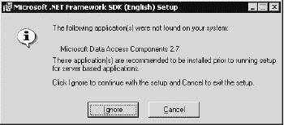
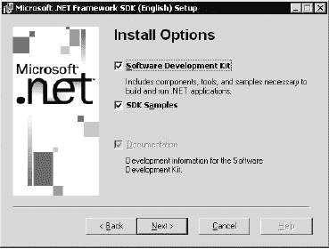
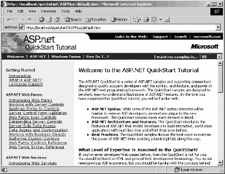
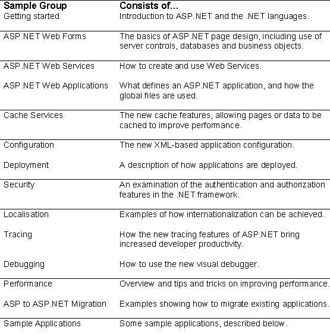
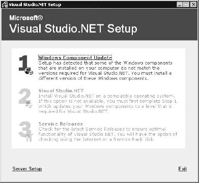
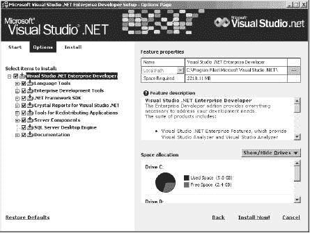
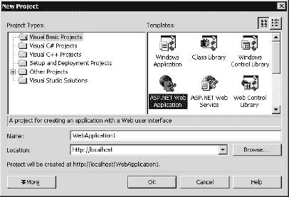
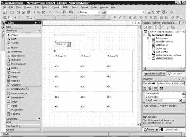
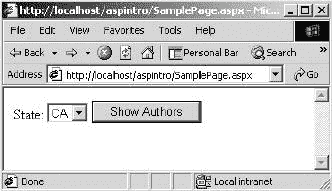
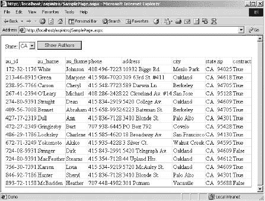

# ASP.NET 快速通道指南——第 1 章

> 原文：<https://www.sitepoint.com/fast-track-guide-asp-net-1/>

**微软的。自从 Beta 1 首次向世界发布以来，NET 技术已经吸引了大量的媒体。从那以后，邮件列表、新闻组和网站如雨后春笋般涌现，包含各种形式的代码示例、应用程序和文章。即使你不是使用现有 ASP 技术的程序员，这也是一个很好的赌注，至少你听说过。NET，即使你不太确定它涉及到什么。毕竟有太多关于。NET，有时很难从可用的东西中筛选出你需要的东西。有了新的语言、新的设计器和新的编程方式，您可能想知道编写 ASP.NET 应用程序到底需要什么。**

这就是这一章的由来，因为我们要解释到底需要什么，以及我们如何使用它。目的是让您尽快上手，能够尽快编写简单的 ASP.NET 页面，并为您打下新框架基础的坚实基础。这不仅会让现有的 ASP 程序员受益，还会让没用过 ASP 的人受益，包括需要写 web 应用的 Visual Basic 程序员。无论你有什么样的技能，ASP.NET 都能让整个工作变得更加简单。因此，我们将特别关注:

*   安装和测试 ASP.NET
*   新技术的好处
*   ASP 和 ASP.NET 的基本区别
*   新的编程模型
*   服务器控件的丰富层次结构

我们先简单讨论一下为什么会有 ASP.NET。

##### 进化还是革命？

作为开发人员，我们都习惯于软件产品发布的进化周期，在这个周期中，每个新的发布都会增加一些功能并解决一些问题。服务器端 web 技术遵循了这种模式，像 dbWeb 和 IDC 这样的产品很快就进入了我们今天所熟悉和喜爱的动态服务器页面。ASP 1.0 发布于 1996 年，尽管它已经经历了两个版本，但它并没有真正改变太多——直到现在。准备好抛弃那些根深蒂固的 ASP 编程习惯，因为你将会有一段有趣的旅程。

ASP.NET 是革命开始的地方，因为它与以前的版本完全不同。它的首次亮相是在 1999 年华盛顿特区的 Wrox 会议上，当时即兴的掌声显示了观众对该产品的喜爱。然后在 2000 年 7 月，spent 在 PDC 上收到了它的第一次公开发布，在那里大约 6000 名开发人员除了. NET 什么也没得到。结果，他们在一周的大部分时间里看起来就像前灯里的兔子——对他们必须接受的所有东西感到茫然和困惑。。NET 并不特别难理解，但是 ASP.NET 与我们所熟悉的非常不同。

这确实是整个问题的症结所在。ASP.NET 只是整体的一部分。NET 框架，但要有效地使用 ASP.NET，你必须了解底层架构。在下一章，我们将概述这种新的架构及其带来的好处，但现在我们需要看看 ASP.NET。

##### ASP.NET 入门

对一些人来说，ASP.NET 的变化似乎令人生畏，但用道格拉斯·亚当斯的不朽名言来说:不要惊慌！尽管发生了根本性的变化，ASP.NET 的基础知识还是很容易掌握的，尤其是如果你以前只使用过 Visual Basic 编程的话。另一个需要强调的要点是，ASP.NET 与 ASP 是并行的——它根本不涉及现有的 ASP 应用程序。因此，我们不必担心我们以前做过的任何事情突然停止工作。

不像 Beta 2 有两个版本的 ASP.NET，发布版只有一个版本，包含了所有的特性。

ASP.NET 在 Windows 2000(专业版和服务器版)、Windows XP 上受支持，并将包含在 Windows 中。NET 服务器。Windows NT 或 Windows 9x 平台不支持它。可以安装 Visual Studio。并在支持的平台上远程使用 ASP.NET。ASP.NET 可以在[http://www.Microsoft.com/net](http://www.Microsoft.com/net)、[http://www.asp.net/](http://www.asp.net/)或[http://www.gotdotnet.com/](http://www.gotdotnet.com/)从微软获得，也是 MSDN 订阅服务的一部分。

##### 正在安装。网

安装非常简单，只需一个可执行文件。这将安装框架，包括 ASP.NET，并包括示例和文档的选项。在安装过程中，可能会要求您更新 Microsoft Windows Installer 组件，如果是这样，您应该单击“是”按钮进行更新。此更新对于是必需的。NET SDK 安装。

您可能还会看到以下对话框:



这表明您的系统上没有安装 MDAC 2.7。您可以按下“忽略”按钮继续安装过程，MDAC 2.7 不是必需的。NET，尽管如果您使用与 ADO 互操作的任何数据功能，建议您使用它。安装向导启动后，您将看到通常的许可证屏幕，然后是选项屏幕:



这为您提供了安装所需组件、工具和示例以及 SDK 示例的选项。您应该勾选所有选项，以确保所有内容都已安装。的可分发版本。NET framework 大约 18Mb，不包含示例或文档。作为示例的一部分，安装了包含示例数据库的 Microsoft 数据引擎(MSDE)的命名实例。

##### 配置示例

安装例程创建一个名为 Microsoft 的文件夹。NET Framework SDK 包含一个标题为示例和快速入门教程的 HTML 页面。在此页面上，您应该遵循概述的步骤:

第一步:安装。NET Framework 示例数据库。单击此链接并选择从其当前位置运行此程序，以运行示例数据库安装例程。如果您收到安全警告对话框，您可以选择“是”以允许程序运行。此时，程序检查 MSDE，如果还没有安装，就安装它，然后安装示例数据库。

第二步:设置快速入门。单击此链接并选择从其当前位置运行此程序，以配置 IIS 并执行其他安装例程。运行该程序时，您可能还会收到另一个安全警告对话框，您可以选择“是”来允许该程序运行。

此时，示例已经安装完毕，您可以选择启动它们。您还可以通过导航到 Microsoft。NET Framework SDK 菜单(安装在程序下)并选择示例和快速入门教程。

##### 运行样本

从主快速入门页面，您应该选择开始 ASP.NET 快速入门教程，您将看到以下屏幕:



屏幕的左侧部分显示了分成不同组的样本，它们是:



我们将在整本书中看到这些主题的例子。

屏幕右侧将显示示例，包括描述和源代码。所有示例的源代码都可以在 Visual Basic、C#和 JScript 中找到。这些语言的用法将在本章后面讨论。

***示例应用***

示例应用程序应该让您对使用 ASP.NET 可以实现什么有一些好的想法，并展示如何实现它以及编写应用程序的一些最佳实践。

*   **个性化门户**是一个示例门户应用程序，允许用户登录、内容交付、用户偏好、配置等等。这是使用用户控件的一个非常好的例子，用户控件是可重用的 ASP.NET 页面。

*   电子商务店面是一个小型的电子商务网站，以一个简单的杂货店为基础。它展示了数据绑定和模板的一些好的用途，以及如何实现购物篮系统。
*   一个类浏览器应用程序展示了我们如何浏览类和对象的层次结构。这不仅从学习的角度来看很有用，而且还展示了运行时代码是如何查询这些类的。这是该框架的一个伟大的新特性，在下一章中会有更详细的解释。
*   IBuySpy.com 是另一个电子商务网站，展示了比其他样品商店更多的功能。它包含用户登录、购物篮等等。

##### 附加样本

上面的示例列表只描述了由 SDK 安装的示例，但是还有很多其他的示例，比如 Duwamish 站点的. NET 版本。书中所有示例的代码都可以从 Wrox 出版社的网站上获得(在[www.wrox.com](http://www.wrox.com))。微软还有另外三个网站可以获取信息和示例:

*   www.asp.net 是下载和链接的中心。
*   [www.ibuyspy.com](http://www.ibuyspy.com)是 IBuySpy 在线应用。这段代码可以在线运行，也可以下载(VB.NET 和 C#)。该站点还包含 IBuySpy 的一个基于门户的版本的链接，允许用户定制，以及一个基于新闻的版本，旨在提供内容。
*   www.gotdotnet.com 是一个面向所有人的社区网站。NET 开发人员。它充满了微软和第三方的链接和示例。这个网站也有一个 ASP.NET 托管公司的名单。也有很多第三方网站，因为这个列表可能会改变，你最好去 gotdotnet.com，并按照链接页面。

##### Visual Studio。网

虽然这本书主要是针对 ASP.NET，但我们必须提到 Visual Studio。网也是。首先要明确的是，Visual Studio。NET 并不要求编写 ASP.NET 应用程序，但它确实提供了一个极其丰富的设计环境。它提供了诸如控件拖放、自动网格和列表支持、集成调试、智能感知等功能。

Visual Studio 的安装。NET 包括几个步骤:



组件更新会安装以下组件:

*   Windows 2000 Service Pack 2，如果安装在 Windows 2000 上(这需要重新启动)
*   Microsoft Windows Installer 2.0
*   Microsoft FrontPage 2000 Web 扩展客户端
*   安装运行时文件 q Microsoft Internet Explorer 6.0 和 Internet Tools(这需要重新启动)
*   数据访问组件。NET 框架

组件更新安装允许您输入要在重新启动期间使用的登录名和密码，以便整个安装可以在没有用户交互的情况下进行。

视觉工作室。NET install 提供了与以前版本类似的设置:



完成此步骤后，您可以选择检查服务版本，以便自动为您下载产品更新。

如果您使用过 Visual Studio 的早期版本，您可能会认为安装的菜单项相当少，因为您只能获得两到三个菜单项(取决于您的安装选项)。值得注意的是，主要的两项是微软 Visual Studio。NET 7.0 和微软 Visual Studio。NET 文档。因为底层。NET 架构改变了语言的使用方式。NET 已经考虑到了这一点。因此，您不再需要选择您的语言，然后运行与该语言相关的工具。现在您只需启动 Visual Studio。NET，然后决定您希望用哪种语言编写，以及要创建的应用程序的类型:



最棒的是，无论使用何种语言和应用程序，开发环境都是一样的。这极大地减少了培训时间，因为您不必学习不同的工具来做不同的事情。

##### 在 Visual Studio 中创建 ASP.NET 应用程序。网

使用 Visual Studio 时。NET 中，从“新建项目”对话框中选择“named web 应用程序”(如上所示)，这将创建命名的网站并创建一些默认页面。从那时起，您只需使用设计环境将控件拖动到设计网格上:



然后，您可以使用查看代码(或者更熟悉的双击控件)来查看您正在创建的网页的代码。

我们不打算深入讨论使用 Visual Studio 的更多细节。NET，因为它是一个太大的主题，超出了本书的范围。我们真正想关注的是 ASP.NET 本身。

##### 其他安装

还有其他几项相关技术没有包含在中。NET，但您可能会发现它很有用。这些是:

*   ODBC。NET 数据提供程序，它提供对本机 ODBC 驱动程序的访问。
*   移动互联网工具包，允许开发支持移动设备(如电话和 PDA)的网站。
*   Internet Explorer Web 控件提供了一组在 Internet Explorer 中使用的客户端控件(如 TreeView 和 Tab 控件)。
*   Internet Explorer Web 服务行为。

并非所有这些都与。NET SDK，但它们应该都可以在 http://www.Microsoft.com/downloads 或 MSDN 买到。

##### ASP.NET 和 ASP 有什么不同？

这个问题可以用一个字来回答——非常。ASP.NET 不仅仅是一个新版本，而是一种全新的 web 应用编程理念和方式。ASP 中的新特性并不是为了给我们一个新版本——ASP.NET 是从头开始编写的，以提供最好的应用程序框架。这意味着，在许多领域，与 ASP 的兼容性已经被打破，但从长远来看，这是一件好事。这意味着 ASP.NET 为开发应用程序提供了一个更强大的平台，并带来了更多的好处。

如果你担心兼容性问题，记得我们之前提到过 ASP.NET 和 ASP 并行运行。尽管两者有很多不同，安装 ASP.NET 不会破坏现有的应用程序。这是因为您现有的 ASP 页面仍然由与以前相同的机制处理，而新的框架处理 ASP.NET 页面。这是通过具有新文件扩展名(.aspx)，这意味着它们的处理方式不同于 ASP 页面。

兼容性和移植问题将在第 23 章中讨论。

##### 为什么我们需要一个新版本？

作为开发网站的一种方式，ASP 已经取得了巨大的成功，那么为什么还需要一个新的版本呢？简单地说，ASP 还没有发展到考虑到它现在被使用的方式。虽然它的设计具有很大的范围和灵活性，但我认为即使是它的作者也没有想到它会成为许多应用程序的基石。就像一个狂暴的好莱坞小明星一样，它的迅速成名也带来了问题:

*   ASP 是脚本语言，主要依靠 VBScript 和 JScript。如果我们安装一个解释器，其他语言是可用的，但是它仍然是被解释的。解释语言的两个缺点是缺乏强类型(如 Visual Basic 和 C/C++)和缺乏编译环境。ASP 确实缓存代码，但是它仍然被解释，这不可避免地导致性能和可伸缩性问题。

*   ASP 没有为应用程序提供固有的结构。在静态网页的时代，我们过去常常看到小而集中的源文件。有了 ASP 的动态概念，就有可能将代码构建到网页中，这同样会导致问题。人们总是担心代码和内容的混合，如果你有一个混合的团队，某些人设计 HTML 和界面，不同的人编写代码，这可能是一个问题。让两组人处理同一份文件是自找麻烦。另一个问题是使代码变得复杂的能力，这会导致更大的源文件。包含文件允许一定量的结构和代码重用，但它从来都不是一个好的解决方案。
*   我们必须用 ASP 写代码来做大多数事情，不管多简单。例如，考虑验证表单域的任务。仅仅为了确保值被输入到字段中就需要代码。其他领域，如缓存内容、维护表单状态等，都需要代码。即使添加新的 HTML 控件也需要将原始 HTML 写入页面。
*   浏览器兼容性的世界已经演变为设备兼容性。虽然大部分网络访问仍然是通过电脑和浏览器进行的，但这种情况会持续多久呢？移动设备变得越来越普遍，功能也越来越强大，导致网站设计出现更多问题。如果您希望您的网站获得最大的影响力，您需要与这些设备竞争，这意味着编写代码来检测设备并呈现适当的内容。
*   标准兼容性在 web 开发中也起着很大的作用。XHTML 越来越被广泛接受，XML 和 XSL/T 现在都被广泛使用，与移动设备对话也可能意味着支持 WML。对这些标准的支持意味着我们的 ASP 应用程序不仅要与现有的标准一起工作，而且要易于升级以支持未来的标准。

这些只是我们在构建 ASP 应用程序时会遇到的一些问题，但不是唯一的问题。互联网快速变化的特性通常要求应用程序快速变化。对于具有强大开发环境的语言来说，诸如组件化、代码重用、快速开发等实践对开发人员来说是一大福音，但这种支持在 ASP 中是缺乏的。B2B 应用和 P2P 数据共享的兴起也给开发者带来了巨大的挑战。

《ASP.NET》就是为了满足这些需求而从头开始写的。它不仅回答了现有开发环境提出的许多问题，还提供了很好的可扩展性，并带来了很好的工具支持。最起码，你需要的是 ASP.NET 可再发行软件，它是免费的，你可以继续使用你最喜欢的编辑器(来吧，承认吧——它是记事本)。这让我们可以使用 ASP.NET 的所有功能，包括多语言支持。对于更丰富的环境，您可以使用 Visual Studio。NET，在这里您可以获得拖放支持、彩色代码(比您想象的更有用)、上下文相关的帮助和工具提示，以及 Visual Studio 过去带来的所有常见的优秀编辑功能。

##### ASP.NET 的好处

从上面对 ASP 问题的讨论中，可以很容易地说 ASP.NET 解决了这些问题，尽管如此，还有更多的问题。为了理解已经完成的工作，看看 ASP 的四个主要目标。网络:

*   让代码更干净
*   改善部署、可扩展性、安全性和可靠性
*   为不同的浏览器和设备提供更好的支持
*   启用一种新的 web 应用程序

您可能不会直接看到其中的一些支持，因为公共语言运行库(CLR)处理了大部分支持。这将在下一章详细讨论，但现在我们将集中讨论 ASP.NET 如何改善我们的生活。

***多国语言***

ASP 仅限于脚本引擎，特别是 VBScript 和 JScript。的。NET framework 天生支持多种语言，所以我们可以使用任何我们觉得最舒服的语言。默认情况下，CLR 附带 Visual Basic。NET、C#和 JScript。NET(都是编译过的)，我们可以使用许多第三方语言，比如 Perl、COBOL 等等。另外，Visual Studio。NET 增加了对 Visual C++的支持，Java 的实现(称为 J#)也可以从微软下载。因为这种语言支持是框架的一部分，所以您或您团队中的其他人使用什么语言并不重要。显然，从你的角度来看，保持某种程度的兼容性可能是最好的(如果没有别的原因，为了维护的目的)，但是就框架而言，什么都可以。

这种多语言支持不仅限于可用的内容，还包括它的使用方式。用一种语言编写组件，从另一种语言使用(或重用)它们是很有可能的。基于服务器的控件是用 C#编写的，但是我们可以很高兴地从 Visual Basic 中派生出它们的子类。NET，然后在 JScript 中子类化该控件。NET(或任何。NET 支持的语言)。

下一章将更详细地介绍这个框架，而第三章将更详细地探讨语言本身。

***服务器处理***

如果你做过一些 Visual Basic 编程，那么你会发现切换到新的 ASP.NET 服务器控件相当容易，但如果你的编程仅限于 ASP。不过没必要担心，因为它们非常容易理解和使用——只是它们与 ASP 有很大不同。

ASP 的一个大问题是页面简单地定义了一个大函数，这个函数开始于页面的顶部，结束于页面的底部。页面内容按照页面顺序呈现，无论是直接的 HTML 还是 ASP 生成的 HTML。因此，我们的逻辑依赖于它在页面中的位置，除了将 HTML 控件作为流的一部分呈现之外，没有其他方法可以定位它们。我们做的任何事情都需要我们编写代码，这包括 HTML 元素的输出。

ASP.NET 通过引入基于服务器的声明式控件模型解决了这个问题。对于 ASP 程序员来说，这可能是一个陌生的概念，因为控件是在服务器上声明的，可以在服务器上进行编程，但可以从客户端进行事件驱动。这听起来很奇怪，但是使用起来很简单。要将普通的 HTML 控件转换成服务器控件，我们所要做的就是添加 runat="server "作为属性。例如:

```
 <input id="FirstName" type="text" runat="server"> 
```

这是一个标准的 HTML 控件，但是添加了 runat 属性，允许使用服务器端代码对控件进行编程。例如，如果这个控件放在一个表单中，我们将表单提交回同一个页面，我们可以在服务器端代码中这样做:

```
Dim PersonFirstName As String       

PersonFirstName = FirstName.Text 
```

在服务器上运行控件允许我们使用 ID 属性直接识别它。这使得代码更具可读性，因为我们不必引用表单内容或将内容复制到变量中。直接引用控件也更自然，这使得开发页面更简单。如果你做过 Visual Basic 或 VBA 编程，那么这对你来说不会太陌生。

如果你只在 ASP 中编写过脚本，那么这可能看起来很奇怪，但这只是因为它是一种不同的处理浏览器内容的方式。您可能已经完成了数据库访问，所以您已经使用了对象，调用了方法，并设置了属性，ASP.NET 服务器控件实际上与此没有任何不同。

第 4 章介绍了新的服务器处理架构。

***Web 表单控件***

将现有的 HTML 控件转换为服务器端控件很简单，但是这种方法仍然存在几个问题:

*   **一致性。**我们仍然受困于一些 HTML 控件相当不直观的本质。例如，为什么单行文本输入有 INPUT 标记，而多行文本输入有 TEXTAREA 标记？我们指定行和列的单个控件肯定更有意义吗？
*   **用户体验。**我们如何轻松地编写为 IE 等浏览器呈现丰富内容的网站，同时保持与下层浏览器的兼容性？HTML 不具备根据浏览器改变其内容的能力——我们必须为此编写代码。
*   **设备。**我们如何编写应对浏览器以外设备的网站？如今，手机、掌上电脑甚至冰箱都有浏览器。就像浏览器问题一样，我们不得不为此手动编写代码。

为了缓解这些问题，Microsoft 创建了一组服务器控件，由 asp:前缀标识。ASP.NET 服务器控制通过以下方式解决上述问题:

*   提供一致的命名标准。例如，所有文本输入字段都由 TextBox 控件处理。对于不同的模式(多线、密码等。)我们只是指定属性。
*   提供一致的性能。所有服务器控件都使用一组一致的属性，这样更容易记忆。例如，文本框的文本字段比值字段更直观。
*   提供一致的事件模型。传统的 ASP 页面通常有大量的代码来处理数据发布，尤其是当一个页面提供多个命令时。使用 ASP.NET，我们将控件连接到事件过程，给我们的服务器端代码更多的结构。
*   发出纯 HTML，或者 HTML 加客户端 JavaScript。除了一个小的例外(这是有意的)，服务器控件默认发出 HTML 3.2，提供了很好的跨浏览器兼容性。这是可以改变的，所以在默认情况下，我们的目标是上层浏览器，如 IE，其中的控件将发出 HTML 4.0 和 DHTML，提供更丰富的界面。用户看到的只是 HTML 内容，而不是服务器控件。
*   发射设备特定代码。某些控件在浏览器请求时会发出 HTML，但在 WAP 电话请求时会发出 WML。控件处理设备的检测和正确标记的生成。

这些控件将在后面的章节中详细介绍，但是让我们快速地看一个简单的例子来展示这些控件是如何工作的。

让我们快速看一个简单的例子来说明这些控件是如何工作的:

```
<html>        

<script language="VB" runat="server">        

 Public Sub btn_Click(Sender As Object, E As EventArgs)       

 ' some code goes here End Sub        

</script>        

<body>        

<form runat="server">        

 Press the button: <asp:Button runat="server" Text="Press Me"        

OnClick="btn_Click" runat="server"/>        

</form>        

</body>        

</html>
```

本例中的服务器控件是一个按钮，使用 asp:Button 元素添加到页面中。关于该控件，有几点需要注意:

*   它设置了`runat="server"` 属性，告诉 ASP.NET 它应该处理这个控件。
*   它使用 `Text` 属性来设置要在按钮上显示的文本。这与其他控件一致。
*   它使用`OnClick`属性来标识单击按钮时要运行的事件过程。由于这是一个服务器控件，因此该事件过程在服务器上运行。

事件过程自动提供两个参数，即生成事件的控件和过程需要的任何附加参数。在事件过程中，我们可以访问任何其他服务器控件，包括回发期间提交的输入字段的内容。

***HTML 输出***

在传统的 ASP 页面中，ASP 处理器运行服务器端代码，将其剥离，以便只有 HTML 和客户端脚本被发送到客户端。这个过程对于 ASP.NET 页面来说是完全一样的(标签仍然有效)，服务器控件被转换成它们的 HTML 等价物。例如，上面显示的页面代码将以下 HTML 呈现给浏览器:

```
<html>        

<body>        

<form name="ctrl2" method="post" action="test.aspx" id="ctrl2">        

<input type="hidden" name="__VIEWSTATE"        

 value="YTB6MTU5NDYxNjE5Ml9fX3g=2dbab7f5" />       

 Press the button: <input type="submit" name="ctrl5" value="Press Me" />        

</form>        

</body>        

</html> 
```

这里有几点需要注意:

*   第一个是表单自动添加了方法、动作和 id 属性。如果我们想的话，我们可以自己添加这些(除了 action 属性)，但这不是必须的。

*   添加了一个隐藏的输入字段，它包含(以压缩形式)服务器控件的状态。这被称为视图状态，是 ASP.NET 管理控件内容的方式。视图状态将在第 4 章中介绍。

*   该按钮被转换成标准的提交按钮。

因此，我们可以看到，即使我们在服务器上有更好的代码，它也不会影响代码在客户机上的呈现方式。它仍然是标准的 HTML，具有标准的表单和元素。

**服务器控制层级**

服务器控件在逻辑上分为一组系列:

*   HTML 服务器控件，它是 HTML 元素的服务器等价物。

*   Web 表单控件，它紧密映射到单独的 HTML 元素。

*   列表控件，它映射到产生网格或类似网格的布局的 HTML 元素组。

*   **富控件**，产生丰富的内容，封装复杂的功能，会输出纯 HTML 或者 HTML 和脚本。日历控件就是一个很好的例子，它只用一行代码就为用户提供了一个日历。

*   **验证控件**，它们是不可见的控件，但是允许服务器端和客户端表单验证的简单使用。

*   **移动控件**，根据访问页面的设备输出 HTML 或 WML。

第 5 章和第 6 章详细讨论了这些控件中的大部分，第 21 章涵盖了移动控件。

在本书的早期阶段，您可能看不到这些控件对您的影响，但是让我们举几个常见的例子。首先，显示数据库中的数据，也许是以某种网格的形式。在 ASP 中，我们会打开包含数据的记录集，并通过行和列循环构建一个 HTML 表。我们可以将它抽象成包含文件中的一个独立函数，但是我们仍然需要编写代码。对于 ASP.NET 数据网格控件，是控件本身为我们处理这些。列表控件(包括数据网格)内置了对从数据源提取数据和为我们创建 HTML 的支持。例如，考虑下面的 ASP 代码:

```
<%         

 Dim rs         

 Dim fld         

 Set rs = Server.CreateObject("ADODB.Recordset")         

 rs.Open "select * from authors", _         

 "Provider=SQLOLEDB; Data Source=.; Initial Catalog=pubs; UID=sa; PWD="         

If Not rs.EOF Then         

 Response.Write "<table border='1'><tr>"         

 For Each fld In rs.Fields         

 Response.Write "<td>" & fld.Name & "</td>"         

 Next         

 Response.Write "</tr>"         

 While Not rs.EOF         

 Response.Write "<tr>"         

 For Each fld In rs.Fields         

 Response.Write "<td>" & fld.Value & "</td>"         

 Next         

 Response.Write "</tr>"         

 rs.MoveNext        

 Wend         

 Response.Write "</table>"         

End If         

%>
```

这没有什么特别的—它只是创建了一个 HTML 表。现在使用数据网格将它与等效的 ASP.NET 代码进行比较:

```
<%@ Import Namespace="System.Data.SqlClient" %>         

<script language="VB" runat="server">         

Sub Page_Load(Sender As Object, E As EventArgs)         

 Dim con As New SqlConnection("Data Source=.; " & _         

 "Initial Catalog=pubs; UID=sa; PWD=")         

Dim cmd As SqlCommand         

con.Open()         

cmd = New SqlCommand("select * from authors", con)         

DataGrid1.DataSource = cmd.ExecuteReader()         

DataGrid1.DataBind()         

con.Close()         

End Sub         

</script>         

<asp:DataGrid id="DataGrid1" runat="server"/> 
```

**注意，当你完成一个数据库连接时，你应该关闭它。请调用 Connection 对象的 Close 方法，或者传递值 CommandBehavior。CloseConnection 作为 ExecuteReader 方法的参数。详见第 8 章。**

我们可以立即看到要编写的代码是如何减少的。事实上，这里的所有代码都与从数据库获取数据并将其绑定到网格有关。没有任何代码可以像 DataGrid 那样创建一个表。

数据绑定将在第 7 章中介绍。

另一个很好的例子是 Calendar 控件，它只用一行代码就在我们的网页上创建了一个功能齐全的日历:

```
<asp:Calendar runat="server"/> 
```

就是这样——不需要任何额外的东西就能让它工作。这种简化的方法并不意味着控件简单，只是简单易用。编码的责任已经从网页开发人员转移到了控件开发人员身上。还有大量其他非微软控件，无论是计划中的还是已经发布的，涵盖了从更高级的网格到树形视图的所有内容。或者，您可以编写自己的控件。这将在第 18 章讨论。

***语言改进***

最伟大的新特性之一是脚本已经死了——万岁。这有点夸张，因为真正死去的是这些语言的无类型、解释的本质。VBScript 不再受支持，取而代之的是完全的 Visual Basic 支持，而 JScript 仍然受支持，但增加了类型。此外，还引入了一种称为 C#(发音为 C Sharp)的新语言，其格式类似于 C/C++。因为 ASP.NET 完全是用 C#写的，我们可以理解这不是一个小的添加

我们将在第 3 章中详细介绍语言方面的改进，但是现在，我们需要了解的是所有语言:

*   支持数据类型。
*   使用一组通用的数据类型。
*   都是完全编译的。
*   是面向对象的，并且支持继承。

同样重要的是，语言支持内置于公共语言运行库(CLR)中，它提供了这种公共支持。这意味着继承之类的东西是跨语言的，所以我们可以用 C#写组件，用 Visual Basic 继承和扩展。CLR 为我们管理所有这一切，并提供跨语言调试，提供能够使用调试器将 ASP.NET 页面中的 Visual Basic 代码单步执行到 C#组件中的功能。

还提供了可扩展性，这意味着可以支持更多的语言。微软提供 VB.NET、JScript 和 C#作为。NET SDK，但是第三方正在开发许多其他语言。

***代码与内容分离***

我认为这通常是网站设计中未被使用的特性，因为许多网站完全是由程序员创建的。这本身并不是一件坏事，但我认为程序员一般不会成为伟大的设计师，我坚定地认为自己属于这一群体。虽然我对界面设计和可用性非常感兴趣，但我并不特别擅长。ASP 倾向于建立在这个问题上，因为代码(ASP 脚本)通常与内容(HTML)混合在一起。这使得设计和编码很难同时进行，如果需要更新页面，还会带来潜在的问题。

**代码内联**

ASP.NET 用两种方法中的一种来解决这个问题。第一种是代码内联模型，代码仍然保存在 ASP.NET 页面中，但不与 HTML 混合。很容易将代码和内容分成两部分。例如:

```
<html>          

<%---- This is the code section %>          

<script runat="server">          

 Public Sub btn_Click(Sender As Object, E As EventArgs)          

 YourName.Text = Name.Text         

 End Sub          

</script>          

<body>          

<%---- This is the content section %>          

 <form runat="server">          

 Enter your name: <asp:TextBox id="Name" runat="server"/>          

 <br/>          

 Press the button: <asp:Button OnClick="btn_Click"          

 runat="server" Text="Press Me"/>          

 <br/>         

 Your name is: <asp:Label id="YourName" runat="server"/>          

  </form>          

</body>          

</html> 
```

这不是一个激进的设计，但是它与 ASP 的不同之处在于,服务器块经常与 HTML 混合在一起。暂时不要担心代码会做什么，因为我们将在后面讨论。重要的是所有的脚本都与内容分开。这种分离在 split 中是可能的，因为新的服务器控件体系结构允许从基于服务器的代码访问 HTML 控件。我们一会儿会看这个。

**代码在**后面

将代码与内容分离的第二种方式是模型背后的代码，其中代码被完全移除到一个单独的文件中。使用我们上面看到的例子，我们的 HTML 文件现在看起来像这样:

```
<%@Page Language="VB" Inherits="Ch1CodeBehind"          

 Src="ComponentsCh1CodeBehind.vb" %>           

<html>           

<body>           

<%---- This is the content section %>           

<form runat="server">           

 Enter your name: <asp:TextBox id="Name" runat="server"/>           

 <br/>           

 Press the button: <asp:Button OnClick="btn_Click"           

 runat="server" Text="Press Me"/>           

 <br/>           

 Your name is: <asp:Label id="YourName" runat="server"/>           

 </form>           

</body>           

</html>
```

同样，不要太担心代码本身——结构才是重要的。请注意脚本块是如何被删除的，以及一个特殊的页面指令是如何被添加的(这些将在第 4 章中介绍)。这告诉 CLR 当前页从命名文件继承其代码，如下所示:

```
Imports System           

Imports System.Web.UI           

Imports System.Web.UI.WebControls           

Public Class Ch1CodeBehind           

 Inherits System.Web.UI.Page           

  Public Sub btn_Click(Sender As Object, E As EventArgs)           

  YourName.Text = Name.Text           

 End Sub           

End Class 
```

注意，过程`btn_Click`与它被内联时完全相同。这是模型背后的代码的最大特点之一；除了一些指令，代码保持完全相同。而且，因为我们现在是在编译环境中工作，所以也没有性能损失。

***配置***

两件事决定了 ASP.NET 的布局。首先是标准的 IIS 设置，与现有的 ASP 应用程序没有区别。第二个是配置文件，一个包含应用程序元数据的 XML 文件。有一个机器范围的文件(machine.config)包含所有 ASP.NET 应用程序的默认值，每个应用程序都可以有自己的文件(web.config)来覆盖默认值。包含配置信息的文件的优点是我们不需要接触注册表来修改设置——每个应用程序都是独立的。当我们希望部署 ASP.NET 应用程序时，这有一个额外的优势，因为配置只是我们部署的文件之一。

第 13 章详细介绍了配置文件。

***部署***

在 ASP.NET，部署是另一个显著简化的领域，通常称为 XCopy 部署，原因很简单，这就是我们通常要做的事情。每个应用程序都是独立的，包括配置文件和组件。在。NET framework 中，组件不再需要注册，只需要将它们复制到目标位置即可。

第 13 章详细介绍了部署。

这种部署模式也有例外。一个是如果我们正在与 COM/COM+组件交互，这些组件仍然需要注册。另一个是如果我们使用共享程序集。NET 组件正被多个 ASP.NET 应用程序使用。在这种情况下，组件没有保存在与其余 ASP.NET 文件相同的目录中。

第 23 章介绍了与 COM/COM+的互操作性。

##### 编写 ASP.NET 页面

本章的第一部分简要概述了 ASP 和 ASP.NET 之间的一些差异，第 4 章将对此进行更详细的讨论。现在是时候向您展示如何尽快建立和运行这些 ASP.NET 页面了。让我们考虑一个从 pubs 数据库中提取作者详细信息的简单表单。我们将有一个下拉列表显示作者居住的各个州，一个获取信息的按钮和一个网格。这将快速向您展示几个您可以在页面中使用的简单技术。

##### 创建网站

要做的第一件事是决定你想在哪里创建你自己的样本。像 ASP 一样，我们可以在 InetPubwwwroot 下创建一个目录，或者在其他地方创建一个目录并使用虚拟站点或虚拟目录指向它。方法没什么区别，纯粹是个人喜好问题。

接下来，您可以使用任何您喜欢的编辑器来创建您的网页。你应该给他们一个. aspx 的扩展名。

##### 示例页面

现在让我们添加示例页面的代码—将此代码称为 SamplePage.aspx(我们将在看到它运行后更详细地研究它)。该页面假设 Pubs 数据库安装在您的系统上。

```
<%@ Import Namespace="System.Data.SqlClient" %>            

<script language="VB" runat="server">            

 Sub Page_Load(Sender As Object, E As EventArgs)            

 If Not Page.IsPostBack Then            

  state.Items.Add("CA")            

  state.Items.Add("IN")            

  state.Items.Add("KS")            

  state.Items.Add("MD")            

  state.Items.Add("MI")            

  state.Items.Add("OR")            

  state.Items.Add("TN")            

  state.Items.Add("UT")            

End If            

End Sub            

Sub ShowAuthors(Sender As Object, E As EventArgs)            

Dim con As New SqlConnection("Data Source=.; " & _ "Initial            

Catalog=pubs; UID=sa; PWD=")           

 Dim cmd As SqlCommand            

 Dim qry As String            

 con.Open()           

 qry = "select * from authors where state='" & _            

 state.SelectedItem.Text & "'"            

cmd = New SqlCommand(qry, con)            

  DataGrid1.DataSource = cmd.ExecuteReader()            

  DataGrid1.DataBind()            

  con.Close()            

End Sub            

</script>            

<form runat="server">            

  State: <asp:DropDownList id="state" runat="server" />            

  <asp:Button Text="Show Authors" OnClick="ShowAuthors"            

  runat="server"/>            

  <p/>            

  <asp:DataGrid id="DataGrid1" runat="server"/>            

</form>
```

最初运行时，我们会看到以下内容:



ASP.NET 快速入门指南 33 这里没有什么特别的挑战性，当按钮被按下时，网格会填充来自所选州的作者:



同样，没有什么是 ASP 做不到的，但是让我们看看页面代码，从控件开始:

```
<form runat="server">             

  State: <asp:DropDownList id="state" runat="server" />             

  <asp:Button Text="Show Authors" OnClick="ShowAuthors"             

  runat="server"/>             

  <p/>             

  <asp:DataGrid id="DataGrid1" runat="server"/>             

</form>
```

这里我们有一个标记了 runat="server "属性的表单。这告诉 ASP.NET，表单将回发数据供服务器代码使用。在表单中，有一个包含状态的 DropDownList(相当于 HTML 选择列表)、一个回发数据的按钮(相当于 HTML INPUT type="button ")和一个显示作者的 DataGrid。按钮使用 OnClick 事件来标识按钮被按下时要运行的服务器端代码的名称。不要误以为这是客户端的 DHTML onClick 事件，因为它不是。该控件是一个服务器端控件(runat="server ")，因此将在服务器端代码中处理该事件。

现在让我们看看剩下的代码，从 Import 语句开始。这告诉 ASP.NET，我们将使用一些数据访问代码，在本例中是特定于 SQL Server 的代码。

```
<%@ Import Namespace="System.Data.SqlClient" %> 
```

接下来是用 Visual Basic 编写的实际代码。

```
<script language="VB" runat="server"> 
```

这是对事件架构的第一次真正介绍。当加载一个页面时，会引发`Page_Load` 事件，并且运行事件过程中的任何代码。在我们的例子中，我们希望用状态列表填充 DropDownList，所以我们只需手动将它们添加到列表中。实际上，这些数据可能来自数据库。

```
Sub Page_Load(Sender As Object, E As EventArgs)             

  If Not Page.IsPostBack Then             

    state.Items.Add("CA")             

    state.Items.Add("IN")             

    state.Items.Add("KS")             

    state.Items.Add("MD")             

    state.Items.Add("MI")             

    state.Items.Add("OR")             

    state.Items.Add("TN")             

    state.Items.Add("UT")             

  End If             

End Sub
```

关于这段代码需要注意的一点是，它被包装在一个`If` 语句中，检查一个名为`IsPostBack`的布尔属性。Web 控件的一个优点是它们在页面文章中保留了它们的内容，所以我们不需要重新填充它们。由于`Page_Load`事件在页面每次运行时都会运行，我们会将州添加到已经存在的列表中，并且列表会不断变大。属性允许我们确定这是否是页面第一次被加载，或者我们是否已经向服务器进行了回发。

现在，当单击按钮时，关联的事件过程将运行。这段代码只是构建一个 SQL 语句，获取适当的数据，并将其绑定到网格。

```
Sub ShowAuthors(Sender As Object, E As EventArgs)             

 Dim con As New SqlConnection("Data Source=.; " & _             

 "Initial Catalog=pubs; UID=sa; PWD=")             

 Dim cmd As SqlCommand             

 Dim qry As String             

 con.Open()             

qry = "select * from authors where state='" & _             

 state.SelectedItem.Text & "'"            

 cmd = New SqlCommand(qry, con)             

 DataGrid1.DataSource = cmd.ExecuteReader()             

 DataGrid1.DataBind()             

 con.Close()             

 End Sub             

</script>
```

这段代码并不复杂，尽管乍一看可能会令人困惑。本书的其余部分更详细地解释了这些概念，但我们可以很容易地看到一些好处。代码结构整齐，易于编写和维护。代码被分解成事件，这些事件只有在被调用时才运行。第 4 章包含了对页面事件的详细讨论，如何使用它们，以及它们出现的顺序。

同样值得注意的是，与同等的 ASP 页面相比，需要编写的代码更少。这意味着我们可以更快地创建应用程序——大量的跑腿工作都是由控件本身完成的。控件架构的另一个酷之处是，我们可以编写自己的程序来执行类似的任务。因为整个。NET 平台是基于对象的，我们可以利用现有的控件并从它继承，创建我们自己的、稍加修改的控件。一个简单的例子是可滚动区域中的网格。提供的网格允许分页，但不允许滚动。

##### 摘要

这一章是一个真正的短暂停留之旅，讲述了为什么 ASP.NET 会出现，它有一些很棒的特性，以及我们可以多么容易地创建页面。我们已经了解了:

*   ASP 的问题
*   为什么 ASP.NET 会出现
*   ASP 和 ASP.NET 的区别
*   一个简单的 ASP.NET 页面的例子

ASP 仍然是一个伟大的产品，关注我们为什么要改变，以及它将带来的长远利益是非常重要的。最初，当你学习并走向成功时，会有一些痛苦。NET 架构，但最终你的应用程序会更小，更快，更容易编写和维护。这几乎是大多数开发人员想要的生活。

现在是时候了解。NET 框架本身，以及所有这些伟大的功能是如何提供的。

## 分享这篇文章