# Feathers.js 初学者指南

> 原文：<https://www.sitepoint.com/feathers-js-guide/>

在本文中，您将学习如何使用 [Feathers.js](https://feathersjs.com/) 在 Node.js 中构建一个 RESTful API 服务器。

API 服务器，也称为**应用服务器**，是一个为前端应用提供数据的程序。它还在后端处理业务逻辑，并提供对组织数据库的受限访问。它不只是防止未经授权的人访问数据；如果没有权限，它还可以限制登录用户访问或更改数据。

您构建的每个应用程序都需要为其最终用户提供服务。为此，您的应用程序需要处理数据。您可以使用远程 API 来创建新的服务。但是，对于大多数应用程序，您需要管理自己的数据存储。一个流行的选择是使用在线数据存储服务，如 [Firebase](https://firebase.google.com/) 。这样，您就不必处理运行分布式数据库服务器的具体细节。但是，您的项目需求可能需要使用成熟的内部数据库管理系统，如 MongoDB 或 Oracle。为了让前端应用程序访问存储在数据库中的数据，您需要一个位于数据库和前端应用程序之间的服务器应用程序。

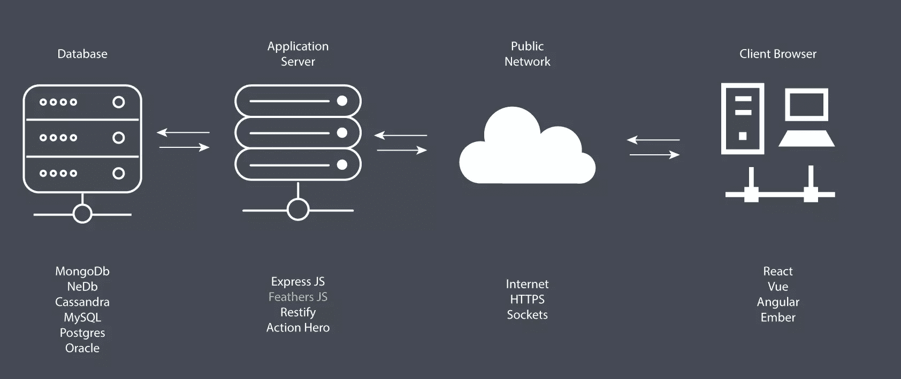

如上图所示，应用服务器的工作是使用 SQL 或 NoSQL 命令从数据库中访问数据，并将其转换为前端应用程序(客户端浏览器)可以理解的格式，如 JSON。此外，应用服务器可以使用各种安全协议(如 HTTPS 加密和令牌授权)来确保数据库和客户端应用程序之间的通信安全可靠。使用这种体系结构的一个主要优点是，您可以使用同一个应用服务器部署面向不同平台的应用程序——桌面、移动、web 等等。还可以很容易地横向扩展您的应用程序，以便高效地为更多用户提供快速响应。

我们将构建一个简单的 API 服务器，并演示 Feathers 提供的各种特性。

## 先决条件

在开始学习本教程之前，您需要在以下主题上有一个良好的基础:

*   [ES6 JavaScript](https://www.sitepoint.com/javascript/es6/)
*   [创建快捷应用](https://www.sitepoint.com/create-new-express-js-apps-with-express-generator/)
*   [用 Express 创建 RESTful APIs】](https://www.sitepoint.com/creating-restful-apis-express-4/)

Feathers 构建在 Node.js 的极简 web 框架 [Express](https://expressjs.com/) 之上。如果你已经完成了链接中演示的教程，你会意识到使用 just Express 构建 RESTful APIs 是相当累人的。有了 Feathers，大部分重复性的工作已经替你完成了。您只需要专注于配置和定制代码。让我们深入代码，了解这个 web 框架是如何工作的。

## 项目创建

要开始使用 Feathers，您需要全局安装它的命令行应用程序:

```
npm install -g @feathersjs/cli 
```

接下来，使用下面的命令创建一个新的 API 项目:

```
mkdir contacts-api
cd contacts-api
feathers generate app 
```

以下是我选择的选项。随意选择任何测试框架。不幸的是，测试超出了本文的重点，所以这里不做讨论。就我个人而言，我喜欢简单，这也是我选择 [Jest](https://jestjs.io/en/) 的原因。

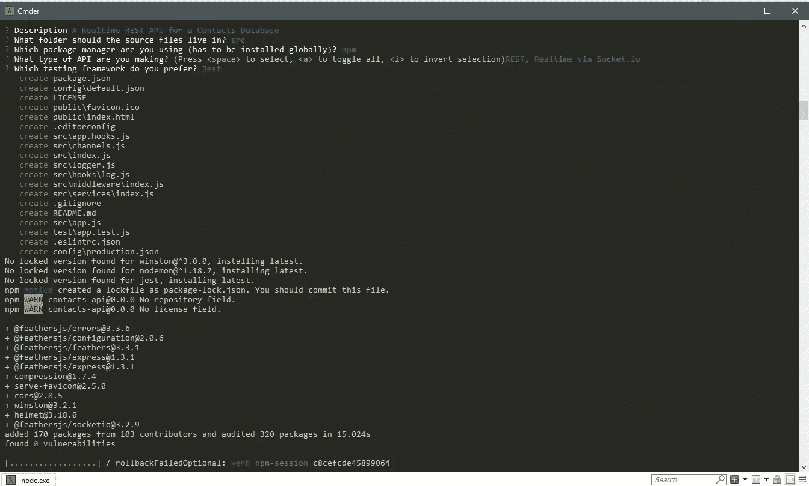

安装完成后，您可以打开您喜欢的代码编辑器来查看项目文件。

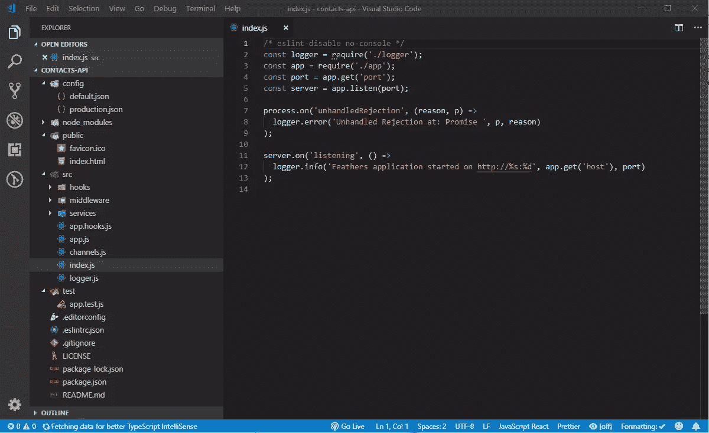

如果您已经完成了我在先决条件一节中列出的快速教程，您不应该被生成的代码吓倒。以下是描述文件夹和文件的简短摘要。

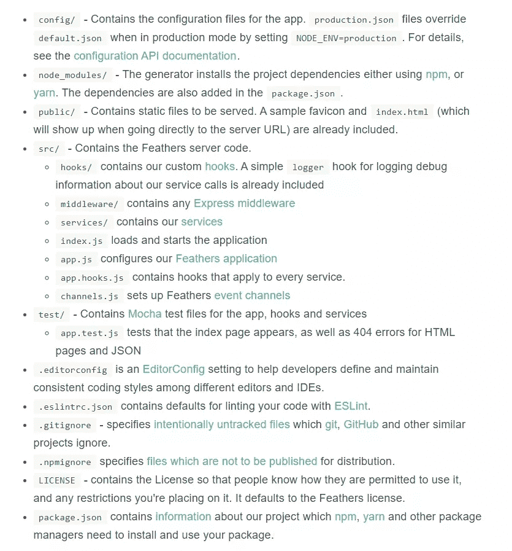

不要太关心每个文件现在做什么。在本教程中，你将会明白它们是如何工作的。现在，让我们确认测试正在工作。

## 林挺

为了确保我们的项目符合定义的 [ESLint](https://eslint.org/) 规则，只需运行命令`npm test`。如果您在 Unix 或 Linux 平台上，这应该运行良好。如果您使用的是 Windows，要成功运行测试，您需要做一些调整。

首先，转到`package.json`并查看脚本部分。将`test`行改为:

```
"scripts": {
  "test": "npm run eslint && SET NODE_ENV= npm run jest",
}, 
```

接下来，如果您已经在 Visual Studio 代码中安装了[更漂亮的](https://marketplace.visualstudio.com/items?itemName=esbenp.prettier-vscode)，您需要在工作区设置选项卡中将单引号设置更改为`true`:

```
{
  "prettier.singleQuote": true
} 
```

最后，确保在创建或编辑任何文件时，行尾是`LF`。如果您使用的是 Visual Studio 代码或类似的编辑器，可以在状态栏中检查当前的行尾样式。如果显示的是`CRLF`，那就换成`LF`。进行这些更改将有助于您通过 lint 测试。不幸的是，要通过测试还需要更多的工作，这里不做介绍。

让我们看看如何生成一个 CRUD RESTful 接口。

## 生成服务

在 Express 中构建一个 Restful CRUD API 接口需要一些工作。在 Feathers 中，您只需执行一条命令，回答几个问题，代码就会自动生成:

```
$ feathers generate service
? What kind of service is it? NeDB
? What is the name of the service? contacts
? Which path should the service be registered on? /contacts
? What is the database connection string? nedb://../data
    force config\default.json
   create src\services\contacts\contacts.service.js
    force src\services\index.js
   create src\models\contacts.model.js
   create src\services\contacts\contacts.hooks.js
   create test\services\contacts.test.js 
```

在本教程中，我们将使用 [NeDB](https://github.com/louischatriot/nedb) 数据库。Feathers 既支持 SQL 数据库，如 T2 的 MySQL T3，也支持 NoSQL 数据库，如 T4 的 MongoDB T5。然而，安装数据库系统——无论是在您的机器上还是在云服务器上——都需要一定的配置时间。另一方面，NeDB 是 100% JavaScript 的内存数据库，支持 MongoDB API 的子集。不需要任何配置；你只需要安装它。这是一个用于原型开发和测试新应用程序的很好的数据库。这是我们将在本教程中使用的。

让我们简要地看一下使用这个命令生成的一些文件:

*   `services/contacts/contact.service.js`。这是一个 Feathers 服务，为`/contacts`提供 CRUD API 端点。很小，不是吗？这是因为羽毛为我们做了繁重的工作。它使我们免于编写样板 CRUD 代码。

*   `services/contacts/contact.hooks.js`。这是我们定制 CRUD 逻辑行为的地方。我们有`before`部分，在 Feathers 读取或写入数据库之前，我们可以在这里检查或更改数据。我们还有一个`after`部分，在它被发送到客户端应用程序之前，我们可以检查或更改来自数据库的结果。我们可以做一些事情，比如限制访问、数据验证、执行连接操作以及计算附加字段或列的值。

*   `models/contacts.model.js`。在这里，我们定义一个模型，并将其附加到一个数据库表中。这也是我们定义一个模式的地方，当插入或更新新记录时，该模式可用于验证字段。不幸的是，NeDB 不支持模式。然而，我提供了一个连接到 MongoDB 的模型示例，它通过`mongoose`适配器支持模式特性:

```
"use strict";

const mongoose = require("mongoose");
const Schema = mongoose.Schema;
require("mongoose-type-email");

const contactsSchema = new Schema({
  name: {
    first: { type: String, required: [true, "First Name is required"] },
    last: { type: String, required: false }
  },
  email: {
    type: mongoose.SchemaTypes.Email,
    required: [true, "Email is required"]
  },
  phone: {
    type: String,
    required: [true, "Phone is required"],
    validate: {
      validator: function(v) {
        return /^\+(?:[0-9] ?){6,14}[0-9]$/.test(v);
      },
      message: "{VALUE} is not a valid international phone number!"
    }
  },
  createdAt: { type: Date, default: Date.now },
  updatedAt: { type: Date, default: Date.now }
});

const contactsModel = mongoose.model("contacts", contactsSchema);

module.exports = contactsModel; 
```

尽管使用 NeDB 有局限性，但它仍然是一个很好的原型数据库。大多数 NoSQL 数据库将允许您使用任何结构提交数据，而不必首先定义模式。一旦实现了项目需求，实现一个模式是更明智的。有了模式后，Feathers 将使用您定义的规则为您执行字段验证。您将需要一个生产就绪的数据库，比如 MongoDB，以便能够定义一个模式。请注意，开发数据库的配置是在`config/default.json`定义的:

```
"nedb": "../data" 
```

这是提供数据库凭证的地方。我们还有另一个名为`config/production.json`的配置文件。这是您部署 Feathers 应用程序时使用的生产数据库配置。在开发过程中使用单独的数据库很重要。否则，您将面临删除或损坏生产数据库中的业务操作数据的风险。

现在我们已经为`contacts`建立了 CRUD 服务，是时候让它转一圈了。您可以使用命令`npm start`启动 Feather 服务器。请注意，这个服务器不支持热重装。所以每次修改代码时都需要重新启动它。为了与我们的 Feathers 应用程序进行交互，我们需要一个 API 浏览器工具，如[邮递员](https://www.getpostman.com/)或[失眠](https://insomnia.rest/)。在本教程中，我将使用失眠症，但是你可以使用 Postman 或任何其他工具轻松地跟上。

创建一个新的 GET 请求(按下`Ctrl` + `N`)，并将其命名为“列出联系人”。在网址部分，输入`http://localhost:3030/contacts`。当您点击**发送**按钮时，您应该会看到以下画面:

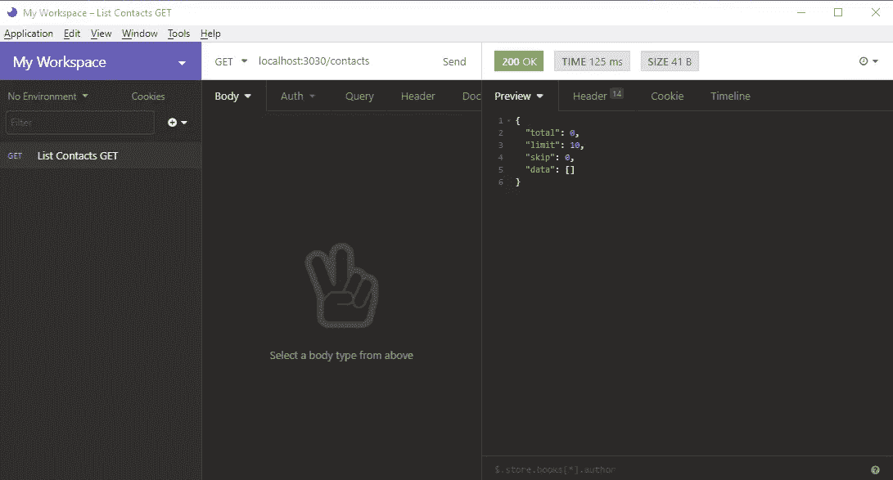

没什么！我们的数据库目前是空的，所以我们需要创建一些新的联系人。创建一个名为`Create Contact`的新请求。如下所示填写其余字段:

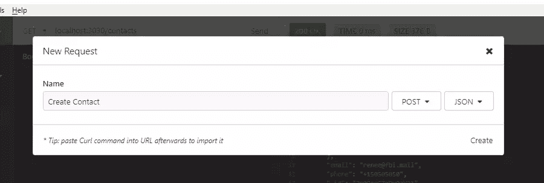

如果您忘记在上面的表格中更改发布方法，您可以稍后再做。将方法改为 POST，并将`Body`选项卡改为 JSON。在 JSON 选项卡中复制以下数据:

```
{
  "name": {
    "first": "Jack",
    "last": "Bauer"
  },
  "email": "jack@ctu.mail",
  "phone": "+1234567"
} 
```

当您点击发送按钮时，您应该得到以下响应。请注意，已经为您的新联系人生成了一个`_id`。

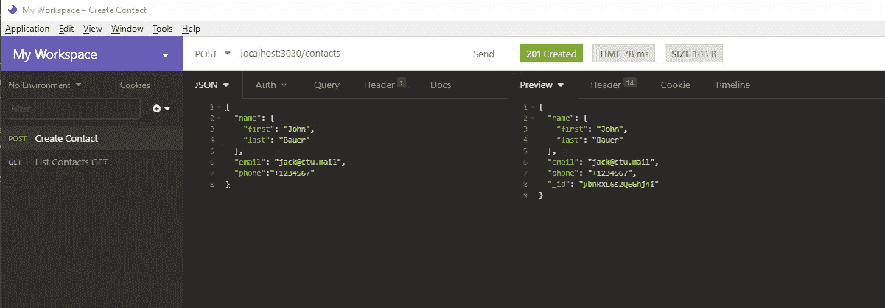

回到`List Contacts`并再次点击**发送**按钮。您应该会得到以下结果:

```
{
  "total": 1,
  "limit": 10,
  "skip": 0,
  "data": [
    {
      "name": {
        "first": "Jack",
        "last": "Bauer"
      },
      "email": "jack@ctu.mail",
      "phone": "+1234567",
      "_id": "ybnRxL6s2QEGhj4i"
    }
  ]
} 
```

回到`Create Contact`并发布几条新记录:

```
{
  "name": {
    "first": "Chloe",
    "last": "O'Brian"
  },
  "email": "chloe@ctu.mail",
  "phone": "+1987654"
} 
```

```
{
  "name": {
    "first": "Renee",
    "last": "Walker"
  },
  "email": "renee@fbi.mail",
  "phone": "+150505050"
} 
```

现在让我们执行一次更新。为此，我们不会使用 UPDATE HTTP 方法。这个方法将完全覆盖一个记录。我们想要做的只是覆盖单个字段，而不是整个记录。为此，我们将使用补丁。创建一个新的请求，`Update Contact`如下图所示:

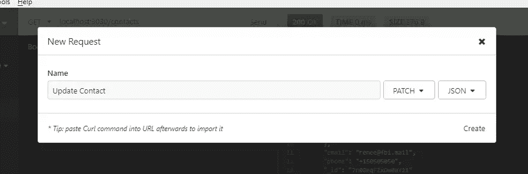

在 URL 字段中，输入`http://localhost:3030/contacts/{_id}`。用第一条记录的 ID 替换`{_id}`。将以下数据放入 JSON 选项卡:

```
{
  "email": "jack.bauer@gmail.com"
} 
```

点击**发送**按钮。您应该会得到以下结果:

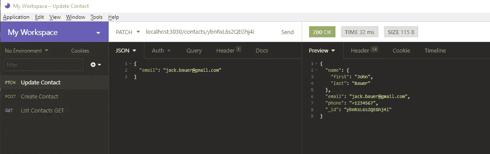

请注意其余的字段是如何保持完整的。接下来，我们将删除一条记录。这个很简单。只需创建一个新的删除请求，并将其命名为`Delete Contact`。在 URL 字段中，使用格式`http://localhost:3030/contacts/{_id}`。就像之前一样，用您想要删除的记录的 ID 替换`{_id}`。点击**发送**将为你删除该记录。您可以通过再次运行`List Contact`请求来确认。

我们刚刚验证了所有 CRUD 操作都运行正常。在下一节中，我们将学习如何设置身份验证。

## 证明

现在，我们的`/contacts` API 端点不受保护。如果我们将应用程序部署到云服务器上，任何人都可以通过 URL 访问和操作我们的记录。为了限制访问，我们需要设置身份验证。我们将使用 [JSON Web 令牌](https://jwt.io/)来实现对我们的 API 应用程序的认证。运行以下命令进行设置:

```
feathers generate authentication 
```

正如您在下面看到的，Feathers 支持不同的用户认证方式。最容易设置的是“本地用户名+密码”选项。

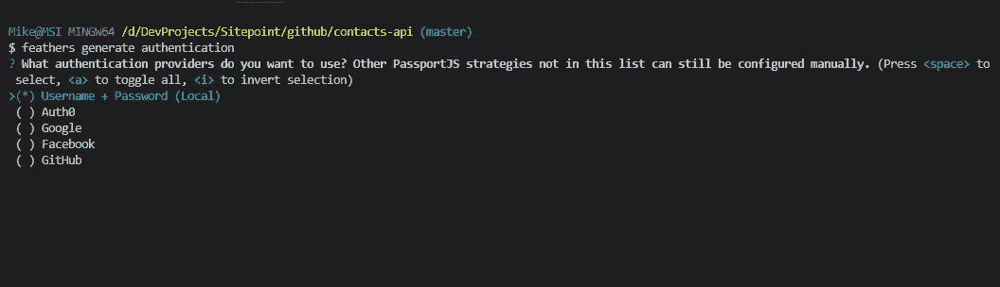

为其余问题选择以下选项。

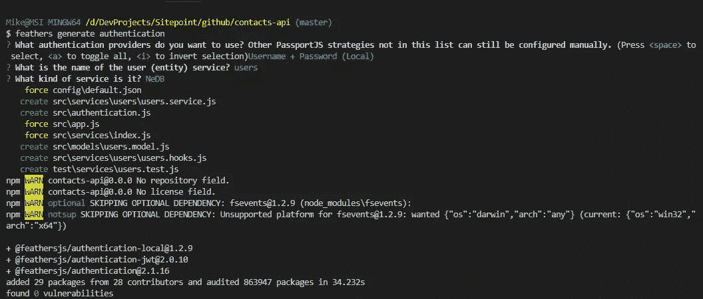

您可以查看由刚刚执行的命令生成的文件:

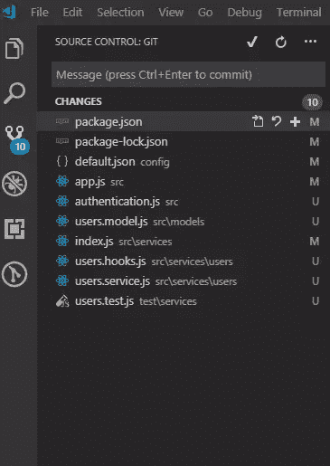

下一步是创建一个新用户。我们可以使用失眠症或任何其他 API 浏览器工具来做到这一点。创建一个新请求，并将其命名为`Create User`:

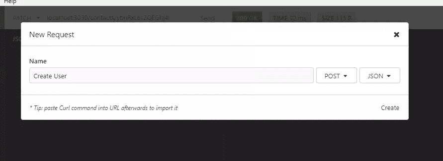

在 JSON 选项卡中，发送以下数据:

```
{
  "email": "admin@example.com",
  "password": "secret"
} 
```

您应该会得到如下类似的响应:

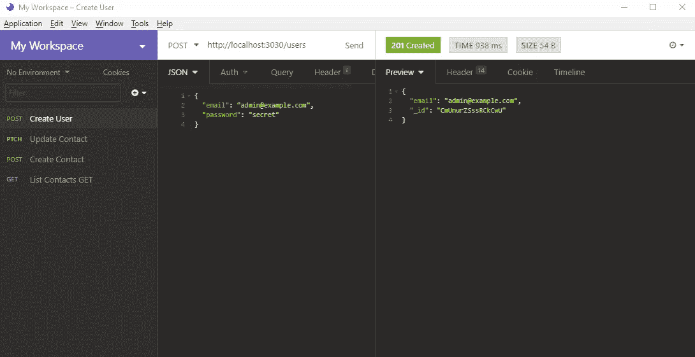

我们现在有了一个用户。让我们通过创建一个新请求`List Users`并发送 URL `http://localhost:3030/users`来确认这一点。不幸的是，您将得到以下响应:

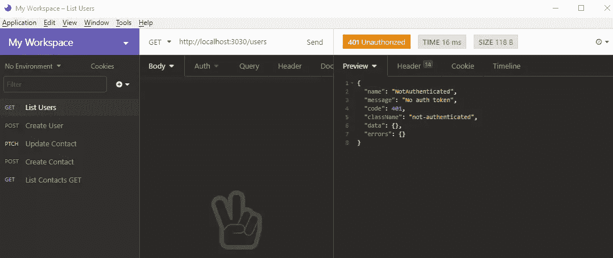

我们需要获得认证才能访问这些数据。由于我们还没有开发一个可以用来登录的前端应用程序，所以我们将继续使用 API 浏览器。创建一个新请求，并将其命名为“获取 JWT 令牌”。如下图所示填写表格:

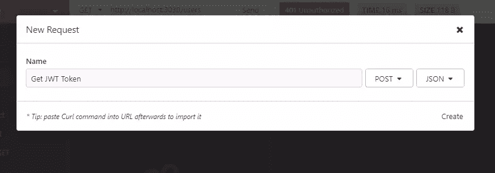

该请求使用 POST 方法。为了更加清晰，也许您可以将请求重命名为“Login”。在 JSON 选项卡中，复制以下数据:

```
{
  "strategy": "local",
  "email": "admin@example.com",
  "password": "secret"
} 
```

点击发送按钮后，您应该会得到以下响应:

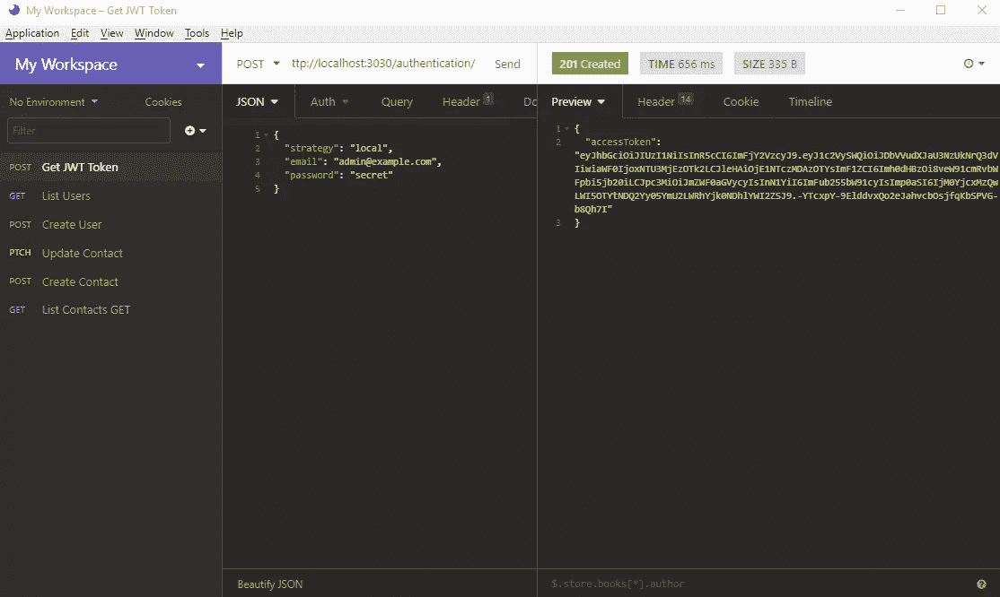

复制令牌代码(不带双引号)。进入`List Users`请求页面，选择`Auth`选项卡并选择`Bearer`。将此令牌码粘贴到`TOKEN`字段。

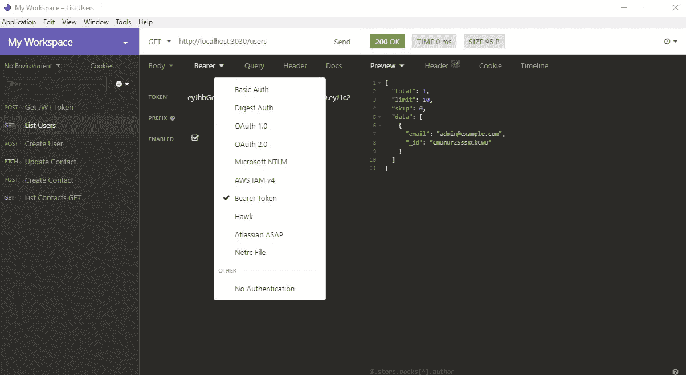

当你点击**发送**按钮时，你应该会得到一个用户列表。请注意，我们的认证系统并不完全安全。任何拥有`/users` URL 端点的人都可以创建一个新账户并访问我们的系统。为了防止未经授权创建新帐户，我们还需要限制该端点。打开文件`services/users/users.hooks.js`并更新以下代码:

```
module.exports = {
  before: {
    //...
    create: [ hashPassword(), authenticate('jwt') ],
    //... 
```

这将确保只有经过身份验证的用户才能创建新帐户。下一步是保护`/contacts`端点。只需打开文件`services/contacts/contacts.hooks.js`并相应地更新:

```
const { authenticate } = require('@feathersjs/authentication').hooks;

module.exports = {
  before: {
    all: [authenticate('jwt')],
    //...
  }, 
```

重新启动 Feathers 服务器以使代码更改生效。如果您尝试运行`List Contacts`请求，您将得到以下响应:

```
{
  "name": "NotAuthenticated",
  "message": "No auth token",
  "code": 401,
  "className": "not-authenticated",
  "data": {},
  "errors": {}
} 
```

要获得认证，您需要像之前一样设置`Bearer`令牌。一旦你这样做了，你可以发送你的请求，你应该会收到你的联系人名单。请注意，您之前获得的令牌将在一天后过期。为了提高效率，最好使用[环境变量](https://support.insomnia.rest/article/18-environment-variables)，这样一次更新所有 API 请求参数就变得更容易了。构建前端应用程序时，您需要将这个令牌存储在`local storage`中。不要用饼干。否则，你的应用将容易受到 [CSRF](https://www.owasp.org/index.php/Cross-Site_Request_Forgery_(CSRF)) 的攻击。查看关于[安全](https://docs.feathersjs.com/security)的 Feathers 文档，了解更多关于你应该注意的其他安全风险。

现在您已经设置了身份验证，此后您创建的任何新服务都将为您提供保护新端点的选项。现在让我们在下一节看看本教程的最后一个主题。

## 钩住

钩子是附加在服务方法的前**、**后**或**错误**上的中间件函数。它们通常用于处理日志记录、限制访问、保护字段、填充相关实体、发送通知等等。如果你看`services/users/users.hooks.js`，你可以看到一些内置的羽毛挂钩在使用。我们将创建自己的自定义挂钩。首先，停止服务器并删除`data/contacts.db`数据库表。接下来，通过使用以下命令生成钩子来创建一个新钩子:**

```
feathers generate hooks 
```

使用以下选项创建自定义挂钩`process-contact`:

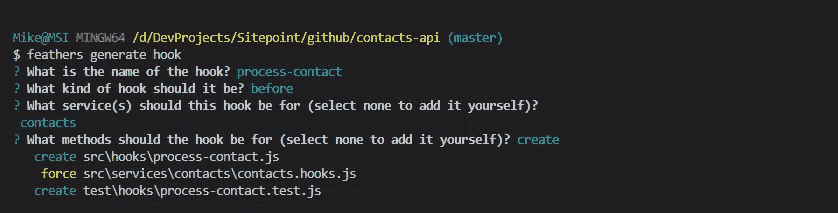

我们想在这个钩子中做的是在处理`Create Contact`请求之前注入两个新字段。

*   `createdBy`:链接到当前登录的用户 by _id
*   `createdOn`:添加创建日期

打开文件`hooks/process-contact.js`，按如下方式更新文件:

```
module.exports = function(options = {}) {
  return async context => {
    return context;
  };
}; 
```

```
module.exports = function(options = {}) {
  return async context => {
    // Get authenticated user
    const user = context.params.user;

    //Extract Submitted Data
    const { data } = context;

    // Add new Fields
    context.data = {
      ...data, // Preserve submitted data
      createdBy: user._id,
      createdOn: new Date()
    };
    return context;
  };
}; 
```

接下来，创建另一个钩子`populate-user`，当请求时，它将把一个`user`对象附加到每个`contact`记录。按照下面截图中的说明进行操作:

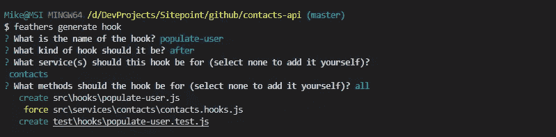

打开文件`hooks/populate-user`并插入以下代码:

```
// eslint-disable-next-line no-unused-vars
module.exports = function(options = {}) {
  return async context => {
    const { app, method, result, params } = context;

    // Ensure contacts is an array. If it's a single contact, wrap it into an array
    const contacts = method === "find" ? result.data : [result];

    // Fetch user object from each contact's createdBy
    await Promise.all(
      contacts.map(async contact => {
        contact.user = await app
          .service("users")
          .get(contact.createdBy, params);
      })
    );

    return context;
  };
}; 
```

阅读评论，了解它是如何工作的。您现在可以启动服务器了。使用`Create Contact`请求再次创建三个联系人。如果您还没有设置不记名令牌，请设置它。否则，您会收到一个授权错误。当您创建新联系人时，应该会得到这样的回复:

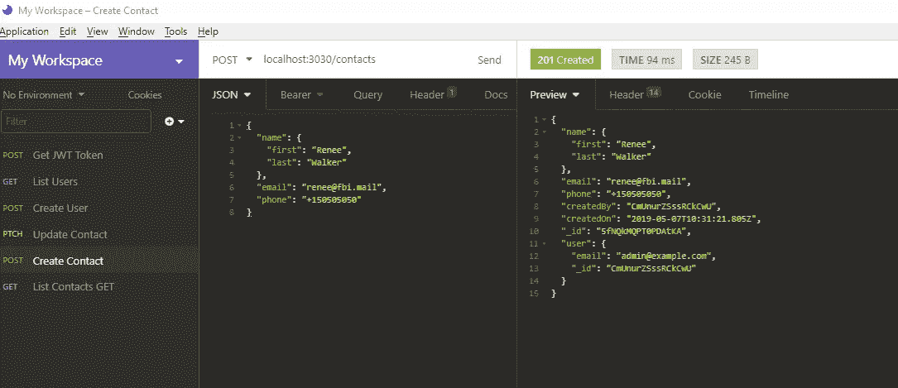

## 摘要

我希望您现在已经学会了如何快速构建自己的 RESTful API 服务器。我们只是触及了基础，你应该浏览一下[完整指南](https://docs.feathersjs.com/)来发现 Feathers 可以提供的更多特性，帮助你以最小的努力实现高级特性。你也应该去看看[令人敬畏的羽毛](https://github.com/feathersjs/awesome-feathersjs)页面，里面有丰富的资源。无论你需要一个插件、项目示例还是教程，你都可以在那里找到链接。你也应该看看[羽毛加 CLI](https://github.com/feathers-plus/cli) ，这是类固醇羽毛。它在 Feathers CLI 已经提供的基础上增加了新的特性，比如为播种和 GraphQL 支持生成代码。

如果你想进一步推进`contacts-api`项目，我鼓励你使用自己选择的框架创建一个新的前端应用程序。为`/contacts`和`/users`端点构建一个登录屏幕和 CRUD 页面。享受实施挑战的乐趣。

## 分享这篇文章