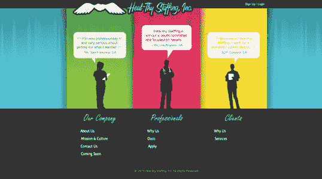
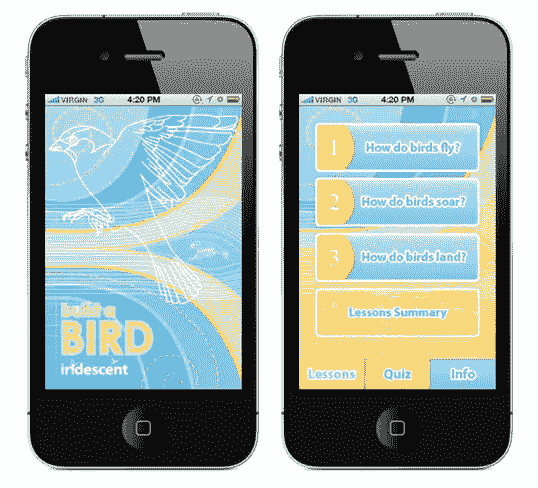
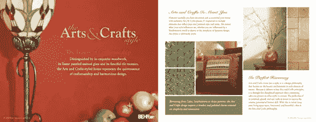
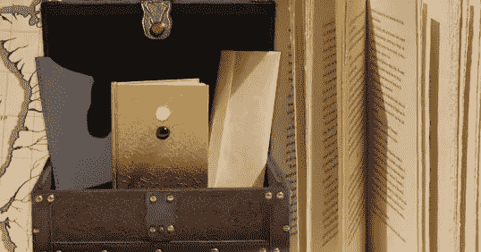
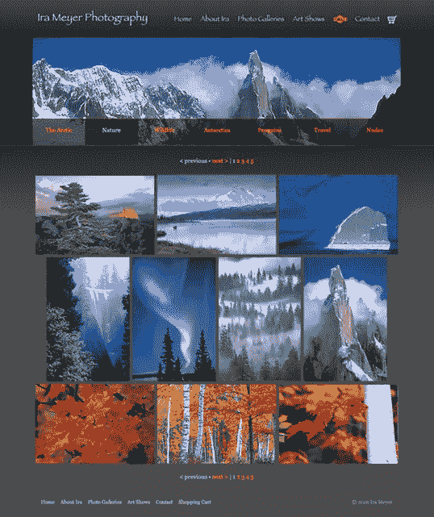

# 特色读者:杰西卡·格林沃特，自由设计师，Pixelkeet 创始人

> 原文：<https://www.sitepoint.com/featured-reader-jessica-greenwalt-founder-of-pixelkeet/>

杰西卡·格林沃特是加州的自由设计师。她有超过 10 年的设计经验，她已经获得了许多知名客户，包括 LinkedIn、SmugMug 和 Marvel Comics。杰西卡的作品包括多种媒介:印刷品、网络、手机、插图，甚至手工制作。今年早些时候，杰西卡创立了自己的设计公司 Pixelkeet。你可以在[她的行为作品集](http://www.behance.net/jgreenwalt)和[的网站](http://www.jgreenwalt.com)上看到更多她的作品，你也可以在[脸书](http://www.facebook.com/JessicaGreenwaltDesign)和[推特](https://twitter.com/jessgreenwalt)上关注她。

### Heal-thy 人事公司。

### 构建一个小鸟 iPhone 应用程序

### 贝尔数码文章:艺术和手工艺风格

### 《炼金术士》特别收藏书籍设计

### 艾拉·迈耶摄影网站

## 分享这篇文章