# 采访:詹姆斯·瓦尔德纳和他令人难以置信的标志设计

> 原文：<https://www.sitepoint.com/featuring-james-waldner-and-his-incredible-logo-designs/>

[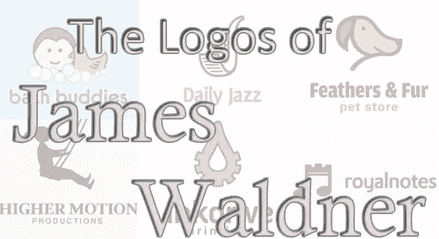](https://www.sitepoint.com/wp-content/uploads/2011/11/00-featured.jpg)

简洁和清晰是伟大标志的标志，所以当你发现像詹姆斯·瓦尔德纳这样的设计师能够通过标志设计表达复杂的想法时，你会注意到——我们已经注意到了。詹姆斯有一种独特的能力来创造美丽的标志，同时保持简单，易于理解的视觉表现。

詹姆斯设计的一个引人注目的元素是他使用的基本形状——圆形、正方形和三角形。除了一些委托的波峰型设计项目，詹姆斯完成的绝大部分作品都源自这些基本形状。以下是几个比较明显的例子:

[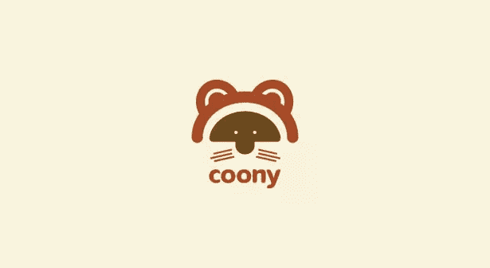](https://www.sitepoint.com/wp-content/uploads/2011/11/01-cooney.jpg)

[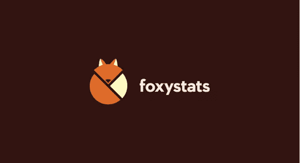](https://www.sitepoint.com/wp-content/uploads/2011/11/02-foxystats.jpg)

[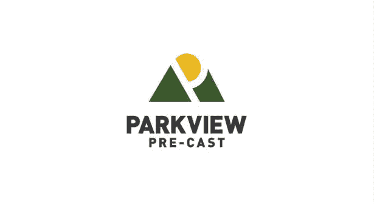](https://www.sitepoint.com/wp-content/uploads/2011/11/03-parkview.jpg)

[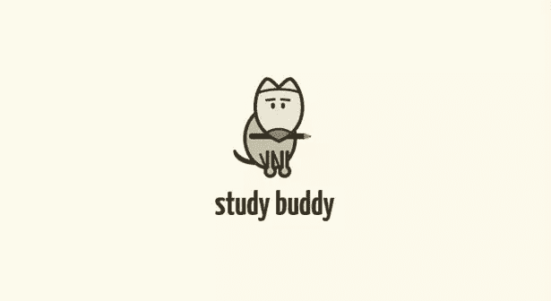](https://www.sitepoint.com/wp-content/uploads/2011/11/04-studybuddy.jpg)

### 从自学成才到成功的设计师

詹姆斯很友好地接受了我们的采访。我们喜欢进入设计师的头脑，尤其是那些已经取得成功的设计师，看看他们有什么样的过程和他们如何处理他们的艺术。詹姆斯有一些很好的提示和见解，我们认为这些将有助于任何人开始或发展自己的设计工作室。

***设计节:你的设计往往包含某种形式的印刷元素。你在哪里找到字体，你有发现完美匹配的过程吗？***

 **詹姆斯·瓦尔德纳(JW): 有很多网站提供高质量的字体。我最喜欢的是 MyFonts.com 的[和 FontShop.com 的](http://myfonts.com/)。对于设计师来说，FontSquirrel.com 也是一个免费字体的好地方。使用优质字体是值得的！

我试图匹配图标的风格和个性。他们必须结婚。匹配它们是一项艰巨的工作，需要花费大量的时间。找到完美的类型是困难的，这本身就是一门艺术。有时，如果需要，我会定制设计类型。在字体中使用一些定制总是很好的，因为它可以防止一些人轻易地重新创建标识。

***DF:** 客户面试是一个热门话题，在讨论如何成为一名平面设计师时，往往会被忽视。与新客户的最初几次对话有多重要，你是否有一个流程来确保你做得正确？*

JW: 客户面谈是整个过程中至关重要的一部分。我相信不是每个客户都适合我，所以我会选择哪些客户。作为设计师，我们经常觉得我们必须承担每一个项目。如果我们这样做了，我们就接受那些根本不会有回报的项目，因为它们需要比预期多得多的时间。或者，我们接受采用“当我看到它时我就知道”方法的客户。简而言之，有些客户不知道他们想要什么，我觉得最好避开。

在面试中，我通常会问许多项目的具体问题，以确定我们是否是一个好的匹配，以及我是否有信心能够产生客户所期望的结果。我也了解项目细节。我能了解的信息越多越好。客户是开放的还是他们知道他们想要什么？两者都有风险。一个开放式的项目有很多选择，一个确切知道他们想要什么的客户可能不会对你的想法足够灵活。所以是组合。

我寻找让我工作的客户。他们相信我在设计方面的个人观点，并根据设计方面的良好表现提出建议。我们需要一个开放的沟通渠道，这样我们才能讨论方法。

[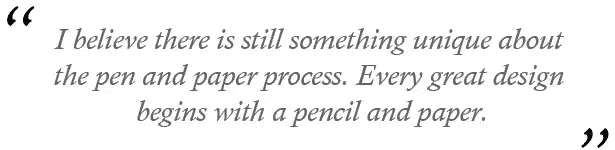](https://www.sitepoint.com/wp-content/uploads/2011/11/05-quote.jpg)

***【DF】**:你是在纸上设计，然后翻译成插画，还是从数字流程开始？*

JW: 我相信纸笔的制作过程还是有一些独特之处的。每一个伟大的设计都始于一支铅笔和一张纸。一旦我有了喜欢的设计，我要么扫描它，要么在 illustrator 中重新绘制它。所有标志都是用 illustrator 矢量完成的。

***DF:** 你是一个自称自学成才的设计师。你是如何学会这门手艺的，你是如何坚持学习的？*

JW: 大多数人不知道的是，我是一名认证教师。我第一次接触 Adobe 产品是在我教高中设计课程的时候。为了让自己沉浸在设计环境中，我开始为当地企业设计/开发网站。我相当喜欢它，并开始做得越来越多。设计比编码有趣得多，所以我专注于设计而不是编码，并雇佣了编码员。在与当地企业合作后，我注意到对标志设计的需求，所以我使用 illustrator 扩展到该领域。我被迷住了。当我查看在当地提供服务的公司时，我惊讶地看到许多平凡的质量工作。对我来说，这是一个提供真正高质量设计的机会。

我爱读书，从专业的平面设计书籍中学到很多东西。我经常买书，参加在线设计研讨会。像[Dribbble.com](http://www.dribbble.com)、[LogoPond.com](http://www.logopond.com)、[LogoLounge.com](http://www.logolounge.com)这样的网站真的帮了我大忙，因为我能够得到该领域其他专业人士的评论，并让行业专业人士看到我的作品。

我是一个完美主义者，这有助于提高我的工作质量。它已被许多与标识相关的网站认可，如:logopond.com、logomoose.com、logooftheday.com、logolounge.com、iheartlogos.com 等。让我的作品出现在网站上并出版成册，帮助我在全球范围内找到了客户。

你通常一次处理多少个客户？

JW: 我相信质量而不是数量。因此，我在任何时候都只接两个客户，专注于手头的项目。它让我更好地为客户服务，让我更有条理，更有效率。

### 全面质量

詹姆斯·瓦尔德纳有着鼓舞人心的故事和优秀的职业道德，他是一个应该激励我们其他人在我们自己的行业中取得成就的设计师，无论是在哪个行业。我们看到这位设计师接受了艰苦的工作，抓住了出现在他面前的机会，并继续制作高质量的设计——这些都是帮助他成为今天成功的标志和网页设计师的品质。

查看下面詹姆斯的一些标志设计，然后访问他的网站[GoLumo.com](http://golumo.com/)看到更多他的不可思议的工作，除了标志，还包括网页设计，托管，甚至搜索引擎优化。

[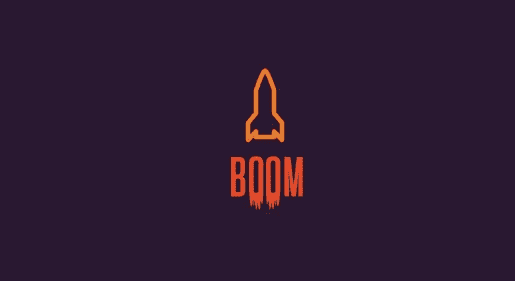](https://www.sitepoint.com/wp-content/uploads/2011/11/boom.jpg)

[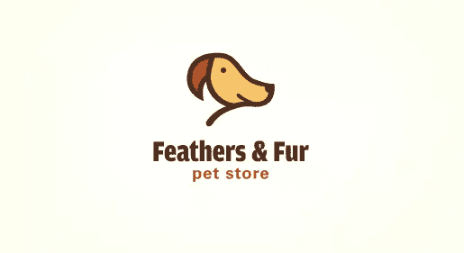](https://www.sitepoint.com/wp-content/uploads/2011/11/feathersandfur.jpg)

[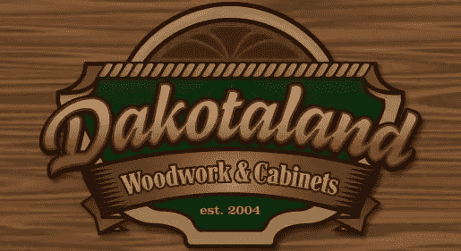](https://www.sitepoint.com/wp-content/uploads/2011/11/dakota1.jpg)

[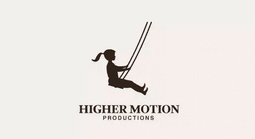](https://www.sitepoint.com/wp-content/uploads/2011/11/highermotion.jpg)

[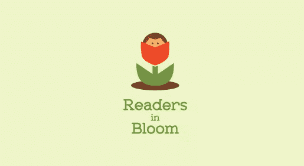](https://www.sitepoint.com/wp-content/uploads/2011/11/readers.jpg)

[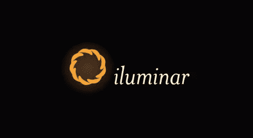](https://www.sitepoint.com/wp-content/uploads/2011/11/iluminar.jpg)** 

## **分享这篇文章**