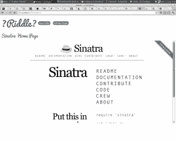

# 摆弄西纳特拉，第二部分

> 原文：<https://www.sitepoint.com/fiddling-around-with-sinatra-ii/>

在[的上一篇文章](https://www.sitepoint.com/fiddling-around-with-sinatra/)中，我们成功构建了一个应用程序，允许用户通过创建“谜语”——HTML、CSS 和 JavaScript 的小片段——来展示他们的 HTML、CSS 和 JavaScript 技能。作为一个额外的奖励，它还允许用户使用 SCSS 为 HTML 设计风格和降价。在这一部分，我们将对应用程序进行一些改进，使其更像[网站](http://codepen.io/) [it](http://dabblet.com/) [克隆](https://jsfiddle.net/)。

## iFrames

我们要做的第一件事是将每个谜语放入它自己的 iframe 中。这意味着谜语将有效地存在于它自己的 HTML 文档中。这样做的好处是使每个谜语的行为完全像它是一个自包含的网页一样，所以用户将能够加载外部库和网络字体，这在以前是不可能的。

要实现 iframe，我们需要更改显示视图，如下所示: