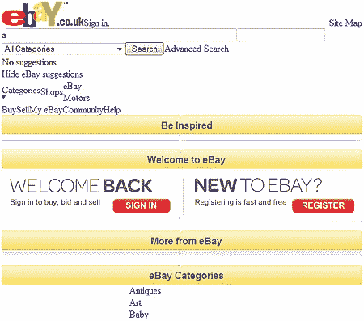

# 为什么文件命名比你想象的更重要

> 原文：<https://www.sitepoint.com/file-naming-important/>

命名你的网络文件通常不被认为是特别重要的。开发人员很少花太多时间考虑文件和文件夹的名字，除非他们正在实现一个 REST API T2，或者添加一些 SEO 专家认为有助于他们营销的关键词。

但是，您为 HTML、CSS、JavaScript 和图形文件选择的文件夹和文件名可能会产生灾难性的影响。举个例子，这是易贝英国主页今天在我的浏览器上的样子:

原因是:我使用的是 [Adblock Plus](https://addons.mozilla.org/en-US/firefox/addon/1865) ，这是一个 Firefox 插件，可以从页面上删除广告。Adblock Plus 是最受欢迎的 Firefox 扩展，已经被下载了 5000 万次。Adblock 并不孤单:所有主流浏览器都有几十个免费软件、共享软件和商业广告拦截器。甚至不受支持的浏览器也可以使用网页过滤代理服务器，如 [Proxomitron](http://www.proxomitron.info/) 。

作为开发者，你绝对无法阻止广告拦截软件。大多数拦截器使用正则表达式规则来检查域名、文件名或 HTML 代码。易贝看起来如此糟糕的原因是因为几个核心的 CSS 文件被封锁；它们不包含广告，但它们的文件名无意中触发了 Adblock 的规则。

虽然您不能阻止广告拦截器，但您可以避免在合法文件和文件夹中使用类似广告的名称，以确保它们不会被拦截。要避免的典型名称包括:

*   任何以“广告”或“广告”为特征的词。我甚至会对“添加”、“调整”或“管理”等词保持警惕。
*   以“横幅”、“点击”、“服务器”、“bureua”或“辛迪加”为特征的单词组合。
*   包含*标准*横幅尺寸的数字，例如 my-image-468×60.jpg

最重要的是，使用各种广告拦截软件测试你的系统。

你被广告拦截器发现了吗？你有其他建议来确保文件不会被意外阻止吗？

## 分享这篇文章