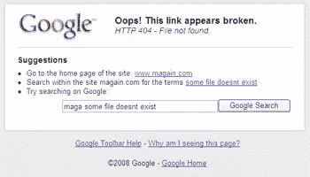

# 找不到文件？谷歌最清楚

> 原文：<https://www.sitepoint.com/file-not-found-google-knows-best/>

谷歌 IE 工具栏的 [beta 5 版本中加入了一个新功能——忽略网站的 404 页面，显示自己的文件未找到页面(当然有链接和谷歌搜索栏)——这引起了](http://toolbar.google.com/T5/intl/en/index.html)[许多](http://seoker.com/2008/02/12/update-on-the-google-404-page-hijack/)[的](http://www.techcrunch.com/2008/02/12/new-google-toolbar-beta-hijacks-404-pages/)[博主](http://www.zoliblog.com/2008/02/12/google-takes-a-404-page-from-opendnss-book/)到[叫屈](http://www.lastpodcast.net/2008/02/12/rumor-google-likes-your-404-reality-not-really/)。

谷歌的马特·卡茨(Matt Cutts)已经进入了“[没关系，我们只是在帮助](http://www.mattcutts.com/blog/404-pages-in-google-toolbar/)”模式，澄清了谷歌版本的文件未找到页面只有在网站显示的 404 页面小于 512 字节的情况下才会生效(这一假设据称是针对默认页面的)。当然，完全有可能的是，一个定制的 404 页面没有使用太多的标记，在谷歌看来，这意味着它不值得显示。
 **是**这是一个用户可以关闭的设置，用户可以选择**是**来卸载工具栏。但另一方面，这是一个默认打开的设置，是一个非常受欢迎的软件，拥有庞大的用户群——我保持标记精简的事实是否会导致我的 404 页面被谷歌认为他们应该看到的内容覆盖(对那些用户来说)？向浏览器添加功能和扩展其功能是一回事，而显示一个完全不同的页面则完全是另一回事。

TechCrunch 进行的一项民意调查显示，毫不奇怪，73%的读者不同意谷歌在这个问题上的立场。

这可能不算邪恶，但肯定是一个巨大的灰色地带。

## 分享这篇文章