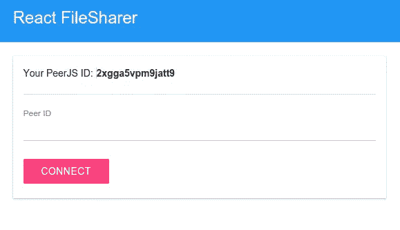
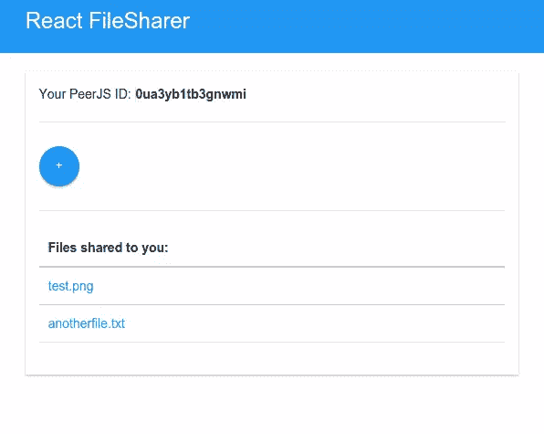

# 在 React & PeerJS 中构建对等文件共享组件

> 原文：<https://www.sitepoint.com/file-sharing-component-react/>

*这篇文章由[丹普林斯](https://www.sitepoint.com/author/dprince/)和[布鲁诺莫塔](https://www.sitepoint.com/author/bmota/)进行了同行评审。感谢 SitePoint 的所有同行评审员使 SitePoint 的内容尽可能做到最好！*

在本教程中，我们将使用 [PeerJS](http://peerjs.com/) 和 [React](https://facebook.github.io/react/) 构建一个文件共享应用。我会假设你是一个完全的初学者，所以我会提供尽可能多的细节。

为了让你对我们将要构建的东西有个概念，这里有几个应用程序的截图。首先，当组件可以使用时:



下面是当前用户已经连接到一个对等点，并且该对等点已经与该用户共享了一些文件时的情况:



本教程的源代码是 GitHub 上的[。](https://github.com/sitepoint-editors/react-filesharer)

## 技术堆栈

如前所述，文件共享 app 要用 PeerJS 和 React。PeerJS 库允许我们通过 [WebRTC](https://en.wikipedia.org/wiki/WebRTC) 连接两个或更多设备，提供了一个开发人员友好的 API。如果你不知道 WebRTC 是什么，它基本上是一个允许在 web 上进行实时通信的协议。另一方面，React 是一个基于组件的视图库。如果您熟悉 Web 组件，它类似于为您提供创建自定义独立 UI 元素的能力的方式。如果你想深入了解这一点，我推荐你阅读《T2》为愚蠢的人准备的反应。

## 安装依赖项

在我们开始构建应用程序之前，我们首先需要使用 [npm](https://www.npmjs.com/) 安装以下依赖项:

```
npm install --save react react-dom browserify babelify babel-preset-react babel-preset-es2015 randomstring peerjs 
```

以下是对每种方法的简要描述:

*   **[React](https://www.npmjs.com/package/react)**–React 库。
*   **[-react-dom](https://www.npmjs.com/package/react-dom)**-这允许我们将 React 组件渲染到 DOM 中。React 不直接与 DOM 交互，而是使用一个虚拟 DOM。ReactDOM 负责将组件树渲染到浏览器中。如果你想深入了解这一点，我推荐你阅读[React js |学习虚拟 DOM 和 React Diff 算法](http://www.oyecode.com/2015/09/reactjs-learning-virtual-dom-and-react.html)。
*   **[browser ify](https://www.npmjs.com/package/browserify)**–允许我们在代码中使用`require`语句来要求依赖关系。这负责将所有文件放在一起(捆绑)，以便可以在浏览器中使用。
*   **[巴别利菲](https://www.npmjs.com/package/babelify)**——巴别利菲的变形金刚。它负责将捆绑的 es6 代码编译成 es5。
*   **[巴别塔-预设-反应](https://www.npmjs.com/package/babel-preset-react)**-所有反应插件的巴别塔预设。它用于将 JSX 转换成 JavaScript 代码。
*   **[巴别预设-es 2015](https://www.npmjs.com/package/babel-preset-es2015)**-将 ES6 代码翻译成 ES5 的巴别预设。
*   **[randomstring](https://www.npmjs.com/package/randomstring)**–生成随机字符串。我们将使用它来生成文件列表所需的密钥。
*   –peer js 库。负责在对等体之间建立连接和共享文件。

## 构建应用程序

现在我们已经准备好构建应用程序了。首先让我们看一下目录结构:

```
-js
-node_modules
-src
    -main.js
    -components
        -filesharer.jsx
index.html 
```

*   **js**——browser ify 将要捆绑的 JavaScript 文件存储在这里。
*   **src**–存放 React 组件的地方。在里面，我们有一个`main.js`文件，我们在其中导入 React 和应用程序使用的组件。在这种情况下，我们只有包含应用程序主体的`filesharer.jsx`。
*   **index.html**——app 的主文件。

### 索引页

让我们从`index.html`文件开始。这包含应用程序的默认结构。在`<head>`中，我们有到主样式表和 PeerJS 库的链接。在`<body>`中，我们有应用程序的标题栏和主`<div>`，在这里我们将添加我们创建的 React 组件。就在结束之前的`<body>`标签是应用程序的主要 JavaScript 文件。

```
<!DOCTYPE html>
<html lang="en">
<head>
    <meta charset="UTF-8">
    <title>React File Sharer</title>

    <link href="http://cdn.muicss.com/mui-0.4.6/css/mui.min.css" rel="stylesheet" type="text/css" />
</head>
<body>

    <div class="mui-appbar mui--appbar-line-height">
        <div class="mui-container">
          <span class="mui--text-headline">
            React FileSharer
          </span>
        </div>
    </div>
    <br />
    <div class="mui-container">
        <div id="main" class="mui-panel"></div>
    </div>

    <script src="js/main.js"></script>
</body>
</html> 
```

### 主 JavaScript 文件

[`src/main.js`](https://github.com/sitepoint-editors/react-filesharer/blob/master/src/main.js) 文件是我们将主要组件渲染到 DOM 中的地方。

首先，我们需要 React 框架、ReactDOM 和`Filesharer`组件。

```
var React = require('react');
var ReactDOM = require('react-dom');
var Filesharer = require('./components/filesharer.jsx'); 
```

然后我们声明一个`options`对象。这用于指定`Filesharer`组件的选项。在这种情况下，我们传递的是`peerjs_key`。这是你从 [PeerJS 网站](http://peerjs.com/peerserver)获得的 API 密匙，这样你就可以使用他们的对等云服务来建立对等连接。在我们的应用程序中，它充当共享文件的两个对等方(设备)之间的中间人。

```
var options = {
    peerjs_key: 'your peerjs key'
} 
```

接下来，我们定义主要组件。我们通过调用`React`对象的`createClass`方法来实现。它接受一个对象作为它的参数。默认情况下，React 期望在对象内部定义一个`render`函数。这个函数的作用是返回组件的用户界面。在这种情况下，我们只是返回我们之前导入的`Filesharer`组件。我们还传入了`options`对象作为`opts`属性的值。在 React 中，这些属性被称为 *props* ，它们可以在组件内部使用，有点像向函数传递参数。稍后，在`Filesharer`组件中，您可以通过说出`this.props.opts`后跟您想要访问的任何属性来访问选项。

```
var Main = React.createClass({
  render: function () {
    return <Filesharer opts={options} />;
  }
}); 
```

从 DOM 中获取 main `div`的引用，然后使用 ReactDOM 的`render`方法呈现主组件。如果您熟悉 jQuery，这基本上类似于`append`方法。所以我们正在做的是将主组件追加到主`div`中。

```
var main = document.getElementById('main');

ReactDOM.render(<Main/>, main); 
```

### 文件共享组件

前面提到的`Filesharer`组件( [`src/components/filesharer.jsx`](https://github.com/sitepoint-editors/react-filesharer/blob/master/src/components/filesharer.jsx) )，包含了 app 的主体部分。组件的主要目的是拥有可以在任何地方使用的独立代码。其他开发人员可以导入它(就像我们在主组件中做的那样)，传入一些选项，渲染它，然后添加一些 CSS。

分解一下，我们首先导入 React 框架、randomstring 库和 PeerJS 客户端。

```
var React = require('react');
var randomstring = require('randomstring');
var Peer = require('peerjs'); 
```

我们向外界公开组件:

```
module.exports = React.createClass({
    ...
}); 
```

在前面的主 JavaScript 文件中，我们传递了一个可选的`prop`来定制将在文件共享组件中显示的标签。为了确保将正确的属性名(`opts`)和数据类型(`React.PropTypes.object`)传递给组件，我们使用`propTypes`来指定我们所期望的。

```
propTypes: {
    opts: React.PropTypes.object
}, 
```

在传递给`createClass`方法的对象中，我们有`getInitialState`方法，React 用它来返回组件的默认状态。这里我们返回一个包含以下内容的对象:

*   `peer`–用于连接服务器的 PeerJS 对象。这使我们能够获得一个唯一的 ID，其他人可以用它来连接我们。
*   `my_id`–服务器分配给设备的唯一 ID。
*   `peer_id`–您正在连接的对等用户的 ID。
*   `initialized`–一个布尔值，用于确定我们是否已经连接到服务器。
*   `files`–用于存储已共享给我们的文件的数组。

```
getInitialState: function(){
    return {
        peer: new Peer({key: this.props.opts.peerjs_key}),
        my_id: '',
        peer_id: '',
        initialized: false,
        files: []
    }
} 
```

请注意，我们上面使用的 PeerJS 初始化代码仅用于测试目的，这意味着只有当您在计算机中打开的两个浏览器之间共享文件时，或者当您在同一网络上共享文件时，它才会起作用。如果你真的想稍后构建一个生产应用，你必须使用[对等服务器](https://github.com/peers/peerjs-server)而不是对等云服务。这是因为对等云服务对您的应用程序可以拥有的并发连接数有限制。您还必须指定一个`config`属性，在其中添加 ICE 服务器配置。基本上，这可以让你的应用程序处理 NAT 和防火墙或其他存在于对等体之间的设备。如果你想了解更多，你可以在 HTML5Rocks 的 WebRTC 上阅读[这篇文章。我已经在下面添加了一些 ICE 服务器配置。但是如果它不起作用，你可以从这里的](http://www.html5rocks.com/en/tutorials/webrtc/infrastructure/)[中选择](https://gist.github.com/zziuni/3741933)或者[创建你自己的](https://www.webrtc-experiment.com/docs/TURN-server-installation-guide.html)。

```
peer = new Peer({
  host: 'yourwebsite.com', port: 3000, path: '/peerjs',
  debug: 3,
  config: {'iceServers': [
    { url: 'stun:stun1.l.google.com:19302' },
    { url: 'turn:numb.viagenie.ca', credential: 'muazkh', username: 'webrtc@live.com' }
  ]}
}) 
```

回到正轨，接下来我们有了`componentWillMount`方法，它在组件装入 DOM 之前执行。所以这是执行我们想在其他事情之前运行的代码的完美地方。

```
componentWillMount: function() {
    ...
}); 
```

在这种情况下，我们使用它来监听由`peer`对象触发的`open`事件。当该事件被触发时，意味着我们已经连接到对等服务器。对等服务器分配的惟一 ID 作为参数传递，所以我们用它来更新状态。一旦我们有了 ID，我们还必须将`initialized`更新为`true`。这显示了组件中的元素，该元素显示了用于连接到对等点的文本字段。在 React 中，*状态*用于存储整个组件中可用的数据。调用`setState`方法更新您指定的属性，如果它已经存在，否则它只是添加一个新的。还要注意，更新状态会导致整个组件重新呈现。

```
this.state.peer.on('open', (id) => {
    console.log('My peer ID is: ' + id);
    this.setState({
        my_id: id,
        initialized: true
    });
}); 
```

接下来我们收听`connection`事件。每当另一个人试图连接到我们时，就会触发此事件。在这个应用程序中，只有当他们点击*连接*按钮时才会发生这种情况。当这个事件被触发时，我们更新状态来设置当前连接。这表示当前用户和另一端用户之间的连接。我们用它来监听`open`事件和`data`事件。注意，这里我们传入了一个回调函数作为`setState`方法的第二个参数。这是因为我们使用状态中的`conn`对象来监听`open`和`data`事件。所以我们希望一旦我们做了，它就已经可用了。`setState`方法是异步的，所以如果我们在调用它之后立即监听事件，那么`conn`对象可能在状态中仍然不可用，这就是为什么我们需要回调函数。

```
this.state.peer.on('connection', (connection) => {
    console.log('someone connected');
    console.log(connection); 

    this.setState({
        conn: connection
    }, () => {

        this.state.conn.on('open', () => {
            this.setState({
                connected: true
            });
        });

        this.state.conn.on('data', this.onReceiveData);

    });

}); 
```

当对等服务器成功建立到对等的连接时，触发`open`事件。当这种情况发生时，我们将状态中的`connected`设置为`true`。这将向用户显示文件输入。

每当另一端的用户(从现在开始我称之为“对等方”)向当前用户发送文件时，就会触发`data`事件。当这种情况发生时，我们调用`onReceiveData`方法，我们将在后面定义。现在，我们知道这个函数负责处理我们从一个对等点收到的文件。

您还需要添加`componentWillUnmount()`，它在组件从 DOM 中卸载之前执行。这是我们清理组件挂载时添加的任何事件侦听器的地方。对于这个组件，我们可以通过在`peer`对象上调用`destroy`方法来实现。这将关闭与服务器的连接，并终止所有现有的连接。这样，如果在当前页面的其他地方使用这个组件，我们就不会触发任何其他事件侦听器。

```
componentWillUnmount: function(){

    this.state.peer.destroy();

}, 
```

当当前用户试图连接到一个对等点时，执行`connect`方法。我们通过调用`peer`对象中的`connect`方法并传递给它`peer_id`来连接到一个对等体，我们也从状态中获得这个方法。稍后你会看到我们如何给`peer_id`赋值。现在，我们知道`peer_id`是用户在文本字段中输入的值，用于输入对等 ID。然后由`connect`函数返回的值被存储在状态中。然后，我们做与前面相同的事情:监听当前连接上的`open`和`data`事件。注意，这一次，这是为试图连接到对等点的用户准备的。之前的另一个是针对正在连接*到*的用户。我们需要涵盖这两种情况，因此文件共享将是双向的。

```
connect: function(){

    var peer_id = this.state.peer_id;

    var connection = this.state.peer.connect(peer_id);

    this.setState({
        conn: connection
    }, () => {
        this.state.conn.on('open', () => {
            this.setState({
                connected: true
            });
        });

        this.state.conn.on('data', this.onReceiveData);

    });

}, 
```

每当使用文件输入选择一个文件时，就会执行`sendFile`方法。但是，我们没有使用`this.files`来获取文件数据，而是使用了`event.target.files`。默认情况下，`this`在 React 中是指组件本身，所以我们不能使用它。接下来，我们从数组中提取第一个文件，并通过将文件和包含文件类型的对象作为参数传递给`Blob`对象来创建一个 blob。最后，我们通过调用当前对等连接上的`send`方法，将它连同文件名和类型一起发送给对等方。

```
sendFile: function(event){
    console.log(event.target.files);
    var file = event.target.files[0];
    var blob = new Blob(event.target.files, {type: file.type});

    this.state.conn.send({
        file: blob,
        filename: file.name,
        filetype: file.type
    });

}, 
```

`onReceiveData`方法负责处理 PeerJS 接收到的数据。这就是捕获由`sendFile`方法发送的任何内容的方法。所以传递给它的`data`参数基本上就是我们之前传递给`conn.send`方法的对象。

```
onReceiveData: function(data){
    ...
}); 
```

在函数内部，我们从接收到的数据中创建一个 blob 等等，什么？但是我们已经将文件转换成 blob 并使用 PeerJS 发送了它，为什么还需要再次创建 blob 呢？我听到了。答案是，当我们发送 blob 时，它实际上并不停留在 blob 上。如果您熟悉将对象转换成字符串的`JSON.stringify`方法，它的工作方式基本相同。因此，我们传递给`send`方法的 blob 被转换成一种可以通过网络轻松发送的格式。当我们收到它时，它不再是我们发送的同一个 blob。这就是为什么我们需要再次创建一个新的 blob。但是这次我们必须把它放在一个数组中，因为这是`Blob`对象所期望的。一旦我们有了 blob，我们就使用`URL.createObjectURL`函数将它转换成一个对象 URL。然后我们调用`addFile`函数将文件添加到接收到的文件列表中。

```
console.log('Received', data);

var blob = new Blob([data.file], {type: data.filetype});
var url = URL.createObjectURL(blob);

this.addFile({
    'name': data.filename,
    'url': url
}); 
```

下面是`addFile`函数。它所做的就是获取当前处于状态的文件，向它们添加新文件并更新状态。在制作列表时，`file_id`被用作 React 所需的`key`属性的值。

```
addFile: function (file) {

    var file_name = file.name;
    var file_url = file.url;

    var files = this.state.files;
    var file_id = randomstring.generate(5);

    files.push({
        id: file_id,
        url: file_url,
        name: file_name
    });

    this.setState({
        files: files
    });
}, 
```

每当用于输入对等 ID 的文本字段的值发生变化时，`handleTextChange`方法就会更新状态。这就是用对等 ID 文本字段的当前值来更新状态的方式。

```
handleTextChange: function(event){

    this.setState({
      peer_id: event.target.value
    });

}, 
```

`render`方法呈现组件的 UI。默认情况下，它呈现一个加载文本，因为组件首先需要获取一个惟一的对等 ID。一旦它有了一个对等 ID，状态就会被更新，然后触发组件重新呈现，但这次是在`this.state.initialized`条件中使用`result`。在其中，我们有另一个条件来检查当前用户是否已经连接到一个对等点(`this.state.connected`)。如果是，我们称之为`renderConnected`方法，如果不是，我们称之为`renderNotConnected()`。

```
render: function() {
    var result;

    if(this.state.initialized){
        result = (
            <div>  <div>  <span>{this.props.opts.my_id_label || 'Your PeerJS ID:'}  </span>  <strong className="mui--divider-left">{this.state.my_id}</strong>  </div>  {this.state.connected ? this.renderConnected() : this.renderNotConnected()}  </div>
        );
    } else {
        result = <div>Loading...</div>;
    }

    return result;
}, 
```

还要注意，上面我们使用了*道具*来定制文件的标签。因此，如果之前将`my_id_label`作为属性添加到`options`对象中，它将使用分配给该对象的值，而不是双管(`||`)符号右侧的值。

下面是`renderNotConnected`方法。它所做的只是显示当前用户的对等 ID，一个用于输入另一个用户 ID 的文本字段，以及一个用于连接到另一个用户的按钮。当文本字段的值改变时，触发`onChange`功能。这就是我们之前定义的`handleTextChange`。这将更新当前文本字段中的文本，以及状态中的`peer_id`的值。该按钮在点击时执行`connect`功能，启动对等体之间的连接。

```
renderNotConnected: function () {
    return (
        <div>  <hr />  <div className="mui-textfield">  <input type="text" className="mui-textfield" onChange={this.handleTextChange} />  <label>{this.props.opts.peer_id_label || 'Peer ID'}</label>  </div>  <button className="mui-btn mui-btn--accent" onClick={this.connect}>  {this.props.opts.connect_label || 'connect'}  </button>  </div>
    );
}, 
```

另一方面，`renderConnected`功能显示文件输入和共享给当前用户的文件列表。每当用户点击文件输入时，就会打开文件选择框。一旦用户选择了一个文件，它就触发`onChange`事件监听器，该监听器又调用`sendFile`方法，该方法将文件发送给对等体。在它下面，我们调用`renderListFiles`方法或`renderNoFiles`，这取决于当前是否有文件处于该状态。

```
renderConnected: function () {
    return (
        <div>  <hr />  <div>  <input type="file" name="file" id="file" className="mui--hide" onChange={this.sendFile} />  <label htmlFor="file" className="mui-btn mui-btn--small mui-btn--primary mui-btn--fab">+</label>  </div>  <div>  <hr />  {this.state.files.length ? this.renderListFiles() : this.renderNoFiles()}  </div>  </div>
    );
}, 
```

顾名思义，`renderListFiles`方法负责列出当前状态下的所有文件。这将使用`map`函数遍历所有文件。对于每次迭代，我们调用`renderFile`函数返回每个文件的链接。

```
renderListFiles: function(){

    return (
        <div id="file_list">  <table className="mui-table mui-table--bordered">  <thead>  <tr>  <th>{this.props.opts.file_list_label || 'Files shared to you: '}</th>  </tr>  </thead>  <tbody>  {this.state.files.map(this.renderFile, this)}  </tbody>  </table>  </div>
    );

}, 
```

下面是`renderFile`函数，它返回一个包含文件链接的表格行。

```
renderFile: function (file) {
    return (
        <tr key={file.id}>  <td>  <a href={file.url} download={file.name}>{file.name}</a>  </td>  </tr>
    );
} 
```

最后，当还没有文件时，我们有一个负责呈现 UI 的函数。

```
renderNoFiles: function () {
    return (
        <span id="no_files_message">  {this.props.opts.no_files_label || 'No files shared to you yet'}  </span>
    );
}, 
```

## 将所有东西整合在一起

我们使用`browserify`命令将代码捆绑在 *src* 目录中。以下是您在项目根目录中必须执行的完整命令:

```
browserify -t [ babelify --presets [ es2015 react ] ] src/main.js -o js/main.js 
```

分解一下，首先我们指定`-t`选项。这允许我们使用转换模块。这里我们使用 Babelify，它使用 react 预置和 es2015 预置。因此，首先 Browserify 查看我们指定的文件(`src/main.js`)，解析它并调用 Babelify 完成它的工作。Babelify 使用 es2015 预设将所有 ES6 代码转换为 ES5 代码。而 React 预置将所有 JSX 代码转换为普通 JavaScript。Browserify 检查完所有文件后，会将它们放在一起，以便在浏览器中运行。

## 考虑要点

如果您打算在自己的项目中使用在本教程中学到的知识。请务必考虑以下几点:

*   将`Filesharer`组件分解成更小的组件。您可能已经注意到在`Filesharer`组件中有一堆代码。通常这不是你在 React 里做事的方式。您想要做的是将项目尽可能分解成更小的组件，然后导入这些更小的组件。以`Filesharer`组件为例，我们可能有一个用于输入对等体 ID 的`TextInput`组件、一个用于列出我们收到的文件的列表组件和一个用于上传文件的`FileInput`组件。这个想法是让每个组件只扮演一个角色。
*   检查浏览器中是否有 [WebRTC](http://caniuse.com/#search=webrtc) 和[文件 API](http://caniuse.com/#search=file%20api) 。
*   处理错误。
*   当你对文件进行修改时，使用 Gulp 来捆绑代码，一旦完成，使用 live reload 来自动重新加载浏览器。

## 结论

就是这样！在本教程中，您已经学习了如何使用 PeerJS 和 React 来创建文件共享应用程序。您还学习了如何使用 Browserify、Babelify 和 Babel-React-preset 将 JSX 代码转换成可以在浏览器中运行的 JavaScript 代码。

## 分享这篇文章