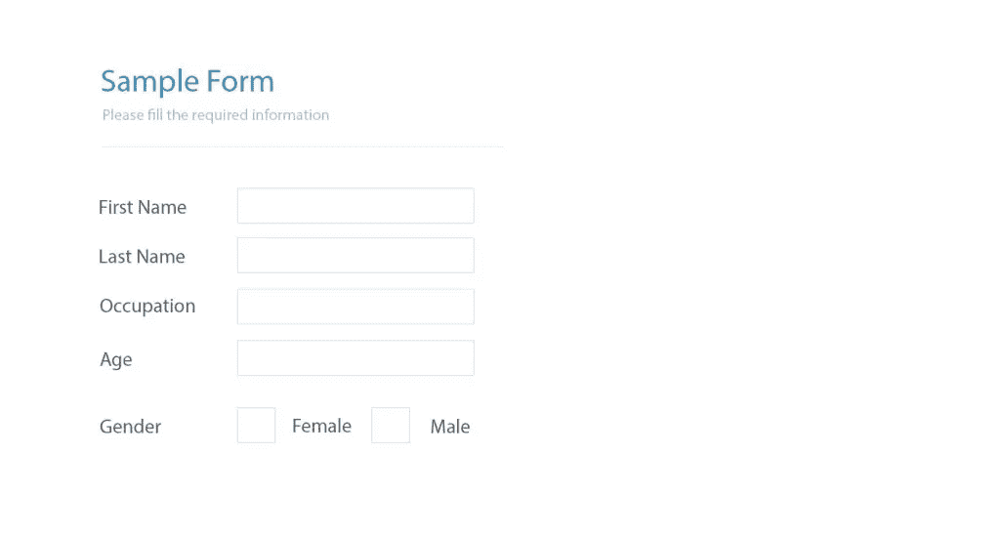
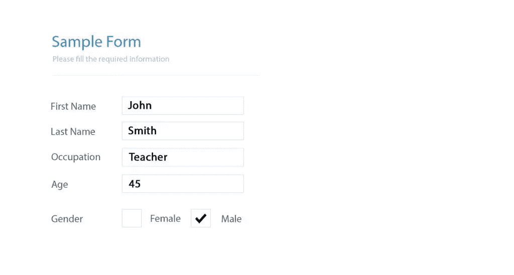

# 用 PDFtk 和 PHP 填写 PDF 表单

> 原文：<https://www.sitepoint.com/filling-pdf-forms-pdftk-php/>

PDF 文件是在线共享文档最常见的方式之一。无论我们是需要将客户的文档传递给银行或保险公司等第三方服务提供商，还是仅仅向雇主发送简历，使用 PDF 文档通常都是首选。

PDF 文件可以传输纯文本/格式化文本、图像、超链接，甚至可填写的表格。在本教程中，我们将看到如何使用 PHP 和一个名为 **PDFtk Server** 的强大 PDF 操作工具来填写 PDF 表单。

为了简单起见，在本文的其余部分，我们将把`PDFtk Server`称为`PDFtk`。


## 装置

像往常一样，我们将使用 [Homestead 改进的](https://www.sitepoint.com/quick-tip-get-homestead-vagrant-vm-running/)作为我们的开发环境。

一旦虚拟机启动，并且我们已经设法用`vagrant ssh`ssh 到系统中，我们就可以开始使用`apt-get`安装`PDFtk`:

```
sudo apt-get install pdftk
```

要检查它是否工作，我们可以运行以下命令:

```
pdftk --version
```

输出应该类似于:

```
Copyright  (c)  2003-13  Steward  and  Lee, LLC -  Please  Visit:www.pdftk.com.  This  is free software; see the source code for copying conditions.  There  is NO warranty,  not even for MERCHANTABILITY or FITNESS FOR A PARTICULAR PURPOSE.
```

## 它是如何工作的

PDFtk 为操作 PDF 文档提供了各种各样的功能，从合并和拆分页面到填写 PDF 表单，甚至是应用水印。本文重点介绍如何使用 PDFtk 通过 PHP 填写标准的 PDF 表单。

PDFtk 使用 **FDF** 文件来操作 PDF 表单，但是什么是 FDF 文件呢？

FDF 或**表单数据文件**是一个纯文本文件，它可以用比 PDF 文件更简单的结构存储表单数据。

简单地说，我们需要从**用户提交的数据**生成一个 FDF 文件，并使用 PDFtk 的命令将其与原始 PDF 文件合并。

### FDF 档案里有什么

FDF 文件的结构由三部分组成:页眉、内容和页脚:

#### 页眉

```
%FDF-1.2  1  0 obj<</FDF<< /Fields[
```

我们不需要担心这一部分，因为它是我们将用于所有 FDF 文件的。

#### 内容

一些 FDF 内容的例子如下:

```
<< /T (first_name) /V (John)
<< /T (last_name) /V (Smith)
<< /T (occupation) /V (Teacher)>>
<< /T (age) /V (45)>>
<< /T (gender) /V (male)>>
```

内容部分一开始可能看起来很混乱，但是不要担心，我们很快就会看到。

#### 页脚

```
]  >>  >> endobj
trailer <</Root  1  0 R>>  %%EOF
```

这一节对于我们所有的 FDF 文件也是一样的。

内容部分包含表单数据条目，每个条目都遵循一个标准模式。每行代表表单中的一个字段。它们以表单元素名称的前缀`/T`开始，表示标题。第二部分是元素的值，以表示值的`/V`为前缀:

```
<< /T(FIELD_NAME)/V(FIELD_VALUE) >>
```

要创建 FDF 文件，我们需要知道 PDF 表单中的字段名称。如果我们可以访问 Mac 或 Windows 机器，我们可以在 Adobe Acrobat Pro 中打开表单并查看字段的属性。

或者，我们可以使用 PDFtk 的`dump_data_fields`命令从文件中提取字段信息:

```
pdftk path/to/the/form.pdf dump_data_fields > field_names.txt
```

因此，PDFtk 会将结果保存在`field_names.txt`文件中。以下是提取数据的示例:

```
--  FieldType:  Text  FieldName: first_name FieldFlags:  0  FieldJustification:  Left  ---  FieldType:  Text  FieldName: last_name FieldFlags:  0  FieldJustification:  Left  ---  FieldType:  Text  FieldName: occupation FieldFlags:  0  FieldJustification:  Center  ---  FieldType:  Button  FieldName: gender FieldFlags:  0  FieldJustification:  Center
```

表单中的每个字段都有几个属性。我们可以在 Adobe Acrobat Pro 中修改这些属性。例如，我们可以改变文本的对齐方式、字体大小，甚至是文本的颜色。

### PDFtk 和 PHP

我们可以使用 PHP 的`exec()`函数将 PDFtk 引入 PHP 环境。假设我们有一个简单的 PDF 表单，包含四个文本框和一组两个单选按钮:



让我们编写一个简单的脚本来填写这个表单:

```
 <?php

// Form data:
$fname      = 'John';
$lname      = 'Smith';
$occupation = 'Teacher';
$age        = '45';
$gender     = 'male';

// FDF header section
$fdf_header = <<<FDF
%FDF-1.2
%,,oe"
1 0 obj
<<
/FDF << /Fields [
FDF;

// FDF footer section
$fdf_footer = <<<FDF
"] >> >>
endobj
trailer
<</Root 1 0 R>>
%%EOF;
FDF;

// FDF content section
$fdf_content  = "<</T(first_name)/V({$fname})>>";
$fdf_content .= "<</T(last_name)/V({$lname})>>";
$fdf_content .= "<</T(occupation)/V({$occupation})>>";
$fdf_content .= "<</T(age)/V({$age})>>";
$fdf_content .= "<</T(gender)/V({$gender})>>";

$content = $fdf_header . $fdf_content , $fdf_footer;

// Creating a temporary file for our FDF file.
$FDFfile = tempnam(sys_get_temp_dir(), gethostname());

file_put_contents($FDFfile, $content);

// Merging the FDF file with the raw PDF form
exec("pdftk form.pdf fill_form $FDFfile output.pdf"); 

// Removing the FDF file as we don't need it anymore
unlink($FDFfile);
```

好吧，我们来分析一下剧本。首先，我们定义要写入表单的值。我们可以从数据库表、JSON API 响应中获取这些值，甚至可以将它们硬编码到脚本中。

接下来，我们根据前面讨论的模式创建一个 FDF 文件。我们使用 PHP 的 [tempnam](http://php.net/manual/en/function.tempnam.php) 函数创建一个临时文件来存储 FDF 内容。原因是 PDFtk 只依赖物理文件来执行操作，尤其是在填写表单时。

最后，我们使用 PHP 的`exec`函数调用 PDFtk 的`fill_form`命令。`fill_form` **将**FDF 文件与原始 PDF 表单合并。根据脚本，我们的 PDF 文件应该和 PHP 脚本在同一个目录下。

将上面的 PHP 文件作为`pdftk.php`保存在 web 根目录中。输出将是一个新的 PDF 文件，其中所有字段都填充了我们的数据。



就这么简单！

### 展平输出文件

我们还可以展平输出文件以防止将来的修改。这可以通过将`flatten`作为参数传递给`fill_form`命令来实现。

```
<?php
exec("pdftk path/to/form.pdf fill_form $FDFfile output path/to/output.pdf flatten"); 
```

### 下载输出文件

我们可以不将文件存储在磁盘上，而是通过将文件的内容和所需的头一起发送到输出缓冲区来强制下载输出文件:

```
<?php

// ...

exec("pdftk path/to/form.pdf fill_form $FDFfile output output.pdf flatten"); 

// Force Download the output file
header('Content-Description: File Transfer');
header('Content-Type: application/octet-stream');
header('Content-Disposition: attachment; filename=' . 'path/to/output.pdf' );
header('Expires: 0');
header('Cache-Control: must-revalidate');
header('Pragma: public');
header('Content-Length: ' . filesize('output.pdf'));

readfile('output.pdf');            

exit;
```

如果我们在浏览器中运行脚本，输出文件将被下载到我们的机器上。

现在我们已经对 PDFtk 的工作原理有了基本的了解，我们可以开始围绕它构建一个 PHP 类，使我们的服务更加可重用。

## 围绕 PDFtk 创建包装类

我们最终产品的用法应该像下面的代码一样简单:

```
<?php

// Data to be written to the PDF form
$data = [
    'first_name' => 'John',
    'last_name'  => 'Smith',
    'occupation' => 'Teacher',
    'age'        => '45',
    'gender'     => 'male'
];

$pdf = new pdfForm('form.pdf', $data);

$pdf->flatten()
    ->save('outputs/form-filled.pdf')
    ->download();
```

我们将在 web 根目录下创建一个新文件，并将其命名为`PdfForm.php`。让我们把这个类也命名为`PdfForm`。

### 从类属性开始

首先，我们需要为该类声明一些私有属性:

```
<?php
class PdfForm
{
    /*
    * Path to raw PDF form
    * @var string
    */
    private $pdfurl;

    /*
    * Form data
    * @var array
    */
    private $data;

    /*
    * Path to filled PDF form
    * @var string
    */
    private $output;

    /*
    * Flag for flattening the file
    * @var string
    */
    private $flatten;

    // ...

}
```

### 构造函数

让我们编写构造函数:

```
<?php

// ...

public function __construct($pdfurl, $data)
{
    $this->pdfurl = $pdfurl;
    $this->data   = $data;
}
```

构造函数不做任何复杂的事情。它将 PDF 路径和表单数据分配给它们各自的属性。

### 处理临时文件

由于 PDFtk 使用物理文件来执行它的任务，我们通常需要在这个过程中生成临时文件。为了保持代码的整洁和可重用性，让我们编写一个创建临时文件的方法:

```
<?php

// ...

private function tmpfile()
{
    return tempnam(sys_get_temp_dir(), gethostname());
}
```

这个方法使用 PHP 的 [tempnum](http://php.net/manual/en/function.tempnam.php) 函数创建一个文件。我们向该函数传递了两个参数，第一个是通过 [sys_get_temp_dir](http://php.net/manual/en/function.sys-get-temp-dir.php) 函数获取的`tmp`目录的路径，第二个参数是文件名的前缀，只是为了确保文件名在不同的主机之间尽可能唯一。这将在文件名前加上我们的主机名。最后，该方法将文件路径返回给调用者。

### 提取表单信息

如前所述，要创建一个 FDF 文件，我们需要事先知道表单元素的名称。这可以通过在 **Adobe Acrobat Pro** 中打开表单或者使用 PDFtk 的`dump_data_fields`命令来实现。

为了方便开发人员，让我们编写一个方法，将字段信息打印到屏幕上。虽然我们不会在 PDF 生成过程中使用这种方法，但当我们不知道字段名时，这种方法会很有用。另一个用例是解析字段的元数据，使写入过程更加动态。

```
<?php

// ...

public function fields($pretty = false)
{
    $tmp = $this->tmpfile();

    exec("pdftk {$this->pdfurl} dump_data_fields > {$tmp}");
    $con = file_get_contents($tmp);

    unlink($tmp);
    return $pretty == true ? nl2br($con) : $con;
}
```

上面的方法运行 PDFtk 的`dump_data_fields`命令，将输出写入文件并返回其内容。

我们还为美化输出设置了一个可选参数。因此，我们将能够通过向该方法传递`true`来获得人类友好的输出。如果我们需要解析输出或对其运行正则表达式，我们应该不带参数地调用它。

### 创建 FDF 文件

下一步，我们将编写一个生成 FDF 文件的方法:

```
<?php

// ...

public function makeFdf($data)
{
    $fdf = '%FDF-1.2
    1 0 obj<</FDF<< /Fields[';

    foreach ($data as $key => $value) {
        $fdf .= '<</T(' . $key . ')/V(' . $value . ')>>';
    }

    $fdf .= "] >> >>
    endobj
    trailer
    <</Root 1 0 R>>
    %%EOF";

    $fdf_file = $this->tmpfile();
    file_put_contents($fdf_file, $fdf);

    return $fdf_file;
}
```

`makeFdf()`方法遍历`$data`数组项，根据 FDF 标准模式生成条目。最后，它使用`file_put_contents`函数将内容放在一个临时文件中，并将文件路径返回给调用者。

### 展平文件

让我们写一个方法将`$flatten`属性设置为`flatten`。该值由`generate()`方法使用:

```
<?php

// ...

public function flatten()
{
    $this->flatten = ' flatten';
    return $this;
}
```

### 填写表格

既然我们已经能够创建一个 FDF 文件，我们可以使用`fill_form`命令来填充表单:

```
 // ...

private function generate()
{

    $fdf = $this->makeFdf($this->data);
    $this->output = $this->tmpfile();
    exec("pdftk {$this->pdfurl} fill_form {$fdf} output {$this->output}{$this->flatten}");

    unlink($fdf);
}
```

`generate()`调用`makeFdf()`方法生成 FDF 文件，然后运行`fill_form`命令将其与原始 PDF 表单合并。最后，它会将输出保存到一个用`tempfile()`方法创建的临时文件中。

### 保存文件

当文件生成后，我们可能希望保存或下载它，或者两者同时进行。

首先，让我们创建保存方法:

```
 // ...

public function save($path = null)
{
    if (is_null($path)) {
        return $this;
    }

    if (!$this->output) {
        $this->generate();
    }

    $dest = pathinfo($path, PATHINFO_DIRNAME);
    if (!file_exists($dest)) {
        mkdir($dest, 0775, true);
    }

    copy($this->output, $path);
    unlink($this->output);

    $this->output = $path;

    return $this;
}
```

该方法首先检查是否有给定的目的地路径。如果目标路径为空，则它只是返回而不保存文件，否则它将继续下一部分。

接下来，它检查文件是否已经生成；如果没有，它将调用`generate()`方法来生成它。

在确保生成了输出文件之后，它会检查磁盘上是否存在目标路径。如果路径不存在，它将创建目录并设置适当的权限。

最后，它将文件(从`tmp`目录)复制到一个永久位置，并将`$this->output`的值更新到永久路径。

### 强制下载文件

为了强制下载文件，我们需要将文件的内容和所需的头一起发送到输出缓冲区。

```
 // ...

public function download()
{
    if (!$this->output) {
        $this->generate();
    }

    $filepath = $this->output;
    if (file_exists($filepath)) {

        header('Content-Description: File Transfer');
        header('Content-Type: application/pdf');
        header('Content-Disposition: attachment; filename=' . uniqid(gethostname()) . '.pdf');
        header('Expires: 0');
        header('Cache-Control: must-revalidate');
        header('Pragma: public');
        header('Content-Length: ' . filesize($filepath));

        readfile($filepath);

        exit;
    }
}
```

在这个方法中，首先我们需要检查文件是否已经生成，因为我们可能需要下载文件而不保存它。在确保一切都设置好之后，我们可以使用 PHP 的`readfile()`函数将文件内容发送到输出缓冲区。

我们的 PdfForm 类现在可以使用了。完整代码在 [GitHub](https://github.com/sitepoint-editors/pdf-form) 上。

### 将课堂付诸行动

```
<?php
require 'PdfForm.php';

$data = [
    'first_name' => 'John',
    'last_name'  => 'Smith',
    'occupation' => 'Teacher',
    'age'        => '45',
    'gender'     => 'male'
];

$pdf = new PdfForm('form.pdf', $data);

$pdf->flatten()
    ->save('output.pdf')
    ->download();
```

### 创建 FDF 文件

如果我们只需要创建一个 FDF 文件而不需要填写表格，我们可以使用`makeFdf()`方法。

```
<?php
require 'PdfForm.php';

$data = [
    'first_name' => 'John',
    'last_name'  => 'Smith',
    'occupation' => 'Teacher',
    'age'        => '45',
    'gender'     => 'male'
];

$pdf = new PdfForm('form.pdf', $data);

$fdf = $pdf->makeFdf();
```

`makeFdf()`的返回值是在`tmp`目录中生成的 FDF 文件的路径。我们可以获取文件的内容，或者将它保存到一个永久的位置。

### 提取 PDF 字段信息

如果我们只需要查看表单中存在哪些字段和字段类型，我们可以调用`fields()`方法:

```
<?php

require 'PdfForm.php';

$fields = new PdfForm('form.pdf')->fields();

echo $fields;
```

如果不需要解析输出，我们可以将`true`传递给`fields()`方法，以获得人类可读的输出:

```
<?php

require 'PdfForm.php';

$pdf = new PdfForm('pdf-test.pdf')->fields(true);

echo $pdf;
```

## 包扎

我们安装了`PDFtk`，并学习了一些有用的命令，如`dump_data_fields`和`fill_form`。然后，我们围绕它创建了一个基本类，以展示我们如何将 PDFtk 的强大功能带到我们的 PHP 应用程序中。

请注意，这个实现是基本的，我们试图保持尽可能简单的东西。我们可以更进一步，将 FDF 创建特性放在一个单独的类中，这将在处理 FDF 文件时给我们更多的空间。例如，我们可以对每个表单数据条目应用链式过滤器，比如大写、小写，甚至格式化日期等等。我们也可以为 FDF 类实现`download()`和`save()`方法。

有问题吗？评论？请将它们留在下面，我们将尽最大努力及时回复！

## 分享这篇文章