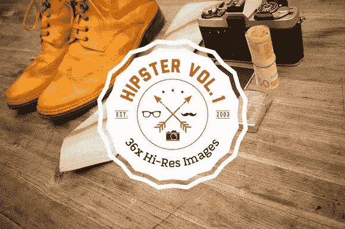

# 找到令人敬畏的资产，帮助你的网站在创意市场上大放异彩

> 原文：<https://www.sitepoint.com/find-awesome-assets-help-site-shine-creative-market/>

*本文由[创意市场](http://synd.co/1zSOXu7)赞助。感谢您对使 SitePoint 成为可能的赞助商的支持。*

你知道那是什么感觉。你即将完成一个工作了几个月的项目，但是还缺少一些东西。基本元素已经到位，您对设计很满意，但是它缺少了一些东西。

有很多地方可以找到让你的网站更上一层楼的资源——字体库、图片库和获取免费图片的地方。但是对于需要比 Flickr Creative Commons 搜索结果更手工制作的项目，你真的需要更多与设计师本身的联系，这通常会花费你一些钱。

或者，从另一个角度来看:你是一名设计师、排版师或主题开发人员，在工作之余，你创作自己的东西来取乐。但是你会意识到这些东西值得投入到这个世界中。所以你在寻找一个有创意的平台，在那里你可以展示你的商品，控制你的作品，并且知道你会得到公平的对待。

如果这两种情况你都很熟悉，考虑选择一个更好的选择:市场。确切地说，是创意市场。

创意市场是一个网站开发者寻找他们需要的资产和设计资源的地方，也是设计师、摄影师、排版人员和主题开发者分享他们的作品并获得报酬的地方。

有大量的字体、图片、库存照片和主题，价格低至 2 美元。该网站还提供每月捆绑包，价值至少 1000 美元，售价 39 美元(详见下文)。

Creative Market 负责信用卡费用和送货物流，但不会通过审查您的产品来干扰您的工作。每笔销售额的 70%归你。

你也可以成为合作伙伴，并从你推荐到该网站的顾客购买的任何商品中获得 10%的佣金。

超过 700，000 名创意人员是该社区的一部分，该社区从商业扩展到充满活力的讨论，设计师们分享他们的故事。

## 创意市场的二月大捆绑

Creative Market 的二月大礼包非常丰富，有 62 款价值超过 1200 美元的产品，售价 39 美元。它将于 2 月 10 日至 17 日发售，并展示了一些很酷的东西，比如下面的各种产品。

潮人套装第 1 卷— 36 张各种潮人必备的高分辨率图片。

奶奶的食谱品牌工具包——就像奶奶以前做的一样

欲了解更多信息或为自己获取捆绑包，[请访问创意市场网站](http://synd.co/1zWntqE*)查看大捆绑包。

## 分享这篇文章