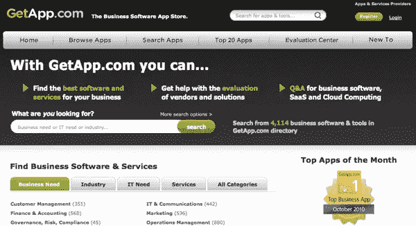

# 与 GetApp.com 一起寻找完美的应用

> 原文：<https://www.sitepoint.com/find-the-perfect-app/>

我有点沉迷于应用程序。我喜欢测试新工具，尝试日常问题的新解决方案，比较我尝试的每个应用程序的优缺点。在我的应用测试和研究中，我发现了一些真正的瑰宝。即使一个新的应用程序并不完全符合我的要求，它也会教会我一些关于我在寻找什么的东西，并帮助我调整我的搜索。

在过去，我通常以两种方式找到应用程序——一个新的应用程序引起轰动，我受到启发去测试它，或者我正在寻找一些非常具体的东西。挑战总是来自第二种情况。虽然我很喜欢谷歌，但它并不总是能有效地找到一个特定的应用，尤其是一个可能是新出现的、对谷歌还不太友好的应用。

这就是应用搜索工具的用武之地。无论你是渴望尝试新事物，还是希望满足特定需求，你都可以在[GetApp.com](http://getapp.com)找到适合你业务的应用。

GetApp.com 基本上是一个搜索引擎和商业应用市场。你可以使用该网站查找、比较和选择超过(目前)4000 份申请。如果你是一名应用程序开发人员，你可以列出你的应用程序，让感兴趣的买家找到。

用户可以根据业务需求、行业、IT 需求、服务和平台浏览可用的应用程序，也可以在任何类别中搜索特定的应用程序。

GetApp.com 还提供了一个评估中心，其中包括应用程序行业高管的报告和采访。此外，每个应用程序都包括用户评论和开发者的社交统计数据，以及 Twitter 粉丝和脸书粉丝的数量。

收集的内容越来越多，很容易找到许多与商业相关领域的应用程序。我已经找到了两个新的服务来尝试读者调查，我将把它包含在我的下一期时事通讯中。我只用了五分钟。

当你在市场上寻找一个新的应用程序时，你会去哪里？

## 分享这篇文章