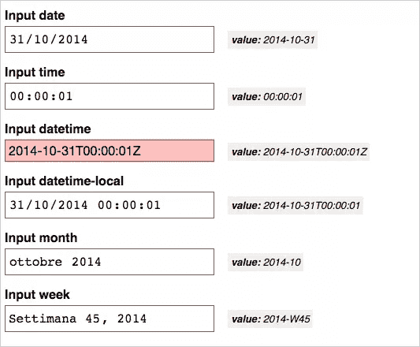

# 为 Bootstrap 寻找日期选择器输入解决方案

> 原文：<https://www.sitepoint.com/finding-date-picker-input-solution-bootstrap/>

我的工作经常需要在表单中添加日期输入。由于并非所有浏览器都支持它们，我一直在寻找将它们集成到我的页面中的最佳方式。

你可以在我能使用上看到[浏览器支持日期输入的最新数据。](http://caniuse.com/#search=date)

除了基本的`date-input`字段，还有其他与时间相关的字段类型:

*   `datetime`字段允许输入基于 [UTC](http://en.wikipedia.org/wiki/Coordinated_Universal_Time) 格式的日期和时间。
*   `datetime-local`表示没有时区的日期和时间
*   `time`
*   `month`代表月份和年份
*   `week`代表星期数和年份

在 [Modernizr](http://modernizr.com/) 的帮助下，我已经为上面列出的所有日期输入类型建立了一个测试页面，并且我已经使用 [Browserstack](http://www.browserstack.com) 在许多最近的移动和桌面浏览器上测试了它。例如，这是在 Chrome 中看到的结果页面(红色字段是不受支持的字段):

您可以在这里的演示中直接测试它:

查看笔[测试日期选择器的显示和数值。](http://codepen.io/SitePoint/pen/RNryzy/)通过 [CodePen](http://codepen.io) 上的 SitePoint ( [@SitePoint](http://codepen.io/SitePoint) )。