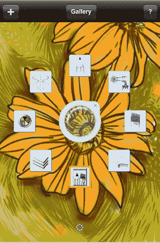
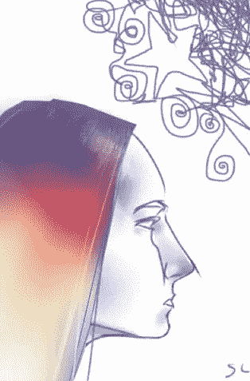
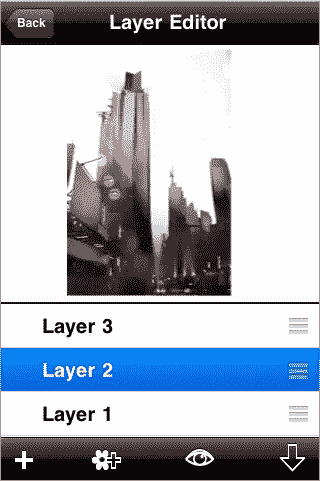

# 使用 Autodesk Sketchbook Mobile 进行手指画

> 原文：<https://www.sitepoint.com/finger-painting-with-autodesk-sketchbook-mobile/>

在最近访问 iTunes 应用商店时，我注意到超级棒的 Autodesk Sketch Mobile X 位于免费应用列表的首位。我倾向于停留在 iTunes 商店的免费区，所以在那里看到它我非常兴奋。在进一步的调查中，我看到完整版的价格是 2.99 美元，所以我购买了。Sketchbook Mobile 是一个绘画和绘图应用程序，可以让你用手指绘画、素描、擦除和缩放。

Autodesk 拥有制作 2D 和 3D 软件的悠久历史，当然还有 Autocad。Sketchbook Mobile 使用与 Autodesk SketchBook Pro 绘画和绘图软件相同的引擎。那么主要特点是什么呢？这个应用内置了很多很酷的设备。

*   能够处理多达 6 层
*   大量画笔选项
*   对称素描
*   可定制的调色板
*   对称素描
*   最大 1024 x 682 像素的绘图

标记工具(如下所示)围绕中心宽度控制排列成一个环。要改变你的笔刷大小，你可以点击中间的控制，拖动左和右分别增加和减少。这些工具是铅笔工具，喷枪，画笔，橡皮擦，画笔屏幕，图层编辑器，颜色选择和对称性。

**对称**
这是一个很好的特征。打开对称意味着您绘制的任何笔划都将围绕画布的垂直中心镜像。这里有一个小技巧，如果你想要水平对称，在打开对称之前，把你的 iphone 或 ipod 转到横向。

每个新的绘画或草图都以一层开始，但你可以在 iPhone 3GS 上再添加五层，在其他设备上再添加两层。所以，如果你想描摹你的一张照片，你可以加载它，创建一个新的图层，并开始在你的原始照片上绘制草图。您可以合并层并打开和关闭每个层的可见性。

有几个功能缺失，我想看看。其中最主要的是能够将草图导出为. psd 文件。目前你可以将图纸导出为. png 格式。但是，我肯定会在手机上保留这个应用程序一段时间。这感觉像是一个“合适的”应用程序，具有出色的功能。作为一名设计师，它非常聪明，对我来说可能很有用，同时也很有趣。

**其他绘图应用**

这并不是 iphone 的第一个移动绘图应用程序。你可能也想看看[图层](http://www.layersforiphone.com/)和[笔刷](http://brushesapp.com/)，它们和 Sketchbook Mobile 有相似的功能。

[在此下载 Autodesk Sketch Mobile X](http://itunes.apple.com/WebObjects/MZStore.woa/wa/viewSoftware?id=327375467&mt=8 "http://itunes.apple.com/WebObjects/MZStore.woa/wa/viewSoftware?id=327375467&mt=8")(免费)

[在这里下载完整版](http://itunes.apple.com/WebObjects/MZStore.woa/wa/viewSoftware?id=327375467&mt=8)(2.99 美元)

## 分享这篇文章