# 启动你自己的 Linux 服务器

> 原文：<https://www.sitepoint.com/fire-up-linux-server/>

安装 Linux 发行版既令人兴奋又令人沮丧。我前两次尝试安装 Linux 第一次在 1996 年，第二次在 1997 年——都没有成功。

当时 Linux 中的安装例程和硬件支持远不如现在先进；红帽仍然处于相对早期的发展阶段，曼德拉草还没有被创造出来，而苏塞刚刚从休闲裤的阴影下走出来。两次失败后，我决定我不会被 Linux 发行版打败。我将我的机器设置为双引导配置(包括 Linux 和 Windows 分区),承诺尽可能少地使用 Windows。不到一年，Windows 还留在机器上的唯一原因是我妻子对 Linux 不熟悉。鉴于她的计算需求是网上冲浪和阅读电子邮件，她最终也顺利过渡到 Linux 作为全职计算平台。

我们将在本章详细讨论双引导选项。但是首先，重要的是进行一些初步的研究，这将帮助您解决在安装过程中可能遇到的问题，无论您使用的是纯 Linux 系统还是双引导配置。

本文转载自 SitePoint 的新版本，Stuart Langridge 和 Tony Steidler-Dennison 的文章“使用 Linux & Apache 运行您自己的 Web 服务器”。本书旨在向您展示如何设置、优化和保护您自己的 Web 服务器。这四个章节的摘录包括:

1.  构建 Linux 环境，包括研究和安装过程。

3.  日常使用，包括 GNOME 桌面、Linux 文件系统以及启动和关闭过程。

5.  命令行，它介绍了命令行，并通过大量的实际例子和建议解释了如何使用这个宝贵的工具来执行重要的任务。包括对 shell 和 PATH 环境变量的探索。

7.  系统管理，包括创建新用户和组、发送电子邮件和自动执行日常任务的过程，并讨论安装和文件系统以及各种服务。

如果你想离线阅读这些信息，你可以[下载这篇文章的 PDF 版本](https://www.sitepoint.com/show-modal-popup-after-time-delay/)。

关于这本书的更多信息，请参见本书的专用页面。

但是现在，让我们开始构建 Linux 环境。

##### 第一章。构建 Linux 环境

##### 必要的研究

没有什么比缺乏硬件支持更令人沮丧的了，尤其是当你已经习惯了 Windows 提供的快速驱动程序安装时。事实上，Windows 附带了一组基本的驱动程序，用于预测连接到您机器上的硬件。硬件制造商也为 Windows 机器的视频卡、网卡和扫描仪等设备发布驱动程序光盘。开发这些驱动程序花费了硬件制造商大量的金钱，所以很长一段时间硬件开发商为 Linux 提供驱动程序没有经济意义。

随着 Linux 在服务器市场上获得市场份额，Linux 驱动程序的开发有了显著的改进。存储设备、RAID 阵列、以太网卡——在过去几年里，Linux 驱动程序的开发越来越多。

为了避免丢失驱动程序的麻烦，在安装您的 Linux 发行版之前做一些研究是很重要的。虽然现代发行版不太可能会有问题，但是您仍然希望进行研究，以避免任何硬件问题。

大多数主要发行版都发布了硬件兼容性列表。这些列表逐项列出了已知可与发行版中包含的驱动程序配合使用的硬件。Red Hat/Fedora、Mandriva 和 SuSE 也提供了硬件邮件列表，以便从它们的网站上分发。然而，这些列表倾向于依赖用户在事后帮助解决硬件兼容性问题，而不是在安装之前为用户提供信息。

此外，还有一个优秀的 Linux 兼容性列表。它不能提供您在特定于制造商的列表中所能找到的粒度，所以它应该作为后备，而不是您的主要信息来源。

##### 硬件兼容性列表

***红帽/软呢帽***

红帽的主要产品线是红帽企业 Linux (RHEL)，大多基于红帽的自由软件发行版 Fedora。Fedora 实际上不是红帽维护的；它由 Fedora 开发者社区维护。然而，Red Hat 在 Fedora 上做了很多工作，因为这些工作流入了 RHEL。

Red Hat 的硬件目录没有扩展到 RHEL 以外的 Fedora 版本，这是你在 Red Hat 网站寻找 Fedora 支持时需要记住的事情。该列表提供了有关 CPU、视频卡、SCSI 控制器、IDE 控制器、网卡、调制解调器和声卡的信息。

***苏塞***

SuSE 提供了两个列表:快速搜索列表和 T2 扩展搜索列表。两者的区别在于，扩展搜索提供了供应商、设备和类别之外的字段。实际上，你可能只需要快速搜索。

***Mandriva Linux***
[Mandriva Linux 硬件兼容性数据库](http://www1.mandrivalinux.com/en/hardware.php3)是经过 Mandriva Linux 社区测试的非常全面的硬件列表。

***通用 Linux***

Linux 硬件兼容性指南可能是最全面的高级 Linux 链接。它始于 1997 年，每年更新两次。它提供了所有设备类型和所有主要制造商的信息。

除了提供有趣和有用的用户论坛，LinuxQuestions.org 还提供了一份杰出的 Linux 兼容硬件清单。这是最新的高级 Linux 列表，每天都有更新。虽然它不像 HOWTO 那么全面，但是 LinuxQuestions 列表很容易因为这种及时性而变得同样重要。

[Linux Compatible](http://www.linuxcompatible.org/) 提供更新列表和论坛，用户可以在其中帮助其他用户解决现有的硬件问题。

##### 安装发行版

一旦您完成了初步的硬件研究，就该完成安装过程了。我们将看看基于图形和文本的安装程序，当您在资源有限的机器上安装 Linux 时，第二种安装程序会很有用。不要忘记，如果您的情况需要，您可以在没有桌面的服务器上安装 Fedora Core。无论如何，在将安装光盘放入计算机之前，通读以下部分是一个好主意。

***双开机选项***

我们已经提到了服务器的双引导选项:在系统上同时运行 Windows 和 Linux。正如我所提到的，当您适应 Linux 服务器中的新功能和选项时，这提供了一组很好的“技术培训轮”。以下安装说明同样适用于双引导配置。然而，在选择这个选项时，有几个要点需要记住。

*   如果您正在一个全新的机器上构建双引导服务器，请确保首先安装和配置 Windows。默认情况下，Windows 不识别任何本机 Linux 文件系统。(NB。但是，有一些第三方工具允许 Windows 读取同一台机器上安装的 Linux 的驱动器；一个商业例子见[pro.mount-everything.com](http://pro.mount-everything.com/)。)如果先安装 Linux，Windows 引导加载程序会接管并加载 Windows；Linux 将会在那里，但是你将不能引导进入它。Linux 安装将与 Windows 协同工作，并允许您同时启动。
*   Linux 提供了一种读取 FAT32(通常由 Windows 98 和 ME 使用)或 NTFS(通常由 Windows NT、2000 和 XP 使用)文件系统的方法。在 FAT32 的情况下，您还可以写入 Windows 分区。如果您使用基于 NTFS 的 Windows 安装，Windows 分区上的文件将是只读的。
*   如果你在一个已经包含 Windows 操作系统的系统上安装 Linux，购买一个非破坏性的分区管理工具可能会有用，比如 [Partition Magic](http://www.symantec.com/partitionmagic/) 。这将允许您移动 Windows 系统上的分区，在驱动器上为 Linux 安装腾出空间，并保留驱动器上已经存在的数据。

除了这些要点之外，安装双引导系统的过程与安装单个操作系统是一样的。

***图形化安装***

有些人会认为，Linux 的真正崛起始于图形化安装程序的出现。在那之前，安装是一件“无鼠标”的事情，使用键盘箭头键和空格键。red Hat——Fedora 所基于的发行版——是图形化 Linux 安装例程的先驱。从那时起，创作者一直在不断完善和改进的过程，结果是一个非常干净，易于遵循的安装程序。正如您将在我将在本章剩余部分展示的截屏中看到的，在您的新服务器上安装 Fedora 几乎没有痛苦！

我提供了这个过程中几乎每一步的截屏。虽然过程很简单，但有几个步骤对成功安装特别重要。希望下面讨论中的大量屏幕截图能够帮助您更容易地理解安装过程。

**获取安装光盘**

获取 Fedora Core 安装光盘主要有两种方式:可以从[http://fedora.redhat.com/download/](http://fedora.redhat.com/download/)下载光盘自己刻录，也可以购买。

安装光盘以一系列 ISO 映像的形式下载，命名为 FC4-i386-disc1.iso (FC4 表示 Fedora Core 4，i386 表示它适用于英特尔 x86 处理器，disc1 表示它是第一张光盘)。ISO 映像是整张 CD 的直接副本，存储在一个文件中。下载完图像后，您需要将它们都刻录到 CD 上。或者，如果您有一个 DVD 刻录机，并且您计划安装 Fedora 的机器有一个 DVD 驱动器，您可以下载 DVD 映像(而不是 CD 映像)并将其刻录到一个 DVD 上，就像刻录 CD 一样。大多数 CD 刻录程序都提供了一个菜单选项来刻录 ISO 映像；各种流行的 Windows CD 刻录工具的使用说明列表也可以在网上找到。如果有疑问，与 CD 刻录工具相关的帮助文件或网站可能会解释如何将 ISO 映像刻录到 CD 上。(NB。如果您的 CD 刻录程序无法刻录 ISO 图像， [CDBurnerXP Pro](http://www.cdburnerxp.se/) 易于使用，可在所有版本的 Windows 上运行。)

购买 Fedora 光盘会花你一点钱，但如果你没有快速的宽带连接，这比下载图像更快更容易(四张光盘图像总共差不多 2.5GB)。你可以从任意数量的供应商那里购买 Fedora 安装光盘，大多数供应商收取的费用只比空白光盘的成本高一点点，外加邮费和包装费；找到这些供应商最简单的方法是在你的国家搜索“便宜的 Linux CDs ”,或者询问当地的 Linux 用户组。如果这是你第一次运行 Linux，这可能是得到 CD 的最好方法。

**安装**

要开始安装，请将第一张安装光盘放入光盘驱动器，然后重新启动机器。如果您的机器配置为从光盘启动，当机器启动时，您会看到图 1.1 所示的屏幕。

*图 1.1。最初的 Fedora 安装屏幕。*
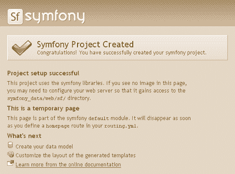

初始安装提供了几个选项。您可以选择通过按 Enter 键以图形模式安装，或者通过在 boot:提示符下键入 linux text 以文本模式安装。无论哪种方式，安装程序首先会为您检查安装介质。这是确定安装光盘是否被篡改或损坏的好方法。这个过程需要一点时间，但是我建议您进行这个测试。

像任何操作系统一样，Linux 在安装过程中需要最少的硬件驱动程序。测试完安装介质后，您会看到大量文本向下滚动到屏幕上——这是正在运行的初始硬件探测过程。Red Hat 通过它的安装程序 Anaconda 帮助开发了图形化的 Linux 安装程序。它包括一个高度精确的探测和测试机制，使安装程序的其余部分相当无痛。

一旦所有这些媒体测试和硬件探测完成，您将最终看到欢迎使用 Fedora Core 屏幕。单击“下一步”按钮开始。

**选择您的语言**

*图 1.2。选择安装语言。*
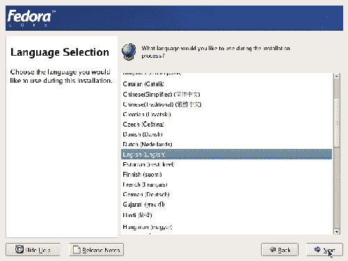

Fedora 是一个真正的国际操作系统:安装屏幕有 30 多种语言。从图 1.2 所示的语言选择屏幕中选择您的母语，然后单击下一步。

*图 1.3。选择键盘布局。*
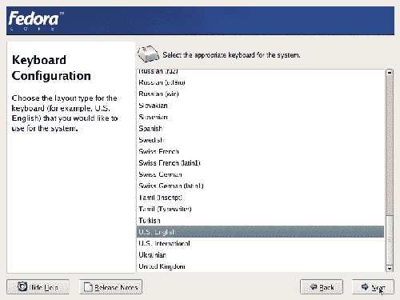

Fedora 可用的键盘语言数量与安装屏幕上可用的语言数量相似。从图 1.3 所示的屏幕中选择键盘语言。

**安装类型**

Fedora 安装程序提供三种专门的安装类型:用于家庭或办公室的个人桌面，用于开发或系统管理工作的工作站，以及用于文件、打印和 Web 服务器的服务器。如果您想完全控制系统的配置方式，还可以选择自定义选项。在我们设置 Web 服务器时，在单击下一步之前，从图 1.4 所示的安装类型屏幕中选择服务器选项。

*图 1.4。选择安装类型。*
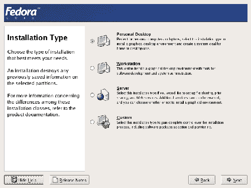

**磁盘分区**

Fedora 安装程序提供了两种分区方法——自动和手动——如图 1.5 所示。

*图 1.5。选择分区方法。*
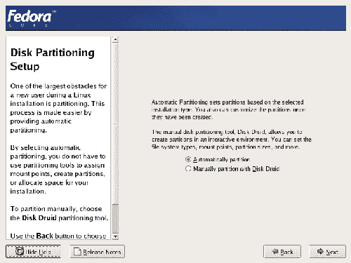

自动分区创建三个分区:

1.  分区是内核的家:Linux 的核心程序。Fedora 建议/boot 分区不小于 100MB，尽管您很少需要这么多。

3.  当所有系统内存都在使用时，`swap`分区用作内存的后备。

5.  `/`分区包含不在自己分区上的所有内容。

***什么，没有驱动字母？***

*Linux 中的分区与 Windows 中的不同。Linux 分区不使用驱动器号名称，比如 C:，您可能已经习惯了。Linux 上的主分区被标记为`/`(稍后您将看到它如何适应整个分区布局)。系统上其他常见的分区包括`/boot`(包含内核和引导加载程序)、`/home`(包含用户特定的文件)和`/var`(包含程序配置和变量数据)。这些标签被称为挂载点，我们将在第 4 章系统管理中进一步讨论它们。*

可以组织您的系统，使其分布在多个分区上；例如，将/var(数据，包括 MySQL 数据库和网站之类的东西所在的地方)放在一个单独的分区上是很常见的。然而，自动分区使事情变得更简单，将您的数据分布在不同的分区上并不能取得很大的效果。一些管理员强烈建议这样做，但是 Fedora rescue CD(也可以从 Fedora 网站下载 ISO 映像)将帮助您避免大多数问题，这些问题过去可能是通过将数据拆分到不同的分区来解决的。因此，默认的分区设置通常就足够了。

**使用圆盘德鲁伊**

Fedora 还提供了 Disk Druid，一个图形化分区工具。如果您喜欢默认方案之外的方案，您将需要在安装过程中使用 Disk Druid。Disk Druid 提供了机器上分区表的图形和文本表示。要选择一个分区，请单击图形驱动器表示(如图 1.6 所示)，或者单击文本表示。在任一种情况下，您都可以通过单击适当的工具栏按钮来添加、编辑或删除分区。

*图 1.6。磁盘 Druid 分区工具。*
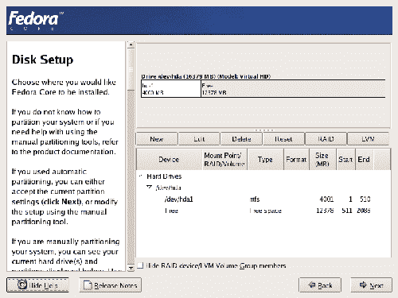

如果安装 Linux 的系统以前安装了 Windows(或其他操作系统)，您可能需要手动删除包含 Windows 的分区。此外，如果您在屏幕顶部的图中看不到任何标记为“Free”的空间，您需要删除一些内容来为 Fedora 腾出空间。为此，请选择要删除的分区，然后单击删除按钮。

***删除分区***

一旦你删除了一个分区，就没有办法再找回上面的数据了。(嗯，没有简单的方法。高级恢复工具确实存在。)小心删除！

***更正一个意外删除***

如果您不小心将一个分区标记为删除，或者犯了其他错误，您可以通过单击重置按钮将所有内容恢复到原始状态。您对分区所做的更改直到安装过程的后期才会真正生效。

单击 New 按钮打开 Add Partition 对话框，如图 1.7 所示。

*图 1.7。添加分区。*


在这里，您可以指定挂载点、文件系统类型和分区大小(以兆字节为单位)。该窗口还提供了进一步的大小选项，包括利用驱动器上的所有剩余空间创建分区的能力。

选择挂载点下拉列表将显示服务器可用的所有公共分区标签(挂载点)，如图 1.8“选择挂载点”所示；或者，您可以手动输入装载点标签。请记住，这些是最常见的挂载点，所有 Linux 系统管理员都很熟悉。创建自定装载点可能会让服务器的其他管理员感到困惑。

*图 1.8。选择挂载点。*
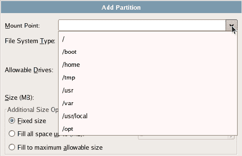

一旦你创建了一个分区，你可以通过选择分区，然后点击编辑按钮来编辑它，这将提供给你几乎与添加分区对话框相同的选项。

如果您试图跳过磁盘设置屏幕而不创建交换分区，您将收到如图 1.9 所示的警告。Linux 中的交换分区与 Windows 中的虚拟内存的作用非常相似:当系统的内存变满时，内存中的部分数据被写入交换分区，从而释放内存空间。当再次需要写入交换分区的数据时，它会被读回到内存中。要创建交换分区，请单击添加按钮并选择交换作为文件系统类型。

*图 1.9。互换警告。*
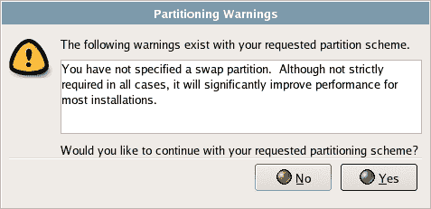

***交换空间***

在 Linux 机器上创建交换空间时，一个很好的经验法则是创建机器物理内存大小的 1 . 5 倍。例如，如果您有 1GB 的物理内存，则创建一个 1.5GB 的交换分区。

**GRUB 引导加载程序**

如果您决定进行双引导安装，您需要设置 GRUB 引导加载程序。GRUB 是一个程序，它会让你从已安装的操作系统列表中进行选择，然后让计算机启动所选的操作系统。如图 1.10 所示，这很容易设置。请注意，您应该设置一个引导加载程序密码，以防止未经授权的用户访问内核的启动参数。

*图 1.10。配置 GRUB。*
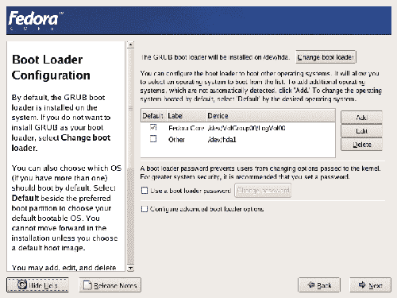

**联网**

在你设置好所有的分区后，你会看到如图 1.11 所示的网络选项，“配置 Fedora 的网络选项”。机器内现有的以太网卡将表示为 ethn 如果机器只有一块网卡，就叫`eth0`。默认配置如图 1.11 所示。第一个网络连接(通常是`eth0`)将被激活，并通过 DHCP 自动配置。(NB。动态主机配置协议(DHCP)将用于自动检测您的网络设置，使您能够连接到互联网或专用网络。)如果机器在一个内部网络上，你可以将它作为默认设置。对于直接连接到互联网的 Web 服务器，您需要手动配置静态 IP 地址和手动配置的网关、DNS 和主机名。在这种情况下，您的 ISP 将能够为您提供 IP 地址、网关和其他详细信息。

*图 1.11。配置 Fedora 的网络选项。*
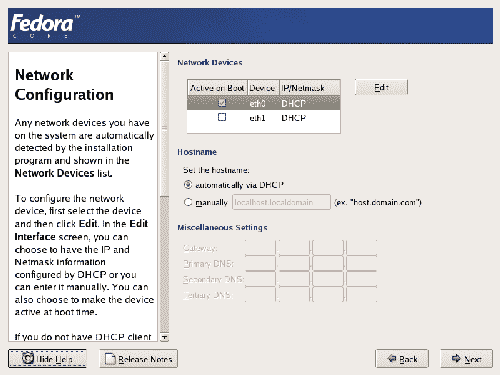

单击网络配置屏幕中的编辑按钮将显示编辑界面窗口，如图 1.12 所示。在这里，您可以进行定制配置调整，比如给服务器一个静态 IP 地址。

*图 1.12。手动配置以太网接口。*
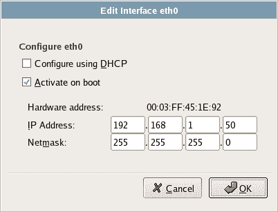

在前一个屏幕中配置了网络设备设置后，您可以自由配置主机名、网关和 DNS 设置。图 1.13 显示了一个主要为内部使用而配置的网络设备。

*图 1.13。手动配置的网络接口。*
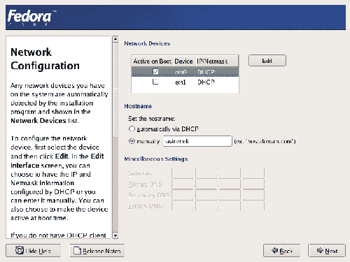

**网络安全**

Fedora 核心发行版——以及 Linux 的许多其他主要发行版——努力使您的网络安全配置尽可能简单。默认情况下，Fedora 会打开防火墙，阻止所有来自网络的流量。要自定义防火墙，只需选择您想在这台机器上运行的服务。或者，您可以简单地禁用防火墙，这将使机器处于开放状态，容易受到黑客攻击。您还可以选择启用安全增强的 Linux (SELinux ),这有助于在黑客控制部分系统时最大限度地减少任何损害。注意，SELinux 不应该被认为是防火墙的替代品——防火墙和 SELinux 都不能让你的系统完全安全，所以最好同时启用它们。出于我们的目的，您应该只允许远程登录和 Web 服务器流量通过防火墙，并设置 Enable SELinux？激活，如图 1.14 所示。第 9 章，服务器安全更详细地讨论了安全问题。

*图 1.14。设置服务器安全选项。*
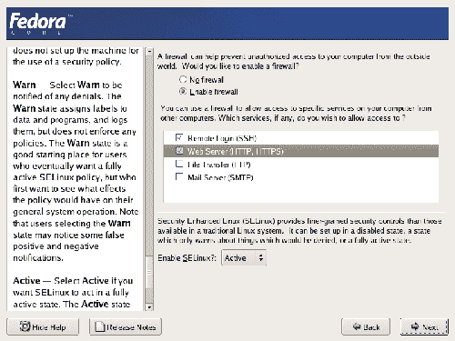

***Telnet 和 FTP 安全***

尽管 telnet 和 FTP 在 Fedora 安全配置屏幕中显示为选项，但它们都被广泛认为是不安全的协议。对于访问远程机器，SSH 比 telnet 更安全，因为对于传输文件，SFTP 比 FTP 更安全。如果需要 FTP 功能，建议将其设置在不同的服务器上，尽可能与网络的其他部分隔离。

**设置时区**

Fedora 提供了两个选项来设置服务器的时区。你可以将鼠标移动到离你最近的大都市地区，或者从详尽的城市列表中选择。无论哪种情况，所选择的城市都会在地图上高亮显示，如图 1.15 所示。

*图 1.15。设置时区。*
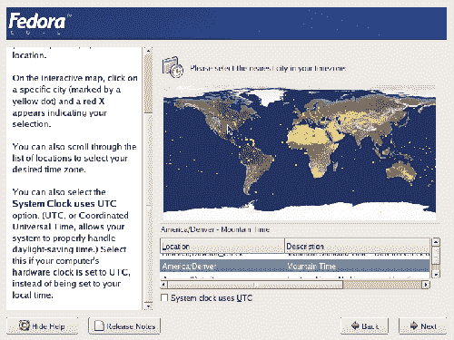

**设置根用户**

所有 Linux 系统都有一个管理帐户，root。此帐户可以访问计算机上的所有内容；它类似于 Windows 系统中的管理员帐户。由于 Linux 中 root 用户的权力如此之大，所以尽可能地降低访问 root 用户帐户的难度至关重要。为 root 帐户选择一个安全的密码——由大小写字母以及数字和特殊字符组成——并将其输入到如图 1.16 所示的字段中。我建议您将您的根密码记录在某个地方并妥善保管:如果您忘记了密码，一旦出现问题，就很难访问您的机器。

*图 1.16。设置 root 密码。*
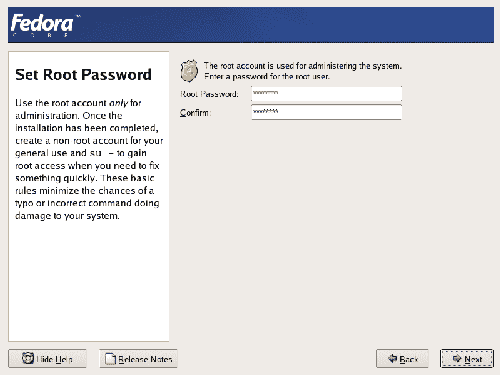

**安装软件包**

以前，当您被要求选择安装类型时(您从个人桌面、工作站、服务器或自定义中选择)，您的选择决定了在此屏幕中可以选择哪些软件包组。对于您的服务器安装，您将会看到作为 Fedora 发行版的一部分提供的完整的服务器软件，以及一些不错的额外组件。如图 1.17 所示，通过单击相应的复选框，选择您想要安装的每个软件包组。

*图 1.17。选择包组。*
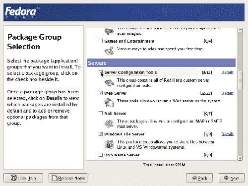

每个包组包含许多包；通过单击选中包组时出现的 Details 链接，可以看到一个列表(类似于图 1.18 所示)。该列表由基本软件包(该软件包组所需的软件包)和可选软件包组成，您可以根据需要选择安装这些软件包。

*图 1.18。优化包装选择。*
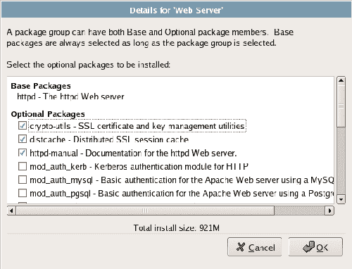

经过一个漫长的改进过程，Red Hat 发行版已经提供了一个完整的软件包，几乎可以满足任何常见的计算需求。虽然将服务器安装保持在最低限度是一个很好的目标，但是您可能会发现有些包是您不可或缺的。如果你是第一次使用 Linux，接受缺省值是完全可以的；如果您意识到还需要其他东西，以后添加包就很容易了，默认设置是 Fedora 团队精心选择的，可以满足大多数人的需求。

对您的安装特别重要的是 GNOME 桌面环境和服务器配置工具，它们为服务器配置提供了丰富的图形工具。服务器配置工具提供了配置 Apache、邮件服务器、引导加载程序和其他对服务器的配置和操作至关重要的软件的能力。用于完成这些任务的命令行工具在很大程度上是在核心安装中提供的，但是这些工具可能很复杂并且难以使用。如果您打算使用图形工具来管理您的服务器，您需要从这一部分仔细挑选。因为您正在设置 LAMP (Linux、Apache、MySQL 和 PHP)服务器，所以现在应该安装(Apache) Web 服务器、MySQL 和 PHP。

除了服务器配置工具，Fedora 还提供了一整套服务器软件，包括 Apache Web 服务器、IMAP 和 Postfix 邮件服务器、用于与 Windows 机器共享文件的 Samba、DNS 服务器、FTP 服务器等等。但是，要小心在这个阶段安装太多东西的诱惑；以后根据需要安装额外的包很容易，现在安装的服务越多，以后需要做的安全工作就越多。最好只安装您现在知道需要的东西，以后当您发现对它们有需求时再添加新的服务。

您的安装特别感兴趣的是 Fedora 核心发行版中提供的可选 Web 服务器包。这些工具包括 PHP 脚本语言、用于从 PHP 连接到 MySQL 和 PostgreSQL 数据库服务器的工具，以及用于与 Apache 服务器通信的一系列其他软件。如果你正在为一个动态的、数据库驱动的网站构建一个服务器，你将从这一部分中选择你需要的部件。你还需要一个数据库。如果您没有专用的数据库服务器，Fedora Core 4 附带了两个数据库包:MySQL 和 PostgreSQL。MySQL 是两者中最简单和使用最广泛的，所以我们将在本书中重点讨论它。

***PHP 和 MySQL:延伸阅读***

我们将在下一章讲述安装 PHP 和 MySQL 的高级细节。然而，利用这些包的细节超出了本书的范围。如果你正在寻找使用 PHP 和 MySQL 构建动态服务器的详细参考，请查看凯文·杨克的 [*使用 PHP & MySQL*](https://www.sitepoint.com/books/phpmysql1/) 构建自己的数据库驱动网站(SitePoint，ISBN 0-9579218-1-0)。

您可能感兴趣的其他包组包括:

*   网络服务器软件包组包含各种网络实用程序功能的软件，如 DHCP 和 Kerberos。
*   开发工具包组提供了从源代码构建包所必需的工具。安装这些工具是一个好主意，尽管您可能不会立即看到它们将如何被使用。
*   管理工具包组提供了一整套由 Red Hat 开发的用于服务器管理和配置的工具。您应该安装所有这些软件，因为它们将帮助您以您选择的方式配置您的系统。有替代的、基于命令行的工具供有经验的管理员使用，但是图形工具对于那些没有 Linux 系统管理经验的人来说更容易使用。
*   系统工具软件包组包含各种有用的工具，允许您监控到您的服务器的流量，连接到 VNC 和 Windows 终端服务器等等。

如您所见，作为 Fedora Core 的一部分，有大量的包可供使用。该安装提供了一整套用于构建、配置和管理 Web 服务器的软件工具。预算限制要求您的 Web 服务器服务于多个目的，这种情况并不少见；如果您受到这样的限制，您会发现 Fedora 工具甚至更有用。

***更多信息请咨询***

正如您可能已经注意到的，在以上一系列屏幕中，Fedora 通过左窗格下方的 Release Notes 按钮提供了每个部分的更多信息。此窗格还充当帮助屏幕，提供每个选定安装包的特定详细信息。与软件包详细信息屏幕中的简要软件包描述非常相似，这个窗格提供了一个很好的资源，在您安装 Linux 系统时可以用来了解它。帮助屏幕提供了比简短摘要更多的细节。

**“正在安装，请稍候…”**

包选择完成后，您就完成了安装 Fedora Linux 的繁重工作。剩下的工作将由安装程序自己完成:用您创建的分区格式化硬盘，安装您选择的每个包，并对每个包执行依赖检查。

安装服务器的过程将让您体验 RPM 软件包管理器(RPM)系统的强大功能。(RPM 最初是 Red Hat Package Manager 的首字母缩略词，但当它在 Red Hat 之外广泛使用时，正式变为递归首字母缩略词。递归首字母缩略词的其他例子有 PHP (PHP 超文本预处理器)和 GNU (GNU 不是 Unix)。)RPM 是一种格式，用于分发包含在 Fedora Core 中的软件，以及 SuSE 和 Mandriva Linux 等其他 Linux 发行版。服务器的安装将以一系列 RPM 事务的形式进行，这些事务检查依赖性并安装每个选择或需要的软件。

***依赖性去神秘化***

几乎所有的计算机软件都依赖于其他软件。一个简单而明显的例子是，在新服务器上运行的任何软件都将依赖于 Linux。这种关系称为依赖关系。依赖是由模块化软件设计的哲学产生的，或者从其他较小的程序构建大程序。RPM 调查并处理这些依赖关系，检查依赖代码的存在，并注意那些可能丢失的部分。

现在是时候给自己泡一杯咖啡了:安装 Fedora Linux 系统可能需要 45 分钟，这取决于机器的速度。在安装过程中，会几次要求您插入额外的光盘，安装完成后，会提示您重新启动机器。您的新服务器将首先出现一个屏幕，显示关于 Linux 发行版和内核版本的信息。

请注意，如果您设置了双引导系统，在引导加载程序自动启动默认操作系统之前，会出现一个倒计时。倒计时时间可以通过引导加载程序配置来调整。这对于生产 Web 服务器来说可能很重要:如果系统宕机，您可能希望机器尽快恢复到网络。

**最后一步**

主安装完成后，剩下的就是一些日常工作了。Fedora 服务器将引导您完成加载驱动程序的过程，然后向您展示安装代理:一组用于在安装后配置系统的工具。使用这样的工具已经成为 Linux 发行版中的一种常见方法，SuSE 提供了 YaST2 工具，Mandriva 利用了 SystemDrak。您将看到安装代理的欢迎屏幕，如图 1.19 所示，随后是许可协议。一旦您表示同意许可，您将进入配置屏幕。

*图 1.19。安装代理的欢迎屏幕。*
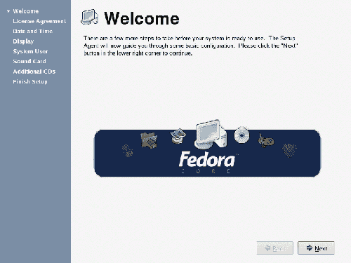

日期和时间配置屏幕提供两个选项卡:日期和时间和网络时间协议。第一个选项卡允许您确认系统时钟是否准确。第二个选项卡提供配置网络时间协议(NTP)软件的功能，该软件可用于将系统时钟与权威来源同步。如图 1.20 所示，在该屏幕中选择启用网络时间协议将启用 NTP 守护程序，该程序在后台运行，定期根据 NTP 服务器返回的时间检查您的系统时间。服务器下拉列表中列出了其中的几个服务器(pool.ntp.org 就是一个很好的 NTP 服务器。这实际上是许多服务器共享的名称，确保它始终可用)。如果启用了 NTP 并选择了服务器，守护程序将启动，在进入下一个安装代理屏幕之前检查选定的服务器。

*图 1.20。网络时间协议选项卡。*
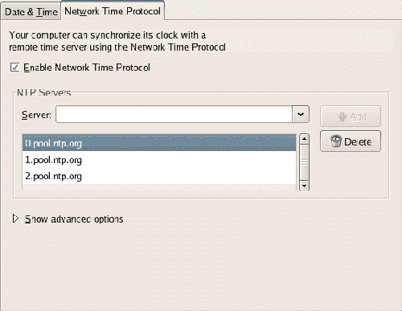

在显示屏上，您可以选择正在使用的显示器类型、想要的工作分辨率以及颜色深度。如果在列表中找不到您的显示器，您可以选择通用 CRT 显示器或通用 LCD 显示器。

安装代理还提供了一个屏幕，允许我们配置其他用户。用户详细信息包括用户名、全名和密码，如图 1.21 所示。如果您决定允许网络登录，您也可以从该屏幕中选择该选项。

*图 1.21。设置系统用户。*
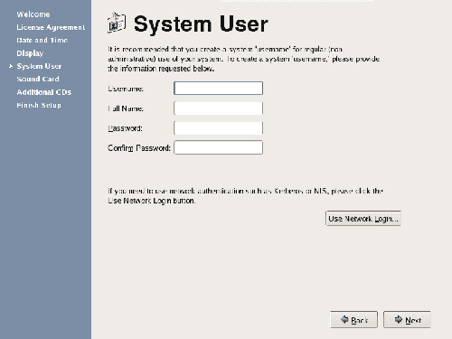

***创建用户账户***

与 Windows 一样，强烈建议您在主管理帐户或 root 帐户之外创建用户帐户。root 账号是万能的；它拥有创建、修改和销毁系统上任何文件的权限。未经深思熟虑就以 root 用户身份执行操作会给系统带来灾难性的后果。几乎每个 Linux 用户都可以详细描述他们第一次(也可能是唯一一次)从 root 帐户使系统无法运行的情形。

如果 Fedora 安装程序在您的系统上找到了声卡，您将被要求确认其详细信息。您还会看到一个用于测试它的按钮，但是，在生产 Web 服务器上，这可能是不必要的。还有一个额外的软件屏幕，你可以用来安装任何你可能需要的额外软件。你现在可以跳过这个屏幕。

祝贺您，您现在已经建立了一个 Linux Web 服务器！图形化安装为新的 Linux 用户提供了一套易于管理的工具来启动和运行系统。但是，在某些情况下，文本模式安装是达到相同目的的更快、更有效的方法。现在让我们来看看文本模式安装程序。

##### 摘要

安装 Linux 系统比安装 Windows 系统需要更多的前期研究。由于许多 Linux 设备驱动程序是通过基于社区的逆向工程创建的，而不是由这些设备的制造商创建的，因此在开始安装之前检查大量硬件兼容性列表是很重要的。这将有助于您确保服务器上存在设备的驱动程序。

Linux 支持可以有多种形式，最流行的是基于 Web 的列表和论坛。这种方法真正代表了开源世界中的社区精神，在开源世界中，用户体验是提供 Linux 问题解决方案的基础。所有商业 Linux 发行商都提供一定程度的付费支持，尽管不同发行商的支持期限可能会有很大的不同。

Linux 系统可以安装完整的图形工具，或者作为一个最小的基于文本的系统。安装程序紧随其后，提供从图形环境或纯文本环境完成安装的选项。

与 Windows 系统不同，桌面环境并非不可避免地与操作系统内核代码绑定在一起。相反，X Windows 和桌面管理系统是不同的系统，在它们自己的空间中运行。Linux 的这个特性允许创建一个完全可操作的、基于文本的系统，它拥有非常小的安装代码库。然而，大多数用户会选择基于 X Windows 和任何桌面管理器的图形系统。

##### 第二章。日常使用

与 Windows 不同，Linux 不提供标准的用户界面，但是提供了许多可以安装在 Linux 内核上的桌面环境。Fedora Core 附带了 KDE 和 GNOME 桌面环境；在本书中，我们将主要关注 GNOME。

##### GNOME 桌面

大多数图形用户界面都非常相似；微软视窗、Mac OS 和 GNOME 桌面有许多共同之处。你可能不会有太多的麻烦，但是 GNOME 做了一些不同的事情。这里有一个 GNOME 基础的简要介绍，可以帮助你开始使用。

***桌面之旅***

GNOME 桌面，如图 2.1 所示，在顶部和底部各显示一个栏；在 GNOME 中，这些条被称为面板。

*图 2.1。GNOME 桌面。*
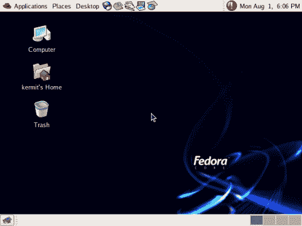

**底部面板**

底部面板为每个打开的窗口提供了一个可点击的按钮，类似于 Windows 任务栏，如图 2.2 所示。

*图 2.2。GNOME 桌面的底部面板。*


底部面板的右侧是工作区切换器，如图 2.3 所示。工作区(也称为虚拟桌面)是组织打开的窗口的一种方式。

*图 2.3。显示在底部面板中的工作区切换器。*


当您打开窗口并四处移动它们时，您会看到窗口布局的小插图出现在第一个方块中。如果您点击第二个方块，所有窗口将从屏幕上消失——窗口仍然打开，但您看不到它们，因为您已经切换到不同的工作区。单击工作区切换器中的第一个方块，您将看到原来的窗口返回。

通过右键单击窗口的标题栏并从“移动到另一个工作区”菜单中选择一个工作区，可以在工作区之间移动窗口。

默认情况下，您有四个工作区，但是您可以在工作区切换器首选项窗口中更改此默认设置(右键单击工作区切换器并选择首选项…以访问此窗口)。

**顶部面板**

顶部面板分为三个部分:菜单和“快捷方式”图标显示在左侧，而通知区域显示在右侧，如图 2.4 所示。

*图 2.4。GNOME 桌面的顶部面板。*


**顶部面板菜单**

顶部面板菜单让我们可以访问计算机上的所有内容。图 2.5 所示的应用程序菜单将所有已安装的应用程序分类为游戏、图形、互联网、办公等。例如，如果你安装了 Firefox，你可以在互联网菜单中找到它

*图 2.5。通过应用菜单定位 Firefox。*
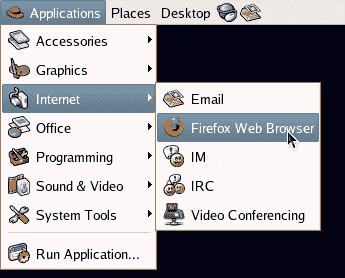

图 2.6 中描述的位置菜单列出了可能有用的文件位置:您的个人文件夹、您的桌面、计算机上的驱动器和网络位置。

*图 2.6。地点菜单。*
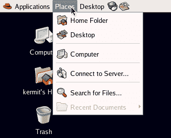

桌面菜单提供对配置(用户首选项和系统设置)以及在线帮助、屏幕锁定、注销和关机选项的访问。这些如图 2.7 所示。

*图 2.7。桌面菜单。*
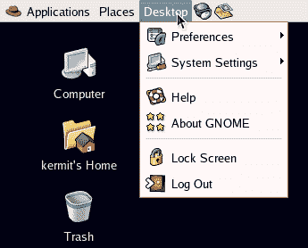

**顶部面板快捷图标**

快捷图标位于菜单旁边的启动面板中，提供对常用应用程序的快速访问。

*图 2.8。在启动面板中显示快捷图标。*


默认情况下，图标提供了 Web 浏览器(Firefox)和电子邮件客户端(Evolution)的快捷方式，以及三个主要的 OpenOffice.org 应用程序(文字处理、电子表格和演示工具包)，如果您安装了这些程序的话。

***使用 Windows***

组成 GNOME GUI 的窗口的显示类似于 windows 平台上的用户界面。图 2.9 显示了 GNOME 窗口的显示。

*图 2.9。一个侏儒窗口。*
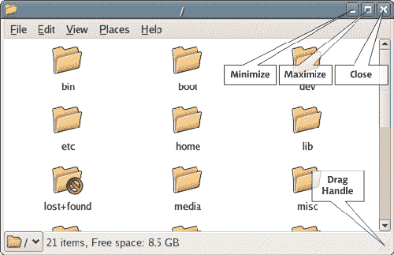

如果你使用过其他操作系统，你在 GNOME 的 windows 上不会有任何问题。

##### 启动和关闭

因为 Linux 是一个真正的多用户系统，所以在使用该系统之前，您需要登录您的系统帐户。在 GNOME 中，处理这个任务的默认应用程序是 GNOME 显示管理器(GDM)。正确安装系统的所有设备和驱动器后，将会打开 GDM 登录屏幕。您将使用安装后创建的帐户名和密码登录系统。

***避根！***
*永远不要以 root 身份登录你的系统。请记住，root 是 Linux 中无所不能的帐户，能够在系统上执行任何操作。这些操作包括删除系统关键文件，这将完全禁用系统，使其很难恢复。应该尽量少用 root 访问权限。登录您的系统时，先登录用户账号；然后，如果需要，您可以通过临时切换到 root 来执行管理任务。*

请记住，优雅地关闭您的 Linux 机器很重要，就像您关闭 Windows 机器一样。这允许在系统关闭之前将任何缓冲的数据写入磁盘。您可以通过选择桌面>注销或通过命令行来关机。让我们先来看看关闭机器的图形工具。

从桌面菜单中选择注销，如图 2.10 所示，将为您提供注销系统帐户(返回登录屏幕)、重新启动机器或完全关闭机器的选项。

*图 2.10。Linux 的注销选项。*
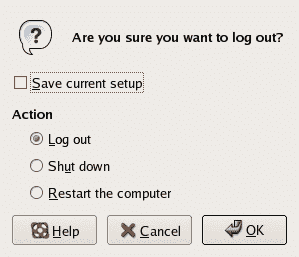

##### Linux 文件系统

***驱动器和分区***

如果您习惯于 Windows 面向驱动器的布局，Linux 文件系统结构可能会有点混乱。没有`C:`驱动；事实上，没有驱动器，只有分区。更加混乱的是，分区在硬盘上的实际位置没有被清楚地标识出来。Linux 文件系统比这抽象得多。

我给你举个例子。我家里的老爷机`cortex`，包含两个物理硬盘。一个是 40GB 的旧硬盘，里面有我使用的操作系统和所有程序。另一个是我后来添加的一个新的 160GB 的庞然大物，它被分成两个部分。第一部分包含我的个人文件:我用数码相机拍的照片，我的 MP3 收藏，以及一些零碎的东西。我把第二部分留给我的程序创建的临时文件。

在 Windows 系统上，这些驱动器很可能被系统和用户视为`C:`、`D:`和`E:`。Windows 将在`C:WINDOWS`安装，Firefox 将在`C:Program FilesMozilla Firefox`运行，我的数码照片将存放在一个名为`D:Photos`的目录中，等等。在 Windows 中，目录名与分区直接相关，因此也与存储目录的硬盘直接相关。这个概念如图 2.11 所示。

*图 2.11。`C:`、`D:`、`E:`与我的物理硬盘有什么关系。*
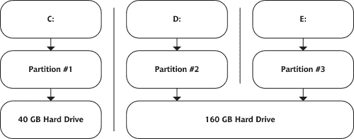

Linux 文件系统对您隐藏了这些不必要的细节(当然，直到您想看的时候)。操作系统内核存放在名为`/boot/`的目录中，Firefox 在`/usr/lib/firefox-1.0.4/`中，我的照片和 MP3 进入名为`/home/username/photos/`和`/home/username/music/`的目录中，临时文件进入名为`/tmp/`的目录中。没有明显的迹象表明这些目录位于不同的分区或不同的硬盘上。

Linux 文件系统给每个分区分配一个不同的挂载点:一个目录，通过它我们可以访问分区。在我们的例子中，Windows 中的`D:`类似于我们 Linux 系统中的`/home/tony/`,`E:`类似于`/tmp/`,`C:`将是`/`，文件系统层次结构的顶层。这种结构如图 2.12 所示。

*图 2.12。在 Linux 中看到的相同分区。*
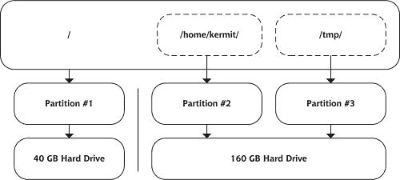

毫无疑问，当您第一次从 Windows 的面向物理磁盘的视图过渡到 Linux 的分层文件系统时，会感到困惑。然而，随着时间的推移，你会从震惊中恢复过来，并开始认识到从整体上看待这个系统的意义，而不是把它分成几个独立的部分。

***`ext3`文件系统***

Linux 以其能够与许多不同的文件系统一起工作而闻名，这是当之无愧的。一个现代的 Linux 发行版将读取、写入和跟踪几乎所有微软文件系统中的文件——从最初的 FAT 到 NTFS——以及 Mac OS X、OS/2 和各种深奥的操作系统使用的文件系统。对于 Linux，加载适当的内核模块并挂载一个分区很简单。这使得在 Linux 机器上处理写在其他系统上的文件变得很容易。在这一节中，我们将看看 Fedora 核心服务器的原生文件系统:ext3。

ext3 文件系统是原生 Linux 文件系统 ext2 的扩展，现在是 Fedora Core 的默认文件系统。ext3 用日志层扩展了 ext2，便于快速系统恢复，并确保高水平的数据完整性。日志不断更新，记录了未决和已完成的文件操作。

日志记录可以快速轻松地防止数据损坏。所有挂起和完成的操作都记录在日志中。系统在重新启动时检查日志，并完成那些在系统出现故障或“异常关闭”时挂起的操作这保护了系统停机时缓冲的数据的一致性。

日志记录层的使用也减少了恢复时间。系统不是逐位检查每个文件的一致性，而是仅完成日志中记录的任何挂起的写入。这将曾经需要 20 到 30 分钟的重新启动操作缩短到了几秒钟，这一改进在企业环境中尤为重要。

***文件系统丰富***
*其他 Linux 发行版使用不同的文件系统。例如，SuSE Linux 默认使用 ReiserFS 文件系统。广泛的基准测试表明，ReiserFS 可以比 ext3 更有效地处理大量小文件。然而，我们没有时间来看这些其他的文件系统。如果您想了解适用于您的 Linux 系统的其他文件系统选项的更多信息，您可以在 Linux Gazette 上找到详细的列表、描述和在线安装说明。*

***快速浏览文件系统***

图 2.13 中描述的 Linux 文件系统的结构与您可能习惯的不同。让我们看一下文件系统结构的概要，并探索它的各种功能和元素。

*   **`/`(根目录)**
    这是任何 Linux 系统的顶层，称为根目录。不幸的是，还有一个名为 root 的目录。不要担心:我们马上会解释这些目录之间的区别，以及如何避免混淆。

*   **`/boot`**
    这个目录包含了引导操作系统所需的所有文件，包括 Linux 内核。
*   **`/bin`和`/sbin`**
    这些文件夹的内容相似——它们都包含可执行二进制文件——但用途不同。`/bin`包含你可能从命令行使用的可执行文件:像`ls`、`mv`和`cp`这样的命令，我们将在第 3 章命令行中看到，就在这个文件夹中。包含操作系统本身使用的命令和进程，所以如果你是新手，最好远离这个文件夹。
*   **`/dev`**
    这些是设备文件——系统中实际存在的所有设备以及可以添加到系统中的所有设备的抽象。这些文件为操作系统提供了每个设备的描述和操作说明。
*   **`/etc`**
    该目录包含系统特定的配置文件。作为管理员，您可能会花相当多的时间在`/etc`目录中，因为它包含系统上大多数应用程序的配置指令。例如，Apache 的配置文件位于`/etc/httpd/conf/httpd.conf`。
*   **`/home`**
    该目录包含系统每个用户的主目录。例如，我们的示例用户拥有主目录`/home/kermit`，同一系统上的其他用户拥有主目录`/home/gonzo`和`/home/fozzie`。默认情况下，Gonzo 或 Fozzie 不能读写 Kermit 的文件，Kermit 也不能读写他们的文件(只有 root 用户才有这个能力)。
*   **`/root`(`root`目录)**
    这是根用户的主目录，不要与其他“根目录”`/`混淆。
*   **`/lib`**
    `/lib`目录包含系统中各种应用程序将要访问的所有共享库。它还包含内核在各种系统操作中使用的库。
*   **`/media`、`/mnt`**
    这些目录作为临时挂载的文件系统的挂载点。例如，可以从`/media/cdrom`访问光盘驱动器。
*   **`/opt`**
    该目录为已经添加到系统中的包提供存储。
*   **`/tmp`**
    该目录为临时文件提供系统范围的存储。
*   **`/usr`**
    包含用户命令和二进制文件、图形界面文件、系统应用程序中使用的包含文件以及可选的源代码文件。
*   **`/var`**
    `/var`目录包含可变数据文件:在与它们相关的应用程序运行期间可能改变的文件，包括日志文件和邮箱文件。

***挂载点***
*挂载点的概念可能有点混乱，尽管它们存在于每个操作系统中，包括 Windows。为了避免混淆，可以把挂载点想象成一个容器，设备或文件系统的内容将被清空到这个容器中。例如，`/media/cdrom`是 CD-ROM 设备内容的挂载点。将设备的内容清空到挂载点使得系统及其用户可以访问这些文件。一般来说，设备和文件系统在使用之前必须被装载(连接到装载点)。在后面的章节中，我们将讨论在 Linux 中自动挂载这些设备和文件系统的方法。*

*图 2.13。显示在文件浏览器应用程序中的 Linux 文件系统。*
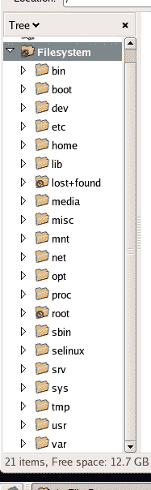

***导航文件系统***

导航文件系统从桌面上的 Nautilus 开始，Nautilus 是 GNOME 对文件系统的图形化表示。桌面上有两个图标作为 Nautilus 的起点:计算机和用户名的主页，如图 2.14 所示。

*图 2.14。桌面文件系统图标。*
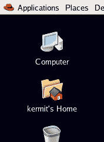

电脑图标从系统顶层开始，类似于 Windows 中的我的电脑；而用户名的主图标从当前用户的主目录开始。

双击计算机图标会向我们展示一个类似于图 2.15 所示的视图。我们可以看到连接到计算机上的可移动介质，以及代表本地文件系统的根的图标，以及我们可以通过网络访问的任何其他文件系统。

*图 2.15。计算机图标的顶级视图。*
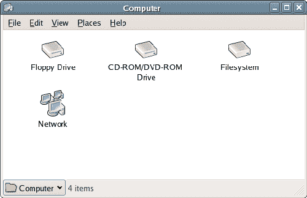

双击文件系统图标会打开一个新窗口，显示文件系统的根目录，如图 2.16 所示。双击这些图标将打开另一个窗口，提供所选目录的内容视图，就像 Mac 上的 Windows 资源管理器或 Finder 一样。

*图 2.16。查看计算机图标文件系统。*
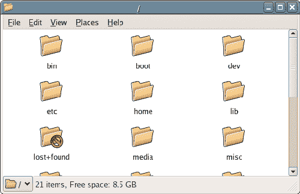

双击桌面上用户名的主目录图标将直接跳转到当前用户的主目录。首先，主目录将只包含一个可见的文件夹图标，即桌面，如图 2.17 所示。

*图 2.17。主页图标视图。*
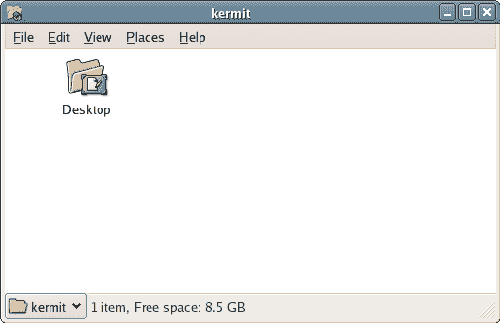

***处理 Linux 文件***

实际上，Linux 系统中的一切都是文件，包括目录、链接等等。甚至命令也是文件，从简单到极其复杂。由于 Linux 系统及其文件的性质，理解新系统上的文件处理和编辑过程非常重要。

在这一节中，我们将快速浏览文件权限结构，了解系统从一个文件链接到另一个文件的能力，并探索一些更常见的 Linux 文本编辑应用程序。因为 Linux 中的一切都是文件，所以理解如何访问和编辑文件非常重要。这些是你几乎每天都会用到的技能。

**文件权限**

Linux 利用了所有计算机操作系统中最细粒度的文件权限系统之一。正如我们已经看到的，这种粒度部分是由于 Linux 中的一切都是文件这一事实。命令、配置、设备文件:都是可编辑的，这取决于编辑用户是谁，以及如何设置文件的权限。因此，理解权限结构以及它将如何影响您和您的用户与系统文件的交互非常重要。

最基本的，Linux 权限分为三组权限。这些是:

*   所有者(或用户)-授予拥有文件的用户(通常是创建文件的用户)的权限。
*   组–授予特定用户组的权限。可以将用户添加到任意数量的可用组中，每个组都可以拥有文件权限。
*   “其他”-授予除所有者或有权访问文件的组成员之外的任何人的权限。

这些权限集中的每一个都可以授予下列不言自明的权限的任意组合:

*   阅读
*   写
*   执行

Linux 权限结构中特别有趣的是这三组权限是如何交互的。特定用户可能属于只能读取特定文件的组，但是如果该用户恰好是该文件的所有者，则该文件的所有者权限也可能授予该用户对该文件内容的写入权限。

作为一个例子，让我们看看一个简单文本文件的默认权限结构。从菜单中选择应用程序>附件>文本编辑器，打开 gedit 应用程序。在 gedit 中输入一些文本，然后将文件保存在您的主目录中。在 Nautilus 中找到该文件，右键单击该文件，然后选择 Properties。单击 Permissions 选项卡，查看已经授予该文件的权限，如图 2.18 所示。

*图 2.18。文本文件的默认权限。*
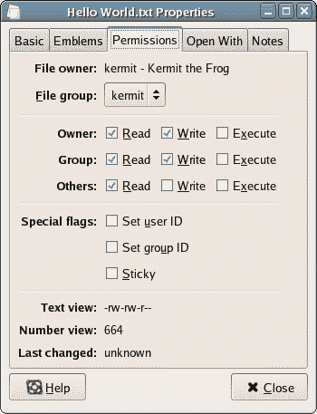

让我们深入看看这个对话。

*文件所有者*
这标识了拥有该文件的用户。默认情况下，所有者是创建文件的用户；但是，拥有足够权限的用户(例如 root 用户)可以更改文件所有权详细信息。

*文件组*
有权访问该文件的用户组:在本例中，是一个名为 kermit 的组。当您创建一个用户时，Linux 会自动创建一个与该用户同名的组。这允许我们允许一个用户访问另一个用户的文件。例如，如果我们将用户 gonzo 添加到 kermit 组，Gonzo 就可以访问 Kermit 的文件。

*所有者、群组和其他*
这些复选框允许实际设置权限。您可以授予所有者、您选择的组或其他任何人读、写和/或执行权限的任意组合。三种权限类型的三个部分的组合导致了对该文件的权限的 512 种可能的组合。这是一个非常灵活的结构！我们一会儿将更仔细地看看文件权限。

特殊标志
权限系统的特殊扩展允许我们标记一个文件，由文件系统进行特殊处理。我们不需要在本书中使用这些标志。

*文本视图和数字视图*
这些查看文件权限的可选方式对于任何通过命令行处理文件权限的人来说都是熟悉的。

文本视图由十个字符组成。第一个表示文件类型:如果文件是目录，这个字符会是`d`；如果该文件是一个常规文件，它将是`-`。其余九个字符表示所有者、组和其他所有人的读、写和执行权限。例如，`-rw-rw-r--`代表一个常规文件，它对所有者具有读写权限，对组具有读写权限，对其他所有人具有只读权限。当您更改上面的复选框时，您可以看到此视图发生变化。

数字视图是文本视图的一个更紧凑的视图。数字从左到右代表授予所有者、组和其他所有人的权限。当您更改复选框中的选择时，此视图也会发生变化。

*最后更改*
该字段标识文件最后更改的日期和时间。由于这个文件还没有被重新打开和修改，Linux 还不认为它被改变了。打开文件并进行修改，以查看日期的变化。

***符号链接，或链接文件:更多抽象***

大多数使用过 Windows 的人都理解快捷方式的概念。快捷方式实际上是从一个位置指向系统中另一个区域的文件的指针。事实上，一些用户理解并沉迷于 Windows 中的快捷方式，以至于他们的桌面最终都被它们覆盖了！从非真实位置启动文件的能力对计算机用户来说显然是有价值的。Linux 也提供了这样的能力。作为一名管理员，你会发现 Linux 的快捷方式几乎和 Windows 一样令人兴奋。

Windows 中的快捷方式和 Linux 中的符号链接实际上是一回事:它们是原始文件的抽象——仅仅是表示。在 Windows 中创建快捷方式实际上并不会将可执行文件移动到桌面。类似地，在 Linux 中，我们可以为文件编写一个看起来像文件本身的抽象。该文件在新位置并不真正存在，它只是像存在一样运行。

Windows 和 Linux 创建快捷方式的一个重要区别是，在大多数情况下，Linux 符号链接(通常称为符号链接)可以被完全视为文件。例如，如果您在编辑器中打开一个符号链接，并对文件进行更改，编辑器将编辑符号链接指向的实际文件。如果您在 Windows 下尝试这样做，当编辑器打开快捷方式文件进行编辑时，您可能会大吃一惊，而不是快捷方式链接到的文件！符号链接在 Linux 下经常使用，因为它们是一种强大的抽象，可以让文件看起来好像同时在多个位置。

您可以在 Nautilus 中创建一个符号链接，方法是右键单击一个文件或文件夹，然后选择 Make Link，如图 2.19 所示。这将在文件名的开头创建一个带有“link to”的符号链接，如图 2.20 所示。您可以将该文件拖放到任何地方，并根据您的选择对其进行重命名。

*图 2.19。在 Nautilus 中创建符号链接。*
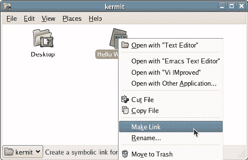

*图 2.20。新创建的符号链接。*
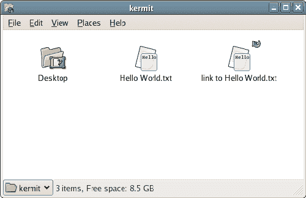

***编辑文本文件***

合理掌握 Linux 兼容的文本编辑器对于日常管理的成功至关重要。由于 Linux 系统中的大多数配置都是通过文本文件完成的，所以明智的做法是找到一个适合自己的文件。事实上，Linux 充满了文本编辑器:没有 GUI 的编辑器、有 GUI 的编辑器、主要面向程序员的编辑器、面向 HTML 开发人员的编辑器——不缺少工具来简化管理任务。在这一节中，我们将看一下您可以使用的一些基于 GUI 的文本编辑器。稍后我们将看看一些基于命令行的编辑器。

Fedora Core 在默认安装中提供了两个健壮的 GUI 文本编辑器:gedit 和 Kate。gedit 是 GNOME 桌面环境的默认文本编辑器，Kate 是 KDE 的默认编辑器，但是两者都可以在任一桌面环境中工作。

如果您长期使用 Windows 的记事本或写字板，您会发现 Linux 的 GUI 文本编辑器中有许多相同的功能，还有更多。

**关闭**

gedit 是 GNOME 的默认文本编辑器。如图 2.21 所示，它提供了全方位的功能，包括:

*   完全支持国际化文本，包括 UTF-8
*   选项卡式多文档界面
*   语法突出显示
*   插件和插件管理器
*   完整的首选项界面

除了这些标准特性之外，还可以添加以下插件来扩展 gedit 应用程序:

*   拼写检查器
*   插入日期和时间
*   字数
*   更改所选文本的大小写
*   缩进或不缩进文本块
*   确定两个文档或文件之间的差异
*   从命令行插入输出
*   HTML、LaTeX 等常见标记语言的标记语言标签列表。

*图 2.21。gedit 主屏幕，准备编辑 Apache 配置文件。*
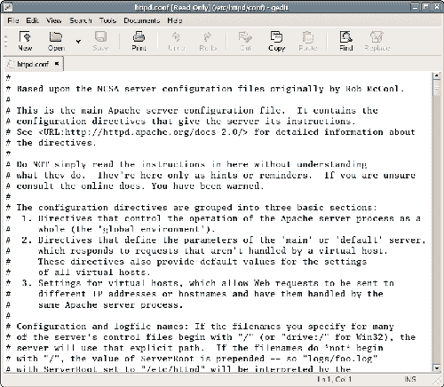

***注意你的 Gs 和 Ks***
*你会很快意识到大多数 Linux 的 GUI 应用程序都是专门为一种或另一种桌面环境编写的。这些应用程序的命名约定保持相当一致，并且相当明显。大多数为 GNOME 桌面环境编写的应用程序将以字母“G”开头，而专门为 KDE 桌面环境编写的应用程序将以字母“k”开头*

凯特

与 gedit 相对应的是 Kate，即“KDE 高级文本编辑器”，如图 2.22 所示，“主 Kate 屏幕，其中正在编辑 Apache 配置文件。”。如果在应用程序菜单中没有，您可以通过选择应用程序>运行应用程序…并输入`kate`来启动它。

*图 2.22。主 Kate 屏幕，其中正在编辑 Apache 配置文件。*
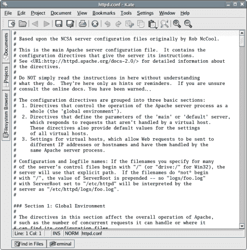

***启动不了凯特？***
*凯特文本编辑器，原本是一个独立的应用程序，现在包含在 kdebase 包中。它不能单独下载。为了使用 Kate，你需要安装所有的 KDE 库和基础应用程序。要安装其他应用程序，请选择桌面>系统设置>添加/删除应用程序。*

像 gedit 一样，Kate 是一个多视图编辑器:它允许你在同一个窗口中打开和编辑多个文档。除了这个非常有用的特性，Kate 还提供了一系列其他功能，使它成为一个非常强大的文本编辑器。其特点包括:

*   凯特允许你编辑各种文本文件，即使它们很大。凯特可以在几秒钟内打开一个 50MB 的文件。
*   Kate 强大的语法高亮引擎可以通过 XML 文件扩展。
*   该编辑器为许多编程语言提供了代码折叠功能，包括:C++、C、PHP 等。
*   Kate 提供了拆分窗口视图，允许您同时查看文档的不同部分。
*   Kate 允许用户通过保存/打开对话框来选择我们想要为每个文件使用的编码。
*   凯特自诩内置终端仿真。
*   Kate 的侧边栏显示了打开文档的列表、文件系统浏览器等等。
*   Kate 提供了一个方便的插件接口，允许第三方插件。
*   编辑器提供了项目处理能力(可以被项目处理插件覆盖)。

最终，Kate 比其他一些编辑器更友好，并且在编辑配置文件和编写 shell 脚本方面提供了更大的灵活性。语法突出显示功能是无与伦比的，因为 Kate 提供了一系列的编程语言和风格。此外，Kate 还提供了一些功能，如打开文档列表(如图 2.23 所示)和集成的文件系统浏览器(如图 2.24 所示)。

*图 2.23。Kate 的文档选项卡。*
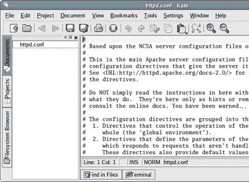

*图 2.24。Kate 的文件系统浏览器选项卡。*
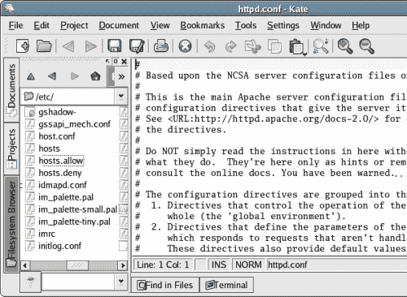

虽然 Linux 确实提供了其他 GUI 文本编辑选项，但 gedit 和 Kate 是其中两个最强大和用户友好的选项。这两种方法都很适合您的 Linux 文本编辑目的。

##### 摘要

理解 Linux 需要时间，在这个过程中的第一步是找到你的路，在这个起初可能有点陌生的桌面周围。在这一章中，我们从用户的角度讨论了 Linux、Fedora 和 GNOME 桌面的一些基础知识。接下来，是时候看看作为 Linux 服务器的管理员，您需要了解什么。

##### 第三章。命令行

到目前为止，我们与 Linux 的交互是通过一个漂亮的桌面环境进行的，对于有经验的 Windows 用户来说，熟悉这个系统相当容易。然而，事情并不总是这样:Linux 用户界面的根牢牢地卡在它的命令行中。

##### 命令行是什么？

与 Windows 不同，GUI 在 Linux 中是完全可选的。如果你觉得特别有能力，或者你有某些要求(或者非常旧的硬件)，你可以在没有图形的情况下运行你的 Linux 机器。随着 Linux 的发展，在其基础上构建了各种 GUI，但是命令行仍然是管理员最好的朋友:一种快速、简单、强大的方式来执行桌面上不容易执行的操作。

*图 3.1。访问 GNOME 终端。*
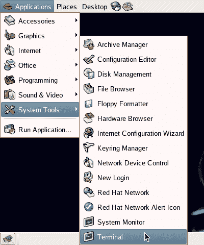

在本书中，我们将使用 GNOME 终端应用程序来访问命令行。您可以从应用程序>系统工具>终端访问该应用程序，如图 3.1 所示。终端本身如图 3.2 所示。

***调整终端***
*GNOME 桌面环境是完全可定制的——包括终端的外观。你可以决定使用的字体，改变窗口的前景和背景颜色——你甚至可以设置窗口本身的透明度，这样就可以看到窗口后面的桌面图像！在终端中，您可以在编辑>当前配置文件…* 中找到这些设置

*图 3.2。GNOME 终端应用程序。*
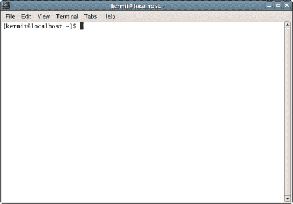

让我们看一个使用命令行来满足特定需求的真实例子。一旦您理解了命令的组成部分(以及图形替代的复杂性)，您将开始理解终端和命令行的实际用途。

```
[kermit@swinetrek ~]$ find /var/backups/* -ctime +5 -exec rm {} ;
```

我经常使用此命令从系统中删除超过五天的备份。该命令使用 find 工具在`/var/backups`目录中搜索超过五天的文件。对于查找工具找到的每个文件，它运行`rm`命令:`rm`是标准的“删除文件”命令。定期运行此命令有助于通过删除五天后变得不必要的备份来节省系统存储空间。当然，该命令应该与每天创建这些备份的自动化过程一起运行。

让我们将该命令的使用与利用图形工具完成相同任务的过程进行比较。

1.  从键盘上拿起鼠标。

3.  双击桌面上的计算机图标。

5.  双击文件系统进入根目录。

7.  双击 var 文件夹将其打开。

9.  双击备份文件夹。

11.  通过选择“查看”>“以列表形式查看”,确保生成的窗口显示文件的创建时间。

13.  按住 Ctrl 键，选择创建日期超过五天的文件。

15.  右键单击并从上下文菜单中选择“移至回收站”。

17.  要*真的*删除文件，请返回桌面，通过右键单击回收站图标并选择清空回收站来清空回收站。

您不需要理解 Linux 文件系统的复杂性就能看出命令行的优势。图形化方法至少需要九次——可能更多——鼠标点击。您不必将查找和删除这些文件的过程视为单一操作，而是必须将该过程分解为各个部分。此外，与通过键盘输入命令的快速简单性相比，使用鼠标在屏幕上定位、指向和点击目标的效率很低，您开始理解命令行是如何成为系统管理的一个有价值和高效的工具。

然而，这甚至没有说明命令行真正的美丽和强大之处。你不相信我实际上一周运行三次 rm 命令，是吗？这也将是非常低效的:我将依靠我自己的多孔内存来确保备份被删除！事实上，您将在 Linux 中使用的大多数命令都是完全可脚本化的，只需做很少的修改。实际上，我已经通过 cron 实用程序(我们将在第 4 章，系统管理中深入讨论)要求我的系统每周执行该命令三次。这很像 Windows 中的计划任务功能，但它更强大:它可以做任何事情。如您所见，即使您只是偶尔打开一个终端窗口，理解 Linux 命令和命令行概念也是必不可少的。

##### 使用命令行

当您使用 Linux 命令行时，您打开了一个可以被认为是操作系统的替代窗口——通过这个替代窗口，您可以访问更强大、更低级的操作系统功能。图形工具不能提供这种能力。图形环境仅仅是操作系统环境的高级抽象，我们所熟悉的图标和菜单只能提供对该环境的有限访问。这些图标和菜单代表了操作系统的功能，但它们并不是真正的功能。换句话说，图形界面在操作员和操作系统之间提供了一个有限的附加层，在这个层中，有限范围的功能由漂亮的图片来表示。为了以最高的效率管理您的 Web 服务器，能够在与您的系统相同的级别上工作是很有用的。

***高不可攀，或落魄肮脏***
*当我们谈论“高级”和“低级”功能时，我们暗指功能的层次结构。最底层的函数直接与内核通信，因此具有强大的功能和灵活性；更高级别的工具本身做更多的工作，提供更多的功能和更高的安全性。例如，将低级别的 rm 命令与 Nautilus 中较高级别的 Trash 功能进行比较。rm 只是简单地删除一个文件:它又快又简单，但是没有简单或有保证的方法来恢复该文件。Nautilus 没有为您提供这样的功能。它坚持让你把文件移动到垃圾桶，有效地标记文件可能被删除。删除本身不会发生，直到你去桌面清空垃圾箱。*

***以 root 身份登录***

我们已经讨论过以 root 用户身份登录 Linux。要从 GNOME 终端这样做，您将输入 su(切换用户)命令。

```
[kermit@swinetrek ~]$ su        

Password:
```

系统会提示您输入 root 密码。一旦你进入它，你将获得系统的完全访问权:计算全能！明智地使用它。尽管有些事情只能以 root 用户身份完成，包括许多系统管理任务，但是遵守良好的 Linux 卫生习惯是很重要的:不要在不必要的时候一直以 root 用户身份登录。每个 Linux 管理员都有一个可怕的经历，当以 root 用户身份登录时，他或她输入了错误的命令，删除了机器上的所有内容(或者类似的灾难)。你想避免这样的灾难。小心，如果不需要的话，不要以 root 用户身份登录。要切换回您的标准用户帐户，请使用 exit 命令。

***一些实际例子***

让我们看几个命令行的例子。

**用`pwd`命令**定位自己

在 Nautilus 中，我们可以同时打开多个文件夹窗口。然而，当使用命令行时，我们一次只能在一个目录中工作。该活动目录称为工作目录。要找出您当前所在的目录，请使用 pwd(打印工作目录)命令。

```
[kermit@swinetrek ~]$ pwd        

/home/kermit
```

***首页，温馨首页***
*首页`/home/username`，通常被称为`~`。你注意到命令行中的`~`了吗？它表示您当前位于主目录中。当我们开始浏览文件系统时，我们将看到这个命令提示符发生了变化，以反映我们正在工作的目录的名称。因此，我们将不必不断地进入`pwd`来找到我们在哪里。*

**用 ls 命令列出文件**

单独使用的`ls`(代表 list)命令列出了工作目录的内容。

```
[kermit@swinetrek ~]$ ls        

Desktop  Hello World.txt
```

通过在命令行中添加目录名，可以检索另一个目录中的文件列表。例如，`ls /`将返回根目录中所有内容的列表。

```
[kermit@swinetrek ~]$ ls /        

bin   dev  home  lost+found misc  net  proc  sbin    srv  tmp  var        

boot  etc  lib   media      mnt   opt  root  selinux sys  usr
```

单独使用 ls 将显示文件夹中包含的文件名，但仅此而已。要查看所有文件的详细信息，我们可以在命令中添加`-l`选项，这会返回一个更长的列表。

```
[kermit@swinetrek ~]$ ls -l        

total 16        

drwxr-xr-x  2 kermit kermit 4096 Sep  5 14:21 Desktop        

-rw-rw-r--  1 kermit kermit   13 Sep  8 07:30 Hello World.txt
```

这里有大量的信息。

*   第一列以我们在第 2 章“日常使用”中讨论的格式显示了每个文件的权限。总之，第一个字符告诉我们文件是否是一个目录；接下来的九个字符显示所有者、组和其他人是否被授予了读、写和执行权限。
*   下一列实际上只对目录有用；它反映了目录中文件的数量。对于文件，该数字将为 1。
*   接下来的两列标识分配给文件的所有者和组。在这种情况下，他们都是科米。
*   接下来显示文件的大小(以字节为单位)。这里，我们看到文件`Hello World.txt`是 13 个字节。
*   接下来，我们会看到文件上次修改的日期和时间。在上面的例子中，桌面目录的最后一次修改是在 9 月 5 日下午 2:21
*   最后，我们得到了文件的名称。

```
ls -l is so useful that Fedora Core includes a built-in shortcut to it: ll.
```

您的主目录将包含许多隐藏文件。在 Linux 中，我们可以通过以句点开始文件名来隐藏文件:如果我们将`Hello World.txt`的名称改为`.Hello World.txt`，它将被隐藏。正是在这些隐藏文件中，程序存储了用户特定的配置信息。要查看隐藏文件，使用全部选项(`-a`)，该选项可与`-l`选项一起使用，或作为`ll`的一个选项。

```
[kermit@swinetrek ~]$ ll -a        

total 212        

drwx------  13 kermit kermit 4096 Sep  8 09:16 .        

drwxr-xr-x   5 root   root   4096 Sep  6 13:48 ..        

-rw-------   1 kermit kermit    5 Sep  8 06:21 .bash_history        

-rw-r--r--   1 kermit kermit   24 May 10 10:15 .bash_logout        

-rw-r--r--   1 kermit kermit  191 May 10 10:15 .bash_profile        

-rw-r--r--   1 kermit kermit  124 May 10 10:15 .bashrc        

drwxr-xr-x   2 kermit kermit 4096 Sep  5 14:21 Desktop        

-rw-------   1 kermit kermit   26 Sep  6 14:20 .dmrc        

drwxr-x---   2 kermit kermit 4096 Sep  6 14:21 .eggcups        

-rw-r--r--   1 kermit kermit  438 May 18 01:23 .emacs        

-rw-------   1 kermit kermit   16 Sep  6 14:28 .esd_auth        

drwx------   4 kermit kermit 4096 Sep  6 14:31 .gconf        

drwx------   2 kermit kermit 4096 Sep  6 14:31 .gconfd        

drwxrwxr-x   3 kermit kermit 4096 Sep  6 14:21 .gnome        

drwx------   7 kermit kermit 4096 Sep  6 14:31 .gnome2        

drwx------   2 kermit kermit 4096 Sep  6 14:20 .gnome2_private        

drwxr-xr-x   2 kermit kermit 4096 Sep  6 14:21 .gstreamer-0.8        

-rw-r--r--   1 kermit kermit  120 May 22 15:18 .gtkrc        

-rw-rw-r--   1 kermit kermit  134 Sep  6 14:20 .gtkrc-1.2-gnome2        

-rw-rw-r--   1 kermit kermit   13 Sep  8 07:30 Hello World.txt        

-rw-------   1 kermit kermit    0 Sep  6 14:31 .ICEauthority        

drwx------   3 kermit kermit 4096 Sep  6 14:21 .metacity        

drwx------   2 kermit kermit 4096 Sep  6 14:22 .mozilla        

drwxr-xr-x   3 kermit kermit 4096 Sep  6 14:21 .nautilus        

-rw-------   1 kermit kermit   50 Sep  6 14:26 .recently-used        

-rw-------   1 kermit kermit  497 Sep  6 14:21 .rhn-applet.conf        

-rw-------   1 kermit kermit   66 Sep  8 09:16 .xauth3R8EvP        

-rw-r--r--   1 kermit kermit  658 Jan 16  2005 .zshrc
```

在这个文件列表的顶部出现了两个目录，名为`.`和`...`，它们分别是当前目录和父目录的快捷方式。我们将在下一节中讨论这些。

**使用`cd`命令在文件系统中移动**

`cd`命令代表更改目录。它将当前工作目录更改为命令后立即指定的目录。

```
[kermit@swinetrek ~]$ cd /etc/httpd/        

[kermit@swinetrek httpd]$
```

单独使用时，`cd`命令会将您返回到主目录。

```
[kermit@swinetrek httpd]$ cd        

[kermit@swinetrek ~]$
```

命令`cd /home/kermit`和`cd ~`做同样的事情。您可以使用`cd ..`命令移动到工作目录的父目录。

```
[kermit@swinetrek ~]$ cd ..        

[kermit@swinetrek home]$
```

**用`echo`和`cat`命令**打印

`echo`命令只是将输出发送到屏幕上。

```
[kermit@swinetrek ~]$ echo "Hello, World!"        

Hello, World!
```

***转义特殊字符***
*某些字符是保留给命令行特殊使用的，比如`!`。但是，您可能经常希望在命令选项或文件名中使用这些字符。要使用这些字符，必须对它们进行转义，即在它们前面加一个反斜杠(`) character. If you use spaces in filenames, you’ll need to escape the spaces when dealing with those filenames on the command line: our file `Hello World.txt`需要作为`Hello World.txt`来访问)。`*

 ``cat`命令打开一个文件，并将其内容写入屏幕。

```
[kermit@swinetrek ~]$ cat Hello World.txt        

Hello, World!
```

**用`cp`和`mv`命令**复制和移动文件

复制命令-`cp`-创建文件的副本。

```
[kermit@swinetrek ~]$ cp Hello World.txt Copy.txt         

[kermit@swinetrek ~]$ ls         

Desktop  Hello World.txt  Copy.txt
```

这里，我们创建了一个名为`Copy.txt`的`Hello World.txt`的精确副本。我们可以在不同的目录中创建文件的副本，如下所示:

```
[kermit@swinetrek ~]$ cp Hello World.txt          

> /var/backup/Hello World.txt         

[kermit@swinetrek ~]$
```

***拆分长命令***
*因为有些命令对于本书的页面宽度来说太长了，所以我把它们拆分成了多行。如果您曾经想在命令行上这样做，您需要在每一行的末尾加上一个空格，然后是反斜杠(`). When you press Enter when a line that ends this way, you’ll get a `>`)提示符，以输入命令的其余部分。因为您不是在写书，所以您可以将这些长命令作为一个长行键入(当您键入命令时，终端会自动将命令换到下一行)。`*

 `您可以使用 cp 来复制整个目录层次结构。下面的命令将创建一个`/var/backup/kermit`目录，其中包含所有 kermit 文件的副本。

```
[kermit@swinetrek ~]$ cp -r /home/kermit/ /var/backup/         

[kermit@swinetrek ~]$
```

```
mv (which stands for move) moves a file from one location in the filesystem to another.
```

```
[kermit@swinetrek ~]$ mv Hello World.txt Moved.txt         

[kermit@swinetrek ~]$
```

在上面的例子中，文件`Hello World.txt`被移动到同一个目录中一个名为`Moved.txt`的新文件中；实际上，我们只是重命名了文件。与`cp`命令不同，当使用`mv`命令时，原始文件不会保留在其原始位置。要将文件移动到另一个目录，可以像这样执行命令:

```
[kermit@swinetrek ~]$ mv Hello World.txt /var/backup/         

[kermit@swinetrek ~]$
```

**用`su`和`exit`命令**切换用户

我们已经看到，单独使用的`su`登录到 root 帐户，并提示您输入 root 用户密码:

```
[kermit@swinetrek ~]$ su         

Password:         

[root@swinetrek kermit]# 
```

***那个什么$#？***
*注意切换到 root 时提示的变化:提示末尾的字符从`$`变为`#`，表示您以 root 身份登录。如果您在您的主目录中，提示中的当前目录将从~变为您的旧用户名。这表明您不再是您个人目录中的普通用户:您是另一个用户个人目录中的 root 用户。root 的主目录是`/root`。*

要切换回原来的用户，使用`exit`命令:

```
[root@swinetrek kermit]# exit         

exit         

[kermit@swinetrek ~]$
```

您可以使用`su`切换到任何其他用户，只要您知道该用户的密码。

```
[kermit@swinetrek ~]$ su gonzo         

Password:         

[gonzo@swinetrek kermit]$ 
```

**使用`chmod`命令改变文件权限**

在第 2 章“日常使用”中，我们讨论了权限，并了解了如何通过 GUI 改变它们。您也可以使用 chmod(更改模式)工具从命令行更改这些权限。

```
[kermit@swinetrek ~]$ chmod o+w Hello World.txt         

[kermit@swinetrek ~]$ ll         

total 16         

drwxr-xr-x  2 kermit kermit 4096 Sep  5 14:21 Desktop         

-rw-rw-rw-  1 kermit kermit   13 Sep  8 07:30 Hello World.txt
```

这里，我们已经授予所有其他用户对`Hello World.txt`的写权限。我们通过将`o+w`传递给它来告诉`chmod`这样做。让我们来看看这意味着什么:

*   字符`o`告诉 chmod 处理其他用户的权限集。这可以用用户组的`u`、组组的`g`或所有三个组的`a`来代替。
*   字符`+`告诉 chmod 授予许可。可以改成`-`，告知`chmod`撤销权限。
*   字符`w`告诉 chmod 处理写权限。这可以更改为`r`表示读取权限，或者`x`表示执行权限。

也可以组合这些字母。例如，您可以使用`ug-w`撤销用户和组的写权限。

```
[kermit@swinetrek ~]$ chmod ug-w Hello World.txt         

[kermit@swinetrek ~]$
```

**用`rm`命令删除文件**

正如我们已经看到的，`rm`命令删除一个文件。在下面的例子中，rm 将删除文件`MyCopy.txt`。

```
[kermit@swinetrek ~]$ rm MyCopy.txt         

[kermit@swinetrek ~]$
```

为了删除一个目录和其中的所有内容，我们必须在命令中添加“recursive”(`-r`)选项，如下所示:

```
[kermit@swinetrek ~]$ rm -r untitled folder         

[kermit@swinetrek ~]$ 
```

通常，您必须拥有文件的写权限才能删除它；但是，如果您对包含该文件的目录具有写权限，您可以在确认操作后删除文件。如果您试图删除您只有读取权限的文件，系统会询问您是否真的要删除该文件:

```
[kermit@swinetrek ~]$ rm Read Only.txt         

rm: Remove write-protected regular file 'Read Only.txt'? y         

[kermit@swinetrek ~]$ 
```

要在没有进一步确认的情况下强制删除，请在命令中添加`-f`选项。这也可以与`-r`选项结合使用来删除写保护目录。

```
[kermit@swinetrek ~]$ rm -rf Read Only Folder         

[kermit@swinetrek ~]$ 
```

***不要勉强它！***
*将`-f`选项与`rm`命令一起使用时要非常小心。以 root 用户身份登录时，未经确认就删除目录或文件可能会严重损坏您的安装。确认删除可以防止这些意外删除。*

***获取帮助***
*可能所有命令行工具中最有用的就是在线手册`man`。如果您需要了解一个命令做什么或者有哪些选项，只需在命令提示符下输入`man commandname`。*

阅读手册时，上下箭头键滚动文本，空格键一次滚动一页，`Q`退出手册，返回命令提示符。

***引入外壳***

就像我们可以通过桌面环境(如 GNOME 或 KDE)与 Linux 进行图形化交互一样，我们也可以通过 shell 与 Linux 命令行进行交互。在本章中，我们一直在使用 shell 现在让我们来看看它的一些更高级的特性。

Fedora Core 中(事实上，在大多数现代 Linux 系统中)的默认 shell 是 bash，或 Bourne Again Shell。bash 是对 1977 年编写的原始 Bourne shell sh 的现代重写。虽然存在其他 shell 环境，如 tcsh、csh 和 ksh，但 bash 由于其有用的特性集而变得越来越流行。我们将在这里详细介绍其中的一些特性。

**标签完成**

许多现代 shells 最有用的特性之一是制表符补全。当在命令行中输入部分命令或文件名，并且用户按 Tab 键时，该命令或文件名将为您完成。例如，键入`cat Hello`，后跟 Tab，将导致在命令行为您完成`cat Hello World.txt`。

然而，键入`cd /etc/ht`，后跟 Tab，不会立即返回任何内容。那是因为有两个目录以`/etc/ht`开头:/etc/httpd

还有`/etc/htdig`。第二次按 Tab 键将列出可能的选项:

```
[kermit@swinetrek ~]$ cd /etc/ht         

httpd/  htdig/         

[kermit@swinetrek ~]$ cd /etc/ht
```

我们可以使用此列表继续键入，直到我们键入足够的字符来识别单个目录；然后，我们可以再次按 Tab 来完成文件名。

**命令历史**

bash shell 记录最近发出的命令的有限历史记录——默认情况下最多 1000 条。您可以使用向上箭头键在命令历史记录中向后滚动，使用向下箭头键向前滚动。找到所需的命令后，您可以按 Enter 键执行它。

要查看完整的历史，只需输入`history`命令。您最近的所有命令将按时间顺序显示，最早的命令在顶部。

```
[kermit@swinetrek ~]$ history         

    1  pwd         

    2  ls         

    3  ls /         

    4  ls -l         

    5  ll -a         

    6  cd /etc/httpd/         

    7  cd         

    8  cd ..         

    9  echo "Hello, World!"         

   10  cat Hello World.txt         

   11  cp Hello World.txt Copy.txt         

   12  cp Hello World.txt /var/backup/Hello World.txt         

   13  cp -r /home/kermit/ /var/backup/         

   14  mv Hello World.txt Moved.txt         

   15  mv Moved.txt /var/backup/         

   16  su         

   17  su gonzo         

   18  chmod o+w Hello World.txt         

   19  ll         

   20  chmod ug-w Hello World.txt         

   21  rm Copy.txt         

   22  rm -r untitled folder         

   23  rm Read Only.txt         

   24  rm -rf Read Only Folder
```

这段历史也是可以搜索的。按 Ctrl-R 会把提示改成`(reverse-i-search)`':`；现在，尝试键入历史中的一个命令的一部分。shell 将在历史记录中找到包含输入字符串的最新命令，并显示它。只需按 Enter 键执行它，或者按 Esc 键返回正常提示符。在下面的例子中，我输入了`Hello`并找到了最后一个包含文件`Hello World.txt`的命令。

```
(reverse-i-search)`Hello': chmod ug-w Hello World.txt
```

一些内置的历史快捷方式可以进一步最大化您利用 shell 历史的效率。`!!`命令将执行历史文件中的最后一个命令。例如，如果最后输入的命令是`ll`，`!!`将重新运行该命令。

```
[kermit@swinetrek ~]$ !!         

ll         

total 16         

drwxr-xr-x  2 kermit kermit 4096 Sep  5 14:21 Desktop         

-rw-rw-r--  1 kermit kermit   13 Sep  8 07:30 Hello World.txt
```

```
!partial-command will execute the last command beginning with partial-command. For example, !ech would re-run the last echo command.
```

```
[kermit@swinetrek ~]$ !ech         

echo "Hello, World!"         

Hello, World!
```

***编程外壳***

shell 本身可以是一种非常强大的小型编程语言。它支持循环、分支、变量——构成一个有价值的编程环境的一切。这些 shell 程序称为 shell 脚本，只是设置了执行权限的文本文件。文本文件包含的命令就像您在命令行中键入的命令一样:

例 3.1。hello_world.sh

```
#!/bin/sh          

echo "Hello, World!"
```

该脚本的输出与您预期的完全一样:

```
Hello, World!
```

让我们来看看 shell 的一些更像编程语言的特性。首先，我们将在 shell 中创建一个新变量并打印其值。

```
[kermit@swinetrek ~]$ COUNTER=0          

[kermit@swinetrek ~]$ echo $COUNTER          

0
```

一旦变量`COUNTER`被创建，它就一直存在，直到你关闭终端窗口。正如您将看到的，变量的值可能会改变，但是变量本身会一直保持，直到终端会话结束。这适用于任何声明的 shell 变量。

如果我们使用 increment 操作符(++)来增加`COUNTER`的值，然后再次回显，您将看到 shell 实际上跟踪了这些变量的值:

```
[kermit@swinetrek ~]$ let COUNTER++          

[kermit@swinetrek ~]$ echo $COUNTER          

1
```

让我们构建一个简单的脚本，名为`counter_test.sh`，它将一直计数，直到我们按下 Ctrl-C 让它停止。

***抱歉中断…***
*你可以在命令行上按 Ctrl-C 中止任何进程，这被称为给程序发送中断信号。*

如果你对自己输入的内容不满意，这个键盘快捷键会丢掉一个命令，让你进入一个新的空白提示。

任何 shell 脚本的第一行通常被称为 shebang:一个英镑符号，后面是一个感叹号，再后面是 shell 的路径。(`/bin/sh`是 Linux 系统上 shell 程序的标准快捷方式。通常，这个文件只是一个到实际 shell 程序的链接(例如`/bin/bash`)，但是使用标准名称可以确保您的脚本仍然可以在使用不同 shell 的系统上工作。)

```
#!/bin/sh
```

每个 shell 脚本都必须以这行开始。我们脚本的下一行将为`COUNTER`变量设置一个值:

```
COUNTER=0
```

换句话说，我们从零开始计数。接下来，我们将在程序中添加一个循环。我们将使它成为一个无限循环，所以用户将不得不发送一个中断信号来退出程序。

```
while true;          

do          

  # contents of loop go here          

done
```

现在我们需要做的就是定义只要条件为真，shell 将做什么:打印`COUNTER`的值，增加`COUNTER`，并等待一秒钟:

```
while true;          

do          

  echo $COUNTER          

  let COUNTER++          

  sleep 1;          

done
```

如果你密切关注，你会知道我们将在屏幕上看到什么:从 0 开始向上计数。以下是完整的脚本:

例 3.2。counter_test.sh

```
#!/bin/sh          

COUNTER=0          

while true;           

do          

  echo $COUNTER          

  let COUNTER++          

  sleep 1;          

done
```

我们已经创建了一个很好的 shell 脚本，但是在运行它之前，我们还有一些工作要做。为了执行我们的脚本，我们需要设置适当的权限。

```
[kermit@swinetrek ~]$ chmod u+x counter_test.sh          

[kermit@swinetrek ~]$ 
```

现在我们可以运行脚本了:

```
[kermit@swinetrek ~]$ ./counter_test.sh          

0          

1          

2          

3          

4
```

这告诉 shell 在当前工作目录中执行一个名为`counter_test.sh`的文件。您应该看到屏幕开始从零开始计数，在增量之间暂停一秒钟。Ctrl-C 将停止计数。

这只是编写 shell 脚本过程的一小部分。还要记住，shell 脚本可以访问您将在日常 Linux 使用中使用的大多数单个命令。将这些任务优雅地合并到一个可执行文件中的脚本是一件美妙的事情，可以真正节省时间。

如果您以前有过编程经验，您可能会发现这个 shell 对于编程来说有点轻量级。显然，shell 不是一个强大的开发环境。如果它不能满足您的需求，您可能应该开始更深入地研究 Perl 等强大的脚本语言。然而，Shell 脚本的优势在于它是一个很好的黑客工具。它们很快，可以完成您在 Linux 中面临的许多日常管理任务，并且每个脚本的许多部分可以在装入脚本之前直接在 shell 中测试。

在详细的在线教程[使用 Bash shell 编写脚本的快速指南](http://pegasus.rutgers.edu/~elflord/unix/bash-tute.html)中可以找到对 Shell 脚本的可能性的进一步探索。

##### PATH 环境变量

现在，记住所有的命令行工具都是位于文件系统中某处的二进制文件:例如，ls 命令实际上位于目录`/bin`中。但是当您在命令提示符下键入 ls 时，shell 是如何知道找到`/bin/ls`的呢？

shell 会在内置 PATH 变量中列出的所有目录中查找与您正在寻找的命令同名的文件。默认 Fedora 核心安装的 PATH 环境变量如下所示:

```
[kermit@swinetrek ~]$ echo $PATH          

/usr/kerberos/bin:/usr/local/bin:/usr/bin:/bin:/usr/X11R6/bin
```

因此，当您键入 ls 命令时，shell 将首先查找可执行文件`/usr/kerberos/bin/ls`，但没有成功。有没有`/usr/local/bin/ls`？没有。T2 怎么样？抱歉。来个`/bin/ls`怎么样？答对了。

记住，当我们运行我们的`counter_test.sh`脚本时，我们需要给脚本文件名加上前缀`./`来告诉 shell 可执行文件在工作目录中。如果我们要将这个目录添加到 PATH 变量中，我们可以简单地输入`counter_test.sh`来运行这个脚本，而不考虑工作目录。

像`PATH`这样的内置变量被称为环境变量。这些是描述流程运行环境的变量。其他环境变量的例子有`HOME`，它包含用户主目录的路径，以及`MAIL`，它是存储用户电子邮件的文件名。环境变量就像普通的 shell 变量一样工作，只是它们也可以被从 shell 启动的程序访问。

要设置或修改环境变量，必须使用 export 命令:

```
[kermit@swinetrek ~]$ export PATH=$PATH:/home/kermit          

[kermit@swinetrek ~]$ echo $PATH          

/usr/kerberos/bin:/usr/local/bin:/usr/bin:/bin:/usr/X11R6/bin          

:/home/kermit/bin:/home/kermit
```

注意我们如何使用`PATH`环境变量的现有值($PATH)来指定它的新值。这项技术允许我们在现有的`PATH`的末尾添加一个额外的目录。你可以看到/home/kermit 目录已经被添加到了`PATH`变量中。你现在应该可以像跑`ls`一样轻松地跑`counter_test.sh`了。

```
[kermit@swinetrek ~]$ counter_test.sh          

0          

1          

2          

3          

4
```

以这种方式设置`PATH`环境变量将允许您在这个终端会话的剩余部分从任何目录运行一个 shell 脚本，但是一旦您退出终端，修改后的`PATH`将会丢失。在第 4 章，系统管理中，我们将看到如何修改默认的`PATH`,每当一个新的 shell 启动时都会用到。

##### 摘要

尽管 Linux 命令行很有用，但当您第一次打开终端时，它看起来相当神秘。这些命令是有逻辑的，但是在你对它们感到舒服之前，可能需要做一些实验。为了让您走上正确的道路，我们在附录 A 命令行参考中列出了一些最常见的终端命令，并解释了它们在您的 Linux 系统中的用法。

不用接近命令行就可以使用 Linux 系统。然而，如果你这样做，你将放弃使用操作系统的真正力量。Linux 的根源在于命令行界面。当然，您可以使用终端比使用图形界面更有效地完成任务，但是，更重要的是，命令行允许您执行通过 gui 不可能完成的任务。

在 comp.os.linux.misc 新闻组中关于界面直观性的讨论中，Mark van Hoeij 写道“我如何在 GUI 中键入'`for i in *.dvi do xdvi i done`'，他的观点是有效的；命令行可以让您轻松地完成 GUI 做不到的事情。掌握命令行是成为 Linux 大师的阶梯上的一大步。

##### 第四章。系统管理

到目前为止，我们已经了解了 Linux 的安装，并且已经对图形界面和命令行界面相当熟悉了。现在，是时候更深入地研究如何管理我们的 Linux Web 服务器了。

##### 创建新用户和组

用户和组的概念在 Linux 中很重要，作为一名管理员，随着您对系统越来越熟悉，或者开始分担服务器的一些管理职责，您肯定会发现需要添加新用户。与其他任务一样，您可以使用基于图形或文本的界面添加新用户。

***用户管理器工具***

在 Fedora Core 中，用户和组管理任务由用户管理器工具处理，您可以通过选择桌面>系统设置>用户和组来启动该工具，如图 4.1 所示。

*图 4.1。打开用户管理器。*
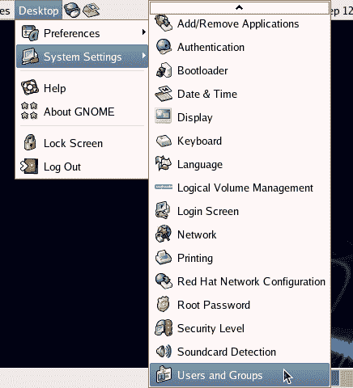

***获得授权***

系统管理工具通常需要 root 访问权限。当他们这样做时，GNOME 将通过图 4.2 所示的对话框提示您输入 root 密码。

*图 4.2。GNOME 显示 root 密码提示。*
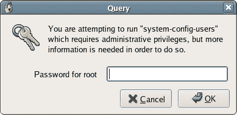

如果您输入的密码正确，您将被授权以 root 用户身份执行系统配置操作，而无需重新输入 root 用户密码。该授权由右上角面板中的徽章图标表示，如图 4.3 所示。完成配置更改后，您可以通过单击徽章图标，然后在出现的对话框中单击“忘记授权”按钮来结束授权。徽章图标应该会消失。

*图 4.3。显示授权徽章。*


**管理用户**

如图 4.4 所示，用户管理器显示了系统中当前存在的所有用户帐户。它还为每个用户显示用户 ID 号、用户所属的组、用户的全名(可选)、用户的默认 shell 和主目录。要添加用户，请单击添加用户。将出现如图 4.5 所示的对话框。

*图 4.4。用户列表。*
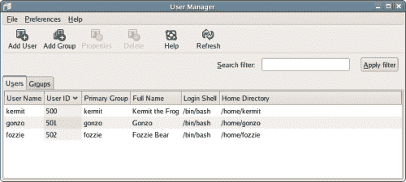

如图 4.5 所示，Fedora 管理员在添加新用户时有很多选项要考虑。其中包括定义主目录、为用户创建私有组、手动分配用户 ID 以及选择用户的 shell。虽然缺省值在大多数情况下是完全可以接受的，但是这个过程非常灵活，非常适合不寻常的情况。

*图 4.5。“新建用户”对话框。*
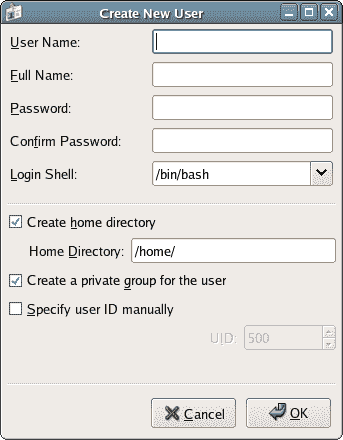

**管理群组**

Linux 系统中的用户可以合并到组中，这可以简化用户组的文件权限管理。例如，您可以创建一个“开发人员”组，将所有为您的服务器创建代码的 Web 开发人员添加到该组中。您将向该组授予对 Web 应用程序文件的适当权限，使每个开发人员能够编辑这些文件，而不允许普通用户访问它们。

要添加新组，请从“用户管理器”窗口中选择添加组。将出现如图 4.6 所示的对话框。

*图 4.6。“创建新组”对话框。*
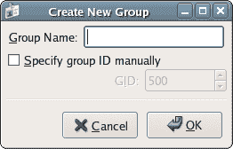

首先，您需要为该组命名。例如，在我们的例子中，您可以将这个组命名为“开发人员”您也可以接受预先分配的组 ID，即 GID(在本例中为 500)，或者选中手动指定组 ID 复选框，为组手动分配组 ID。(NB。您几乎总是希望接受预先分配的 ID，因为除了极少数情况之外，组 ID 是什么并不重要。如果你遇到这种罕见的情况，你就会知道为什么你想要一个特定的 ID；否则，接受建议。)

要查看当前组并将用户添加到现有组，请在用户管理器窗口中选择组选项卡，如图 4.7 所示。

*图 4.7。用户管理器的“组”选项卡。*
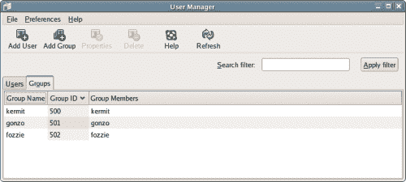

有两种方法可以将用户添加到组中。第一种方法是在用户管理器中选择一个组，然后单击属性按钮。在出现的对话框中，选择 Group Users 选项卡以查看您可以添加到该组的用户列表，如图 4.8 所示。

*图 4.8。向组中添加用户。*
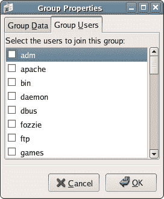

确保您已经选中了所有您想将其包括为该组成员的用户，然后单击“确定”。

将用户添加到组的另一种方法是通过用户管理器的用户视图。在“用户管理器”中，单击“用户”选项卡，选择要添加到组中的用户，然后单击“属性”。单击 Groups 选项卡显示该用户可以加入的所有组的列表，如图 4.9 所示。

*图 4.9。将用户添加到组。*
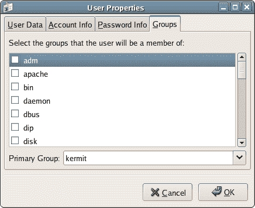

在用户管理器窗口中删除用户或组与创建用户或组一样简单。只需突出显示用户或组，然后单击用户管理器窗口工具栏中的删除按钮。

***从命令行管理用户***

**用`useradd`和`groupadd`和**创建用户和组

为了从命令行添加用户和组，我们使用了`groupadd`和`useradd`命令。

***使用`.bashrc`***
*不幸的是，在 Fedora Core 的默认安装中，您无法像使用`ls`那样轻松地使用`groupadd`或`useradd`。`groupadd`和`useradd`工具位于目录`/usr/sbin`中，这不是默认`PATH`的一部分。要将这个目录添加到`PATH`变量，在命令提示符下输入 export `PATH=$PATH:/usr/sbin`，正如我们在第 3 章命令行中讨论的。这只对当前 shell 会话有效；一旦关闭终端窗口，这个值就会消失。*

如果您想让这个命令在每次启动 shell 时自动运行，您可以将这个命令添加到。bashrc，一个隐藏文件，每次启动 bash shell 时都会自动执行。要在 gedit 中打开该文件，选择文件>打开…在打开文件…对话框中，右键单击列出文件的区域，然后单击显示隐藏文件，如图 4.10 所示。

*图 4.10。在 gedit 中打开`.bashrc`。【T2
*

*找到`.bashrc`并打开。将 export 命令添加到文件的末尾，如下所示。*

*例 4.1。。巴沙尔*

```
# .bashrc            

# User specific aliases and functions            

# Source global definitions            

if [ -f /etc/bashrc ]; then            

    . /etc/bashrc            

fi            

export PATH=$PATH:/usr/sbin
```

下次打开终端窗口时，该命令将自动执行。请注意，这不会影响您当前打开的任何 shells 您需要关闭并重新打开它们，以便执行命令。

让我们看一个这些命令的例子，我们将以 root 用户身份运行它。

```
[kermit@swinetrek ~]$ su            

Password:            

[root@swinetrek kermit]# groupadd muppets            

[root@swinetrek kermit]# useradd -G muppets -c "Miss Piggy"             

> misspiggy            

[root@swinetrek kermit]# passwd misspiggy            

Changing password for user misspiggy.            

New UNIX password:            

Retype new UNIX password:            

passwd: all authentication tokens updated successfully.            

[root@swinetrek kermit]# exit            

exit            

[kermit@swinetrek ~]$
```

在这个例子中，我们可以看到`groupadd`命令被用来创建一个名为“布偶”的组记住`groupadd`位于`/usr/sbin`，所以你可能需要输入`/usr/sbin/groupadd`来代替。

接下来，我们使用`useradd`命令创建一个名为“misspiggy”的用户，并将她添加到“布偶”组(由`-G`选项指定)，全名为“Miss Piggy”(由`-c`选项指定)。使用`useradd`创建用户时，该用户的密码被锁定；我们需要改变它才能解锁。为此，我们使用`passwd`工具。

**删除`userdel`和`groupdel`T3 的用户和组**

您可以使用`userdel`和`groupdel`命令删除用户和组。注意`userdel`将保持用户的主目录不变；当您以 root 用户身份登录时，您可能需要删除此目录:

```
[kermit@swinetrek ~]$ su            

Password:            

[root@swinetrek kermit]# groupdel muppets            

[root@swinetrek kermit]# userdel misspiggy            

[root@swinetrek kermit]# rm -rf /home/misspiggy/            

[root@swinetrek kermit]# exit            

exit            

[kermit@swinetrek ~]$
```

##### 挂载和文件系统

我们在第 2 章“日常使用”中简单地提到了设备、挂载点和文件系统的概念。在 Linux 中，当我们插入任何类型的可移动介质时，我们需要挂载存储在该介质设备上的文件系统。这个概念对于 Windows 用户来说相当陌生，但是一旦你掌握了它，它就会成为你的第二天性。其实 Windows 也是这么做的；区别仅仅在于 Windows 操作系统会自动执行安装过程，因此用户通常不会意识到这一点。Nautilus 也在很大程度上自动化了这个过程，但是对于系统管理员来说，了解设备是如何挂载的，以及如何从命令行完成挂载仍然很重要。

***用`mount`命令*** 挂载文件系统

让我们看看从命令行挂载软盘的过程:

```
[kermit@swinetrek ~]$ su            

Password:            

[root@swinetrek kermit]# mount -t vfat /dev/fd0 /media/floppy            

[root@swinetrek kermit]# exit            

exit            

[kermit@swinetrek ~]$ 
```

命令将设备的文件系统加载到我们服务器的文件系统中。在这种情况下，设备是软盘驱动器(`/dev/fd0`)，该设备的文件系统被加载到`/media/floppy`——挂载点。我们还需要告诉 Linux 它可以在设备上找到什么类型的文件系统。在本例中，我们使用的是 FAT32 格式的磁盘，并且我们用`-t vfat`指定了它。

让我们仔细看看这里发生了什么。我们用的是一台旧的 Windows 机器的软盘；几个目录存储在磁盘上，如图 4.11 所示。

*图 4.11。在 Windows 中查看软盘的文件系统。*


正如我们在第 2 章“日常使用”中看到的，Linux 中没有`A:`驱动；可移动媒体设备作为文件系统的一部分出现在`/media`目录中。所以，当我们挂载软盘时，它出现在`/media/floppy`目录中，如图 4.12 所示。

*图 4.12。软盘的文件系统显示为 Linux 文件系统的一部分。*


***使用`umount`命令*** 卸载文件系统

在移除软盘之前，我们应该卸载它，从而将它从文件系统中移除。我们可以使用`umount`命令来实现这一点——注意遗漏的“n”——如下所示。

```
[kermit@swinetrek ~]$ umount /media/floppy            

[kermit@swinetrek ~]$ 
```

对于某些设备，卸载过程非常重要。软盘就是一个很好的例子。将文件保存到软盘可能需要很长时间；卸载过程确保任何正在写入磁盘的程序在设备被移除之前完成写入。

***文件系统表(`fstab`)文件***

服务器文件系统的许多配置选项都包含在一个文本文件`/etc/fstab`中。由于该文件对系统的运行至关重要，因此该文件归 root 所有，只有 root 可以写入该文件。这种所有权和权限结构可以防止非超级用户对文件进行任何潜在的灾难性修改或删除。强烈建议您不要调整这些权限，并在以 root 用户身份登录时尊重该文件。

***编辑只读文件***
*编辑根文本文件的方法有很多。也许最简单的方法是切换到 root 用户后，从命令行启动您喜欢的文本编辑器。文本编辑器会像你以 root 用户身份登录一样运行，但是 GNOME 会坚持向终端返回一条难看的警告消息:*

```
[kermit@swinetrek ~]$ su            

Password:            

[root@swinetrek kermit]# gedit /etc/fstab            

(gedit:2066): GnomeUI-WARNING **: While connecting to            

session manager:            

Authentication Rejected, reason : None of the            

authentication protocols specified are supported and             

host-based authentication failed.
```

使用这种方法编辑文件绝对没有问题。Kate、gedit 或您选择的文本编辑器将顺利运行。然而，如果你想摆脱这个警告，Bruce Wolk 建议在新闻组`linux.redhat`中使用下面的脚本作为解决方案。

*例 4.2。`~/bin/xroot.sh`*

```
#!/bin/sh            

if [ $# -lt 1 ]            

then echo "usage: `basename $0` command" >&2            

      exit 2            

fi            

su - -c "exec env DISPLAY='$DISPLAY'             

    XAUTHORITY='${XAUTHORITY-$HOME/.Xauthority}'             

    "'"$SHELL"'" -c '$*'"
```

*将该文件作为 xroot.sh 保存在主目录下的 bin 目录中。您可能需要自己创建这个目录，并且还需要给自己对这个文件的执行权限。您可以通过运行`chmod u+x ~/bin/xroot.sh`，或者在 Nautilus 中更改文件的权限来实现。*

*因为`/home/username/bin`被自动包含在`PATH`环境变量中，所以您应该能够通过简单地输入`xroot.sh`从命令行运行它。*

```
[kermit@swinetrek ~]$ xroot.sh gedit            

Password:
```

```
fstab, which is an abbreviation of "filesystem table," provides instructions to the operating system as to where devices should be mounted.
```

`/etc/fstab`文件将如下所示:

例 4.3。`/etc/fstab`

```
# This file is edited by fstab-sync - see 'man fstab-sync' for            

# details            

/dev/VolGroup00/LogVol00 /              ext3   defaults        1 1            

LABEL=/boot              /boot          ext3   defaults        1 2            

/dev/devpts              /dev/pts       devpts gid=5,mode=620  0 0            

/dev/shm                 /dev/shm       tmpfs  defaults        0 0            

/dev/proc                /proc          proc   defaults        0 0            

/dev/sys                 /sys           sysfs  defaults        0 0            

/dev/VolGroup00/LogVol01 swap           swap   defaults        0 0            

/dev/fd0                 /media/floppy  auto   pamconsole,exec,            

                                               noauto,managed  0 0            

/dev/hdc                 /media/cdrom   auto   pamconsole,exec,            

                                               noauto,managed  0 0
```

***注释***
*在大多数 Linux 配置文件中，以`#`开头的行是注释行，被操作系统忽略。*

`/etc/fstab`的每一行包含五个字段，它们共同指定了单个设备的配置。让我们看看每个字段的含义。

1.  第一个元素指定设备。以`LABEL=/boot`开头的第二行是一个特例——标签`/boot`在系统的其他地方定义。你可以把这看作是`/dev/hda1`的同义词。

3.  第二项标识设备的挂载点。最后两行——`/media/floppy`和`/media/cdrom`——定义了`/dev/fd0`(软驱)和`/dev/hdc`(光驱)的挂载点。第一行涉及设备`/dev/VolGroup00/LogVol00`(这是第一个硬盘上的第一个分区)，告诉系统将这个磁盘挂载为文件系统的根。

5.  第三个元素定义了 Linux 应该期望的文件系统类型。这里我们可以看到`/dev/VolGroup00/LogVol00`有一个 ext3 文件系统。

7.  第四个元素列出了设备和文件系统的挂载选项。可用选项包括:
    *   `auto`:该设备应该在系统启动时自动挂载。
    *   `noauto`:该设备不应该在系统启动时自动挂载。
    *   `owner`:设备和文件系统只能由设备文件的所有者挂载。
    *   `kudzu`:Red Hat kudzu 系统将检查设备是否有变化。
    *   `rw`:文件系统将提供读写访问。
    *   文件系统将提供只读访问。

正如您在默认的`fstab`文件中看到的，还有几个其他的挂载设备和文件系统的选项，但是这些是我们感兴趣的选项。在我们的例子中，许多选项被设置为`defaults`。在 Fedora 核心系统中，这相当于`auto,owner,kudzu,rw`。

*   第五列由 dump backup 实用程序用来确定该文件系统是否应该包含在其备份中—0 值告诉 dump 出于备份目的忽略该文件系统。*   最后一列指出是否应该用`fsck`(文件系统检查)实用程序检查文件系统。ext3 文件系统很少受益于这种检查。如果您确实想要执行这样的检查，您应该按照您想要检查的顺序对文件系统进行编号——`1`表示第一个，`2`表示第二个，依此类推。

有了正确格式化的`fstab`文件，使用`mount`命令就变得容易多了:

```
[kermit@swinetrek ~]$ su            

Password:            

[root@swinetrek kermit]# mount /media/floppy            

[root@swinetrek kermit]# exit            

exit            

[kermit@swinetrek ~]$ 
```

这里，我们只指定了挂载点。`mount`能够在`fstab`中查找以识别与该挂载点相关的设备。

您是否能够以普通用户的身份安装设备取决于`fstab`中提到的选项以及设备文件的权限。如果挂载点归 root 所有，并且您试图以普通用户的身份在上面挂载一个设备，您将看到一个`Permission denied`错误。

**制作挂载点**

到目前为止，我们只讨论了 Fedora Core 对挂载点的约定。其他 Linux 系统使用不同的约定，以便使挂载点名称更容易识别。例如，SuSE 会在系统安装时创建一个`/floppy`挂载点，而不是 Fedora 的`/media/floppy`。其他发行版可以使用不同约定的事实应该告诉您挂载点的命名不是标准的，也不应该是标准的。请记住，挂载点只是系统上的另一个目录。如果您对正在使用的发行版所采用的约定感到困惑，请使用您喜欢的约定。

例如，您可以在 Fedora 系统上使用上面提到的 SuSE 约定:

```
[kermit@swinetrek ~]$ su             

Password:             

[root@swinetrek kermit]# mkdir /floppy             

[root@swinetrek kermit]# exit             

exit             

[kermit@swinetrek ~]$ mount -t vfat /dev/fd0 /floppy             

[kermit@swinetrek ~]$ 
```

这里，我们已经在一个新的挂载点安装了软盘的文件系统:`/floppy`。我们可以编辑`fstab`来使这个改变更加永久。

例 4.4。`/etc/fstab`

```
# This file is edited by fstab-sync - see 'man fstab-sync' for             

# details             

/dev/VolGroup00/LogVol00 /              ext3   defaults        1 1             

LABEL=/boot              /boot          ext3   defaults        1 2             

/dev/devpts              /dev/pts       devpts gid=5,mode=620  0 0             

/dev/shm                 /dev/shm       tmpfs  defaults        0 0             

/dev/proc                /proc          proc   defaults        0 0             

/dev/sys                 /sys           sysfs  defaults        0 0             

/dev/VolGroup00/LogVol01 swap           swap   defaults        0 0             

/dev/fd0                 /floppy        auto   pamconsole,exec,             

                                               noauto,managed  0 0             

/dev/hdc                 /media/cdrom   auto   pamconsole,exec,             

                                               noauto,managed  0 0
```

我们现在可以通过输入 mount `/floppy`来挂载软盘。

**自动挂载文件系统**

我们可以使用`fstab`中的自动选项使某些设备的安装过程自动化。要在 CD-ROM 插入后自动安装，将为`/dev/hdc`列出的选项从`noauto`更改为`auto`。

例 4.5。`/etc/fstab`

```
# This file is edited by fstab-sync - see 'man fstab-sync' for             

# details             

/dev/VolGroup00/LogVol00 /              ext3   defaults        1 1             

LABEL=/boot              /boot          ext3   defaults        1 2             

/dev/devpts              /dev/pts       devpts gid=5,mode=620  0 0             

/dev/shm                 /dev/shm       tmpfs  defaults        0 0             

/dev/proc                /proc          proc   defaults        0 0             

/dev/sys                 /sys           sysfs  defaults        0 0             

/dev/VolGroup00/LogVol01 swap           swap   defaults        0 0             

/dev/fd0                 /media/floppy  auto   pamconsole,exec,             

                                               noauto,managed  0 0             

/dev/hdc                 /media/cdrom   auto   pamconsole,exec,             

                                               auto,managed    0 0
```

现在，每当你插入光盘，它会自动安装。

##### 服务

像每一个现代操作系统一样，Linux 有相当多的后台运行。如果你是一个普通的计算机用户——在 Linux、Mac 或 Windows 系统上——你很少会有令人信服的理由来与这些后台任务交互。大多数时候，你甚至不会意识到它们的存在。任务会自己执行，只要你不妨碍他们，他们也不会妨碍你。即使作为管理员，除了启动、停止或重新启动这些服务，您也不太可能需要做更多的事情。但是不要让缺乏直接联系欺骗了你:这些服务对你的系统的运行是至关重要的。

Linux 的系统服务通常被称为守护进程。它们是在后台运行的应用程序，提供文件和打印机共享、电源管理、自动任务调度和系统日志记录等关键功能。例如，您的 Web 服务器将运行 httpd，这是位于 Apache 核心的 HTTP 守护进程。如果你使用 MySQL，你还需要运行 MySQL 守护进程`mysqld`。

***服务配置工具***

服务配置工具可通过选择桌面>系统设置>服务器设置>服务来启动，可用于停止和启动服务。该工具如图 4.13 所示。

*图 4.13。服务配置工具。*


要停止或启动服务，请从左侧面板的列表中选择它。一个简短的描述，以及服务的当前状态，将出现在右边。要启动已停止的服务，请单击窗口顶部的启动按钮。要停止正在运行的服务，请单击“停止”按钮。还有一个重新启动按钮，可用于重新启动服务，这是某些配置更改生效所必需的操作。

您也可以使用此工具配置服务，使其在机器开机时自动启动。为此，选中服务名称旁边的复选框，然后单击保存。

**服务和运行级别**

运行级别基本上是一种描述系统当前可用功能的便捷方式。在 runlevel 5 中，所有的系统功能都是可用的:多个用户可以登录，网络功能是可用的，GUI 已经启动并运行。随着系统启动，系统功能变得可用，会触发其他运行级别:

*   **运行级别 1** :这就是所谓的单用户模式。一次只能有一个用户登录。没有网络资源可用。
*   **Runlevel 2** :多个用户可以同时登录，但是没有网络支持。这就是所谓的多用户模式。
*   运行级别 3 :这与运行级别 2 相同，除了网络资源变得可用。这种运行级别有时被称为完全多用户模式。
*   运行级 5 :除了运行级 3 中所有可用的东西，GUI 服务器在这个运行级也是可用的。

***run level 4 怎么了？***
*没有默认的运行级别 4——这是留给系统管理专家定义的。*

服务配置工具允许我们将服务设置为在运行级别 3、4 或 5 启动。要改变在给定运行级别启动的服务，请从“编辑运行级别”菜单中选择一个选项。您可以选择一次编辑一个运行级别，或者通过选择 Runlevel All 一次编辑所有三个运行级别，如图 4.14 所示。

*图 4.14。编辑所有运行级别。*


选中复选框以指定您希望哪些守护程序自动启动，以及您希望它们何时启动，然后单击窗口顶部的保存。请注意，如果您希望守护进程在运行级别 3、4 和 5 下运行，您需要选中所有这三个复选框。如果只选中运行级别 3 的复选框，当系统达到运行级别 5 时，服务将停止。

***使用服务启动和停止服务***

要从命令行停止、启动或获取服务的状态，可以使用 Fedora Core 的服务工具，它位于`/sbin`目录中。请记住，如果您将`/sbin`添加到了`PATH`环境变量中，您就不需要在命令名前面加上前缀`/sbin/`来运行它。

```
[kermit@swinetrek ~]$ su             

Password:             

[root@swinetrek kermit]# /sbin/service httpd status             

httpd is stopped             

[root@swinetrek kermit]# /sbin/service httpd start             

Starting httpd:                                           [  OK  ]             

[root@swinetrek kermit]# /sbin/service httpd status             

httpd (pid 2928 2927 2926 2924 2923 2922 2921 2920 2917) is             

running...             

[root@swinetrek kermit]# /sbin/service httpd stop             

Stopping httpd:                                           [  OK  ]             

[root@swinetrek kermit]# exit             

exit             

[kermit@swinetrek ~]$ 
```

该工具有两个参数:守护进程的名称(在本例中为`httpd`)和要执行的动作。所有服务都将支持行动`start`、`stop`、`restart`和`status`。

***使用`ntsysv`自动启动服务***

```
ntsysv is an unusual command line tool in that it offers an interface similar to the text-based install discussed in Chapter 1, Building The Linux Environment, as you can see in Figure 4.15.
```

*图 4.15。终端中运行的 ntsysv。*


默认情况下，`ntsysv`只编辑运行级别 5。您可以通过用`--level`选项启动`ntsysv`来改变这一点。例如，`ntsysv --level 3`将编辑运行级别 3。

***自动启动服务`chkconfig`***

与`ntsysv`相对应的更传统的命令行是`chkconfig`。

```
[kermit@swinetrek ~]$ su             

Password:             

[root@swinetrek kermit]# /sbin/chkconfig --level 345 httpd on             

[root@swinetrek kermit]# exit             

exit             

[kermit@swinetrek ~]$ 
```

该命令将`httpd`设置为从运行级别 3、4 和 5 开始。您可以通过运行`chkconfig --list`获得在每个级别启动的服务列表。

##### 自动化日常任务

计算机是用来为我们做事的。然而，我们在计算生命中花费了大量时间重复执行相同的任务，其中许多任务最终都是不经大脑的。系统管理有时会变成一件充满单调和例行公事的琐事:同样的击键、同样的检查、同样的结果。如果我们能够将计算机用于其预期用途，并让它为我们做这些事情，那不是很理想吗？

Linux 提供了大量自动化任务的方法。Shell 脚本可能会有所帮助，但是真正的力量在于两个特殊的工具:cron 和 at(在较小程度上)。您将依赖这些工具来执行诸如归档日志、用新安装的应用程序更新系统数据库、编写服务器统计数据等日常任务。

***克朗***

cron 是一个执行预定脚本的 Linux 系统守护进程。cron 守护进程或 crond 作为一项服务在系统启动时启动。每一分钟，它都会检查自己的时间表数据库，查找需要执行的任务。

cron 的核心是`/etc/crontab`文件，如下所示，来自默认的、未更改的 Fedora 核心安装:

例 4.6。`/etc/crontab`

```
SHELL=/bin/bash              

PATH=/sbin:/bin:/usr/sbin:/usr/bin              

MAILTO=root              

HOME=/              

# run-parts              

01 * * * * root run-parts /etc/cron.hourly              

02 4 * * * root run-parts /etc/cron.daily              

22 4 * * 0 root run-parts /etc/cron.weekly              

42 4 1 * * root run-parts /etc/cron.monthly
```

`crontab`文件首先定义了一些环境变量:任务将在其中运行的 shell、`PATH`环境变量、邮件通知将被发送到的系统帐户以及要使用的主目录。在`run-parts`发表意见后，命令一览表被列出。

**`crontab`命令调度语法**

信不信由你，这个文件中的一行就提供了系统执行一整套任务所需的所有信息。为了理解它，我们需要把这条线分成几个区域。

***24 小时制***
*`cron`始终以 24 小时制交易:7:24 表示上午 7:24，19:24 表示晚上 7:24*

1.  *第一个字段定义在执行任务之前每小时必须经过多少分钟。在上面默认的`crontab`文件中，第一个任务被安排在整点后一分钟开始；最后一项任务计划在整点 42 分开始。*

3.  第二个字段定义了任务完成的时间。由此，我们可以知道第二个任务计划在 4:02 运行。星号表示任务应该每小时执行一次。因此，我们可以知道，第一个任务被安排在 0:01、1:01、2:01 等等运行，一直到 23:01，在这之后，它重新开始。

5.  *第三个字段定义了任务运行的日期，从 1 到 31。最后一个命令计划在每月第一天的 4:42 运行。同样，星号表示该任务应该在该月的每一天运行。*

7.  第四个字段确定任务应该在哪个月运行；正如你所料，月份是从 1 到 12 编号的。如果您一年只执行一次任务，比如说在七月，则该域将包含一个 7。如果您在 12 月份每天都要执行一项任务，则该字段将包含 12 项。因为，在我们的例子中，这个字段总是包含一个星号，我们知道我们所有的任务每个月都会被执行。

9.  第五个字段定义任务将在一周中的哪一天运行。0 代表星期日，1 代表星期一，6 代表星期六。我们的第三个任务在这个字段中有一个 0:它将在周日的 4:22 执行。同样，该字段中的星号表示该任务将在一周的每一天执行。

11.  *下一个字段标识将完成任务的用户。在这里的所有情况下，它都是 root。*

13.  *最后一个字段定义了将要运行的实际任务。这里，我们使用 run-parts 来执行`/etc/cron.schedule`目录中的每个脚本。目录中的脚本每小时运行一次，目录中的脚本每天运行一次，以此类推。*

**添加到`crontab`**

让我们在第 3 章命令行中提到的场景中更实际地使用它。您可能还记得，我们用 find `/var/backups/* -ctime +5 -exec rm {} ;`命令介绍了命令行的强大功能，我用它每周三次删除超过五天的备份。这个自动化过程是由 cron 支持的，所以让我们来看看它在我的系统上是如何配置的:

例 4.7。`/etc/crontab`

```
SHELL=/bin/bash              

PATH=/sbin:/bin:/usr/sbin:/usr/bin              

MAILTO=root              

HOME=/              

# run-parts              

01 * * * * root run-parts /etc/cron.hourly              

02 4 * * * root run-parts /etc/cron.daily              

22 4 * * 0 root run-parts /etc/cron.weekly              

42 4 1 * * root run-parts /etc/cron.monthly              

12 5 * * 2,4,6 root find /var/backups/* -ctime +5 -exec rm {} ;
```

前两个字段告诉我们，该任务将在 5:12 运行——出于纯粹的考虑，我已经将该任务安排在我不使用系统的时候运行，尽管这可能不会对性能产生太大影响。接下来的两个字段用星号填充，这意味着不管日期是什么，它们都将运行。然而，这里潜在的有趣值是第五个“星期几”字段，它的值是`2,4,6`——这意味着任务被安排在星期二、星期四和星期六。`crontab`也允许范围。`1-5`在第五个会安排一个任务在周一到周五运行。

cron 可以轻松地执行 shell 脚本。让我们创建一个名为`backup.sh`的脚本来实际创建这些备份。将该文件保存在`/home/username/bin`目录中——如果您还没有创建该目录，您可能需要创建该目录。

例 4.8。`~/bin/backup.sh`

```
#!/bin/sh              

# Create a directory for this backup.              

# Its name depends on the date and time so backups can't overwrite              

# each other, unless they're executed in the same minute.              

DATE=`/bin/date +%Y%m%d%H%M`              

mkdir /var/backup/$DATE              

# Backup the Apache logs.              

mkdir /var/backup/$DATE/apache-logs              

for f in /var/log/httpd/*;              

do              

  cp -fr "$f" --target-directory /var/backup/$DATE/apache-logs              

done              

# Backup kermit's home directory              

mkdir /var/backup/$DATE/kermit-home              

for f in /home/kermit/*;              

do              

  cp -fr "$f" --target-directory /var/backup/$DATE/kermit-home              

done
```

上面的脚本完成了几项任务:

*   `DATE=`/bin/date +%Y%m%d%H%M``声明一个名为`DATE`的变量，并用 date 命令的输出填充它。date 命令上的`+%Y%m%d%H%M`选项指示它将日期格式化为 YYYYmmddHHMM 格式。即 2006 年 12 月 31 日午夜前一分钟变为 200612312359。日期命令前后的反引号告诉系统，这是一个嵌入在脚本中的命令，应该运行该命令以获得所需的文本值。
*   接下来，`mkdir /var/backup/$DATE`根据这个日期为我们的备份创建一个目录。
*   `mkdir /var/backup/$DATE/apache-logs`为 Apache 日志创建子目录。
*   `/var/log/httpd/*;`行中的`for f`建立了一个循环来遍历`/var/log/httpd`目录中的每个文件。在这个循环中，变量`f`将引用当前文件。
*   `cp -fr "$f" --target-directory /var/backup/$DATE/apache-logs`将当前文件(`f`)复制到目标目录`/var/backup/current-date/apache-logs`。
*   然后重复前面的三个步骤，将`/home/kermit`中的所有内容复制到`/var/backup/current-date/kermit-home`。

在我们继续运行这个脚本之前，我们需要创建`/var/backup`目录，授予每个人对这个目录的写访问权限，并使`backup.sh`脚本可执行:

```
[kermit@swinetrek ~]$ su              

Password:              

[root@swinetrek kermit]# mkdir /var/backup              

[root@swinetrek kermit]# chmod a+w /var/backup              

[root@swinetrek kermit]# exit              

exit              

[kermit@swinetrek ~]$ chmod u+x ~/bin/backup.sh              

[kermit@swinetrek ~]$ 
```

在修改 crontab 文件之前，让我们测试一下这个脚本，以确保它按照我们的预期工作:

```
[kermit@swinetrek ~]$ backup.sh              

cp: cannot stat `/var/log/httpd/*': Permission denied              

[kermit@swinetrek ~]$ 
```

我们得到这个错误消息是因为我们没有访问`/var/log/httpd`目录的权限；我们需要以 root 用户身份运行这个脚本:

```
[kermit@swinetrek ~]$ su              

Password:              

[root@swinetrek kermit]# backup.sh              

[root@swinetrek kermit]# exit              

exit              

[kermit@swinetrek ~]$ ls /var/backup              

200612312359              

[kermit@swinetrek ~]$ 
```

在文件列表中，我们可以看到已经用当前日期和时间创建了一个目录。深入研究这个目录，直到您对脚本按预期运行感到满意。

该过程的最后一步是按照我们已经定义的时间表将脚本的执行添加到 crontab 文件中:

例 4.9。`/etc/crontab`

```
SHELL=/bin/bash              

PATH=/sbin:/bin:/usr/sbin:/usr/bin              

MAILTO=root              

HOME=/              

# run-parts              

01 * * * * root run-parts /etc/cron.hourly              

02 4 * * * root run-parts /etc/cron.daily              

22 4 * * 0 root run-parts /etc/cron.weekly              

42 4 1 * * root run-parts /etc/cron.monthly              

12 5 * * 2,4,6  find /var/backups/* -ctime +5 -exec rm {} ;              

32 5 * * * root /home/kermit/bin/backup.sh
```

这个条目与原始条目的不同之处仅在于它执行一个脚本，而不是执行一个单独的命令。因为脚本可以包含命令和逻辑，所以这是解决更复杂的例行操作的一个好方法。

**使用`/etc/cron.schedule`目录**

我们已经讨论了默认的 crontab 条目的作用。第一行每小时运行命令`run-parts /etc/cron.hourly`:`run-parts`将进入`/etc/cron.hourly`目录并执行它在那里找到的每个可执行文件。对于`cron.daily`、`cron.weekly`和`cron.monthly`目录也存在条目。如果您愿意，您可以简单地将您的`backup.sh`脚本存储在`/etc/cron.daily`目录中。它将与其他每日脚本一起运行。

***【腰果】***

Anacron 在某种程度上是 cron 的扩展。像 cron 一样，它打算按计划执行命令，处理日常任务。然而，与 cron 不同的是，Anacron 并不假设机器是全天候运行的。从这个意义上说，Anacron 为 cron 的功能提供了某种程度的冗余。

像其他 Linux 应用程序一样，Anacron 从文本配置文件中获取方向。在 Fedora 中，这个文件是`/etc/anacrontab`。乍一看，anacrontab 文件看起来没有 crontab 那么令人生畏，尽管我们知道 crontab 文件实际上可以有多简单。

例 4.10。`/etc/anacrontab`

```
# /etc/anacrontab: configuration file for anacron              

# See anacron(8) and anacrontab(5) for details.              

SHELL=/bin/sh              

PATH=/usr/local/sbin:/usr/local/bin:/sbin:/bin:/usr/sbin:/usr/bin              

1        65      cron.daily            run-parts /etc/cron.daily              

7        70      cron.weekly           run-parts /etc/cron.weekly              

30       75      cron.monthly          run-parts /etc/cron.monthly
```

与 crontab 中一样，该文件的前几行定义了一些环境变量:在本例中是`SHELL`和`PATH`。剩下的几行描述了 Anacron 必须执行的任务，涉及多个领域。从左到右，这些字段如下:

*   **period**:period 字段标识构成作业运行一次的“周期”的天数。在此示例中，第一个作业将每天运行，第二个作业将每七天运行一次，最后一个作业将每三十天运行一次。
*   **延迟**:当一个任务要被执行的时候，Anacron 会在执行任务之前等待这么多分钟。当机器在长时间关闭后打开时，这可能是有用的。例如，想象一下如果我们的机器关闭超过三十天。当我们重新打开它时，Anacron 会意识到是时候执行它所有的预定任务了。它将在 65 分钟内执行每日任务，在 70 分钟内执行每周任务，在 75 分钟内执行每月任务。这种惊人的速度阻止了机器被三个相互竞争的工作所拖累。
*   **作业标识符**:作业标识符字段顾名思义:系统可以通过它来识别每个 Anacron 任务。该字段可以包含除空格、制表符和斜杠以外的任何字符。
*   **命令**:最后，类似于 crontab，anacrontab 指定将要执行的命令。同样，Anacron 将执行`run-parts`来遍历`/etc/cron.daily`中的脚本。

Anacron 的操作非常简单。运行时，它从`/etc/anacrontab`读取作业列表，并检查每个作业是否在最近指定的天数内运行过。如果没有，Anacron 将在等待延迟时间后运行作业。如果作业已在指定的时间段内运行，它会不去管它。这很简单。

我们可以使用本章前面介绍的服务工具之一来启动 Anacron 守护进程。默认情况下，它应该被设置为与您的机器一起启动，但是如果您愿意，您可以更改此设置。

***一起运行 cron 和 Anacron***
*默认情况下，cron 和 Anacron 都被配置为运行/etc/cron.schedule 目录中的所有脚本。然而，cron 或 Anacron 中只有一个会真正运行脚本。*

每个目录都包含一个脚本来保持 Anacron 的更新。例如，每当 cron 运行`/etc/cron.daily`中的脚本时，其中一个脚本就会更新 Anacron 用来记录任务上次运行时间的文件。稍后，当 Anacron 去运行这些脚本时，它会看到 cron 已经运行了它们，所以它不会再运行它们。

***在***

现在，我们让 cron 在您的系统上定期执行计划任务。如果机器不能 24/7 全天候运行，我们有 Anacron 来接替 cron 的工作。这似乎是任务调度方法的完整补充，不是吗？尽管这可能是真的，但我们仍然遗漏了自动化任务拼图中的一块:at。

at 是一个典型的 Linux 黑客，旨在接管其他应用程序中断的地方。对于 cron 和 anacron 来说，向时间表中添加一个简单的、一次性的任务并不是一件简单的事情。例如，假设您需要下载一个非常大的文件，并且您希望在网络上没有其他人的时候下载，因此有足够的带宽可用。您可以向`/etc/crontab`添加一个条目，但是您必须记住删除它，以避免将来再次下载相同的文件。at 完美地服务于这个利基目的。更好的是，使用 at 的语法再简单不过了:

```
[kermit@swinetrek ~]$ at 3:00              

at> wget https://www.sitepoint.com/verylargefile.zip              

at> <EOT>              

job 1 at 2005-12-31 03:00              

[kermit@swinetrek ~]$               

<EOT>
```

```
<EOT> stands for end of transmission, and is triggered by hitting Ctrl-D. Use this to indicate that you have finished entering commands to be executed at the given time.
```

at 为您指定的时间的下一个实例安排任务。在上面的例子中，at 将在凌晨 3:00 执行给定的命令。

***24 小时制***
*记住，at 和 cron、Anacron 一样，使用 24 小时制。*

总之，如果你想安排任务，Linux 可以很好地满足你。cron 和 Anacron 用于重复任务，at 用于一次性的、偶尔的任务。

##### 发送电子邮件

默认情况下，Fedora Core 4 上的邮件由 sendmail 程序处理。可以将 sendmail 配置为执行非常复杂的任务，例如为公司或 ISP 运行所有的电子邮件。整本书都可以(也已经)写关于它的内容。但是，您不太可能想让 LAMP 服务器兼做邮件服务器，而且您已经有了一个邮件服务器。LAMP 服务器上的某些服务会生成电子邮件；例如，如果 cron 作业失败，它通常会通过电子邮件将错误描述发送到 root 用户帐户的邮箱 root@localhost。那封邮件需要阅读，有时是紧急的，并且必须登录到你的服务器上来这样做是很痛苦的。最好的方法是确保发送到 Web 服务器的所有邮件都发送到系统管理员可以阅读的地址。我们将设置 Web 服务器，以便它收到的所有邮件都自动转发到另一个电子邮件地址。

***`aliases`文件***

邮件方向由文件`/etc/aliases`控制，如下图所示。

例 4.11。`/etc/aliases`

```
#               

#  Aliases in this file will NOT be expanded in the header from               

#  Mail, but WILL be visible over networks or from /bin/mail.               

#               

#       >>>>>>>>>>      The program "newaliases" must be run after               

#       >> NOTE >>      this file is updated for any changes to               

#       >>>>>>>>>>      show through to sendmail.               

#               

# Basic system aliases -- these MUST be present.               

mailer-daemon:  postmaster               

postmaster:     root               

# General redirections for pseudo accounts.               

bin:            root               

daemon:         root               

adm:            root               

...               

marketing:      postmaster               

sales:          postmaster               

support:        postmaster               

# trap decode to catch security attacks               

decode:         root               

# Person who should get root's mail               

#root:          marc
```

该文件中的每一行都是一个电子邮件别名；行`postmaster: root`的意思是“如果邮件到了邮局主管的账户，把它放到 root 的邮箱里。”默认情况下，Fedora 的别名文件确保机器上所有“系统”帐户(即电脑创建的所有帐户，而不是您创建的帐户)的邮件都发送到 root 的邮箱。这非常有用，因为这样一来，您所要做的就是确保发送到 root 用户的邮件最终到达管理员的邮箱。这是一个两步过程。首先，在别名文件中记录 root 的邮件应该发送到管理员的邮箱。为此，取消对`/etc/aliases`中最后一行的注释，并将`marc`改为管理员的电子邮件地址。

例 4.12。`/etc/aliases (excerpt)`

```
# Person who should get root's mail               

root:          kermit@myisp.net
```

其次，通过运行命令`newaliases`告诉 sendmail 别名文件已经更改:

```
[kermit@swinetrek ~]$ su               

Password:               

[root@swinetrek kermit]# newaliases               

/etc/aliases: 77 aliases, longest 16 bytes, 785 bytes total               

[root@swinetrek kermit]# exit               

exit               

[kermit@swinetrek ~]$ 
```

这就是全部要求。从现在开始，Web 服务器上的任何 cron 作业(或类似的作业)发送到 root 的任何邮件都将最终出现在您的邮箱中。如果您已经在服务器上创建了额外的帐户(比如说，为单个系统管理员创建的帐户)，那么您可能也希望将这些帐户添加到`/etc/aliases`，使它们将邮件转发到 root 或其他电子邮件地址。做出更改后，记得运行新的日历。

例 4.13。`/etc/aliases`(节选)

```
# Person who should get root's mail               

root:          kermit@myisp.net               

kermit:        root               

gonzo:         gonzo@myisp.net               

fozzie:        fozzie@myisp.net
```

##### 其他服务

如您所料，Fedora Core 系统安装了全套图形工具，以简化系统上各种服务的管理。这里有太多的工具需要深入讨论；相反，我们将看看您最常用来配置和维护您的系统及其提供的服务的工具。

***偏好 vs 设置***

在 Linux 中，一般的惯例是将用户特定的选项称为“首选项”那些影响整个系统的被称为“设置”

***桑巴***

Samba 允许您与其他机器共享目录和打印机。通常，这些机器是 Windows 机器，尽管它们不一定是。要启动图 4.16 所示的 Samba 服务器配置工具，请选择桌面>系统设置>服务器设置> Samba。

*图 4.16。Samba 服务器配置工具。*


要与他人共享 Linux 服务器上的目录，请单击添加共享按钮。如图 4.17 所示的对话框，“创建 Samba 共享对话框”将显示。

*图 4.17。“创建 Samba 共享”对话框。*


Samba 配置主窗口显示了您已经定义的所有共享的列表。通过突出显示一个共享，您可以收集关于它的更多信息；您可以通过单击属性按钮来调整其设置。

***NFS***

 *NFS，即网络文件系统，是 Samba 的 Linux 原生等价物。它允许客户机挂载你的机器的部分文件系统，就像它们是其他设备一样。

NFS 配置的界面(可通过桌面>系统设置>服务器设置> NFS 访问)与 Samba 配置的界面非常相似。目录、允许的主机和权限都显示在主窗口中。您可以添加或删除共享，并且与 Samba 配置一样，可以检查和更改现有共享的属性。

***挂载 NFS 股票***
*您可以使用`mount`命令快速轻松地挂载 NFS 股票。不需要指定设备文件，比如`/dev/fd0`，只需指定服务器名和共享目录名，用冒号分隔。*

```
[root@swinetrek kermit]# mkdir /mnt/kermit-oldserver               

[root@swinetrek kermit]# mount oldserver:/home/kermit                

> /mnt/kermit-oldserver               

[root@swinetrek kermit]# 
```

***阿帕奇网络服务器***

服务器设置菜单包括一个 HTTP 选项，该选项启动图 4.18 所示的图形工具“图形 HTTP 配置工具”，允许您配置 Apache 服务器。

*图 4.18。图形 HTTP 配置工具。*


我们不会在这里深入探讨配置工具:我们将在第 5 章构建服务器中深入讨论。但是，您可以看到，几乎所有 Apache 服务器的配置选项都可以在这个窗口中找到。

***套餐管理***

包管理工具如图 4.19“包管理工具”所示可通过选择桌面>系统设置>添加/删除应用程序获得。

*图 4.19。包管理工具。*


该工具提供了一种在系统中添加和删除应用程序的方法。您可以调整组内的单个软件包，也可以删除整个组。

***开机配置***

图 4.20“引导装载程序配置工具”中所示的引导配置工具可从桌面>系统设置>引导程序中获得。这是一个非常简单的工具，用于配置我们在第 1 章构建 Linux 环境中讨论过的 GRUB 引导装载程序，允许你选择你的系统在引导时使用的内核。

*图 4.20。引导程序配置工具。*


当允许对 Linux 内核进行自动更新时，很可能会导致系统上出现多个内核。默认情况下，系统在启动时会选择最新的内核版本，但是这个工具允许您从系统上安装的任何内核中进行选择。它还提供了一个设置引导超时的工具:在自动引导默认内核版本之前，系统在引导期间等待您选择内核的时间。

***日期和时间***

*图 4.21。“日期/时间属性”窗口。*


日期/时间属性工具(桌面>系统设置>日期和时间)，如图 4.21“日期/时间属性窗口”所示有多种用途。首先，它提供了一种立即调整系统日期和时间的方法。这对服务器上的时间戳和日志记录活动非常重要。

在“网络时间协议”选项卡中，您可以将服务器配置为使用网络时间协议(NTP ),这样您的系统将与世界各地的 NTP 服务器连接，以自动调整其内部时钟。这将有助于确保服务器上接近原子钟的时间精度。要使用 NTP，请选中网络时间协议选项卡中的启用网络时间协议复选框。此复选框下面是要使用的 NTP 服务器列表；您可以使用添加和删除按钮来管理该列表。

最后，在时区选项卡中，日期/时间属性工具允许您选择服务器所在的时区。如果您希望服务器根据协调世界时(UTC)来记录时间，请选中系统时钟使用 UTC 复选框。

***显示设置***

Fedora Core 中的显示设置工具(桌面>系统设置>显示)，如图 4.22 所示，允许您设置分辨率和颜色深度，识别您正在使用的硬件(可能已被系统自动检测)，并设置“双头”(或双显示器)系统。

*图 4.22。显示设置对话框。*


***网络设置***

您机器上的网络设置可以通过图 4.23 所示的图形网络配置工具进行配置(桌面>系统设置>网络)。

该工具允许您配置网络设备的所有元素，从实际硬件到 IP 地址，再到 DNS 和 DHCP。此外，可以从图形界面中激活或停用这些设备。还可以执行高级操作，例如配置单个界面以允许普通用户激活，或者在系统启动时激活。

*图 4.23。网络配置工具。*


***打印机***

Fedora 提供了如图 4.24 所示的工具来配置系统上的打印机(桌面>系统设置>打印)。

*图 4.24。打印机配置工具。*


“新建”按钮将启动一个向导，允许您使用直接连接到服务器或网络上的打印机。

***安全等级配置***

防火墙和安全增强型 Linux (SELinux)是使用图 4.25 所示的安全级别配置工具进行配置的。要启动它，请选择桌面>系统设置>安全级别。

*图 4.25。安全级别配置工具。*


这个工具是 iptables 命令行工具和 SELinux 配置的图形化前端。

iptables 提供了将进出系统的网络流量限制在已知流量类型、特定端口和/或特定设备的能力。这都是在安全级别配置窗口的防火墙选项选项卡中配置的。显然，如果您正在配置和管理 Web 服务器，允许机器上的 WWW (HTTP)流量是很重要的。您还可以选择允许安全的 WWW (HTTPS)流量。对于远程管理，允许 SSH(安全 Shell)流量是很有用的:这将允许您从远程位置登录到机器，并安全地执行管理任务，就像您坐在服务器旁边一样。应该很少允许 Telnet:这种协议有许多已知的安全问题。

如果不允许流量类型，而是希望允许所有流量通过特定接口(例如，第一个以太网设备或 eth0)，请从可信设备列表中选择该选项。请注意，这不如将流量限制在特定协议的安全性高，因为通过所选接口的所有流量都将被允许。

您可能还希望允许流量通过特定的端口。您可以在安全级别配置窗口的其他端口文本字段中定义这些端口，用逗号分隔。在防火墙选项选项卡中的所有选项中，这是最安全的，因为它将流量限制在非常特定的入口点。我们将在第 9 章“服务器安全”中详细讨论这个问题。

SELinux 是 Fedora Core 的新增功能，仅从 Fedora Core 3 开始作为标准选项提供。它是对 Linux 内核的一系列安全相关的增强，主要由美国国家安全局(NSA)编写。SELinux 是一个如此丰富的工具，详细的配置信息超出了本书的范围。你可以访问更多关于 SELinux 的信息，包括一个广泛的常见问题列表，在线访问 http://www.nsa.gov/selinux/。

***档案管理员***

图 4.26 中描述的归档管理器用于在您的系统上创建文件归档。它可以处理许多不同的存档格式，从 Windows 用户熟悉的`.zip`格式，到 Java 的`.jar`格式，以及 Unix 的`.tar`。

*图 4.26。存档管理器应用程序。*


它可以从应用程序>系统工具>存档管理器中获得。

存档管理器可用于创建新的存档或向现有存档添加文件。它还用于查看现有归档的内容。要创建新的归档，请单击“新建”图标，然后选择新归档的名称和位置。

接下来，您需要单击 Archive Manager 主工具栏中的 Add 按钮。在出现的窗口中，单击您想要存储新归档文件的位置，并为其命名。

您可以通过单击 add 按钮，或者通过从 Nautilus 拖放文件或文件夹，一次添加一个文件，如图 4.27 所示。

*图 4.27。添加目录。*


存档管理器也可用于查看或提取存档的内容。单击打开并选择一个归档，然后单击工具栏上的提取。存档管理器将显示提取对话框，如图 4.28 所示，“存档管理器的提取对话框。”，包含许多提取存档文件的选项。

图 4.28。存档管理器的提取对话框。

***软盘格式化程序***

要格式化软盘，请在“软盘设备”文本框中输入软盘设备的路径。如果机器只有一张软盘，/dev/fd0 将在该文本字段中显示为灰色。选择密度、文件系统类型，如果需要，添加卷名。您还可以选择格式化模式，包括快速、标准或彻底。所有参数完成后，单击格式按钮完成格式。软盘格式化程序如图 4.29 所示，可从应用程序>系统工具>软盘格式化程序中获得。

*图 4.29。软盘格式化程序。*


***硬件浏览器***

*图 4.30。硬件浏览器。*


Fedora Core 的硬件浏览器提供了安装在系统上的所有硬件的视图。通过突出显示设备可以获得详细视图，如图 4.30 中的硬盘视图所示。

从该窗口可以查看定点设备、网络设备、打印机和所有其他硬件设备。您可以通过选择应用程序>系统工具>硬件浏览器来启动硬件浏览器。

***网络设备和互联网连接***

在所有的 Linux 发行版中，Fedora 特别容易配置用于互联网访问。图 4.31 所示的 Internet 配置向导(应用程序>系统工具> Internet 配置向导)提供了配置以太网卡、拨号和 DSL 调制解调器、无线网卡以及其他连接类型的完整分步演练。

*图 4.31。Internet 配置向导。*


Fedora 的母发行版 Red Hat 开创了探测和检测硬件设备的过程。网络设备也不例外，如图 4.32 所示。大多数商用网络设备都可以在此窗口中检测和显示。

*图 4.32。探测网络设备。*


Internet 配置向导中的“配置网络设置”对话框(如图 4.33 所示)允许您选择连接类型(DHCP 或静态)并提供主机名以便在网络上识别。

*图 4.33。“配置网络设置”对话框。*


***Kickstart***

Fedora 提供了一个主要面向大型环境中的管理员的工具:Kickstart 配置器，如图 4.34 所示。

***需要踢一脚？***

*Kickstart 不包含在 Fedora Core 4 的标准服务器安装中。如果您需要安装它，请运行前面讨论的软件包管理应用程序，并从管理工具组中选择 system-config-kickstart 软件包。*

*图 4.34。Kickstart 配置器。*


Kickstart 提供了一种创建通用系统配置的方法，以后可以在跨网络的多个系统上安装 Fedora 时利用该配置。所有安装选项都包含在由 Kickstart 配置器工具编写的单个文本文件中。文本文件的参数包括引导加载程序选项、分区信息、网络配置、身份验证、防火墙配置、显示、RPM 包选择和其他项目。这是一个很受欢迎的 Fedora 工具，因为配置器可以在整个办公室的所有机器上安装 Fedora，而无需离开服务器机房。

***系统监视器***

图 4.35 所示的系统监视器提供了一个不断更新的视图，显示系统上运行的进程。当您感觉到系统中存在延迟，但无法量化时，这可能很有用。该列表显示了进程名称、运行该进程的用户、使用的内存以及当前使用的每个应用程序的进程 ID。作为管理用户，您可以查看您的流程、所有流程或仅活动流程。

*图 4.35。系统监视器。*


您可以通过突出显示进程并单击进程列表窗口中的“更多信息”按钮来获取任何进程的详细信息。如有必要，可以通过突出显示进程并单击结束进程按钮来停止正在运行的进程。

*图 4.36。系统监视器的资源选项卡。*


系统监视器的 Resources 选项卡提供系统资源使用情况的高级实时图表，如图 4.36 所示。CPU 和内存使用情况显示在图表中，并定期更新。窗口下方的窗格包含硬盘使用情况的视图，包括每个设备上已用空间的百分比。

##### 摘要

Linux 是一个功能强大的操作系统，可以扮演各种服务器角色。在这一章中，我们已经讨论了一些基础知识:如何管理一个 Linux 系统，如何配置它来提供新的服务，以及如何把文件系统放在一起。现在是时候进入本书的真正主题了:构建自己的 Web 服务器。

这就结束了这个“[使用 Linux & Apache](https://www.sitepoint.com/books/linux1/) 运行你自己的 Web 服务器”的例子。

[下载本文 PDF 格式](https://www.sitepoint.com/show-modal-popup-after-time-delay/)以备将来参考。《T2》的完整目录涵盖了这个新版本中解释的所有其他主题，你可以通过我们的[现场客户评论](https://www.sitepoint.com/books/usercomment.php?p=linux1)了解其他读者对这本书的看法。

## 分享这篇文章*``