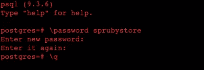
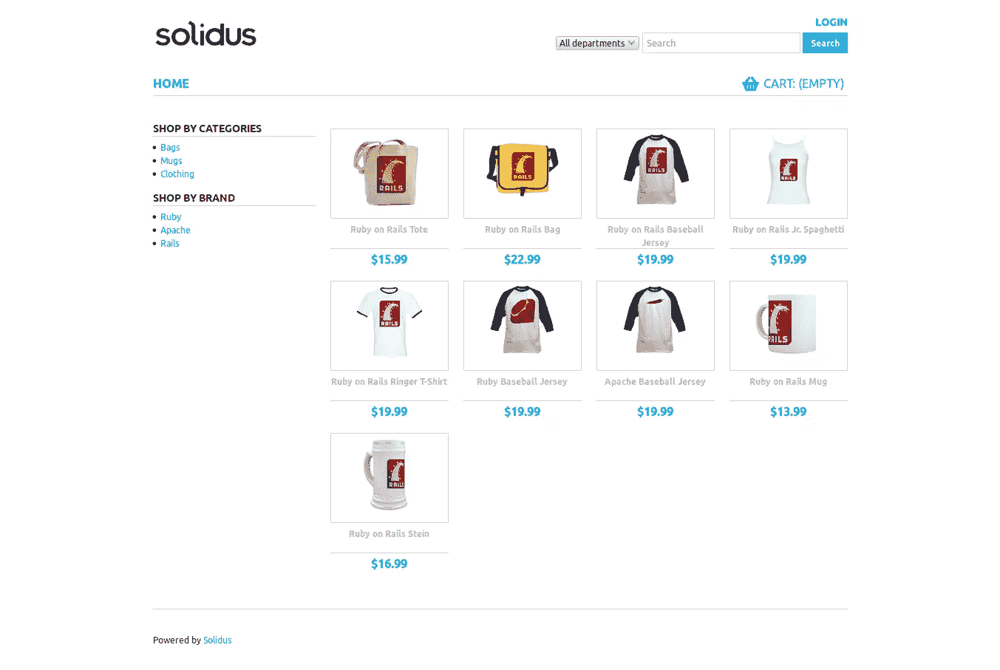
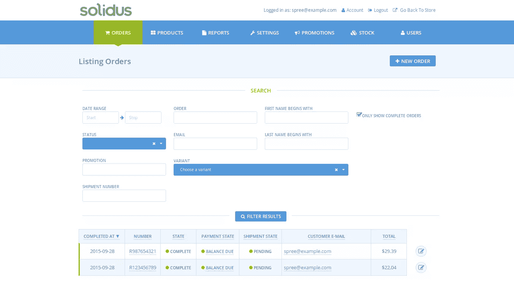
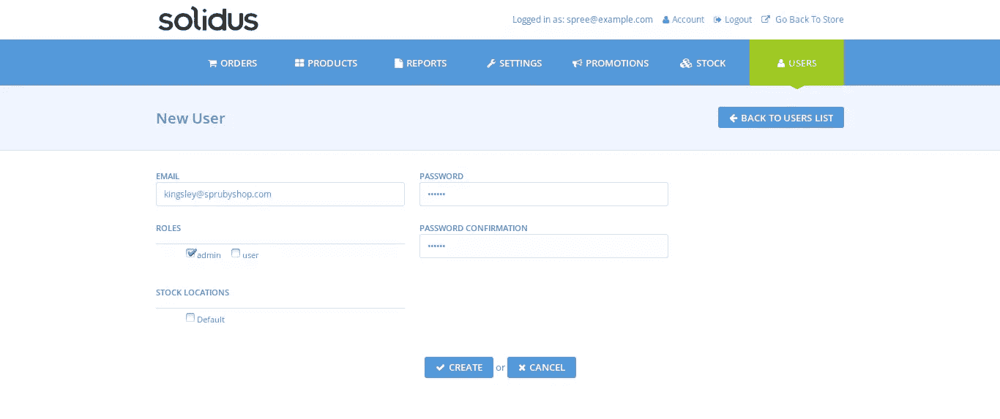
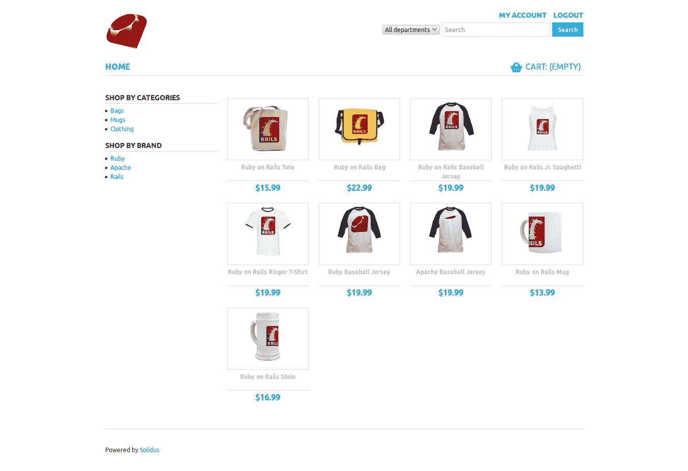
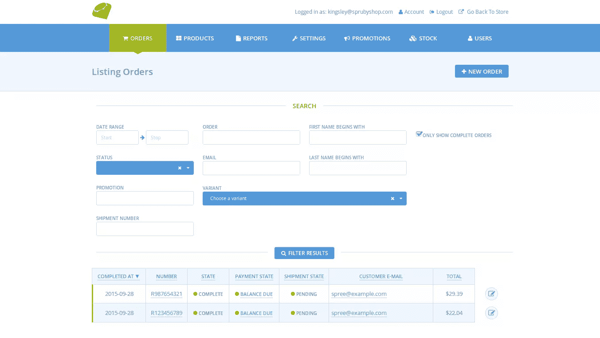

# 用 Solidus 点燃你的电子商务网站

> 原文：<https://www.sitepoint.com/fire-up-your-e-commerce-site-with-solidus/>


*这篇文章由[汤姆·帕金](https://www.sitepoint.com/author/tparkin/)进行了同行评审。感谢 SitePoint 的所有同行评审员使 SitePoint 的内容尽可能做到最好！*

几天前，施普雷的首席执行官肖恩·施菲尔德宣布第一数据公司收购施普雷。看来开源项目热潮[将不再得到支持](http://resolve.digital/blog/posts/spree-commerce-acquired-is-it-time-to-move-your-spree-store-to-solidus)。

Solidus 是一款面向大批量零售商的开源电子商务应用。这个可挂载的引擎使用 Ruby on Rails 构建，为在线商务提供了一个可伸缩的、稳定的、高度可定制的平台。它只是 Spree 2.4 的延续(意思是分叉)，没有新收购的 Spree Commerce 的商业方向

在本教程中，我们将学习安装 Solidus。

注意:我写这篇教程的时候用的是 Ubuntu 14.04。为了使用 Mac 的读者，在必要的地方添加了链接。

## 安装 PostgreSQL

我们将使用 PostregSQL 作为我们的默认数据库，重要的是我们已经安装了它。

对于 Mac 用户，请遵循这些说明[这里](http://www.gotealeaf.com/blog/how-to-install-postgresql-on-a-mac)。

对于 Ubuntu 用户，在终端中输入:

```
sudo apt-get update 
```

出现提示时，输入您的管理员密码。接下来，我们将使用以下命令安装 PostgreSQL:

```
sudo apt-get install postgresql postgresql-contrib 
```

这将安装核心 PostgresSQL 引擎和与数据库服务器一起工作的附加包。

现在，我们将创建一个用户，在本教程中，该用户将与我们的商店同名:

```
sudo -u postgres createuser sprubyshop -s
sudo -u postgres psql 
```

在 postgresql 提示符下，输入:

```
\password sprubyshop 
```

然后输入您的密码(您需要输入两次。)您现在可以使用`CTRL + D`退出。



## 生成 Rails 应用程序

打开您的终端并安装 rails gem，如果您还没有安装的话:

```
gem install rails 
```

这应该会安装最新版本的 Rails gem。我们现在可以生成我们的 Rails 应用程序了。从您的终端运行:

```
rails new sprubyshop -d postgresql 
```

这里我们要求 rails 生成一个名为“sprubystore”的应用，将默认数据库设置为 PostgreSQL。这将把`pg`宝石添加到我们的**宝石文件**中，并将其设置为默认数据库。这也意味着`sqlite3`不会出现在我们的 **Gemfile** 中。我们将 PostgreSQL 用于开发、测试和生产环境。这就是为什么我们之前经历了在机器上安装 Postgres 的压力。

这样，我们的商店应用程序就应该生成了。打开你的**宝石文件**，你应该在那里看到`pg`宝石。如果`sqlite3` gem 碰巧还在，就注释掉它。你的 **Gemfile** 应该是这样的:

*Gemfile*

```
source 'https://rubygems.org'

gem 'rails', '4.2.3'
gem 'pg'
gem 'sass-rails', '~> 5.0'
gem 'uglifier', '>= 1.3.0'
gem 'coffee-rails', '~> 4.1.0'
gem 'jquery-rails'
gem 'turbolinks'
gem 'jbuilder', '~> 2.0'
gem 'sdoc', '~> 0.4.0', group: :doc

group :development, :test do
  gem 'byebug'
  gem 'web-console', '~> 2.0'
  gem 'spring'
end 
```

接下来，我们需要编辑数据库配置。使用文本编辑器导航到 **config/database.yml** ，更改`test`和`development`选项，如下所示:

*config/database.yml*

```
test:
  <<: *default
  host: localhost
  database: sprubyshop_test
  username: sprubyshop
  password: sprubyshop

development:
  <<: *default
  host: localhost
  database: sprubyshop_development
  username: sprubyshop
  password: sprubyshop 
```

要创建数据库，请打开您的终端并运行:

```
rake db:create 
```

**注意:**如果您由于缺少 JavaScript 运行时而遇到错误，您可以将`therubytracer`添加到您的`Gemfile`中或者安装 NodeJS。出于本教程的目的，我们将推迟使用 NodeJS，您可以像这样安装它:

```
sudo apt-get install nodejs 
```

在 Mac 上，使用[自制软件](http://brew.sh/) ( `brew install nodejs`)

现在试着运行`rake`命令，它应该工作了，没有错误。

## 安装 Solidus

Solidus 工作需要 Imagemagick。你需要它来处理产品缩略图的生成。让我们安装:

对于 Mac 用户；

```
brew install imagemagick 
```

对于 Ubuntu 用户；

```
sudo apt-get install imagemagick 
```

现在是时候安装 solidus 宝石了。打开您的 **Gemfile** 并添加以下内容:

```
gem 'solidus'
gem 'solidus_auth_devise 
```

如您所见，我们将使用 Devise 进行身份认证。

运行`bundle install`来安装 gems。

安装完 gems 后，您必须运行生成器来创建必要的配置文件和迁移。

```
bundle exec rails g spree:install 
```

在安装过程中，您将被要求创建一个管理员用户:

```
Create the admin user (press enter for defaults).
Email [spree@example.com]:
Password [spree123]: 
```

现在只使用默认选项。

您可能在安装过程中注意到了一条警告:

```
[WARNING] You are not setting Devise.secret_key within your application!
You must set this in config/initializers/devise.rb. Here's an example:

Devise.secret_key = "b2e58acf575db38200dd2058ecd85539c8713c9f1efd45ad42c68c593c6cd4cb78e0d4388ce84672879c359212dedb4b73f3" 
```

解决这个问题很容易，在您的终端中输入以下命令:

```
rails g solidus:auth:install 
```

警告将再次弹出，之后将为 devise 创建一个配置文件。

太棒了。现在是时候检查我们的进度了。使用以下命令启动 rails 服务器:

```
rails server 
```

打开您的浏览器，指向`http://localhost:3000`看看我们有什么。



要查看管理仪表板，请将浏览器指向`http://localhost:3000/admin`


让我们看看管理仪表板是什么样子的。使用 Solidus 在安装过程中提供的默认详细信息登录。

```
Email: spree@example.com
Password: spree123 
```

Solidus 向您展示了电子商务商店的所有基本要求以及更多内容。“订单”部分处理来自客户的所有订单。“产品”面板只需几次点击，就能轻松管理产品。您还可以从“报告”面板生成报告。所有这些选项都显示在管理控制面板的右侧。

有一个[指南](https://guides.spreecommerce.com/user/)可以带你浏览这些选项。

## 添加新用户

我们不想使用默认的登录帐户。Solidus 为我们提供了一种简单的方法，只需几个步骤即可添加账户:



*   在管理面板中，点击屏幕右侧的**用户**。您将看到一个显示当前用户的屏幕，当前用户是默认用户。

*   点击屏幕右侧的**新用户**。

*   随意填写表格，点击**创建**。



现在注销 Spree 默认帐户，并使用您刚刚创建的详细信息登录。要删除默认的 Solidus 账户，从**用户**面板点击**用户列表**。您将看到所有可用的用户都列在那里。单击回收站图标可删除用户。

## 替换 Solidus 默认徽标

Solidus 有一个默认标志，你可以在商店的左上角看到。商店的主视图和管理员视图中都有该徽标。让我们看看如何改变这种情况。

使用文件资源管理器将您的徽标从您的商店主文件夹复制到`app > assets > images`。创建一个名为`logo`的文件夹，并将你的自定义徽标粘贴在其中。

仅仅这样做不会改变徽标，我们必须在配置文件中指定它。打开文本编辑器到**config/initializer/spree . Rb**。

更改下面的行:

```
#config.logo = "logo/solidus_logo.png"# 
```

让它看起来像这样:

```
config.logo = "logo/sprubyshop_logo.png" 
```

重新启动 Rails 服务器以更改徽标。我们不必为徽标指定路径，因为粘贴徽标的资产文件夹是默认路径。

管理员徽标也进行了类似的修改。要更改它，请编辑 **spree.rb** 中的下面一行:

```
config.admin_interface_logo = "logo/solidus_logo.png 
```

看起来像这样:

```
config.admin_interface_logo = "logo/sprubyshop_logo.png" 
```

**注**:我的 logo 名字是 **sprubyshop_logo.png**

你的 **spree.rb** 应该是这样的:

```
# Configure Solidus Preferences
# See http://docs.solidus.io/Spree/AppConfiguration.html for details

Spree.config do |config|
  # Without this preferences are loaded and persisted to the database. This
  # changes them to be stored in memory.
  # This will be the default in a future version.
  config.use_static_preferences!

  # Core:

  # Default currency for new sites
  config.currency = "USD"

  # from address for transactional emails
  config.mails_from = "store@example.com"

  # Uncomment to stop tracking inventory levels in the application
  # config.track_inventory_levels = false

  # When true, product caches are only invalidated when they come in or out of
  # stock. Default is to invalidate cache on any inventory changes.
  # config.binary_inventory_cache = true

  # Frontend:

  # Custom logo for the frontend
  config.logo = "logo/sprubyshop.png"

  # Template to use when rendering layout
  # config.layout = "spree/layouts/spree_application"

  # Admin:

  # Custom logo for the admin
  config.admin_interface_logo = "logo/sprubyshop.png"

  # Gateway credentials can be configured statically here and referenced from
  # the admin. They can also be fully configured from the admin.
  #
  # config.static_model_preferences.add(
  #   Spree::Gateway::StripeGateway,
  #   'stripe_env_credentials',
  #   secret_key: ENV['STRIPE_SECRET_KEY'],
  #   publishable_key: ENV['STRIPE_PUBLISHABLE_KEY'],
  #   server: Rails.env.production? ? 'production' : 'test',
  #   test: !Rails.env.production?
  # )
end

Spree.user_class = "Spree::LegacyUser" 
```

这是我的样子:

前视图:


后视图；


## 结论

Solidus 实际上由几个不同的 gem 组成，每个 gem 都保存在一个存储库中，并记录在一组在线文档中。通过要求 solidus gem，您自动要求所有必需的 gem 依赖项，它们是:

*   solidus_api (RESTful API)
*   solidus_frontend(购物车和店面)
*   solidus_backend(管理区)
*   solidus_core(基本模型、邮件程序和类)
*   solidus_sample(样本数据)

所有的 gem 都被设计成一起工作来提供一个全功能的电子商务平台。你可以在 Solidus Github 库上了解更多信息。

在本教程中，我们学习了如何安装 Solidus、添加新用户以及添加自定义徽标。我希望在以后的一两篇文章中介绍更多的定制内容。

谢谢你陪着我。随时欢迎反馈。

## 分享这篇文章