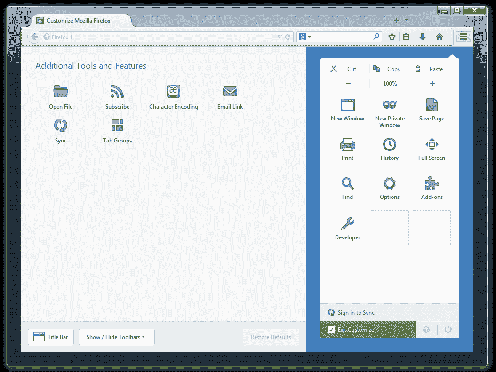

# Firefox 29: Mozilla 自 2011 年以来最大的浏览器升级？

> 原文：<https://www.sitepoint.com/firefox-29-mozilla-browser-upgrade/>

火狐 29 于 2014 年 4 月 29 日发布。这个数字可能看起来不重要，但这是自 2011 年 3 月发布的火狐 4.0 以来最大的一次更新。那个版本受到速度问题和插件不兼容的困扰——*Mozilla 从他们的错误中吸取教训了吗？…*

## 新澳大利亚主题

它已经被推迟了几次，但新的火狐主题已经到来。

乍看之下，它和 Chrome 有着相似的圆形标签和汉堡图标，但你很快就会发现不同之处。

主菜单是一组类似 Android 版本的图标。单击这些按钮会导致子菜单滑出。然而，它的可定制性更强，图标可以移动到任何地方——甚至是经典的菜单和工具栏(除了已经废弃的附加栏)。唯一不能移动的东西是汉堡包本身；这是一个有点不寻常的决定，因为用户已经点击左上角的菜单三年了，并且可能更喜欢它。

各个选项卡由一条细微的线隔开，只有活动选项卡具有明显的圆形外观。我喜欢这个概念，而且更容易找到你正在使用的标签。我唯一的批评是它们有点太圆了，与方形的地址和搜索框明显不同。Mozilla 抵制了像其他厂商一样合并这两个盒子的诱惑——我不能说这让我感到困扰。

澳大利亚有怪癖。我还不确定这是一个改进还是简单的不同，但增强的定制是受欢迎的。如果你不喜欢它，安装[经典主题恢复插件](https://addons.mozilla.org/en-US/firefox/addon/classicthemerestorer/)，你将回到你开始的地方。

最后，我喜欢与浏览器界面互动的[产品之旅](https://www.mozilla.org/en-US/firefox/29.0/whatsnew/)——我很想知道这是怎么做到的。

## 新的 Firefox 同步

Firefox 可以跨桌面和移动设备同步打开的标签、浏览历史、书签、密码和表单数据。或者应该如此。我经常遇到问题，配对过程可能很麻烦，而且它从来没有像 Chrome 那样无缝。

同步系统已经彻底检修过了，你现在需要一个 Firefox 帐户，并有一个经过验证的电子邮件地址和密码。(我不得不等了半个小时才收到验证邮件，所以可能会有一些初期问题。也许 Mozilla 应该采用谷歌、推特或脸书的第三方账户，但这比以前好了。

旧的同步将继续工作一段时间。要进行切换，您需要解除所有设备的配对，并使用 Firefox 29 注册一个新的同步帐户。

## HTML5 更新

出现了一些小的改进…

*   支持`input type="number"`。
*   对`input type="color"` *的支持(有人需要过这个吗？)*

但是桌面浏览器上仍然没有日期控制——真遗憾！

## CSS 更新

`-moz`前缀终于从`box-sizing`属性中删除了。我不确定为什么花了这么长时间；几乎每个响应性布局都使用该属性，甚至 WebKit 也去掉了前缀！其他次要更新包括:

*   `border-image`支持`<gradient>`的图像类型。
*   Flexbox 布局现在可以使用`visibility: collapse`。
*   一个新的`will-change`属性提示什么时候会有动画。必须在 about:config 中通过将**layout . CSS . will-change . enabled**设置为 **true** 来启用。
*   原生 CSS 变量作为一项实验性技术是可用的。要启用它们，请在 about:config 中将**layout . CSS . variables . enabled**设置为 **true** 。

## JavaScript 更新

有几个新特性让 JavaScript 开发人员垂涎三尺:

*   [承诺](/overview-javascript-promises/)默认启用
*   [共享 Web Workers](/javascript-shared-web-workers-html5/) 已启用。
*   游戏手柄 API 已经完成并启用。这在早期版本中应该会发生，但现在肯定会发生。
*   支持 [ECMAScript 国际化 API](http://www.ecma-international.org/ecma-402/1.0/) 。
*   由`JSON.parse()`解析的格式错误的 JSON 字符串现在返回更详细的错误消息，包括行号和列号。

## 开发人员工具更新

开发人员工具发展迅速，有几个令人惊叹的新特性…

*   网络监视器显示饼图，说明所有资源的数量和大小，以及空缓存和已填充缓存的计时。
*   控制台在显示方面有几处改进，比如内联显示数组。
*   将鼠标悬停在属性上，可以在检查器中获得 CSS3 变换预览。
*   web 工作者现在可以使用这个 API 了。
*   样式编辑器支持 CSS 属性自动完成和源映射。

## 杂项更新

火狐速度不减。它在 Windows 上运行很快已经有一段时间了，但 Mac 版本感觉也更好。内存管理一般比其他浏览器要好。

除了常见的[安全补丁](https://www.mozilla.org/security/known-vulnerabilities/firefox.html)，我们还收到了:

*   Android 上新的快速分享按钮。
*   [Open Web App](https://hacks.mozilla.org/2014/03/better-integration-for-open-web-apps-on-android/) 在移动设备上的集成得到了改进。
*   单击 Web 通知将切换到原始选项卡。
*   马来本地化。

Firefox 29 是一段时间以来对任何浏览器最重要的升级。(我没有把 Opera 切换到 Blink 计算在内——那是一个新的浏览器，而不是更新！)

不是每个人都会喜欢这个新主题，一些插件肯定会坏掉——开发者应该咨询澳大利亚和插件兼容性。也就是说，我没有遇到问题，升级和以前的版本一样顺利。

我不相信这些变化会扭转 Mozilla 市场份额的缓慢下降，但 Firefox 29 仍然是你买不到的最好的浏览器之一。它看起来很棒，并提供了几个独特的功能。试试看。

## 分享这篇文章