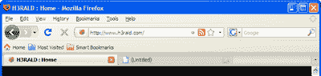
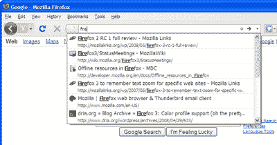
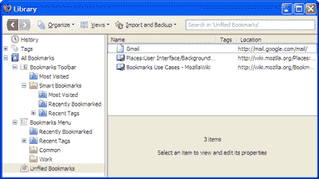
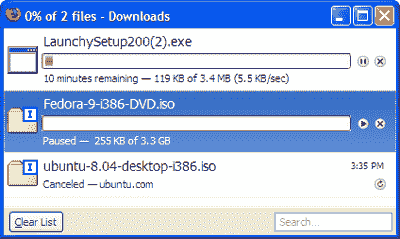
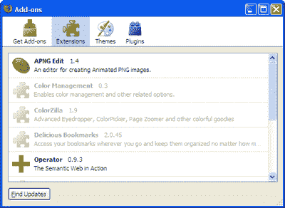
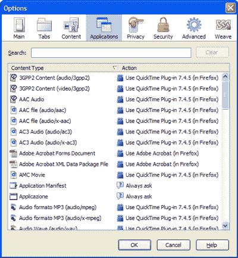
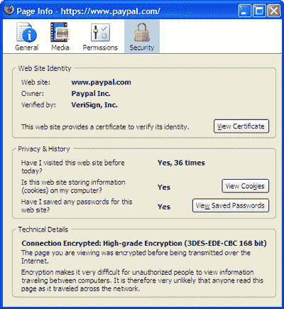
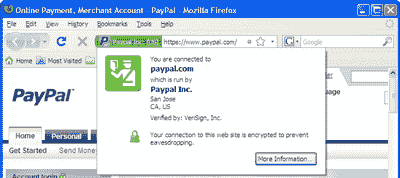
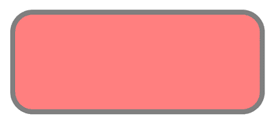
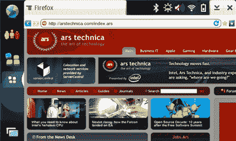

# 火狐 3:什么是新的，什么是热门的，什么不是

> 原文：<https://www.sitepoint.com/firefox-3-whats-new-whats-hot/>

欢迎来到火狐 3！备受好评的 Firefox 网络浏览器的第三个主要版本发布了。虽然有点晚，但这个版本实际上是开源历史上的另一个重要篇章:Firefox 3 确实比它的前辈好得多(是的，所有的前辈！).

如果你对 Firefox 2 不太满意——许多人很快就厌倦了它的缓慢、不吸引人的外观和简单的界面(也就是说，没有安装扩展)——你会很高兴地发现 Firefox 3 快得多，看起来更现代，并有很多新的、非常有趣的功能。大量用户(包括我)因为无法忍受火狐 2 严重的内存问题，最终转用了 Opera 等另一款浏览器。然而，不同的浏览器有不同的问题，虽然我学会了享受 Opera 极快的响应和方便的内置功能，但我无疑错过了 Firefox 的一些扩展。火狐 2 用户的共同诉求包括:

*   要是火狐能更快就好了…
*   要是火狐不吃掉这么多内存就好了…
*   要是这个或那个能改进就好了…

好吧，看起来 Mozilla 开发者真的听取了他们用户的意见，最终产品确实值得称赞。让我们找出原因。如果你渴望离线阅读这篇文章，你可以[在这里](https://www.sitepoint.com/books/firefox3/)下载 PDF 格式的文章。

##### 简化的用户界面

即使许多新功能实际上是“隐藏的”，火狐 3 在许多不同的方面看起来肯定是不同的。有一个新默认主题(对不起，是四个默认主题)，还有大量 GUI 改进。

***视觉刷新***

如果你已经试用过 Firefox 3——你现在应该已经试用过了——你首先会注意到的是它新的默认主题。不管你运行的是哪种操作系统，它确实是不同的。

Alex Faaborg 在关于 Firefox 3 视觉刷新的文章中写道:

“我们之所以要如此关注与各种平台的可视化集成，是因为网络浏览器是用户操作系统的核心部分，我们不希望用户的第一反应是他们已经修改了他们的计算机，添加了某种奇怪的外国应用程序。”

虽然这一评论可能让一些用户感到高兴，但我对默认的 Windows XP 主题并不太满意，如图 1 所示，“Windows XP 的新 Firefox 3 主题”——它根本不像是与操作系统集成在一起的！如果将 Windows XP 主题与 Windows Vista 主题进行比较，唯一真正的区别是箭头的颜色:蓝色代表 Vista，绿色代表 XP。显然图标是由 Iconfactory 设计的(Windows XP 和 Vista 的图标也是如此)。



另一方面，他们在默认的 Mac OS X 主题上做得非常棒:它看起来或多或少像一个原生的 Mac 应用程序，即使小图标模式有点太类似于 Safari 的。

Linux 呢？它没有被忽略 Tango 主题在 Ubuntu 上看起来很完美，尽管我还没有在 KDE 的 windows 管理器上测试过。

虽然有些主题确实做得很好，但我并不完全理解此举的必要性。没有人会为此烦恼:Safari 甚至在 Windows 上使用了相同的 Mac 皮肤！当然，有些人更喜欢集成操作系统的外观和感觉，但即使是 Opera 也提出了新的、闪亮的、跨平台的鲜明主题。但是，就像他们说的，你不能争论味道。

***牛人***

还记得你第一次使用火狐浏览器的搜索栏吗？你只需在谷歌、雅虎或任何其他搜索引擎中输入你想要搜索的单词，按下回车键，相应的搜索结果页面就会自动为你加载。这个功能是一个简单但非常强大的概念，现在是每个主流浏览器的重要组成部分。

你能想象现在不用搜索栏使用浏览器吗？除非它能提供一些等效的、可能更有用的东西，比如 K-Meleon 的 Ctrl-G，让你从地址栏启动谷歌搜索，否则你当然不能这么做。

当我在 Firefox 3 中尝试新的导航栏时，我有一种似曾相识的感觉，如图 2 所示，“Firefox 3 AwesomeBar in action”，由于其独特和非凡的多功能性，它立即被称为 AwesomeBar。

这个想法看起来很简单(至少对用户来说是这样的):在 Firefox 栏中添加“键入即搜索”功能，浏览 Firefox 历史记录和书签中的所有条目。正如爱德华·李(Edward Lee)去年在他的文章中所描述的那样，不那么简单的是得出实际上有意义的结果:

Firefox 会记住你输入的文本和你选择的页面，所以下次当你输入类似的内容时，Firefox 会给这些页面更高的排名。它甚至可以匹配部分输入，所以我甚至可以只输入 planet 中的“p”，Firefox 知道将它放在恰好也匹配“p”的其他页面之上……



现在，这个特性真的很有用。简而言之，这就是新的 AwesomeBar 让你做的事情:

*   键入时在历史记录和书签中搜索任意单词组合。
*   通过在搜索词前分别加上“*”、“^”或“+”，将您的搜索限制为书签、历史记录或标记页面。
*   通过用双引号将单词括起来来匹配整个短语。
*   提供按频率和新近度排序的搜索结果。

与竞争对手提供的替代产品相比，Firefox 提供的智能搜索功能似乎更先进、更有用。Opera 9.5 在地址栏中提供了集成的历史搜索，但我必须承认 AwesomeBar 让它相形见绌。

***新增地方***

当我发现 [del.icio.us](http://del.icio.us/) 时，我开始慢慢地将我看似无穷无尽的火狐书签列表转移到云端。当雅虎为 Firefox 发布其官方 del.icio.us 扩展时，我完全忘记了 Firefox 书签，我仍然很满意我的选择。

Firefox 3 通过引入[位置](http://wiki.mozilla.org/Places)，将基于浏览器的书签提升到了一个全新的水平，这一特性在图 3“用 Firefox 3 的位置存储书签”中进行了演示。



地点功能提供了一个单一的界面来组织你的历史和你的书签。这个界面(可通过**书签>组织书签**访问)包含了许多新功能:

*   现在，您可以通过拖放将访问过的页面直接移动到书签文件夹中，并将其提升为书签(当然，您不能反过来做)。
*   您可以在键入时搜索书签和历史项目，并通过在页面标题、访问日期和位置上定义匹配规则来执行高级搜索查询。
*   您可以将搜索查询保存为永久搜索文件夹。
*   您可以通过指定逗号分隔的标签列表来标记您的书签。
*   您可以通过三个“智能文件夹”访问最近的书签和标签以及最常访问的书签
*   你只需点击一下，点击地址栏中的星号，就可以为一个页面添加书签。要指定文件夹和标签，并更改标题，只需再次单击星号。
*   您可以通过一个方便的下拉菜单备份和恢复您的书签；此外，没有必要再备份你的书签，因为它们每天都会自动备份。
*   您可以通过控制要显示的字段以及应用不同的排序标准来自定义查看书签和历史项目的方式。

就我个人而言，我想不出还有什么能改善你在 Firefox 中的书签体验。也许更好的 del.icio.us 整合？没有必要:新的官方 del.icio.us 扩展与 Firefox Places 完美集成，并允许您——除其他外——只需单击一下即可将您的本地书签导入 del.icio.us。

此外，有传言称 AwesomeBar 可能会在 Firefox 的未来版本中取代搜索栏。

***下载管理器***

你试过用火狐 2 下载一个大文件吗？我照做了，半小时后发现文件因为出现错误无法下载，我后悔了。当然，因为 Firefox 2 的下载管理器不支持恢复，即使 FTP 服务器支持，我也别无选择，只能用第三方下载管理器重启下载。

幸运的是，这个问题现在已经成为过去:新的下载管理器终于名副其实了！如图 4 所示，“新的和改进的 Firefox 3 下载管理器”。

首先，它允许你暂停下载，稍后再继续，即使你同时退出了 Firefox。跨会话恢复可能是 Firefox 下载管理器最期待的改进，现在它只是像每个人期望的那样工作。



但是还有更多:

*   状态栏中会显示当前正在下载的所有文件的摘要以及预计的下载时间。如果您单击此文本，您将打开下载管理器，而不必浏览工具菜单。
*   只需在下载管理器右下角的搜索框中输入文本，就可以搜索您最近下载的文件名。
*   会自动显示几个按钮来暂停、继续、取消和重新开始下载。
*   下载管理器现在与安装在您计算机上的第三方防病毒程序集成在一起，因此您下载的每个文件都将被自动扫描，以获得额外的安全性。

***附加经理***

类似地，如图 5 所示的附加组件管理器“Firefox 3 中的附加组件管理器”也得到了改进。现在，它的顶部有四个按钮，用于加载四个不同的视图:

**获取附加组件**
推荐的附加组件列表现在会自动显示(并更新)在该视图中。这意味着你可以安装你喜欢的插件，而不必去 Mozilla 插件网站。它甚至可以让你直接搜索插件！

扩展
这里没有什么新的东西——只是一个当前安装的扩展列表。通过这个界面，可以设置每个扩展的选项，禁用和卸载它。

**主题**
主题视图显示当前安装的主题；它让你选择一个主题，并卸载以前安装的主题。

**插件**
这个是新的——最后是你所有插件的列表(Flash，Acrobat，Java 等。)可以被最终用户轻松访问，而无需在地址栏中键入`about:plugins`。也可以从这个视图中有选择地禁用特定插件。



这一切都很好，但杀手级功能尚未发布。目前，当你安装一个插件时，仍然需要重启浏览器。显然，这个功能是计划好的，但没有成功，因为它涉及的核心变化太具侵入性。

Opera 不要求你一旦安装了新的主题就重启浏览器，当然 Opera 也不支持插件。如果你只是想更新当前火狐主题的设计，你可以随时使用[人物角色](http://labs.mozilla.com/2007/12/personas-for-firefox/)，毕竟！

***选项对话框***

选项对话框也做了一些相关的修改(仍然可以通过**工具>选项…** 访问)。如图 7 所示，“Firefox 3 的新页面信息对话框”，首先要注意的是用于顶部按钮的新的操作系统相关图标集。然而，如果你更仔细地看，你会看到一个新的应用程序按钮已被添加。

“应用程序”标签允许你自定义 Firefox 处理已知文件类型和协议的方式。



该视图分为两列，第一列列出内容类型，而另一列显示访问特定内容类型时要执行的操作。最大的改进是，现在不再需要通过 about:config 设置来设置内容句柄:现在，您可以使用 GUI 浏览一组特定的预定义操作。

实际上，我对该应用程序的 GUI 的精致程度印象深刻——在这个版本中，它比 Opera 的要精致得多。Firefox 会尝试找到一个合适的插件(如果安装的话)来处理文件内容，但是你也可以通过一个对话框来选择你最喜欢的应用程序，这个对话框会显示所有可以打开特定文件类型的已安装应用程序。

此外，如果你愿意，你可以设置动作为总是询问你是否希望 Firefox 显示通常的打开/保存对话框。除了文件操作，您还可以为常见的 Internet 协议和服务处理程序(如 mailto、webcal 或 web feeds)设置默认操作。也可以选择一些默认的在线应用。例如，对于 web 提要，可以指定 Bloglines、Yahoo 或 Google。如果您的在线应用程序没有列出，该怎么办？运气不好。显然，您必须像过去一样完成通常的 about:config 设置。不幸的是，这也适用于 mailto 处理程序，默认情况下只提供 Yahoo Mail。如果你想使用 Gmail，你可能想在 [LifeHacker](http://lifehacker.com/392287/set-firefox-3-to-launch-gmail-for-mailto-links) 上查看如何使用。

其他微小但仍有价值的改进包括:

*   在搜索浏览器的 cookies 内容时，您可以使用“键入即搜索”功能。这可能非常方便，但不幸的是，搜索是在 cookie 内容上执行的，而不是在域上执行的，因此，如果您键入 google，您会得到很多结果(即，任何 cookie 的内容中都有“google”，并且有很多)。
*   在“高级”标签中，可以查看 Firefox 更新的历史，并配置浏览器检查更新的方式。

***页面信息对话框***

旧的页面信息对话框在这个版本的 Firefox 中经历了一次重大的革新，如图 Firefox 3 的新页面信息对话框”所示。它以一些漂亮的图标代替了标签，现在可以通过以下方式访问:

*   **工具>页面信息**–一如既往
*   地址栏–只需点击新的“身份按钮”即可打开身份覆盖对话框，然后点击更多信息…你将被直接带到**页面信息>安全**标签

但是，为什么要频繁访问页面信息呢？因为它当然能做出惊人的事情！也许最重要的新功能是通过 Permissions 选项卡保存特定于站点的首选项的能力。更具体地说，添加了以下特定于站点的设置:

*   加载图像
*   打开弹出窗口
*   设置 Cookies
*   安装扩展或主题

然而，Firefox 实际上所做的不过是为当前网站设置一个适当的异常(这将立即出现在**选项>内容>【特定内容类型】异常**)。就这些吗？是的，就这些，但是相信我，这可以节省很多时间。



在“安全”选项卡中也可以发现类似的行为——单击“查看 cookie”和“查看密码”会分别将您带到 cookie 和密码管理器，但是已经为当前域名设置了过滤器。现在你意识到为什么 Mozilla 开发者在任何地方都实现了搜索过滤器——他们提供了一个非常智能和优雅的解决方案，以一个价格提供了两个新功能。

***几件小事……***

此外，GUI 中还改进或添加了一些小但仍然重要的东西:

*   不连续的文本选择，就像在 MS Word 或 MS OneNote 和其他花哨的 office 程序中一样
*   整页放大:不仅可以“适当地”放大文本，也可以放大图像。此外，Firefox 会记住您为特定页面设置的缩放级别(尽管页面实际上会在加载后的几分之一秒内调整大小)
*   通过鼠标滚轮实现更平滑的标签滚动
*   选项卡克隆——只需拖动一个按住 **Ctrl** 的选项卡来复制它，而不是移动它
*   可调整大小的搜索栏–只需拖动地址栏和搜索栏之间的分隔符
*   “真正的”全屏可以通过简单地按 F11 键来访问(甚至地址栏和标签都将被隐藏！)

这就是用户界面。好吧，它看起来很漂亮，也更实用，但是引擎盖下面呢？在下一节，我们将看看新火狐的一个关键部分——安全性。

##### 安全性

安全性一直是 Mozilla 基金会的主要关注点之一。事实上，火狐最常见的营销口号之一是“更安全地浏览网页”

***网站识别***

Firefox 3 比以前版本的浏览器提供了更多面向安全的功能。每当您访问通过 SSL 证书进行鉴定的网站时，如果证书有效并经过验证，您将会在地址栏中站点图标旁边的绿色背景上看到拥有该站点的组织的名称。

参观 paypal.com，亲自体验一下。单击新的“识别网站”图标(地址栏旁边的图标)将打开一个覆盖对话框，显示有关网站所有者和验证其身份的机构的更多信息。此外，将显示一个显示护照官员的绿色图标，如图 8“使用 Firefox 的新网站识别功能”所示。这是火狐用来表示“这个网站是安全的，继续浏览”的信号就我个人而言，我会选择一个不那么俗气的形象，但这一个肯定做的工作。



如果您对网站提供的信息仍不满意，您可以点击**更多信息……**按钮，进入**页面信息**对话框的**安全**标签，在这里可以查看网站的安全证书、cookies、技术细节等。

如果您访问的网站没有 SSL 证书，地址栏中的图标旁边不会显示名称，背景也保持灰色。单击它将显示一个覆盖对话框，表明该网站不提供身份信息。

如果您访问一个与使用 https 协议的安全证书相关联的网站，情况会略有变化，但是证书有问题(通常它已经过期:这甚至可能发生在企业内部网站点上)。当你访问这样的网站时，该网站不会显示，而会显示一个标准的 Firefox 错误页面。信息显示“安全连接失败”，并伴随着通常的警察图标，这次是黄色背景。

显然没有办法查看你试图访问的网站(当我试图在工作中访问我们的一个内部网站时，吓死我了！).幸运的是，如果你点击或者你可以在对话框底部添加一个**异常…** 链接，你可以选择是否**离开这里…** (是的，它字面上是这么说的)。这样做会让你回到标准的 Firefox 起始页，或者提示你添加一个例外。

事实证明，如果你经常浏览那些安全证书过期的网站，因为没有人愿意支付每年的更新费用，这是一个非常有用的功能:一旦你添加了一个例外，你就可以在没有任何警告的情况下浏览网站——这是 Firefox 2 和 IE 7 都不允许你做的事情。

添加异常相对来说比较容易:

1.  点击**添加例外…** 按钮。

3.  在**添加安全异常**对话框中，点击**获取证书**按钮。

5.  检索到证书后，您可以点击**查看**按钮查看证书。

7.  点击**确认安全异常**(默认情况下，永久保存该异常复选框处于启用状态)。

关于 Firefox 3 中网站识别的更多信息，请查看 Deb Richardson 的博客文章(它也包含了对每个“护照官员”图标的精确解释)。

***密码管理***

Firefox 3 中另一个与安全相关的改进是密码管理系统。Firefox 2 存储和管理密码的方式有什么问题？让我想想…

*   在提交凭证之前，一个令人生厌的对话框会询问您是否要保存刚才提供的凭证。由于这个特性，我存储的不正确密码的数量高得令人尴尬。
*   如果您想要查看特定站点的密码，要么您记住了该站点的确切 URL，要么您必须手动向下滚动存储有密码的站点列表。

这两个问题已在 Firefox 3 中得到修复:

*   密码对话框不再是模态的。相反，它们从页面顶部滑下，让你继续浏览。此外，它们足够智能，只有在你真正登录后才会出现。
*   保存的密码对话框中增加了搜索功能。多么棒的想法:一个简单的改变，节省了用户宝贵的时间。

还有什么需要改进的？嗯，内置[安全登录扩展](https://addons.mozilla.org/en-US/firefox/addon/4429)会很好，也许在地址栏有一个图标(你可以在里面做几乎任何事情，[甚至发布到 Twitter](https://addons.mozilla.org/en-US/firefox/addon/4664) )。

现在我们已经探索了 Firefox 3 比其前身更安全的方式，让我们看看它的表现如何。

##### 表演

火狐 3 明显比它的前辈更快更轻便。这不是通常的“这是迄今最快的 Firefox”声明:在这个版本中，浏览器终于变得可用，而不是成为内存猪。我并不苛刻:这可能是自 Firefox 1.5 问世以来，我和许多其他用户对浏览器的最大抱怨。

最后，一切似乎都快如闪电:

*   它会…呃…立即启动——这意味着 Opera 和 Safari 在启动时仍然更快，但你不必等待半分钟就能让 Firefox 最终复活。
*   “高度 Ajax 化”的页面要快得多 Gmail 的速度给我留下了特别深刻的印象:例如，当你存档电子邮件时，你真的不必等待超过一秒钟。
*   你可以让 Firefox 3 运行几个小时，而不会让它越来越多地占用你的内存。

这是一个简短的故事，从日常用户的角度来看。

***内存管理改进***

事实上，Firefox 开发者这次确实做得很出色。pavlov.net 上有一个非常有趣的帖子详细解释了所做的事情。

Firefox 2 的内存问题很明显，至少部分是由于内存碎片造成的。这类似于安装和卸载程序时影响硬盘内存的现象:您的磁盘变得碎片化，这会降低性能。类似的事情也发生在 RAM 上，只是在 Firefox 的情况下，每当你在标签页中打开和关闭网页时都会发生:每当加载一个新页面时，如果它比堆中最大的空间大，它就放不下；该程序的唯一解决方案是增加堆的大小。

幸运的是，je malloc(FreeBSD 使用的同一个内存分配器)的采用减少了内存碎片，并且显然导致 Firefox 使用的内存总量下降了 22%(至少在 Windows Vista 上)。

内存管理的另一个重要改进是引入了一个新的“周期收集器”,当两个对象不再被使用时，它会自动中断它们之间的相互引用。这一点，加上其他调整，如改进火狐缓存的过期策略和优化图像存储，都有助于成功控制浏览器之前的内存使用问题。

***真正快速的 JavaScript 执行***

除了改进内存管理，Firefox 开发人员还努力提高 JavaScript 性能。根据一些人进行的基准测试，在执行 JavaScript 代码时，Firefox 3 似乎比其前身快得多。大多数基准测试是使用 [WebKit 的 SunSpider JavaScript 基准测试](http://webkit.org/perf/sunspider-0.9/sunspider.html)进行的，在大多数测试中，Firefox 似乎比其主要竞争对手(Opera 9.5 beta、Safari 3.1 beta 和 Internet Explorer 8 beta)表现更好。

当然，基准测试不应该太认真，但就个人而言，我注意到，例如，Gmail 和 Google Reader 等网站在 Firefox 3 中似乎比 Opera 9.5 测试版更快。尝试在 Firefox 3 中使用 Gmail:当执行“简单”的 Ajax 调用来存档或加载电子邮件时，几乎没有延迟。

***开罗***

我记得当我安装 Firefox 3 的第一个测试版本时:网站上大约 70%的文本似乎没有明显的原因就失去了清晰和抗锯齿的效果。发生这种情况是因为当时 Firefox 使用的是未打补丁版本的 Cairo 图形库 T1，它在 LCD 显示器上运行得不是很好。但是在火狐 3 RC1 版中，这个问题已经解决了。

尽管最初存在一些问题，但 Cairo 与 Firefox core 的集成给双方用户都带来了不少好处，即:

*   硬件加速的 2D 图像渲染
*   更少的图形渲染错误
*   更好看的图形

此外，Gecko 开发人员不必太担心维护与图形相关的代码，因为他们的大部分负担将由 Cairo 的开发团队承担:这似乎是开源模型的另一个非常重要的胜利，这是肯定的。

***回流重构***

不过，Cairo 并不是 Firefox 渲染方面唯一的重大变化。Firefox 3 推出了全新的 Gecko 布局引擎(仍是测试版)。Gecko 1.9b 引入了许多领域的改进，但所谓的“回流重构”似乎是最显著的改进之一。

在 CSS 2.1 规范中已经定义了回流的概念，以指示浏览器应该在网页上定位元素的方式。更具体地说，早期版本的 Firefox 在浏览器执行增量回流的方式上遇到了很多错误，即在页面加载时重新定位页面上的元素。

在某些元素(如表格和图像)的宽度没有定义或没有通过百分比定义的页面上，增量重排问题通常是显而易见的。在这种情况下，浏览器会根据页面上的其他元素执行增量重排来确定正确的宽度。这些 Bug 中最著名的是出现在 Firefox 0.8 中的 [Slashdot 渲染 Bug](http://www.deftone.com/blogzilla/archives/firefox_and_rendering_slashdot.html) 。这导致 Slashdot 网页上的文本呈现不正确。

显然，在过去几年中，发现(并修复)了不少类似的错误，它们都是由 Gecko 引擎执行增量回流的方式引起的。关于这种情况更详细的解释，请参考 Mozilla wiki 的 [reflow refactoring 页面。这是一篇非常有趣的文章，但对于普通读者来说也有点技术性，因为它详细提到了各种实现方面。](http://wiki.mozilla.org/Gecko:Reflow_Refactoring)

真正重要的是，截至火狐 3，很多(全部？)与增量回流和固有宽度相关的错误得到了修复，浏览器现在能够更一致地显示页面元素，并且通过了 [Acid 2 测试](http://www.webstandards.org/files/acid2/test.html)。
与 Opera 和 Safari 开发者不同的是，Firefox 开发者并没有真正尝试构建浏览器来通过 Acid 3 测试，主要原因是 Firefox 3 发布的时间太近了，以至于不愿意为此费心。

***颜色简介***

设计师们会很高兴(也可能不高兴)发现火狐 3 支持[颜色配置](http://en.wikipedia.org/wiki/Color_profile)。这意味着 Firefox 现在能够以正确的颜色呈现图像(尤其是图片)，例如，当它们在专业的照片编辑程序(如 Adobe Photoshop)中查看时。Deb Richardson 写了一篇关于这个新的隐藏功能的非常[有趣的文章，值得一读。](http://www.dria.org/wordpress/archives/2008/04/29/633/)

可以通过安装[色彩管理扩展](https://addons.mozilla.org/en-US/firefox/addon/6891)或者编辑 about:config 页面中的两个设置来启用色彩支持(如果你知道你在做什么)。

这项功能对 Flickr 用户和摄影师来说是一件好事，但其他人可能不太愿意启用它，因为有两个重要的权衡:

*   它会影响浏览器的渲染速度(变慢 10-15%)。
*   插件不支持颜色配置文件，这可能会破坏某些网页的颜色匹配(设计师，小心！).

这些就是默认情况下禁用该功能的原因(也是我打算暂时禁用浏览器中的色彩管理扩展的原因)。

##### 开发者的梦想

如果你认为这个新的 Firefox 版本是关于用户界面改进和性能的，那你就错了。这可能是 Mozilla 基金会迄今为止发布的最引人注目的面向开发者的版本:Firefox 3 附带的开源 API 和开发者好东西的数量是前所未有的，令人印象深刻。

***CSS 改进***

Firefox 3 提供了更高的 CSS 2.1 支持。许多与 CSS 相关的错误已经被修复，并增加了一些新功能。

凯文·杨克写了一篇关于火狐 3 的两个新 CSS 特性的[信息帖子](https://www.sitepoint.com/two-hidden-features-new-in-firefox-3/):它支持`&shy;` HTML 实体(或“软连字符”)，以及内嵌块显示类型。

软连字符可以用来告诉浏览器在什么地方可以断字，这个特性对于那些不能用连字符连接的长单词特别有用。显然 Firefox 是唯一不支持这一功能的主流浏览器，所以从现在开始使用软连字符是可能的，也是相对安全的。

另一方面，IE7 不支持 display 属性的 inline-block 值，所以您仍然需要采取预防措施(例如为“其他”浏览器创建一个单独的样式表)，但这仍然是一个很酷的特性:如果元素的 display 属性设置为 inline-block，则该元素将被呈现为 inline，但其内容将被呈现为 block。更多细节和例子，请查看 Kevin 的帖子。

其他 CSS 改进包括:

*   通过`rgba()`和`hsla()`对颜色属性的颜色半透明支持
*   现在也可以在非 Windows 平台上运行
*   属性将表单字段的默认状态设置为正常、活动、非活动或禁用
*   属性来指示 Gecko 引擎呈现优化速度、易读性或几何精度的文本(参见 Mozilla 开发者网站上的一些[示例)](http://developer.mozilla.org/samples/cssref/text-rendering.html)
*   `:default` CSS 选择器，用于设置相似元素的默认属性。对于其他 CSS 选择器，你必须等到火狐 3.1，[大卫巴伦报道](http://dbaron.org/log/20080603-new-selectors)。
*   将内容和光标设置为无的能力
*   支持负 z 索引值(终于！)

***JavaScript Goodies***

Firefox 3 支持 JavaScript 1.8，其中包括一些有趣的新优势，例如:

*   表达式闭包；我们现在可以写`function(x) x * x`而不是更冗长的`function(x) { return x * x; }`
*   生成器表达式；不再需要像在 JavaScript 1.7 中那样创建定制的生成器函数
*   `reduce()`和`reduceRight()`方法；这些函数让数组在数组的所有元素上运行一个函数，收集以前调用的结果

前往 Mozilla for Developers 网站了解更多详情。

然而，真正起作用的是 Mozilla 开发者发布的新 API 和接口的数量。

Firefox 用户扩展库(FUEL) 包括一组非常有用的对象，它们将简化那些想要开发 Firefox 扩展的人的生活，例如:

*   `Annotation`对象，存储关于网页的自定义数据
*   `Bookmark`、`BookmarkFolder`和`BookmarkRoot`对象，用来处理书签
*   `BrowserTab`对象，控制浏览器标签，它们的状态和内容
*   `Console`对象，向 Firefox 错误控制台发送消息
*   `Events`、`EventItem`和`EventListener`对象管理浏览器事件
*   `Extension`和`Extensions`对象，用于访问当前安装的扩展
*   `Preference`和`PreferenceBranch`对象，用于访问 Firefox 选项
*   `Window`对象，用于管理浏览器窗口及其标签
*   `SessionStorage`对象，用于管理存储物品

此外，还发布了不少新的公共接口:

*   `nsIJSON`–对 JSON 字符串进行编码和解码。
*   `nsIIdleService`–监控用户活动。
*   `nsIZipWriter`–将数据压缩成 ZIP 文件。
*   `nsIThreadManager`–创建和管理线程，并向它们分派事件。
*   `nsIParentalControlService`–访问 Windows Vista 的内置家长控制。
*   `nsILoginManager`和`nsILoginInfo`–访问密码管理器。
*   最后但同样重要的是，一个新的闪亮的 [`Places` API](http://developer.mozilla.org/en/docs/Places) 来访问新的书签和历史功能。

***离线申请变得更容易***

HTML 5 的工作草案已经存在了一段时间，尽管它还没有资格成为一个新的、标准化的 HTML 规范，但它正在这样做。这种可能性的一个明显迹象是，随着时间的推移，越来越多的浏览器支持一个标签接一个标签地推出。

Firefox 3 实现了相当多有趣的 HTML5 特性，离线缓存肯定是其中之一。想象一下，您还可以离线使用您最喜欢的 web 应用程序！事实上， [Google Gears](http://gears.google.com/) 就是为此而生的。但是我们现在拥有的是一种更加标准化的、对离线应用程序的本地支持形式，这有可能改变这种应用程序的开发方式(例如，它们可能不需要第三方 API)。

Firefox 2 已经提供了对 [DOM 存储](http://developer.mozilla.org/en/docs/DOM:Storage)的支持，这提供了一种克服浏览器 cookies 最烦人的限制的方法。简而言之，DOM 存储允许开发人员以编程方式将资源存储在客户机上，而不必太担心它们的大小或确保它们的安全。DOM 存储背后的思想是通过一个易于使用的标准化 API 来提供存储。

另一方面，Firefox 3 通过提供开发离线应用程序所必需的一些其他“缺失部分”,实际上使 DOM 存储支持变得有用。第一种方法是通过缓存清单文件来识别离线资源，该文件可能类似于:

```
CACHE MANIFEST      

# v1     

# Comments must be preceded by a hash symbol      

http://www.example.com/index.html      

http://www.example.com/figure1.png      

http://www.example.com/figure2.png      

http://www.example.com/figure3.png      

http://www.example.com/effects.js      

http://www.example.com/ajax.jar
```

这个清单文件直接链接在`<html>`标签中:

```
<html manifest="http://www.example.com/cache-manifest">
```

这样，您就可以标记离线使用的资源:静态 HTML 页面、图像和脚本！此外，通过使用 [`JAR:`协议](http://docs.sun.com/source/819-0913/author/jar.html#jarprotocol)，还可以压缩脚本以节省空间(和下载时间)。

请注意，从 Firefox 3 开始，离线资源必须在缓存清单中列出，而不是使用`<link rel="offline">`或类似的方式包含在页面标题中。做出这个决定是为了让 Firefox 符合实际的 [WHATWG 规范](http://www.whatwg.org/specs/web-apps/current-work/#offline)。

目前，Firefox 3 对离线缓存的支持缺乏:

*   资源版本控制
*   后备条目
*   机会缓存的条目

除此之外，一切似乎都在正轨上。

最后，添加了`navigator.onLine`事件，它允许页面的 JavaScript 代码确定浏览器何时在线或离线。确保您离线的一个方法是选择**文件>离线工作**，但是当网络连接丢失或不可用时也应该触发它。

成功的故事？好吧，现在至少有一个:Chris Double 为 [Zimbra 电子邮件客户端](http://www.zimbra.com/)添加了离线支持([一个截屏可用](http://www.bluishcoder.co.nz/offlinezimbra/))。

现在我们所需要的是其他浏览器完全接受 Web 应用程序 1.0 规范并提供类似的支持…

***附加 HTML 5 和 Web 应用 1.0 支持***

除了对离线资源的部分支持，Firefox 开发人员还精选了一些其他有趣的 HTML 5 特性，这些特性已经在 Firefox 3 中实现。你尝试过开发一个跨浏览器的所见即所得的 HTML 编辑器吗？如果你知道，很可能你知道 Firefox 提供了 [Midas](http://developer.mozilla.org/en/docs/Midas) ，一个 JavaScript 富文本编辑器。特别是，已经实现了一组 DHTML 命令(与 IE 使用的相同)来执行最常见的编辑操作，如使文本加粗、倾斜等。

Firefox 版之前的问题是，我们必须在 IFrame 中显示希望用户编辑的页面部分，因为只实现了 document 对象的`designMode`属性，允许用户编辑整个文档，而不仅仅是其中的一部分。

但是我们不必再这样做了:现在可以将特定 HTML 元素的`contentEditable`属性设置为 true，使该元素可编辑。这意味着，例如，你甚至可以编辑一个 div 元素，如马克·芬科的[演示所示。好消息是，这一功能现在可以在所有主流浏览器上运行(包括 Firefox、IE 和 Opera)。](http://starkravingfinkle.org/blog/wp-content/uploads/2007/07/contenteditable.htm)

Firefox 3 中实现的关于 HTML 5 和 Web 应用 1.0 草案的其他功能包括:

*   支持`document.activeElement`和`document.hasFocus`来决定一个元素是否有焦点
*   支持`drag`和`dragend`事件来监控拖放操作(查看[的演示](http://developer.mozilla.org/samples/dragdrop/dragevents.html demo))
*   对`getElementsByClassName`的原生支持
*   增强的`<canvas>`支持新的方法来执行转换和[绘制文本](http://developer.mozilla.org/en/docs/Drawing_text_using_a_canvas)
*   支持通过 window.postMessage 跨浏览器窗口发送字符串消息的跨文档消息传递(如 John Resig 的[教程所述)](http://ejohn.org/blog/postmessage-api-changes/)
*   支持锚和区域元素的 ping 属性。Darin Fisher 解释道:“当用户通过这些标签中的一个点击链接时，浏览器会在点击链接后向指定的网址发送通知。”

不幸的是，最受关注的 HTML 5 元素`<video>`和`<audio>`没有入选。 [Chris Double](http://www.bluishcoder.co.nz/) 向[报告说他仍在开发它们](http://www.bluishcoder.co.nz/2008/05/firefox-html5-video-and-audio-update.html)，它们可能会在晚些时候发布，因为它们被标记为 Gecko 1.9.1 的首要特性。

不过，必须指出的是，视频和音频支持将只提供给免费的编解码器，如 Theora 和 Ogg/Vorbis，主要是因为与 MPEG-4 和 MP3 等专有格式相关的专利问题。

***改进的 SVG 支持***

Firefox 从版本 2 开始支持可缩放矢量图形(SVG)。SVG 是一种基于 XML 的语言，用于表示矢量图像。在 W3Schools 网站上可以找到一些例子，包括:

```
<?xml version="1.0" standalone="no"?>      

<!DOCTYPE svg PUBLIC "-//W3C//DTD SVG 1.1//EN"       

  "https://www.w3.org/Graphics/SVG/1.1/DTD/svg11.dtd">      

<svg width="100%" height="100%" version="1.1"       

  >      

<rect x="20" y="20" rx="20" ry="20" width="250" height="100"       

  style="fill:red;stroke:black;stroke-width:5;opacity:0.5"/>      

</svg>
```

如果用兼容 SVG 的浏览器(如 Firefox 2 或 3)解析这段代码，它会生成一个带圆角的矩形(如图 9 所示)。



可以说，SVG(以及通过 JavaScript 进行的 SVG 操作)可以被认为是 Adobe Flash 和 Microsoft Silverlight 等专有技术的替代品，其重要优势是它是一个开放标准(SVG 1.1 是一个纯文本格式而不是二进制格式的 W3C 推荐标准)。

Firefox 3 通过实现`pattern`、`foreignObject`和`mask`元素以及 SVG 1.1 规范中定义的所有过滤器，扩展了 [Firefox 的 SVG 支持](http://developer.mozilla.org/en/docs/SVG_in_Firefox )。此外，许多与 SVG 相关的错误已经在这个版本中得到修复，因此现在可以以一种可接受的方式与复杂的基于 SVG 的应用程序交互，如 [Lively 内核](http://livelykernel.sunlabs.com/)。

尽管如此，Firefox 3 在渲染 SVG 方面没有 Safari 3 和 WebKit 快，尽管它肯定比 Firefox 2 快。

***动画 PNG 图像***

与图形和动画相关的另一个非常重要的特性是原生的 [APNG 支持](http://animatedpng.com/)。实现 APNG 支持的一个关键动机是能够显示动画而不依赖于 Compuserve 专有的图形交换格式(GIF)。

如果你在 90 年代浏览网页，你肯定还记得那些困扰网络的可爱但非常烦人的低质量 GIF 动画。他们只有 256 种颜色，并且不支持透明。最近，它们被重新发现为几乎所有 Ajax web 应用程序的[跳动器](http://en.wikipedia.org/wiki/Throbber):每当你必须等待一个`XMLHttpRequest`调用结束时，你很可能会看到一个跳动器在旋转，表示你必须再等一会儿。

尽管 GIF 动画对于任何比跳动的心脏更复杂的东西来说看起来都很丑，但 APNG 图像却不会。APNG 图像肯定更平滑，并且支持透明度和 24 位颜色。你可以在 Mozilla 实验室网站上看到一些例子，包括图 10 中 Firefox 徽标的旋转版本，“Firefox 徽标，它的动画版本出现在 Mozilla 实验室网站上”。


不幸的是，APNG 目前只受到 Firefox 3 和 Opera 3.5 的支持(别忘了，IE 刚刚开始在 IE7 中支持静态 PNG！)，所以你不能指望每个人都能如你所愿地看到你那些花哨的 APNG 动画。好消息是，APNG 完全向后兼容 PNG，因此任何能够正确显示 PNG 的浏览器(或者像 IE6 那样不正确地显示 PNG)都会将 APNG 动画渲染为静态 PNG。

如何创建 APNGs？嗯，你可以使用合适的 [Firefox 插件](https://addons.mozilla.org/en-US/firefox/addon/5519)。

***微格式***

Firefox 3 带有原生微格式支持。知道这一点很好，但它实际上意味着什么呢？

microformats.org 定义的[微格式是:](http://microformats.org/about/)

<q>[…]一套简单、开放的数据格式，建立在现有的广泛采用的标准之上。微格式并没有抛弃现在有效的东西，而是试图通过适应当前的行为和使用模式(例如 XHTML、博客)来解决更简单的问题。</q>

更具体地说，微格式是使用语义 XHTML 并遵循一组规则和约定的有意义信息的表示。

Microformats.org 为微格式定义了一些开放标准，包括:

*   `hCard`，对于人和组织
*   hCalendar，用于日历和事件
*   VoteLinks 和 hReview，用于观点、评级和评论
*   XFN，社交网络
*   rel-许可证，用于许可证
*   rel-tag，用于标签、关键字和类别
*   XOXO，用于列表和大纲

例如，一个`hCard`看起来像这样(这个[例子取自微格式 Wiki](http://microformats.org/wiki/hcard) ):

```
<div class="vcard">      

  <a class="fn org url" href="http://www.commerce.net/">CommerceNet      

  </a>      

  <div class="adr">      

    <span class="type">Work</span>:       

    <div class="street-address">169 University Avenue</div>       

    <span class="locality">Palo Alto</span>,       

    <abbr class="region" title="California">CA</abbr>       

    <span class="postal-code">94301</span>       

    <div class="country-name">USA</div>       

  </div>       

  <div class="tel">       

    <span class="type">Work</span> +1-650-289-4040       

  </div>       

  <div class="tel">       

    <span class="type">Fax</span> +1-650-289-4041       

  </div>       

  <div>Email: <span class="email">info@commerce.net</span>       

  </div>       

</div>

If you take a closer look, this is nothing but ordinary XHTML, which follows a set of conventions concerning nesting, CSS class names, and tag types. As a matter of fact, despite its fancy name, the previous hCard will be rendered just like ordinary XHTML code.
```

这很重要，因为如果开发人员决定将 hCard 放在页面上，它将遵循与其他 hCard 相同的标准，例如，这将使自动解析 hCard 数据变得容易。要理解这意味着什么，最好为 Firefox 安装[操作符扩展](https://addons.mozilla.org/en-US/firefox/addon/4106)(从版本 2 开始可用)。

Operator 能够解析微格式，并通过工具栏以一种有组织的方式呈现给用户，如图 11“Operator 工具栏的作用”所示。


正如您在图 11 中看到的，“Operator toolbar in action”，信息仍然存在于实际的 web 页面上，但是它已经被 Operator 解析，这使得用户能够执行一组可用于特定信息类型的默认操作。简而言之，正如读写网上的[所概述的，Firefox 可能会通过使用微格式将用户连接到许多流行的网络和桌面服务，从而变成一种信息中介。运算符扩展](http://www.readwriteweb.com/archives/mozilla_does_microformats_firefox3.php)[仍然可用](http://microformats.org/wiki/firefox-extensions)，还有其他一些，所以 Firefox 3 可以通过扩展解析和显示微格式，就像 Firefox 2 一样。

那么期待已久的微格式原生支持在哪里呢？显然这只是引擎盖下的:Firefox 3 公开了一个全新的使用 JavaScript 解析微格式的 [API。这无疑是一件好事，但遗憾的是浏览器没有以某种方式对微格式进行本地解析和呈现。显然，这种遗漏仅仅是因为 Mozilla 的一些人无法下定决心定义一个标准的 GUI:提出了许多](http://developer.mozilla.org/en/docs/Using_microformats)[的想法](http://wiki.mozilla.org/Microformats/UE/ideas)，也创建了一些很酷的模型，但没有一个能成为最终产品。

##### 超越火狐

Firefox 无疑是 Mozilla 基金会最知名的产品，但还有一些其他有趣的项目值得关注。

***芬内克***

Fennec 是 Mozilla 一个新项目的代号，该项目旨在为手机市场创造一个有竞争力的网络浏览器。这并不是 Mozilla 基金会第一次试图开发一款移动浏览器: [Minimo](http://www.mozilla.org/projects/minimo/) 实际上工作正常，但与 Opera Mobile 和 Internet Explorer Mobile 等竞争对手相比，它非常慢，而且占用大量内存——至少在我的 WM6 手机上是这样。
另一方面，Fennec 的目标是成为一个轻量级、功能丰富、创新的移动浏览器，尽管它仍处于预 alpha 阶段， [Ars Technica 报道称它已经相当可用](http://arstechnica.com/news.ars/post/20080409-first-look-mozilla-fennec-targets-handheld-browser-market.html)。图 12，“Fennec:Firefox for mobile web”展示了 Fennec 浏览器的运行情况。



这对 Mozilla 基金会来说是一个巨大的成就，因为这将是有史以来第一个重要的免费开源移动浏览器。

***棱镜***

 *Mozilla Prism 是另一个鲜为人知的 Mozilla 项目，旨在将网络应用带到桌面上。本质上，它只不过是一个单标签、极简主义的浏览器，可以用来运行普通的网络应用程序，如桌面上的 Gmail 或 Google Reader。

在目前的状态下，它只不过是创建和处理 web 应用程序快捷方式的一种奇特方式；单击这些快捷方式，将打开 Prism 并加载用户指定的 web 应用程序的网址。

何必呢？嗯，这是一个感知的问题:它是关于拥有一个单独的，不受干扰的浏览器，只用于一个单一的网络应用程序。当包含对脱机应用程序的适当支持时，事情实际上会变得更加有趣。

目前， [Prism 的愿望清单](http://wiki.mozilla.org/Prism#Wishlist)中有不少有趣的功能:

*   启用扩展支持，以便调整或增强 Prism。此外，网络应用程序本身可以通过扩展进行调整。
*   为页面设置、打开配置文件和脱机工作添加菜单。
*   添加 URL/域/子域限制(外部链接不起作用)。
*   加载“侧边栏服务”也就是说，用户可以选择加载想要加载到侧边栏中的服务(例如，Google Chat 和 Google Notebook 具有为侧边栏设计的特定网页)；这样的页面将作为屏幕左侧的固定大小窗口加载到 Prism 中。
*   选择性地配置一个 web 应用程序，使其不与同一棱镜中的其他 web 应用程序共享 cookies。这可以让多个谷歌应用程序用不同的账户打开(一个`a@gmail.com` Gmail 账户；一个`b@msn.com`读者账号；以及托管 Gmail 的`c@hostedgmail.com`。

当那些特性实现后，Prism 肯定会变得更有趣。

***织***

如果 Prism 的目标是把网络带到桌面上，那么 Mozilla Weave 的目标恰恰相反:把你的浏览器(Firefox)带到网络上。

你可以把它想象成一个智能同步平台，通过互联网同步多个 Firefox 实例，就像 Opera Link T1 所做的那样。

事实上，Weave 只是一个普通的 Firefox 扩展。你所要做的就是安装它，[注册一个账户](https://services.mozilla.com/)，然后你就可以开始了。

在当前阶段，Weave 为用户提供了同步的可能性:

*   书签
*   饼干
*   密码
*   历史
*   格式数据

与 Opera Link 相比，它可以让你同步书签、快速拨号、个人工具栏和备忘录，Weave 似乎在功能和成熟度方面领先。我已经用了几个月了，我必须说我相当满意，即使我几乎根本不用火狐书签。

这个项目的目标——至少对我来说——看起来非常清楚:提供一个如此有用的服务，让你终生坚持使用 Firefox。反正就是这种感觉。

想想看:Firefox 3 带有一个非常漂亮的书签和历史管理器，让你一次点击就可以给网页添加书签，两次点击就可以给网页添加标签。AwesomeBar 可以让你以一种非常智能的方式搜索你的书签和历史记录，Weave 确保无论你去哪里，你都可以快速访问你需要的所有页面。

我必须承认，我真的很想放弃 del.icio.us，转而开始使用 Firefox 书签:如果你使用 del.icio.us 或其他社交书签服务只是为了存储你的书；arks online 并使它们在任何地方都可用，那么 Weave 是理想的。

它只有一个问题:它依赖于 Firefox。这就是我没有广泛使用它的原因:我不想依赖它，也不想依赖 Firefox！这并不是因为我不喜欢 Firefox，而是因为我是一个浏览器迷，我喜欢尝试尽可能多的浏览器。

当然，Weave 的功能并不完整。为了使功能完整，它必须能够同步您的附加组件、扩展和主题:在这一点上，它将变得几乎不可抗拒。想象一下用户和 Mozilla 基金会的可能性:无论你在哪里，Firefox 都是你的网络平台！整洁，也很吓人。

##### 底线

Firefox 3 和其他主要版本一样，是 Firefox 有史以来最好的版本。这一次，发布的新功能数量令人印象深刻:

*   最终用户会很高兴使用更快更漂亮的浏览器。
*   Web 开发人员不会改变他们开发网站的方式，但至少可能会尝试新的 HTML 5 元素和功能。
*   扩展开发者将能够更容易地与浏览器的内部交互，这要归功于大量可用的新 API(并且有完整的文档记录！).

就我个人而言，我觉得这个版本非常注重可访问性，包括用户界面和新的开发人员 API。

特别是，你可以在 GUI 的几乎任何地方搜索和过滤任何东西:Firefox 团队为几乎每个浏览器模块都添加了搜索支持，并且他们减少了访问某些功能所需的点击次数。这是其他浏览器还没有的，也许是对过去版本最重要的改进之一。

新标准甚至草案的逐步采用也相当引人注目。事实上，Opera 在这种情况下仍然领先，但 Firefox 正在迅速赶上。

对于 web 开发来说，哪个浏览器支持更多的功能并不重要；重要的考虑因素是更多的浏览器支持哪些特性。出于这个原因，web 开发人员肯定会很高兴听到他们可以安全地使用 contentEditable 属性，因为它受到三种主要浏览器的支持，而不是发现 Firefox 只为离线应用程序提供胚胎支持。

特别是与 Opera 和 Safari 相比，Firefox 很可能仍然是一款速度较慢、重量较重的浏览器，原因很简单:它的架构本身。Firefox 非常开放和模块化，允许用户安装过多的扩展，而其他人则不能。

Opera 和 Safari 不太可能很快开放(事实上，即使 WebKit 是开源的)，它们也不会提供扩展:这些似乎是 Firefox 独有的，并将继续如此。

归根结底就是用户想要什么。如果你想要一个可以以各种可能的方式定制的浏览器，可以成为你想要的任何东西，从 MP3 播放器到 FTP 客户端，Firefox 绝对是最好的(也是唯一的)选择。另一方面，如果你想要“仅仅是一个浏览器”，它确实做得很好，你可能想看看 Opera 和(当它变得更稳定一点的时候)Safari。

##### 结论

最后，我想祝贺每一个让 Firefox 3 成为可能的人:开发者、测试者和所有积极的用户，他们以这样或那样的方式“尽了自己的一份力”。真的感觉 Mozilla 团队正在尽最大努力倾听用户和他们的反馈，这次发布是一个明显的例子，表明开源仍然可以提供最优秀的软件，正如你所希望的那样。

别忘了[下载这篇文章的免费 PDF 文件，以便离线阅读](https://www.sitepoint.com/premium/library/)。* 

## *分享这篇文章*