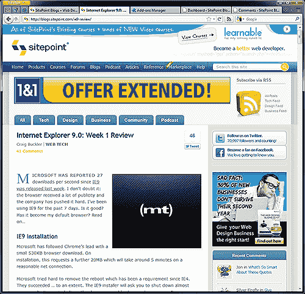
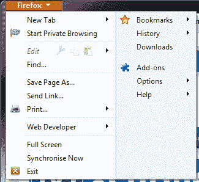
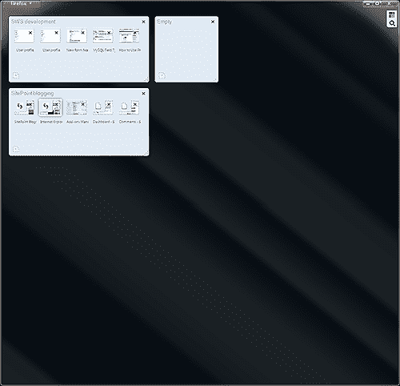
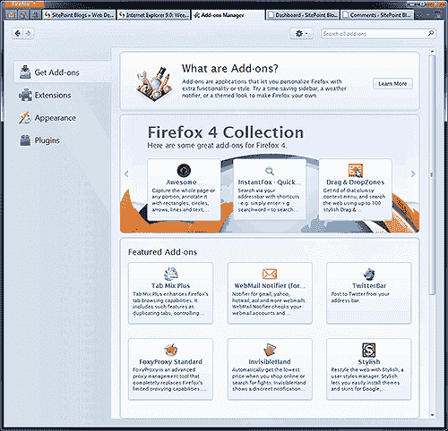
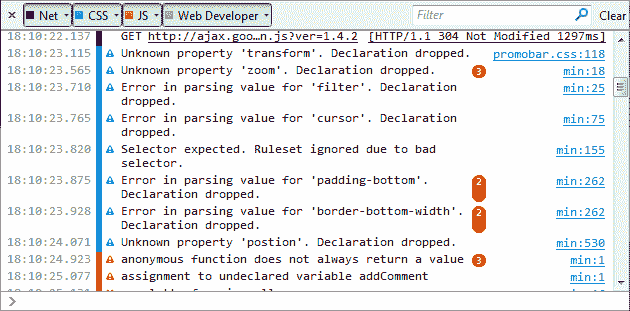

# 火狐 4.0:第 1 周回顾

> 原文：<https://www.sitepoint.com/firefox-4-review/>

浏览器市场经历了疯狂的几周。3 月 15 日，微软发布了备受期待的 Internet Explorer 9.0(T1)，八天后，Mozilla(T2)发布了 Firefox 4.0(T3)。Firefox 在 24 小时内被下载了 550 万次——是 IE9 的两倍多。但是，Mozilla 的浏览器可以安装在更多的操作系统上，下载 3.0 版本的人数没有达到第一天的 800 万。

在我们去年五月的调查中， [Firefox 仍然是网络开发者选择的浏览器](https://www.sitepoint.com/firefox-most-popular-development-browser/)，但是 Chrome 已经开始侵占它的领地。火狐 4.0 能赢得开发者和用户的心吗？

## Firefox 4.0 安装

Firefox 有 70 多种语言版本，桌面浏览器可以安装在 Windows、Mac OS 或 Linux 上。

Windows installer 是 11.8MB，比前一版本大 50%。然而，它是一个独立的文件，实际上比 IE9 和 Chrome 要求的后台文件下载量要小得多。从 v3 升级是没有痛苦的，安装应该不会超过一两分钟。不需要重新启动。

## Firefox 4.0 界面

火狐已经大修；它看起来很棒，现有用户不会被新界面迷惑。最引人注目的变化是新的 Firefox 按钮，没有菜单，以及导航栏上方的标签。毫无疑问，Mozilla 抄袭了其他浏览器最好的 UI 元素，但这并不是坏事。

类似 Opera 的菜单按钮显示提供了对最常用选项的访问，但在 Firefox 的实现中有几处改进是显而易见的:

*   两栏布局更清晰，更易于使用。
*   虽然它仍然可以启用，但你不太可能错过或需要菜单栏(我经常保持 Opera 的菜单在视图中，以访问蜻蜓等功能)。

Tab 粉丝会喜欢这个新功能的。Firefox 实现了应用标签:一个只有图标的标签可以被“钉”在工具栏的左边。然而，像 Chrome 和 Opera 一样，你不能用鼠标中键“卸载”一个应用程序标签——它总是会在启动时重新加载页面。幸运的是，一些附加组件如[标签实用程序](https://addons.mozilla.org/en-US/firefox/addon/tab-utilities/)允许这种行为，所以固定标签仍然存在，但它变暗了，不会自动重新加载。

Panorama 允许您将选项卡组织到相关组中。

我最初发现 Panorama 在与 Windows 7 任务栏预览一起使用时有点混乱和错误。也就是说，我开始看到优势了。Opera 的选项卡堆叠更容易使用，但 Panorama 比快速拨号或关于更强大:选项卡页面和组可以隐藏，直到它们被需要。

像它的竞争对手一样，Mozilla 已经移除了状态栏，当鼠标悬停在一个链接上时，你只会在窗口底部看到一个谨慎的 URL。如果您有一个需要它的扩展，您将需要启用“附加栏”——本质上是一个功能较少的状态栏。个人认为 Mozilla 本应该保留状态栏但默认隐藏。

剩下的模态信息对话框已经被放到浏览器的垃圾箱里了。例如，JavaScript 警告框可以在任何标签上弹出，不需要你立即注意。

我也喜欢 Firefox 新的活动指示器。连接时逆时针旋转，下载时顺时针旋转。这是一种很好的极客风格，在调试连接问题时也会有所帮助。

最后，如果你不喜欢 Firefox 的外观，几乎可以配置 UI 的每个部分。主题、背景图像(人物角色)、栏、图标和标签可以随意添加、删除和重新排列。

## 火狐 4.0 的新特性

Mozilla 处于一个令人羡慕的位置:他们很少需要添加功能，因为他们的浏览器支持成千上万的第三方插件。当其他供应商争先恐后地创建像样的开发人员控制台时，Mozilla 可以放松了，因为没有人能够击败 Firebug。

令人惊讶的是，大多数好的扩展都可以在 Firefox 4.0 中工作。我没有经历过任何附加的怪癖…虽然你可以。附加组件管理器现在出现了自己的选项卡:

除了 UI 调整之外，主要的新特性有:

*   改进的隐私控制。
*   新的网络控制台([见下文](#devtools))。
*   Firefox Sync，允许你在多个设备上同步书签、密码、偏好设置、历史记录和打开标签页。它通常工作得很好，甚至可以同步 about:config 设置，尽管您可能会注意到一些遗漏，比如 cookie 异常。

像 IE9 一样，Mozilla 将 RSS 降级为次要功能。发光的橙色图标已经消失了，但是一个 RSS 按钮可以添加到工具栏上，并且有几个插件可以让[恢复](https://addons.mozilla.org/en-us/firefox/addon/rss-icon-in-awesombar/)或者增强功能。

## Firefox 4.0 性能

Firefox 3.x 因其速度而受到批评。虽然一些问题是由附加组件引起的，但与较新版本的 Chrome、Safari、Opera 和 IE 相比，浏览器感觉很慢。如果你因为这个原因放弃了 Firefox，你会很高兴听到 4.0 版已经有了根本性的改进。在我的主电脑上，Firefox 3.6 的冷启动可能需要 30 秒，而带有相同扩展的 Firefox 4.0 只需要 5 秒。

如果你环顾网络，最近的许多基准测试都令人困惑——如果不是相互矛盾的话。根据我的经验，前 5 名浏览器之间的性能差异几乎可以忽略不计。Firefox 启动速度比 IE9、Chrome 和 Opera 慢一两秒，但这不足以引起愤怒。页面渲染和 JavaScript 性能很好，但是，尽管 Firefox 实现了图形硬件加速，它并没有明显快于其竞争对手。

关于内存使用，火狐 4.0 似乎比 v3 更饥渴一点。如果一次只打开几个标签页，IE9、Opera 和 Chrome 一般使用的资源较少。但是，多开几个，火狐的单个进程就变得更高效了。

稳定性一如既往的好。我经历了几个界面渲染的怪癖，但是没有任何不愉快的事情发生。

## Firefox 4.0 Web 标准支持

只有最激进的 web 开发人员才会抱怨 Firefox 3.6 中的标准支持，但是 Gecko 2.0 中出现了许多新特性，以帮助它跟上 webkit 和 Presto (Opera)的进步:

*   对 HTML5 音频、视频、表单、文件处理和拖放的额外支持。
*   支持新的 WebM 视频格式
*   WebGL 和 3D 图形
*   CSS3 过渡和转换
*   用于背景和图像的 SVG

Mozilla 已经宣布计划采用类似 Chrome 的更新时间表，因此我们可以预计新技术将迅速出现。

## Firefox 4.0 开发工具

如果我们暂时不考虑插件，一个裸 Firefox 提供了一个基本的源代码查看器、错误控制台和一个新的 Web 控制台。实质上，Web 控制台是所有网络活动、JavaScript 和 CSS 错误的组合日志，位于浏览器窗口的顶部:

与其他控制台不同，它显示文件下载和发生的错误:有趣，但很少是必要的。总的来说，我觉得它有点难看、笨重和缓慢——尤其是与 Firefox 提供的其他改进相比。如果你没有别的东西，它可能会有用，但你不会爬过 Firebug 去访问 Web 控制台。

幸运的是，当谈到[开发者工具](https://addons.mozilla.org/en-US/firefox/extensions/web-development/)时，我们被宠坏了。如果没有 [Firebug](https://addons.mozilla.org/en-US/firefox/addon/firebug/) 、 [Web Developer](https://addons.mozilla.org/en-US/firefox/addon/web-developer/) 、[控制台 2](https://addons.mozilla.org/en-US/firefox/addon/console%C2%B2/) 以及其他人，我们的生活会困难得多。

我希望 Mozilla 继续为这些插件提供技术和资金支持；他们成就了今天的 Firefox。

## 摘要

我没想到火狐 4.0 会给我留下如此深刻的印象。Mozilla 从其他供应商那里获得了最好的特性，并对它们进行了改进，创造出了一个流畅的、有凝聚力的浏览器，它易于使用，可以在所有流行的操作系统上使用。

**火狐 4.0 好点:**

*   有吸引力的，可用的和可定制的界面与卓越的标签处理
*   与 Firefox 3.x 相比，速度显著提高
*   面向开发人员、高级用户和新手的强大功能
*   浏览器插件的最佳选择

**火狐 4.0 坏点:**

*   最新版本的 IE，Chrome 和 Opera 一样快，如果不是在某些方面更快的话。Mozilla 需要跟上
*   你的所有插件在火狐 4.0 上工作可能需要一点时间
*   一些小的用户界面错误
*   Web 控制台看起来像是事后的想法，缺乏修饰

我毫不犹豫地向现有的 Firefox 用户推荐 4.0 版，尽管你应该检查基本的附加组件是否兼容。如果你因为 3.x 版本慢而放弃了它，你也应该试试 Firefox 4.0。

在我看来，Firefox 仍然是 web 开发的最佳应用程序，但它也非常适合休闲浏览，而且我不像以前那样经常使用其他浏览器。如果你觉得 IE、Chrome 或 Safari 太有限，Opera 太令人畏惧或古怪，Firefox 占据了一个中间地带，是广大用户的理想选择。

近 5000 万人下载了火狐 4.0——你可以在 getfirefox.com 关注他们。

## 分享这篇文章