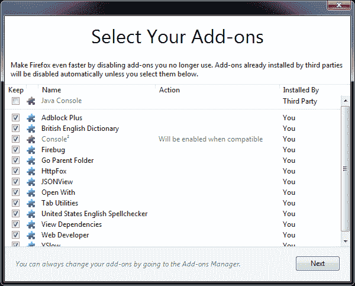

# 火狐 8 的新功能

> 原文：<https://www.sitepoint.com/firefox-8-whats-new/>

新浏览器的发布曾经是一件大事。我们测试了测试版，评估了功能，并急切地等待最终版本。除非你用的是 IE，那些日子早就过去了。很少有人知道或关心他们运行的 Chrome 是什么版本，Firefox 也在走同样的路。

Firefox 8 于 2011 年 11 月 8 日发布，距离第 7 版仅六周。您可能收到了自动更新；如果没有，就去 getfirefox.com 的。升级过程越来越顺利，但你可能会遇到一个或两个插件不兼容。

和往常一样，没有什么明显的新功能:

*   速度有所提高，你可以通过选择“常规”标签上的“选中之前不加载标签”来进一步减少启动时间。
*   搜索栏上有一个新的 Twitter 选项，可以帮助你找到标签和@用户。也就是说，它没有出现在我的安装中，所以它可能取决于您的区域设置或选项。如有必要，可以[手动安装 Twitter 搜索](https://addons.mozilla.org/firefox/addon/twitter-address-bar-search/)。
*   Android 用户可以为书签网站和应用程序添加主屏幕图标。
*   界面做了一些小改动。
*   开发人员可以利用跨源资源共享，这允许从其他域加载 WebGL 图形和纹理。

然而，最好的新特性解决了一个主要问题:糟糕的附加组件。Firefox 有成千上万的扩展，但并不是所有的都是一样的。此外，许多不道德的软件供应商捆绑偷偷摸摸的附加软件，这些附加软件通常隐藏在安装设置中，或者未经用户同意就安装。我看着你微软，雅虎，甲骨文，诺基亚和反病毒公司。

公司声称他们的附加软件有助于浏览，但很少有真正有用的。它们经常使界面混乱，占用内存或增加启动时间。在最坏的情况下，加载项会对安全性产生不利影响，或者阻止卸载。火狐经常被指责为缓慢的内存猪；一些批评是有道理的，但它通常来自用户运行大量他们没有授权的插件。

为了防止恶意扩展，Firefox 8 在首次运行时会向您显示一个附加组件列表。默认情况下，用户未授权的功能被禁用:

如果其他软件随后安装了一个扩展，Firefox 将禁用该插件并显示一个确认屏幕。用户必须选中“允许此安装”来启用它。

用户已经等这个功能出现很久了。虽然 Mozilla 附加系统的成功不能归咎于它，但它已经被滥用了太多年。我怀疑扩展授权将比许多其他增强更有助于提高性能。

不要推迟更新:Firefox 9.0 将于 2011 年 12 月 20 日发布。

## 分享这篇文章