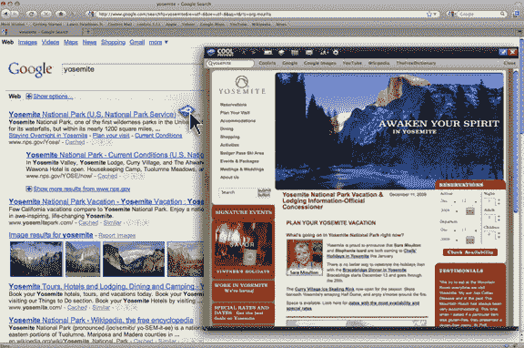
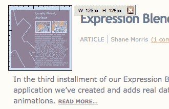
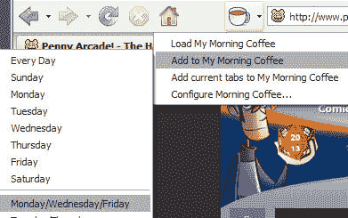
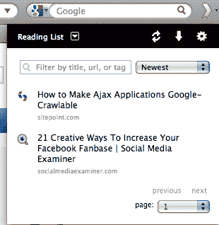
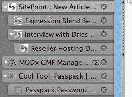

# 提高生产力的五大 Firefox 插件

> 原文：<https://www.sitepoint.com/firefox-add-ons-for-productivity/>

众所周知，我一直在寻求提高自己的工作效率。这是一个总有改进空间的领域，特别是如果你在生活中有许多不同的关注点，倾向于超计划，或者只是想在更少的时间里做更多的事情。

我最近的工作重点是基于网络和浏览器的工具。以后还会有更多，但我的第一站是在我的主要浏览器 Firefox 上。我回顾了一些我最喜欢的 Firefox 扩展，并整理了一份我最喜欢的五个 Firefox 插件的列表。

你用这些吗？你会在清单上添加什么附件？

## [酷预览](https://addons.mozilla.org/en-US/firefox/addon/2207)

CoolPreviews 提供了预览任何链接的能力，无需离开当前页面或标签，从而消除了不必要的标签和窗口。还有许多其他功能，包括搜索功能、书签、链接共享等等。

## [MeasureIt](https://addons.mozilla.org/en-US/firefox/addon/539)

MeasureIt 是开发人员、设计人员或任何想知道对象尺寸的人的有用工具，它只允许您在任何页面上绘制标尺，以检查页面元素的宽度、高度或对齐方式(以像素为单位)。

## [早咖啡](https://addons.mozilla.org/en-US/firefox/addon/2677)

早晨咖啡可以让你跟踪你最常用的网站，并在标签页中打开它们。您可以按一周中的某一天组织您的站点，并安排它们自动打开。如果你所有的标签都不小心关闭了，或者你想重新开始，你也可以一键打开所有你喜欢的网站。

## [以后再看](https://addons.mozilla.org/en-US/firefox/addon/7661)

稍后阅读可让您将页面保存到阅读列表中，以便在有时间时阅读。它有一个离线阅读模式，所以你可以在任何地方阅读你保存的内容，即使没有互联网连接。您也可以在多台电脑和移动设备上同步您的列表。还有其他有用的功能，如共享、文本视图等。

## [树形标签](https://addons.mozilla.org/en-US/firefox/addon/5890)

这个附加组件提供了一个树状标签栏，其工作方式类似于一个文件夹树。从现有选项卡打开的新选项卡会自动附加到当前选项卡，并且可以折叠。如果你想一次打开很多标签页，这很有用。你也可以设置你的标签垂直打开，折叠/展开子树，拖放等等。

## 分享这篇文章