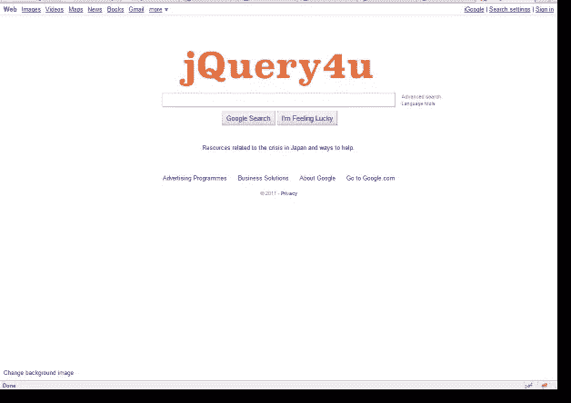
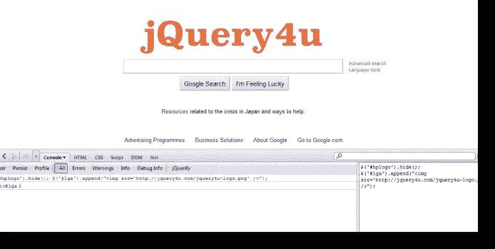

# 使用 FireQuery 更改 Google 徽标

> 原文：<https://www.sitepoint.com/firequery-change-google-logo/>



嗨，伙计们，今天我用 FireQuery 和一些实时的 jQuery 代码来展示我的博客标志，这很有趣，也是定制的 Google。

首先，我假设你知道如何安装和使用 Firebug 和 FireQuery。

我是这样做的。

1.加载 Firefox

2.前往[https://google.com](https://google.com)

2.加载 Firebug(点击右下角的小 bug)

3.单击 jQuerify(将 jQuery 加载到网页)


4.检查页面元素，找到 google 徽标的容器 id 和一个包装器 div，以插入我的新徽标(我更喜欢只更改当前徽标的“src ”,但它存储在一个样式背景元素中，所以更容易隐藏它)。找到的 id 是“hplogo”和“lga”。

5.在控制台窗口中键入以下代码，然后单击“运行”。

```
//hide the current google logo
$('#hplogo').hide();
//display my logo
$('#lga').append("");
```



嘿，转眼间！；-)

**请注意**这里没有涉及黑客攻击，我也没有侵入谷歌来改变他们的标志！这只是一个简单的 FireQuery 示例。

## 分享这篇文章