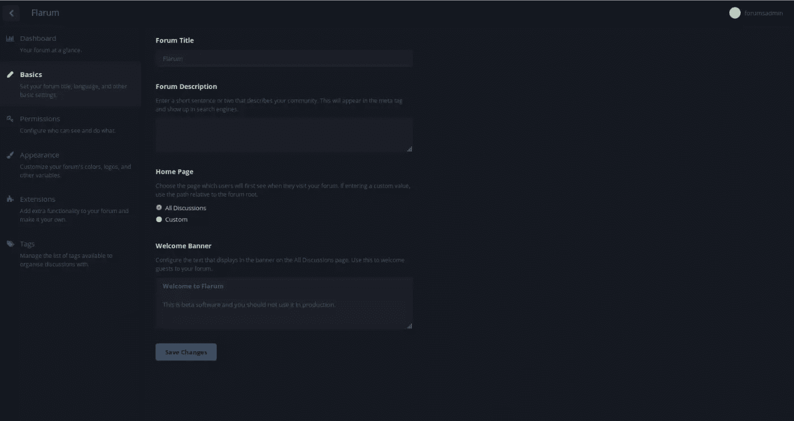
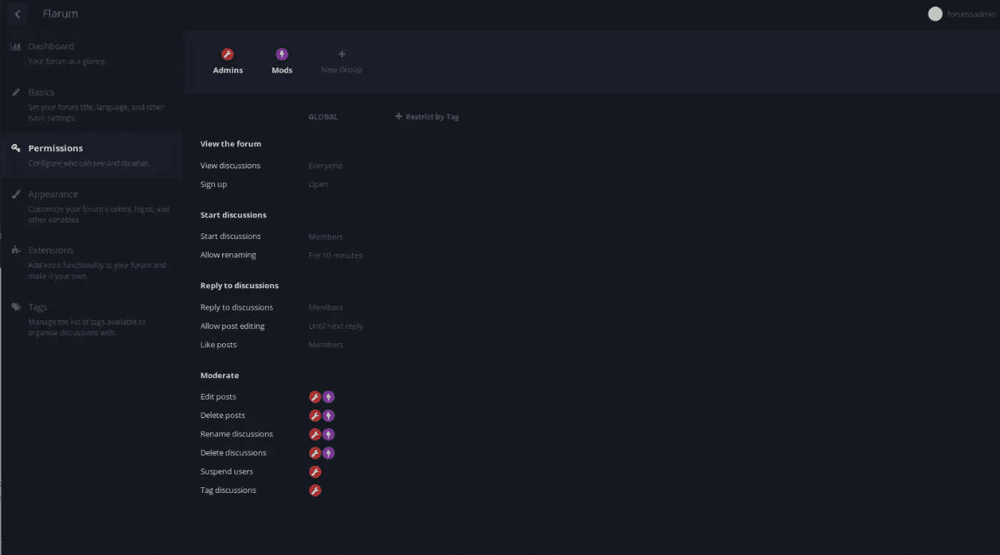
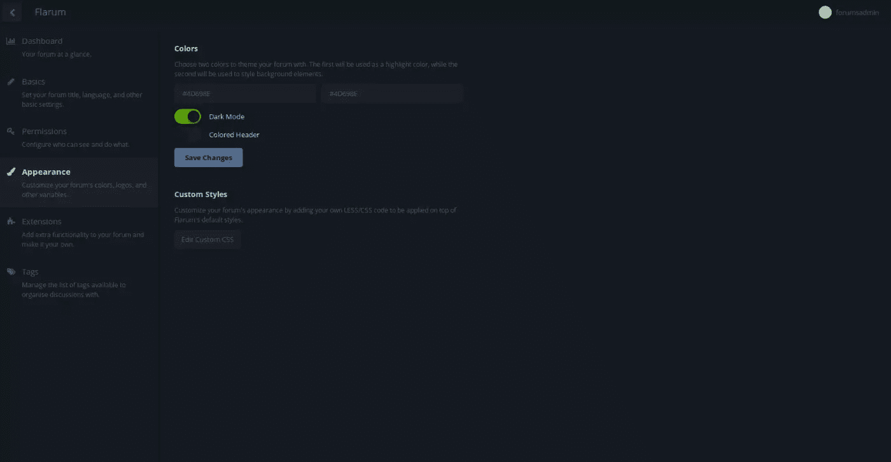
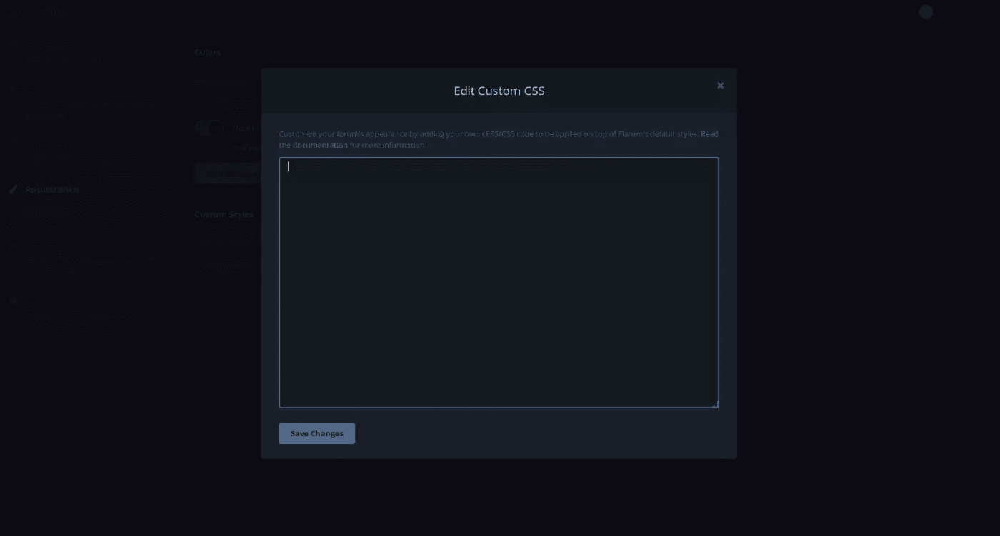
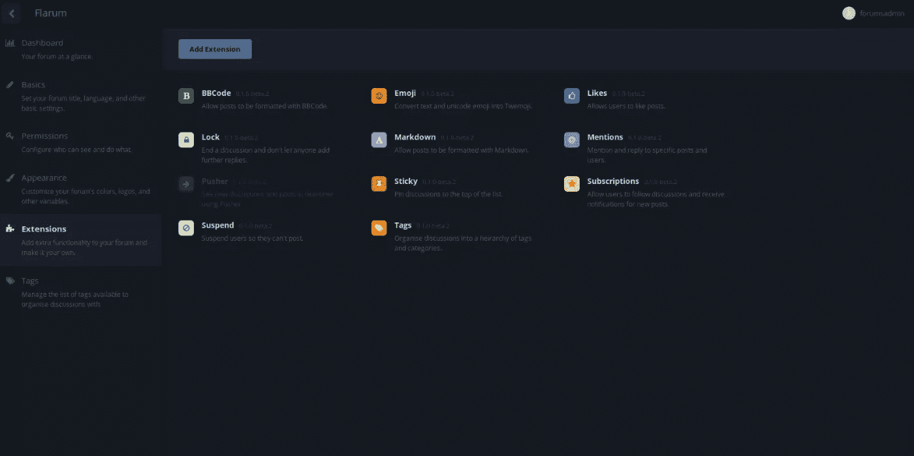
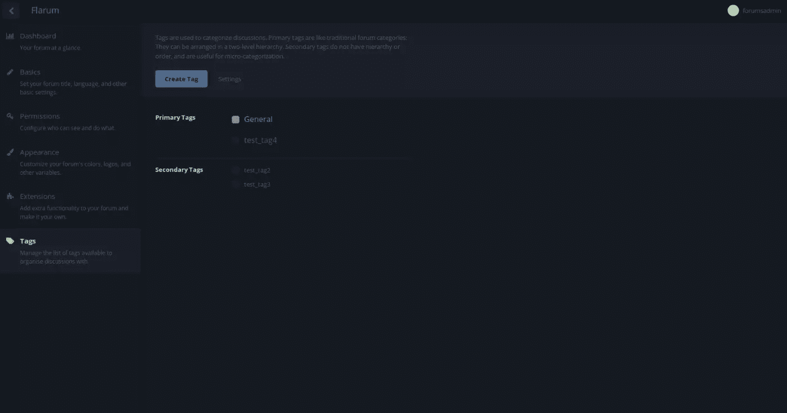
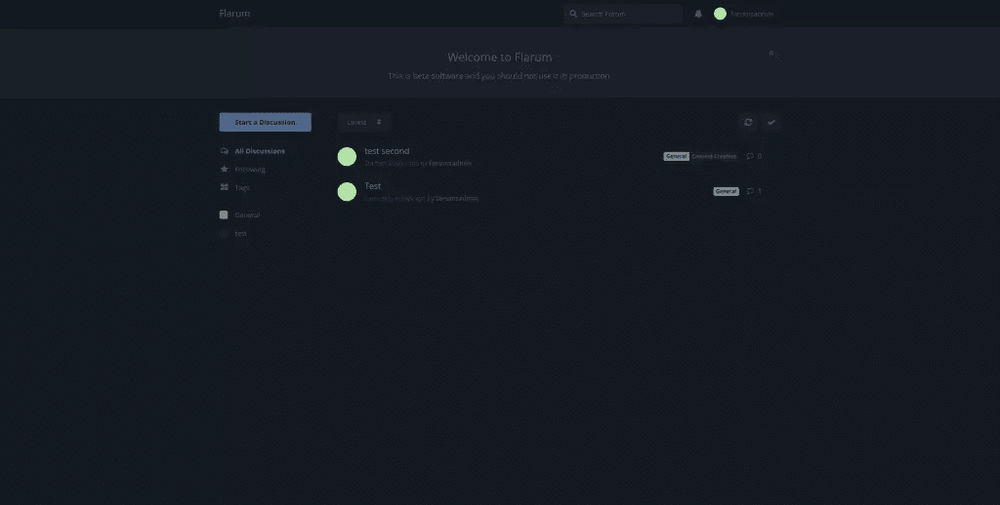
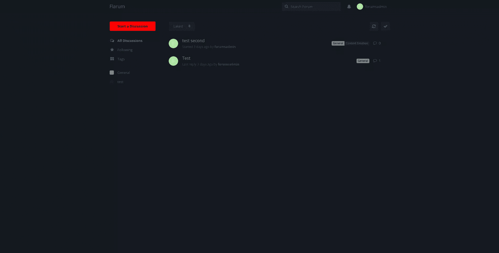

# 首先看看 Flarum——简化的下一代论坛

> 原文：<https://www.sitepoint.com/first-look-at-flarum-next-generation-forums-made-simple/>

[Flarum](http://flarum.org/) 是一个论坛解决方案，目前处于公开测试阶段，正在积极开发中。今天我们将看看它，让它在一个[家园改进的](https://www.sitepoint.com/quick-tip-get-homestead-vagrant-vm-running/)流浪者虚拟机中设置，并看看 Flarum 提供的配置和功能。然后，我们将它与其他一些论坛平台进行比较，看看它的表现如何。

[](https://www.sitepoint.com/wp-content/uploads/2015/10/1444558330flarum.png)

## 环境设置

对于我们的环境，我们将使用一个家园改进流浪虚拟机。关于设置的更多细节可以在这个[关于改进家园和运行](https://www.sitepoint.com/quick-tip-get-homestead-vagrant-vm-running/)的快速提示中找到。如果要使用另一种类型的开发环境，我们可以跳过这一步，否则，**请在继续**之前遵循上面的 HI 设置指南。

出于本文的目的，使用的文件夹是`flarum`，应用程序名称(和在`/etc/hosts`中设置的主机)是`flarum.app`。在我们的`Homestead.yaml`中，我们应该有指向`home/vagrant/Code`目录的`flarum.app`条目。

现在，在`vagrant up`之后，我们应该能够通过`http://flarum.app`在浏览器中访问我们的应用程序。

## 建立论坛

我们将大致遵循 [Flarum 安装指南](http://flarum.org/docs/installation/)。

首先，在我们的主机上，我们[下载 Flarum](https://github.com/flarum/flarum/releases) 的最新版本(本文是使用`0.1.0-beta.2`版本编写的)。然后，我们将内容解压到我们的`flarum`目录。

### web 服务器配置

接下来，我们进入我们的 Homestead VM，编辑我们的 nginx 配置文件。

```
sudo nano /etc/nginx/sites-available/flarum.app
```

我们需要添加以下几行(它们可以添加在`location ~ \.php${}`块的正上方):

```
 location /api { try_files $uri $uri/  /api.php?$query_string;  } location /admin { try_files $uri $uri/  /admin.php?$query_string;  } location /flarum { deny all;  return  404;  }
```

然后，我们将重新启动 nginx，以确保在开始之前保存我们的更改:

```
sudo service nginx restart
```

### 数据库配置

当仍然登录到我们的流浪者机器时，让我们继续设置 Flarum 数据库。创建新用户时，我们将为 Flarum 应用程序选择并设置一个密码，用于访问 MySQL。

```
mysql -u homestead -psecret
```

```
 CREATE DATABASE flarum; CREATE USER 'flarum'@'localhost' IDENTIFIED BY 'password'; GRANT ALL PRIVILEGES ON flarum.* TO 'flarum'@'localhost'; FLUSH PRIVILEGES;
```

然后我们可以退出 MySQL 提示符(`CTRL+C`)。现在，在主机上，我们打开浏览器并输入`flarum.app/`。我们应该会看到 Flarum 安装屏幕。

### Flarum 装置

我们将把我们的测试论坛称为“Flarum”。输入 MySQL 连接信息。我们的用户是`flarum`，我们的密码是`password`。

对于管理员凭证，我们将使用`forumsadmin`、电子邮件和密码。出于演示的目的，我们将只使用`password`。

***注**:在撰写本文时，这个过程中有一个已知的 bug。如果 Flarum 不接受管理员名称(如果该名称无效)，它将静默失败。用户名只能包含字母、数字、破折号和下划线。*

如果一切顺利，我们将在主论坛屏幕上。祝贺您-我们的论坛现已正常运行！

## 初始调整

让我们先浏览一下 Flarum 管理菜单。我们可以从右上角的用户菜单访问管理菜单。

### 基础

[](https://www.sitepoint.com/wp-content/uploads/2015/10/1444697790flarum-02.jpg)

在 Basics 下，我们可以更改当前通知我们 Flarum 是 beta 产品的横幅，当然还有标准标题、描述等。

### 许可

[](https://www.sitepoint.com/wp-content/uploads/2015/10/1444697795flarum-03.jpg)

在权限下，我们有一些基本的审核工具，例如:

*   查看讨论
*   -是啊
*   回复
*   事后编辑
*   爱好
*   缓和行动

这些都可以应用到用户组，可以创建新的组，让我们在用户之间拥有多层次的信任。

### 出现

[](https://www.sitepoint.com/wp-content/uploads/2015/10/1444697802flarum-04.jpg)

在外观下，我们可以选择十六进制颜色来突出显示和背景元素。我们也可以切换到深色模式或彩色标题。这也是可以在 Flarum 的标准 CSS 之上部署自定义 CSS 规则的地方。

[](https://www.sitepoint.com/wp-content/uploads/2015/10/1444697807flarum-05.jpg)

### 扩展ˌ扩张

[](https://www.sitepoint.com/wp-content/uploads/2015/10/1444697813flarum-06.jpg)

Extensions 选项卡显示了所有当前安装的扩展。我们可以单击每个菜单旁边的虚线图标(当鼠标悬停在图标上时)来禁用、启用或卸载。将来，我们将能够使用“添加扩展”按钮，但现在，如果我们发现(或创建)任何第三方的扩展，我们必须通过将它们放入我们的`extensions`文件夹来手动安装扩展。

### 标签

[](https://www.sitepoint.com/wp-content/uploads/2015/10/1444697784flarum-01.jpg)

最后一个菜单“标签”允许我们创建可在讨论中使用的标签。Flarum 采用两级标记层次结构——主要标记和次要标记。目前，创建对话框似乎只允许创建二级标签。我们可以将它们拖上来，作为主标签的子标签，或者将它们留在辅助标签列表中，与主标签一起显示在标签列表中。这有点令人困惑，希望在以后的开发中得到澄清。

## 主题和扩展

主题是一个带有 Flarum 的混合包。有一个简单的方法来添加一次性的样式修改，在管理面板的外观部分。Flarum 使用 CSS 预处理器[而不是](https://www.sitepoint.com/a-comprehensive-introduction-to-less/)，开发人员出于各种原因选择了 CSS 预处理器，而不是 Sass 和其他选项。

### 自定义示例

这是我们的`flarum.app`，通过外观管理选项卡打开了黑暗模式。

[](https://www.sitepoint.com/wp-content/uploads/2015/10/1444558325flarum_app_darkmode.png)

我们将做一个快速定制来演示对主题做一些小的风格改变是多么简单。

如果我们进入管理菜单中的外观选项卡，然后单击“编辑自定义 CSS”，我们就可以输入我们自己的自定义 CSS 或更少。

我们这个简单定制的目标是改变“开始讨论”按钮的颜色。我们想把它涂成红色，让新来的游客看起来更醒目。因此，在我们将我们想要定位的类标识为`IndexPage-newDiscussion`之后，我们可以继续写下一行 CSS 代码:

```
.IndexPage-newDiscussion {background:#ff0000;}
```

这就是全部了。如果我们再看一下我们的主页，我们会看到我们的变化:

[](https://www.sitepoint.com/wp-content/uploads/2015/10/1444558319flarum_app_darkmode2.png)

理论上，可以对应用程序中的任何样式进行更改。现在，当然，当我们在生产中使用 Flarum 时，我们会想要改变更多的小样式。一种方法是在扩展系统中构建我们自己的主题文件。

### 扩展ˌ扩张

如果我们对实例的结构、功能或外观进行了修改，超出了管理菜单或默认扩展所提供的范围，我们可以创建自己的扩展。随着社区的发展，扩展将成为 Flarum 不可或缺的一部分，特别是考虑到它们可以很容易地被创建。作为[创建扩展](http://flarum.org/docs/extend/packaging/)的第一步，可以生成一个框架扩展。扩展的主题部分在[主题文档页](http://flarum.org/docs/extend/themes/)有更全面的解释。关于主题，Flarum 还在`variables.less`文件中提供了一个在站点中使用较少变量的列表，并且他们为 CSS 类使用了一个 [BEM 命名约定](https://www.sitepoint.com/bem-smacss-advice-from-developers/)。

## 一般特征

*   **无限滚动**——这类似于另一个现代论坛平台 Discourse。用户对此似乎有着截然不同的反应——我们喜欢它，或者我们讨厌它。历史上，论坛软件限制每个“页面”的主题数量或主题内的回复数量，要求我们加载新页面以查看更多内容。在 Flarum 中，一个对话的查看者可以滚动浏览一个对话，一边浏览一边加载更多的响应，直到结束——不管它有多长。
*   **触摸友好**——这是让 Flarum 真正脱颖而出的一个特性。它从一开始就经过了触摸优化，支持手势(向右滑动可以将讨论标记为“已读”，向左滑动可以获得更多选项)。动画并不庞大，网页在手机上加载也不会明显变慢。
*   **URL**–Flarum URL 格式非常直观。标签“General”的 url 将是`<app base url>/t/general`。我们第一次讨论的 URL 称为“test ”,标记为“general ”,将为`<app base url>/d/1-test`。此外，文章编号会附加到 URL，以指示讨论中的哪个文章正在被阅读。
*   编辑器–Flarum 使用了一个“浮动编辑器”，它以一种弹出窗口的形式出现在页面底部。在撰写对讨论的回复时，我们可以自由地浏览 Flarum，允许我们根据需要查看其他讨论来撰写我们的回复。这也是话语中的一个特征，而且相当得心应手。Flarum 编辑器支持 MarkDown、BBCode 和 Emoji，并将可扩展以支持更多功能。
*   **审核**–可定制的审核组和权限无疑是平台的福音。即使在测试阶段，人们已经开始关注适度，任何社区管理员都知道这是运营论坛的关键部分。

## 与其他平台的比较

总的来说，Flarum 似乎在发布，它可能比得上 Discourse 等现代论坛平台。话语或[节点](https://nodebb.org/)很可能是同一个竞技场上唯一真正的竞争者。虽然存在其他现代论坛平台，如 vBulletin 5 或 Vanilla，但 Flarum 感觉自己在某种程度上与众不同。在某些情况下，它可能归结为一种语言偏好:Discourse 是 Ruby on Rails 平台，而 NodeBB 是 Node.js 平台。

Flarum 是非常移动友好的，这对于一般的论坛来说是一个挑战，但却是一个关键的面向未来的特性。话语正在实现，但在移动设备上仍然有点笨拙，NodeBB 也是移动友好的-事实上，它声称首先开发移动设备。

Flarum 基于标签的导航可能会疏远静态类别的粉丝，但我们在 web 应用程序中越来越多地看到这一点，基于标签的排序无疑有其优势。相反，话语既使用类别又使用标签，这种组合如何工作很大程度上取决于实现，有时非常有用，有时则一塌糊涂。基于标签的分类是好是坏取决于用户群的偏好。

当比较平台时，资源是另一个大问题，Flarum 轻而易举地赢得了与大多数其他现代平台(如 Discourse)的竞争。它可以运行在较低规格的主机上，感觉更快。然而这是有代价的，因为我们不得不考虑更(相对)成熟的平台，如 Discourse，可能更稳定，并且已经有大型社区来支持和扩展它们。Flarum 甚至还没有准备好生产，所以时间会告诉我们这一优势是否会缩小或变得暗淡。

## 结论

一个人是否选择 Flarum 作为他们的论坛平台的选择可能取决于各种各样的事情。我们更喜欢什么语言？PHP 核心使得 Flarum 成为 PHP 开发人员和那些使用现有 PHP 应用程序的人员的绝佳选择。Flarum 的发布路线图和进展也能告诉我们很多。我们可以观察开发进度、用户反馈以及添加到 Flarum 中的特性。随着扩展系统和主题化选项的成熟，我们将能够衡量这个平台的实际可定制性——以及它背后是否有强大的用户基础，或者它是否会动摇。无论哪种方式，它都应该留在我们未来项目的雷达上！

## 分享这篇文章