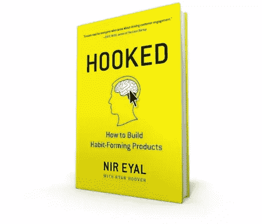

# 《上瘾》( Hooked)初探——养成习惯产品指南

> 原文：<https://www.sitepoint.com/first-look-hooked-guide-building-habit-forming-products/>

*本帖由[上钩的](http://www.amazon.com/dp/1591847788/)赞助。感谢您对使 SitePoint 成为可能的赞助商的支持。*

每次手机震动两秒，我就兴奋。这是对外界刺激的经典巴甫洛夫反应。我应该更清楚，但我就是控制不住。

你看，两秒钟的振动意味着要么 Google Now 让我知道我早上的通勤会有某种延迟(无聊)，要么有人决定在 Twitter 上与我互动(超级刺激！)

我已经很适应这种模式了。事实上，如此舒适以至于我不再对通知感到惊讶。相反，我现在发现我整天都在期待着它。渴望它，几乎。情况变得如此糟糕，有时我会说服自己 Twitter 忘记通知我，我需要去手动检查我的通知。

这种行为模式听起来应该很熟悉。任何产品都可能发生这种情况，这并不意味着你上瘾、失衡、不稳定或怪异。它真正的意思是你是正常的。这意味着一小群神经科学家、产品经理和行为心理学家已经发现了建立习惯形成技术的关键，并且这已经被构建到你似乎无法把手拿开的产品中。

## 简介:挂钩

你会问，建立成功的习惯养成技术的关键是什么？对于 Nir Eyal 来说，这是一个完美的问题，他刚好写了一本关于这个主题的书。

我有机会读了 Hooked 的一个样本章节，我不得不说，这是一个不容错过的机会。作为 web 开发人员，我们每天都在不断推出希望被大量用户采用的软件。UX、SEO 和设计都在我们构建的软件的成功中扮演着重要的角色，但是最成功的产品使用这些工具来实现更大的目标。这个目标继续创造我们在 Twitter、脸书和 Instagram 等产品中所熟悉的上瘾模式。

这个目标被描述为挂钩模型，它有四个阶段:触发、行动、可变回报和投资。

> 钩子模型解释了我们日常使用的许多成功的习惯形成产品和服务的设计背后的基本原理。尽管考虑到大量可用的学术文献，该模型并不详尽，但它旨在成为一种实用工具(而非理论工具),专为那些旨在善用习惯的企业家和创新者打造。在本书中，我汇编了最相关的研究，分享了可行的见解，并提供了一个旨在增加创新者成功几率的实用框架。

## 我被迷住了

我觉得 Hooked 写得很好，研究得很透彻，非常有说服力。我真正注意到的一件事是每章之后总结内容的方式。每章都以行动项目和重要亮点的总结列表结尾，使读者能够讨论或记录该章最重要的方面。我真的很喜欢这种格式，因为在读完这么重要的一本书后，我总是可以回到每一章，轻松地引用它的要点和思想。

Nir 是一名优秀的作家，他的所有主张都有详尽的资源清单作为支持，包括研究论文、行业专家以及他自己与初创公司和大公司合作的经验。我还惊讶地发现瑞安·胡佛是一位有贡献的作家。如果你不知道名字，你可能知道他创办的网站，[产品搜索](http://www.producthunt.com/)。

这绝对是一本让我兴奋不已的书，尤其是作为一名发布产品和软件的 web 开发人员，这些产品和软件旨在为大量用户解决特定问题。我毫不怀疑，通过提供与我引以为豪的行业相关的有用信息，Hooked 将会多次收回投资。

## 结论

如果你目前正在开发一个产品，在一个产品团队中，或者希望在未来推出自己的产品，Hooked 是一本适合你的书。它将向你展示产品团队如何形成强大的用户习惯，确保他们的成功和受欢迎。这是一个没有在其他地方深入讨论过的过程，这使得它成为那些寻求建立习惯形成产品和技术的人的必读之作。

Hooked 在[亚马逊](http://www.amazon.com/Hooked-How-Build-Habit-Forming-Products/dp/1591847788/ref=sr_1_1?ie=UTF8&qid=1414803635&sr=8-1&keywords=hooked)、[巴恩斯&诺布尔](http://www.barnesandnoble.com/w/hooked-nir-eyal/1119342753?ean=9781591847786)、【IndieBound.org】T4 都有。购买后，一定要去 HookModel.com 享受特价优惠！

## 更多详情和评论

“这是所有关心如何提高客户参与度的人的必读之作。”—《精益创业
的作者 Eric Ries 成功的公司是如何创造出让人爱不释手的产品的？

为什么有些产品吸引了广泛的关注，而有些却失败了？是什么让我们完全出于习惯去购买某些产品？技术如何吸引我们，有没有一种潜在的模式？

Nir Eyal 在他的书《上钩:如何打造形成习惯的产品》中回答了这些(以及更多)问题。Hooked 解释了产品如何创造用户习惯背后隐藏的心理。Hooked 不是抽象的理论，而是构建更好产品的操作指南。Hooked 是为产品经理、设计师、营销人员、初创企业创始人以及任何试图理解产品如何影响我们行为的人编写的。

*“Hooked 给你下一代产品的蓝图。读上瘾了或者取代你的公司会。”WordPress 创始人马特·莫楞威格。*

## 分享这篇文章