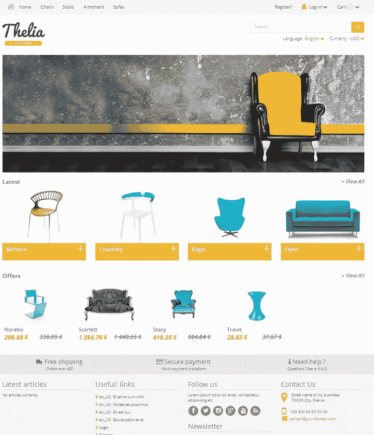
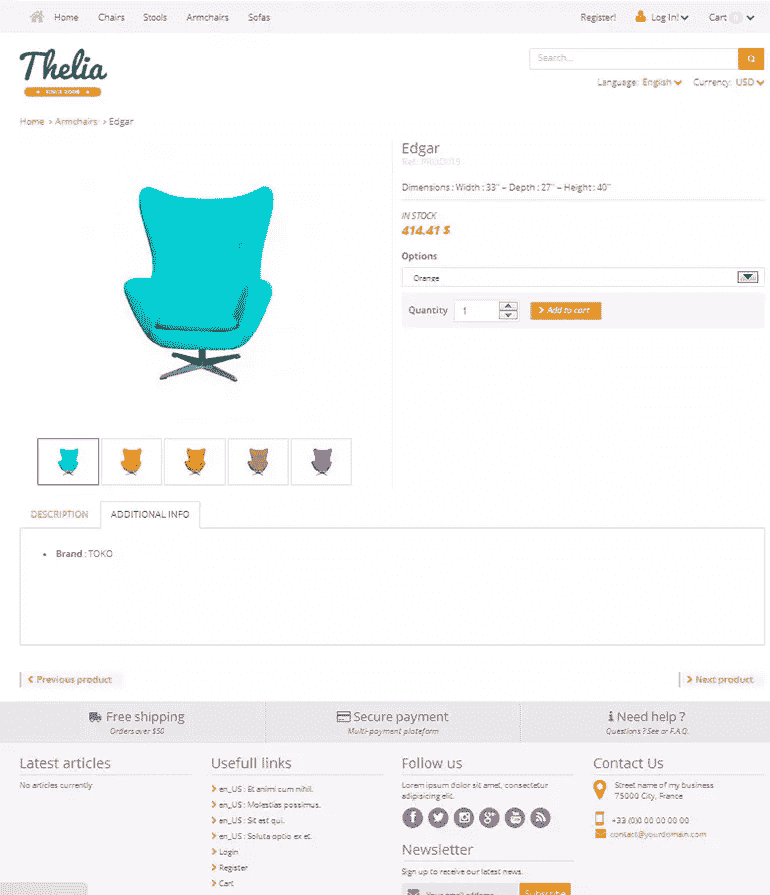
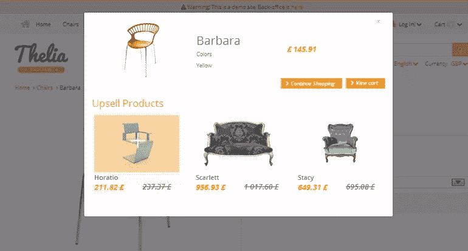
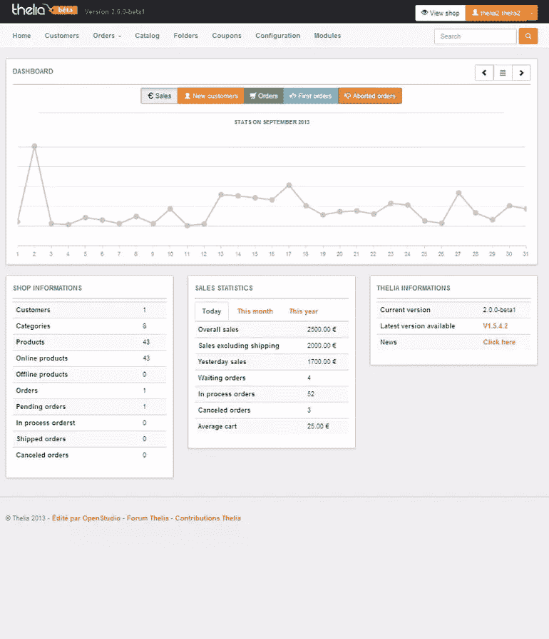
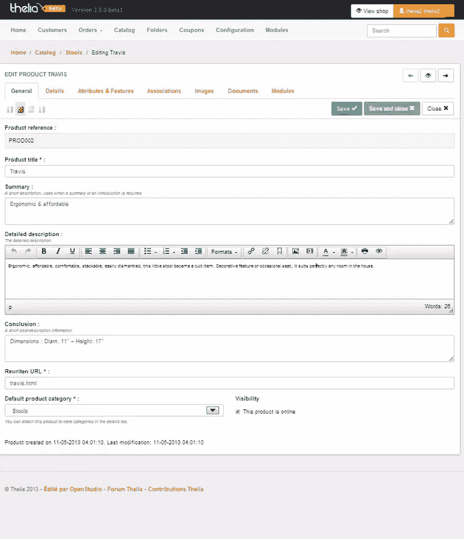
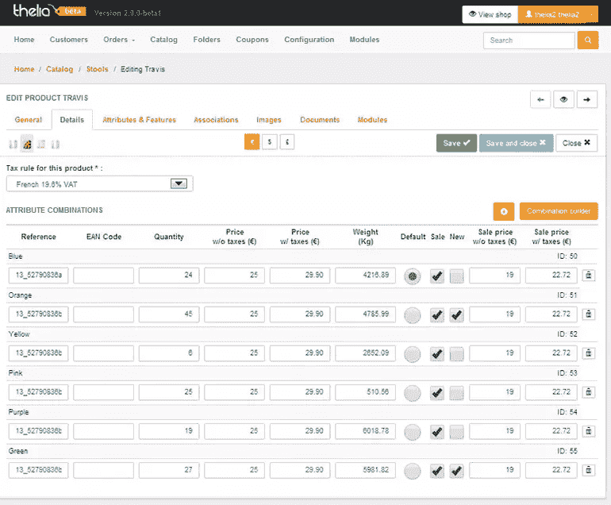
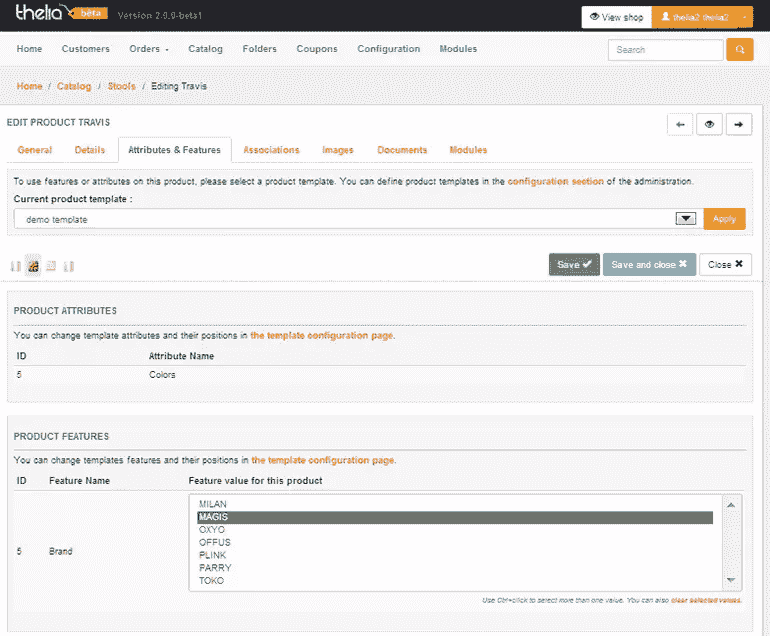
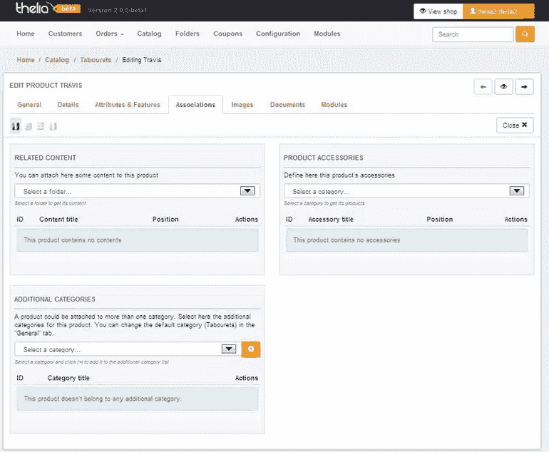

# 先看 Thelia 2:下一代电商？

> 原文：<https://www.sitepoint.com/first-look-thelia-2-next-generation-ecommerce/>

## 介绍

除非你来自法国，否则你可能还没有听说过 Thelia，这是一个正在引起一些国际关注的电子商务系统，这在很大程度上是因为在 9 月底发布的 Thelia 2 测试版的媒体材料中出现的流行词汇。

完整版要到今年年底才会推出，但当一个电子商务系统被描述为开源、Symfony、HTML5、Bootstrap、Propel、PHPUnit、Travis、Smarty 和语义微数据时，它值得一些关注。

## 基本原则

Thelia 2 构建于一些流行的工具之上:

*   Symfony2，一个现代的 PHP 框架，你也可以在 ezPublish CMS 和 Drupal 8 的组件中找到它。Symfony2 使用的是 MVC 模式
*   Bootstrap 3，一个用于构建响应式网站的 CSS 框架，Syed Fazle Rahman 在上面写了一篇[优秀文章](https://www.sitepoint.com/twitter-bootstrap-3-javascript-components/)
*   Smarty 3 的模板引擎是明智之举，因为它使适应变得更加容易

他们显然有他们的基本原则，但使用流行的技术并不一定能成为一个伟大的电子商务平台。那么，让我们来看看它是如何组合在一起的。

## 前端

主页拥有当今大多数电子商务工具中使用的现代外观，翻转部分有很好的变化。它看起来很干净，91 的 Yslow 分数意味着他们的代码也很干净。

产品页面也是如此，干净利落，但没有什么特别之处。基本要素在这里:多个产品图片、信息标签和产品属性(选项)。但这并没有将 Thelia 与所有其他现代电子商务工具区分开来，所以让我们深入后端，看看这里隐藏了什么。

非常重要的追加销售被赋予了一个巧妙的前端接触:在你将产品添加到购物车后，它就在那里。当顾客有购物心情时，就应该这样做。

## 后端

我对销售图表很着迷，所以他们肯定在这一点上得分。在激励方面，它比原始数字更有效，当你登录时，这些应该清楚地显示出来。

糟糕的是，它们留下了大量未使用的空间，这些空间可以用于快速链接、待办事项等。而且没有办法改变。

在顶部你会发现导航栏，当你把它和 Magento 这样的野兽相比时，它肯定是干净的。但 Magento 的导航范围广泛是有原因的——在电子商务商店中有很多东西需要设置和管理。

当你开始编辑一个产品的时候，这个链接终于活跃起来了。建立一个多语言商店非常容易，你可以通过点击标志来编辑每个翻译。这使得它非常方便。

然后你打开“细节”标签。

你现在看到的是不同产品的数量和价格。但不知何故对我不起作用，太乱了。这些不是细节，这些是股票和价格。这样命名容易多了。

为了使它更加混乱，他们称之为“属性组合”，但是还有一个标签叫做“属性和特性”。这只是混淆，但由于它仍处于测试阶段，它可能会在改进列表中。

说到属性，让我们看看 Thelia 是如何处理的。属性对于管理整个商场的一致性非常重要，但也可能有点过头。因此，避免这种麻烦是很重要的。不幸的是，Thelia 在这里也没有说服力。

您首先需要制作一个包含一个或多个属性的模板，而不是为产品分配属性。此模板将分配给您的产品。虽然这最初看起来只是一种不同的方法，但当您有许多属性组合时，这很快就会变得非常烦人。

你必须制作许多不同的模板，因为它在一个下拉列表中，你必须制作大量独特的可识别的名称。简单的复选框列表会容易得多。此外，这些类型的选择并不是真正的属性，而是产品选项。

产品特性列在前端的“附加信息”标签中。这些是真正的产品属性，而不是特性。不过，使用选择字段并不是一个坏选择。总而言之，这是编辑过程中非常混乱的一部分，与网上商店术语中常见的内容不一致。

现在让我们来看看 associations 选项卡，用于交叉销售、相关内容和附加类别。让我先说这些都不起作用。我希望这只是测试版中的一个错误，但这真的太糟糕了，因为处理交叉销售是电子商务的一个重要部分，也是决定使用哪个工具的主要部分。

还有，相关内容部分我也没弄明白。这样，您就有三个不同的字段来编辑三个不同选项卡上的内容(详细描述、产品功能和这个)。但如果我能看到它的实际应用，可能会有所帮助。然后附加类别:再问一遍，为什么？应该在常规选项卡中。

交叉销售部分称为产品配件，更有意义。但是，如果称之为配件，你就只能选择与产品相关的实际配件。这意味着它必须补充你的特色产品，而不是提供不同的选择或品牌。这确实取决于您如何定义交叉销售，但它确实排除了使用交叉销售进行追加销售的选项。也就是你自己不在代码里编辑的时候。

图像和文档选项卡使用简单的拖放，看起来很好。这里唯一的限制是您不使用中央存储库，而是使用每个产品的图像/文档库。
模块部分未加载，但用于添加运输和支付选项。这些模块的配置也不行，我也没什么好说的。

因此，产品编辑出来不是很好:它令人困惑，没有使用正确的命名和功能不是那么先进。这也适用于系统的其他部分。有:

*   没有分层导航(产品过滤)
*   折扣只能通过提供优惠券来实现
*   报道是有限的
*   没有产品比较或愿望清单
*   没有产品层面的社交分享
*   目前没有提供扩展

诸如此类。它只是缺少了像 WooCommerce 这样的直接竞争对手拥有的重要电子商务功能和高级工具。当然，它还在测试阶段，但是我们已经离宣称的“2013 年底”发布日期不远了。

## 结论

请记住，这是测试版的 Thelia 2，但一些最重要的元素要么没有包括在内，要么不完整。界面令人困惑，而且非常简单。

他们自己主持的演示没有完全发挥作用，这也于事无补。

如果你把它本身看作一个产品，你真的不能抱怨。他们有足够的基础，我相信他们会解决大部分的小故障，并不断改进他们的功能集。但是当你拿它和 Prestashop 比较的时候，比如说，它在功能上就是没法比。

然而，作为一名开发者，你可能会喜欢他们利用现代标准的方法，比如 Symfony2 和 Bootstrap。特别是 Bootstrap 在电子商务工具中并不常见，但它是进行移动商务的一种奇妙方式，例如，这是 Thelia 有意瞄准的一个领域。

因此，Thelia 2 背后的人肯定知道他们的东西，如果他们在功能开发上投入相同水平的努力，我们可能有一天会成为赢家。与此同时，开发人员你可能会喜欢它，因为你可以自己承担相当多的开发工作，因为 Thelia 2 是免费和开源的。

如果你对 Thelia 2 有任何体验，请在评论中告诉我们。

## 资源

[前端演示](http://demo-v2.thelia.net/?lang=en&currency=USD)
[后端演示](http://demo-v2.thelia.net/admin) (thelia2/thelia2)

## 分享这篇文章