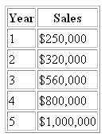

# 跨越:自由职业的第一步

> 原文：<https://www.sitepoint.com/first-steps-freelancing-2/>

很少有人会实现他们最大的人生目标。你知道有多少人实现了他们的梦想？

人们无法实现目标有很多原因，但最常见的解释是我们根本没有努力。为什么不呢？试验自然会有失败的风险。很多人认为永远不尝试更安全；这样，他们就永远不会失败。

同样的道理也适用于投身商业，自己去做。谁不渴望成为自己的老板，却觉得和自己认识的魔鬼在一起更安全？在这个工具包的整个过程中，你经常会被提示去行动，去尝试。毕竟，如果你想摆脱工资奴役，你需要尝试，去冒险。

在 [*网页设计商业工具包 2.0*](https://www.sitepoint.com/kits/freelance2/) 中，我将向你展示如何开始、建立和扩展你自己的自由职业者或小型网站业务。我们将通过轶事的方式遇到一些有趣的人物，有时，处理不那么迷人的话题——除非你觉得盈亏平衡分析很迷人！你可以[下载这一章——还有另外三章](https://www.sitepoint.com/show-modal-popup-after-time-delay/)——作为离线参考。

现在，你可以简单地阅读这些信息，吸收它，仔细考虑它，或者你可以采取行动——立即行动——当它仍然新鲜和鼓舞人心的时候。许多人会简单地阅读它，然后把它放在书架上。但是其他人，比如这些年来不断给我发电子邮件感谢我写了 kit 的第一版的人，将会实现他们所学到的并获得回报。

这是我在 2003 年该工具包发布时收到的第一批反馈信息之一:

*例 1.1。第一版反馈*
*“你不会相信网页设计商业套件对我们业务的影响。我们拥有该套件的第一个月，我们的业务收入是过去三年业务收入的两倍。我们只是通过实施我们在工具包中读到的一些关于定价、展示和跟进的商业战略，就取得了这一成功。”*

反馈片段的关键点是一些业务策略的简单实现。这真的只是简单的实现，所以不要只是阅读这个工具包，把它放在一边，然后逐渐忘记它。当你阅读这些章节时，给自己写下笔记。详细说明如何将我学到的经验应用到你的工作中。最重要的是，将想法付诸实践——行动会带来成功。没有比现在更好的时机来拓展你的业务了，这个工具包将在你前进的每一步都为你提供帮助。

你想成为实现人生最伟大目标的少数人中的一员吗？及时行乐！让我们开始吧。

##### 为什么要自己当老板呢？

你为什么要自己创业？想想这个问题:你的答案很重要。

你为什么还要工作？我们真正需要的是一天两顿像样的饭和一些庇护所，我们会很好的。那么，为什么我们中的许多人要花费漫长而艰辛的时间去创业呢？是为了比邻居有更大的房子、更好的车和更多的珠宝吗？如果你回答“是”，那很好。是为了将来存钱，以便有一天能享受美好的生活方式吗？那也很好。是因为你只是简单地享受你所做的事情，并且投入一天的工作滋养了你的灵魂吗？太好了。

重要的是，在开始之前，你要确定你想自己出去的原因。如果你从一开始就知道你为什么要做自由职业者，你就能更好地评估你的努力是否成功。你还会有一点额外的动力来帮助你度过困难时期——当我们努力赚钱时，困难时期会降临到我们每个人身上。

那么，什么是成功呢？

***定义成功与失败***

我有一个朋友经营着一家小型互联网公司，销售一种产品。他每天花一个小时在工作上。有时他会错过一天…或者三天。他基本上想什么时候工作就什么时候工作。他住在离海滩大约 50 米的一个普通的两居室单元里。他每周打三次高尔夫球，并在周五享受一顿悠闲的午餐。只要他喜欢，他就会去参加体育赛事，而且他去过很多地方。他口袋里总是有足够的钱买啤酒。

他成功了吗？

我有一个客户，他拥有一家规模惊人的公司，每年营业额达数百万美元。他雇用了 35 名员工，正在着手进行国际扩张。他驾驶最新款的保时捷，出演自己的电视广告，并因其出色的商业成就而广受认可。他工作时间很长，但他热爱自己的工作。

他成功吗？

我管理的公司有几个部门。我们做了大量的网站开发，营销大量的业务，管理运动员，拥有和管理许多网站。我每天早上大约 8 点半开始工作，中午结束。然后我去当地的游泳池游一两英里，之后我去跑步或骑自行车。然后，我可能会在当地的海边咖啡馆里花一个小时思考一些我们可能会在旅途中遇到的商业点子。

我成功了吗？

这是三个非常不同的行业。每个企业主都过着非常不同的生活方式。那么，什么是成功呢？

成功是你想要的任何东西。是的，这完全是陈词滥调。但是，像所有的陈词滥调一样，它通过其本质真理变成了陈词滥调。

当我还是一个 21 岁的年轻人时，我的志向是在 30 岁时赚一百万美元。后来，我经历了一些艰难的时刻，我挣扎着支付账单，把食物放在桌子上。突然间，我对成功的定义从赚几百万变成了能够养活家人。现在我长大了(希望也更聪明了一点)，我对成功的定义已经改变了。我仍然经营着自己的企业——我已经经营了十多年了——随着大量小企业在其羽翼未丰的岁月里倒闭，我认为这意味着我在我所做的事情上是成功的。目标会变，你对成功的定义也会变。

与许多人相比，我从事互联网业务的朋友赚了足够多的钱，过着舒适的生活。我称他为成功人士。我的客户开着保时捷，生意兴隆，工作时间也很长，在很多人眼里，他也是一个成功人士。

然而，成功不仅仅是财务盈余。这是一个重要的区别:这可能是你对成功的定义，但不一定是。如果你目前陷入了一份枯燥、低薪的工作，每天早上需要一个小时的车程，那么在你空闲的卧室里经营一家自由职业的网络开发公司，为你提供完全相同的收入，可能就是你对成功的定义。在家工作，花时间和家人在一起，经营一个有趣的生意，赚几个钱，玩得开心？还有什么比这更好的呢？一年赚 1000 万美元可能看起来是件大事，但这也有它自己的问题。

记住，只有一小部分人会实现他们的梦想和人生的主要目标。许多人只是闲荡着等待成功的到来，并给他们当头一棒。嗯，这件事不大可能发生，所以不可能。你必须走出去，抓住生活，争取成功。没有人会替你做这件事——这完全取决于你自己！

##### 你到底在做什么生意？

你是周围最好的网页设计师吗？最佳平面设计师？也许是最好的文案？太好了！因此，这意味着大量的业务，惊人的收入，以及定期参加行业颁奖晚会，在晚会上你总能获得最大的奖项。对吗？

呃，不，事实上。它没有那种意思。

让我们现在就消除第一个误解。事实上，你是一个非常熟练的设计师或程序员或作家，这本身不会决定你取得成功的能力。你的客户对这些能力的看法决定了你作为一名自由职业者是成功还是失败——即便如此，它们也不是你成功的唯一关键。

我从事网页开发十年来遇到的最好的设计师最近倒闭了，因为他不能产生足够的利润来维持业务。几个月后，他告诉我，他分析了前两年的利润，发现他的工作时薪不到 5 美元。碰巧的是，我后来接了这位设计师的一位老客户，他对我说，“我真不敢相信他们有多便宜，我真不敢相信他们要求付款的速度有多慢。”我们最近重新开发了客户的网站，收费是那位伟大设计师收费的五倍——而客户连眼皮都没眨一下。

你看，成为一个伟大的程序员或设计师或其他人是不够的——还有更多的东西。如果你不从事网页设计和开发，那你从事什么行业呢？你和这个星球上的其他商人从事同样的行业——销售行业！

***意识到你在做销售的生意***

当你开始做自由职业者时，你会发现自己在和拥有相同或非常相似技能的人竞争。是什么决定了谁会赢得这份工作？

你的销售技巧。你需要比其他人卖得更好——就这么简单。既然我们已经确定你是做销售的，让我们来问这个问题:“你为什么要做生意？”

首先，想想你卖的是什么。大多数人认为他们从事的是网页设计或开发。有些人更进了一步，说:“我们的业务是为需要网络存在的企业提供解决方案。”

这是第一个提示，通过改变你做生意的方式，它将帮助你变得更有效率，赢得更多的工作。这是一件非常简单的事情。你的生意是为了帮助你的客户赚更多的钱。这是你唯一必须考虑的事情。你设计的网站和你建立的解决方案必须有一个单一的目标——帮助你的客户成功。

他们可能会在你的帮助下通过提供电子商务功能来实现这一目标，或者他们可能会通过加强线下品牌活动来实现这一目标。不管每个项目的本质是什么，你所有工作的目标必须是帮助你的客户赚更多的钱。如果你不帮你的客户赚更多的钱，他们就不会想和你合作。

这是你作为一名自由网页设计师或开发者生存下来必须要做的第一件事。让我们看看其他的。

***自由职业还是小生意？***

自由职业——听起来太棒了！不再有办公室政治！再见，老板！你一个人在外面，风吹在你的头发上，没有花费，客户很多。每一份工作都是新的工作，小时工资很高。变化是生活的调味品！

然后是拥有小企业。你说了算！随着业务的增长，你可以赚很多钱，并获得杠杆化的回报。让一个人每小时产生 80 美元是好的——尤其是当你付给你的员工每小时 40 美元的时候。让五个人每人每小时产生 80 美元就更好了。那是每小时 200 美元的利润…而且你甚至不必在办公室里！

但是哪个是你的选择呢？

自由职业者和经营企业都以不稳定的就业形式而闻名。传统观点认为，在你自己的生意中，地毯可以随时从你的脚下被拉出来。事实上，我认为为自己工作是所有就业形式中最稳定的。

我甚至认为，拥有几个固定客户的自由职业者比世界上大多数企业的文职人员更有保障。有了带薪工作，你就受公司的支配了。当董事会发现金库里没有足够的钱给管理团队每人一百万美元的奖金时会发生什么？没问题！他们只是削减了 500 个工作岗位，并从他们“存”的钱中支付奖金。

我的一个朋友最近从企业界转到了自己的公司。他认为这个行业比有一份工作要稳定得多。为什么？嗯，他明白如果他的一个客户解雇了他，他只是损失了一小笔生意，而且，因为他很忙，所以这真的没关系。如果他被解雇，那就意味着他所有收入的终结。

自己当老板的生活是不可预测的，这是真的。这是它最好和最坏的方面。完全有权做决定，但如果一切都泡汤了，没有其他人来承担责任。

从某种意义上说，尤其是作为一名自由职业者，你的时间是你自己的。你可以想休假就休假，想打盹就打盹，想工作就开始，这是真的。然而，生活并不容易——作为一名自由职业者，生存可能会很艰难，你可以放心，你会发现自己工作时间很长，很辛苦。有时候这些假期是由你不得不意外完成的工作决定的，很难提前计划。但是当你工作这些时间并推迟休假时，你会意识到你所使用的技能是有销路的。这是令人兴奋的部分。

当你经营一家小企业时，也不全是愉快地工作和数钱。对于一个小企业来说，你当然有更大的潜力去成长和创造更多的收入，但是组织的努力是巨大的。谁来给你算账？别忘了考虑到税收。哪些员工将休假，何时休假？然后是病假、保险、办公室租金……你明白了。突然之间，每个员工每小时 40 美元的利润减少到没有那么多。

无论你选择自由职业者还是小企业，你都会被这种多样性所鼓舞，惊讶于自己的多面性，当有人真的付钱给你时，你会激动不已。实际上，我和我收到的第一张来自客户的支票照了相，是的，我仍然记得它的金额和它来自谁！要知道，虽然这将是一项艰苦的工作，但回报——不仅仅是金钱上的回报——将是巨大的。

##### 独自走出去

作为几年的营销顾问，我从内部观察了大量的企业。这是一次极好的教育。

我听到许多人说，互联网是一个太艰难、竞争太激烈的环境，不会给你任何成功的机会。我也听到许多人对任何其他行业提出完全相同的论点。我听到很多人说“现在”不是建立一个成功企业的合适时机。

然而，我见过商人在衰退中成功。我见过商人在互联网业务上取得成功。我见过商人在其他各种竞争激烈的行业取得成功。原因很简单:这些人在任何地方、任何风险下都会成功。他们建立系统，对市场变化反应更快，销售更好，管理更有效；他们做任何事都比竞争对手做得好。

你可以在任何时间任何地点取得成功。以正确的方式经营你的企业，你不可能失败。

***入门***

那么，你从哪里开始创业呢？大多数人会回答“从头开始”，但我想给你提供我自己的哲学。你应该从结尾开始。

当你独立创业时，你首先想到的应该是你的退出策略:你应该知道如何以及何时退出你的企业。如果你的目标是建立未来 30 年的企业，并把它交给你的孩子，那么就做好相应的计划。如果你的退出策略是在五年内建立业务并出售，当你的年收入达到 100 万美元时，你需要一个不同的计划。

非常仔细地计划你的生意——不要只是随波逐流，抱最好的希望。

***确定自己的目标***

当你确定退出策略时，你就为自己提供了一个目标。

假设你的目标是在五年内建立你的网络开发业务，总销售额达到 100 万美元。太好了！为了达到这个结果，估计一下你每年需要完成的销售额。您的销售数字可能需要看起来像这样:

为了达到这些目标，你需要在第一年每月平均销售价值 20，833 美元的作品。也就是每周 4500 美元多一点。对于一个有才华的网页设计师来说，这可能意味着每周只能吸引一个新客户。

这很容易做到——稍后我们将在第 5 章“推销、报价和赢得你的第一个客户”中介绍吸引新客户的最佳方法。

***计划实现***

你必须计划实现！你的成功取决于它！让我们来看看你需要考虑的两个最重要的因素。

**销售额**

既然你已经有了目标，你就需要看看如何每周开发一个新客户。也许你会用公关；也许你会在当地的商业俱乐部建立关系网；也许你会发直邮；也许你会在当地报纸上登广告。这是一个好的营销计划的开始。

然后，您可以将所有这些客户的日常工作(内容管理、网站维护和营销)计算在内——每月另外 1000 美元。

**费用和不测事件**

接下来，看看为了每周接待一个新客户，你需要什么:一部电话，商业资料，如信笺和名片，一台可靠的电脑，一张桌子和椅子，也许还需要一些支持人员。

记下所有这些要求，并将成本分摊到 12 个月内。平均分摊是好的，或者你可以根据你认为可能发生的费用来分摊。重复同样的练习来预测你认为你的收入可能产生的方式。

现在，考虑尽可能多的可能性，除了威胁地球的流星和跨物种的禽流感。如果你的电脑被偷了怎么办？那会…很烦人。保险，别忘了保险。无论你是使用在线服务还是简单地刻录成 CD 带回家，都不要忘记在异地备份你所有的文件。如果你急需人手怎么办？心里有一个人可以提前一天来上班。如果你病了一周怎么办？找一个你可以外包工作的人。继续想。你还需要考虑哪些可能发生的事情？倾听他人，倾听他们经历的问题，帮助你预测不可预知的事情。

继续为所有这些场景开发解决方案，很快你就会有一个高质量的攻击计划:一个绝大多数企业都没有的武器。

***形成正确的心态***

当你刚刚开始第一次创业时，你需要有一个朴素的心态。

你的第一笔生意不是购买新的彩色复印机、最新最好的传真机或红色豪华办公家具的好时机。没有新车，没有新手机，没有可以看到城市风景的大办公室。不要把钱花在对赚钱没有帮助的事情上。购买这个工具包是明智的投资；当你刚刚起步的时候，在一间 200 平方米的办公室里签一份为期三年的租约就不是了。

你需要专注于生存——这意味着尽可能节俭地经营企业。

**节省设备费用**

也许，仅仅是也许，你不能总是跑到你当地的邮局去用传真机，或者借你姐夫的，你实际上必须自己买。如果你急着去买那台新传真机，它有 100 个号码的内存，能在选定的时间打电话，还有其他所有最新最棒的功能，那就停下来吧！后退两步，给自己一巴掌。你在浪费钱！

在创业初期，你必须努力工作，才能赚到钱——不要把钱直接扔出窗外，去买你不需要的东西。建立自己的新公司可能会令人兴奋，但不要让它冲昏了你的头脑。你不需要新的传真机。你不需要新的复印机。你不需要任何新的东西。

参观当地的拍卖场，浏览报纸广告，参观二手商店。问朋友他们有没有不再用的旧传真机。我保证，只要稍微打听一下，你就会找到一台物美价廉的传真机。

你可能认为从长远来看，这种紧缩根本不重要，一台咔哒咔哒、闪着光、嘟嘟响的传真机会给客户留下深刻印象。明白传真机真的不是重点。你的观点和态度是至关重要的因素。在这里存几百，在那里存几百，在那里存几块……在你意识到之前，你会有一个商人的心态，致力于保持支出紧缩和积极的现金流。

最终，这可能是成功与失败的区别。

别担心——我已经落入陷阱，为我并不真正需要的业务购买昂贵的小工具。只是在几年后，当我对自己所做的事情有了一些信心时，我才放松下来，不再去买那些我并不真正需要的东西。

**节省办公空间**

现在，那台二手但功能完美的传真机将何去何从？走进你宽敞漂亮的办公室？或者进你的后卧室？

不要让你的自负阻碍了你企业的生存。创业、建立和发展企业非常困难。你需要一切对你有利的东西，而且每个月不得不为办公室租金花费数千美元并不是一件好事。当我第一次创业时，我在我的后卧室里经营我的生意。这是一个很好的起点。

我的大部分业务都是通过电话、电子邮件或拜访客户的办公室来完成的，所以我在卧室里辛苦工作的事实并不重要。有了现代技术，你的虚拟办公室可以简单方便地建立起来。你将有一个网络连接和一条线路上的传真。你的电话可以由你的“秘书”接听——让你自己熟悉一下接听服务的威力。你的客户不需要知道。

我最初不愿意让客户知道我在家工作。我的看法是，如果你在家工作，你就是小人物。我以为我的客户会觉得，如果我买不起一间办公室，我就太小了，不值得担心；我觉得这会损害我的信誉。事后看来，我想我可能部分是对的。

许多客户想知道你有真正的办公室，有员工、电脑、传真机和一个看起来很重要的会议室。事实上，我试图吸引的客户类型希望得到一个更大的公司可能会提供给他们的保证，所以我避免告诉这些客户，我的网络开发和营销公司只是由我在卧室工作组成的。随着时间的推移，我发现很少有客户问我的办公室在哪里，当他们问我时，我会如实回答，说出我所在郊区的名字。

但我要说的是:在我搬进办公室的那一刻，我的业务真的飞速发展。在我冒险尝试后，我与一些客户进行了交谈，他们的普遍共识是，一旦我有了办公室和员工，他们就会看到我对业务是认真的，而不仅仅是试水。

另一方面是大公司(他们在网络开发上有更大的预算)在与有办公室、员工和更高形象的公司打交道时感觉更舒服。说了这么多，我并不提倡签五年的办公室租约——我建议你慢慢开始。当我最终搬进一间办公室时，我有了一份稳定的收入和一个相当稳固的客户基础。

现在我有了带会议室、休息室、接待区、多条电话线、一条传真线、高速互联网连接和大量员工的办公室，我花了相当多的时间在家用笔记本电脑工作！

**创新和凑合**

我的办公室没有一件新家具。所有六张桌子都是办公室自带的，接待区的家具也是如此。我们的两个书柜和会议桌来自当地的二手商店，价值 350 美元。休息室的冰箱在车库拍卖中卖了 50 美元。这些办公椅都是二手的，总共花了 180 美元。会议室的椅子是我的旧餐椅。

记住，成功是你想要的。

你的支出越多，你需要创造的收入就越多。这降低了你在艰难的商业世界中生存的机会，而这显然不是我们想要的。这是大多数企业失败的原因之一——而且你不会失败。

***寻找好的建议***

在几年前的互联网热潮中，每个人和他的狗都试图获得风险投资。当那些金融大神翻阅一个又一个提案时，他们寻找的一个常量是经验。他们这样做是因为他们知道经验是有帮助的——非常有帮助。

这是否意味着在你有 30 年的工作经验之前，你不应该创业？不，当然不是。那会使生活变得乏味，在你有机会享受成功的果实之前，你就已经老了。你需要的是来自已经有这种经验的人的好建议，这会让你在没有自己的很多建议的情况下继续前进——即使这并不能说服你的银行经理！

你可以去很多人和地方寻求好的建议。让我们来看看在建立一个值得信任的专业人员团队方面提供了什么，在多大程度上信任他们，以及在哪些领域信任他们。有了所有这些资源的组合，你将能够为如何经营你的企业提出一些很好的建议。

**会计师**

会计师是会计、财务和预算建议的最佳来源。

找一个有丰富经验的会计师，和他在一起你会感觉很舒服；不要满足于和你住的最近的那个人。你选择一起工作的会计师是一个可以对你的商业生活产生重大影响的人，所以花时间和精力去找一个你可以一起很好工作的人。其他企业主的推荐是找到合适会计师的好方法，所以问问你认识的人。

**银行家**

首先，银行家从来都不是财务建议的最佳来源。他们在向你销售他们自己的产品方面有既得利益，所以他们的建议总是可能有偏见，不一定符合你的最佳利益。知道了这一点，你仍然可以向银行家寻求一些建议。

虽然银行家通常几乎没有真正的商业经验，但他们见过许多人在商业上失败。这正是他们可以派上用场的地方——他们通常可以看到陷入困境的企业的警告信号，并可能提前警告你。许多银行提供小企业咨询服务。

**律师**

律师是法律咨询的极好来源。考虑他们的经验和意见，但永远记住，任何最终决定都是你的。

也就是说，努力处理好你自己的法律事务。例如，学习如何阅读合同。我发现拿着合同坐下来一点一点地看一遍是有益的。实际上，我会用简单的英语写下自己对合同内容的笔记，然后像那样审阅。负责理解你自己的法律地位。

**朋友和亲戚**

朋友是伟大的友谊，亲戚是关心；这两者通常都不是可靠的商业建议来源。朋友和亲戚会告诉你你想听的，相信他们的作用是给你鼓励，不管你的冒险多么不明智，你的计划多么疯狂。同理，你会有好心的朋友和亲戚为你担心；他们可能会对你完美的商业抱负感到沮丧。

除非你知道他们是客观的，对你的业务领域有所了解，否则不要把好朋友和好商人混为一谈。借用他们的传真机，而不是他们的建议。

**其他商人**

我这里说的不是主要的商业领袖；我说的是在街角经营酒类商店的女人，或者是经营小型货运公司的男人，或者是当地的花店老板。这些人日复一日地在战壕里。他们知道现金流的重要性，他们知道降低成本是多么重要，他们知道如何在一个相当残酷的商业世界中生存。

我做的最有用的事情之一是每周四和其他五个小企业主一起吃早午餐。我们的小团队包括一名公关顾问、一名度假村老板、一名电脑店主、一名出租车司机和一名互联网企业主。我们互相交流想法，讨论现金流情况，并对我们面临的问题有不同的看法。

这就是你需要的那种建议——不带偏见，基于现实生活的经验。

***武装自己走向成功***

当讨论新的小企业的失败率时，经常会出现一个令人生畏的百分比:它表明 80%的小企业在头五年内倒闭。虽然这一发现的来源不得而知，而且似乎是一种夸张的说法，旨在阻止胆小的人投身商业，但肯定有大量的小企业在最初几年就失败了。什么使你认为你会成功？嗯，很简单。你会成功的，因为你会有几件不幸的特遣队没有的武器:

**一个进球**

绝大多数成功人士都有明确的目标。你的目标必须是可以实现的，你必须全心全意地相信你能达到。一项计划

我不是指写在你办公室白板上的像祈祷一样的模糊的小概括——我是指涵盖一切的详细计划。谁为您做会计，您将使用什么软件包？你将如何推销你的产品？如果客户决定起诉你怎么办？如果前两个月赚的比预期多怎么办？如果有人寄信找工作怎么办？如果当地报纸找你怎么办？考虑所有可能发生的事情。

**积极的态度**

你在打哈欠吗？我知道，我知道；拥有积极的态度已经成为老生常谈和新时代的口头禅。但是如果你允许我深入思考一下，你确实需要一个积极的态度。

你即将被无数人拒绝。有人会嘲笑你；其他人会嗤之以鼻。很多人会拒绝接你的电话，很少有人会回电话。人们会变得好斗、敌对、粗鲁，但你必须保持积极。积极的态度是你成功和失败的区别。

我见过的每个成功人士都有积极的态度。他们很乐观，他们知道自己想要什么，他们不会让一些失望阻挡他们的道路。这些年来，我发现消极人格会很快毁掉一家公司。

**自信**

我坚信你永远不会做出错误的决定。好吧，你会遇到问题的。当这些问题发生时，有很多解决方案可以用来处理它们，并且你实施你认为最好的选择。

假设这个选择行不通。这是否意味着这是一个错误的决定？不，这是你尝试过的解决方案。所以没有成功——试试别的，然后，别的。你迟早会找到解决那个问题的办法。下次你遇到这样的问题时，你会更快地找到最佳解决方案。

几年前，我读到过成功的企业家和不太成功的企业家之间的巨大差异:成功的企业家不在乎别人对他们的看法，他们无法想象自己会失败。这向我表明，对失败的恐惧，以及随之而来的失败带来的耻辱，是阻碍大多数人实现梦想的主要障碍。

你必须相信自己。你能做到的。这是毫无疑问的。

##### 摘要

我们已经看到，极少数人有自信和动力去冒险，告别没有成就感的工资奴役。你可以掌控自己的命运。你只需要一点点帮助，这就是这个工具包所能提供的。

我们质疑了成功的定义，发现它对不同的人有不同的含义。成功的概念对你意味着什么——以及你经营企业的方式和目的——完全取决于你。

我们已经看到了自己做自由职业者和自己创业雇佣他人之间的区别。我们已经看到能力和天赋只是故事的一部分。你需要运用其他技能，尤其是感觉、深谋远虑、计划和销售能力。

在经营自己的企业时，明智的方法和正确的心态是关键，不管你对自己当老板有多兴奋。聚集一个由各类专业人士组成的团队对从他们不同的经历中收集必要的建议至关重要。最后，你需要从结尾开始定义你的商业策略:计划你的退出。

既然我们已经介绍了你为什么想做自由职业者以及自由职业是什么的基本知识，接下来的一章将介绍你测试自由职业者或小企业所需的信息、建议、技巧和提示。那么，你准备好开始朝着你最大的人生目标努力了吗？太棒了。让我们开始吧，带你去你想去的地方。

首先，你需要[下载这一章](https://www.sitepoint.com/show-modal-popup-after-time-delay/)——以及其他三章——作为离线参考，如果你有兴趣看看这个工具包还提供了什么，看看[目录](https://www.sitepoint.com/kits/freelance2/toc.php)。但最终，为了让你的小企业发挥最大效益，你需要自己的 [*网页设计商业工具包 2.0*](https://www.sitepoint.com/kits/freelance2/) 。

## 分享这篇文章