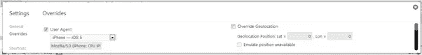

# Sencha Touch 的第一步

> 原文：<https://www.sitepoint.com/first-steps-in-sencha-touch/>

想要开发跨所有平台的移动应用程序吗？想开发 HTML5 移动应用？不知道从哪里开始？

本文旨在帮助您开始使用 Sencha Touch HTML5 框架的旅程。

## 什么是 Sencha Touch？

Sencha Touch 是一个用于开发移动应用程序的 HTML5 框架。它允许您开发与本地应用程序具有相同外观和感觉的移动应用程序。Sencha Touch 支持 Android、iOS、Windows Phone、微软 Surface Pro 和 RT 以及黑莓设备。

## 特征

*   UI 组件(面板、标签栏、导航视图、按钮、选择器)
*   组件可以根据目标设备进行主题化
*   在 PhoneGap 框架的帮助下，访问相机、加速度计等设备功能。

## 如何开始

从 Sencha 网站下载免费的 [Sencha Touch SDK](http://www.sencha.com/products/touch/download/) 和 [Sencha Cmd](http://www.sencha.com/products/sencha-cmd/download) 。请注意，Sencha Cmd 还将安装 Ant、Ruby、Sass 和 Compass，其中的一些或全部对于构建应用程序非常有用。

你还需要在你的电脑上运行一个网络服务器，例如 [XAMPP](http://www.apachefriends.org/en/xampp.html) 。

Sencha 网站建议“如果您在 Windows 上运行 IIS web 服务器，请手动添加`application/x-json`作为 MIME 类型，以便 Sencha Touch 正常工作。有关添加此 MIME 类型的信息，请参见以下链接:[http://stackoverflow.com/a/1121114/273985](http://stackoverflow.com/a/1121114/273985)。

## 装置

将 SDK zip 文件解压缩到项目目录中。您的 HTTP 服务器应该可以访问该文件夹，因此您可以在浏览器中导航到 HTTP://localhost/Sencha-Touch-2 . n 并查看 Sencha Touch 文档。

运行 Sencha Cmd 安装程序。安装程序将 Sencha 命令行工具添加到您的路径中，使您能够生成一个全新的应用程序模板，等等。

切换到 Sencha Touch 目录，输入`sencha `命令，确认 Sencha Cmd 安装正确，例如:

```
$ cd ~/webroot/sencha-touch-2.n/
$ sencha
Sencha Cmd v3.1.n
...
```

**注意**使用`sencha`命令时，你*必须*在下载的 SDK 目录或者生成的 Touch app 里面。更多详情参见 [Sencha Cmd](http://docs.sencha.com/touch/2.2.1/#!/guide/command) 文档。

您的开发和测试环境现在应该已经准备好了。

## Sencha 触摸项目

1.  Index.html-你的应用程序将被托管的页面。
2.  应用程序目录——应用程序通常是模型、视图、控制器、商店和配置文件的集合
    *   模型:表示应该在应用程序中使用/存储的数据类型
    *   视图:借助内置的 Sencha UI 组件/自定义组件向用户显示数据
    *   控制器:处理 UI 交互以及模型和视图之间的交互。
    *   存储:负责将数据加载到应用程序中
    *   配置文件:帮助定制各种手机和平板电脑的用户界面。
3.  资源目录–包含图像、css 和其他媒体资产
4.  App.js
    *   应用程序的全局设置
    *   包含应用程序名称、对所有模型、视图、控制器、配置文件和商店的引用
    *   包含在加载模型、视图、控制器、配置文件和商店后调用的应用程序启动功能。App launch 函数是应用程序的起点，其中第一个视图被实例化和加载。
    *   触摸目录–包含 Sencha 触摸框架文件。

## 试一个样品

让我们创建一个包含列表的简单导航视图。

#### Home.js

```
Ext.define('MyFirstApp.view.Home',{

    extend:'Ext.NavigationView',

    xtype:'Home',

    config:{

        items:[]

    }

});
```

我们来分析一下。

`Ext.define`函数帮助我们在名称空间`MyFirstApp/view`中定义一个名为`Home`的类。按照 Sencha Touch MVC 标准，所有视图组件都放在这个名称空间中。

`Extend`关键字指定`Home`类是`Ext.NavigationView`的子类。因此，`Home`类继承了`Ext.NavigationView`类的基本配置和实现。

`xtype`关键字用于实例化该类。

`Config`关键字帮助我们初始化那个特定类中使用的变量/组件。在这个例子中，我们应该用一个列表初始化导航视图。

主视图中的`Items`内容目前为空白。让我们创建一个列表视图，并将其引用放在主视图的 items 字段中。

首先，在 app 启动功能中呈现这个主视图

#### App.js

```
launch: function() {

    // Initialize the main view

    Ext.Viewport.add([{xtype:'Home'}]);

},
```

现在，让我们为列表中的数据创建一个简单的模型类。

#### my model . js-我的模型. js

```
Ext.define('MyFirstApp.model.MyModel',{

    extend:'Ext.data.Model',

    config:{

        fields:['name']

    }

});
```

让我们创建一个数据存储，并将其映射到上面的模型。

#### MyStore.js

```
Ext.define('MyFirstApp.store.MyStore',{

    extend:'Ext.data.Store',

    config:{

        model:'MyFirstApp.model.MyModel',

        autoLoad:true,

        data:[

            {name:'t1'},

            {name:'t2'}

        ],

        proxy:{

        type:'localstorage'

        }

    }

});
```

我们还用列表数据初始化了存储。

代理用于向模型加载数据。本地存储对象是一个 HTML5 特性，用于在浏览器中本地存储数据。还有其他代理。

Ajax——用于特定域内的请求

本地数据库–允许创建客户端数据库。

我们可以省略这个示例的代理，因为我们不会使用它。

#### MyList.js

```
Ext.define('MyFirstApp.view.MyList',{

    extend:'Ext.Panel',

    xtype:'MyList',

    requires:['Ext.dataview.List','Ext.data.Store'],

    config:{

        title:'My List',

        layout:'fit',

        items:[

        {

             xtype:'list',

             store:'MyStore',

             itemTpl:'<b>{name}<b>'

        }

        ]

    }

});
```

在上面的代码中，`MyList`视图是在名称空间`MyFirstApp.view`中创建的，它继承了`Ext.Panel`的属性。

当在一个特定的类中需要引用其他类时，这些类应该在`requires`字段下声明。Sencha Touch 确保加载了所需的类。

`MyList`视图初始化，标题为`My List`，布局为`fit`，内容为`List`组件。`List`组件被映射到数据存储。

`ItemTpl`表示关于列表应该如何显示给用户的数据模板。

现在我们将列表添加到我们的主页视图中

```
Ext.define('MyFirstApp.view.Home',{

    extend:'Ext.NavigationView',

    xtype:'Home',

    config:{

        items:[xtype:'MyList']

    }

});
```

上面的例子可以在 Chrome 浏览器中通过模拟各种移动分辨率进行测试。右键单击浏览器并选择“检查元素”。选择检查元素窗口右上角的设置图标。选择任何用户代理和解决方案。



## 结论

本文的目的是帮助您迈出 Sencha Touch 开发的第一步。那么，你还在等什么？

继续即兴创作，改编代码，引入您的想法，然后开发和发布您自己的 HTML5 移动应用程序。

## 分享这篇文章