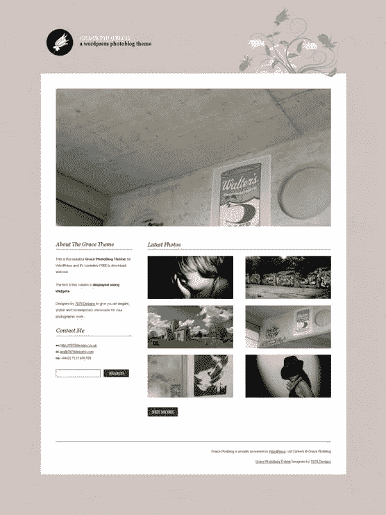
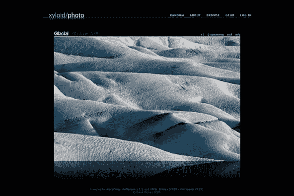

# WordPress 的五个免费的、非常可爱的图片博客主题

> 原文：<https://www.sitepoint.com/five-free-really-quite-lovely-photoblog-themes-for-wordpress/>

最近，我一直在寻找修补我自己的摄影博客，并通过大量的博客主题来寻找一些很好的组合。基于文本的博客有成百上千的 WordPress 主题，但是似乎仍然很难找到一个设计精美的图片博客主题。这里是我遇到的五个主题，它们都有很好的功能和设计，可以直接开箱即用，也可以根据你的需要轻松修改。

设计师安德里亚·米格诺拉(Andrea Mignola)设计的扎克 990 是一个令人印象深刻的主题，令人惊讶的是它不是一个高级主题。它基于[波士顿环球报大图](http://www.boston.com/bigpicture/)网站的理念，允许你上传最大 990 像素宽的图片。页脚部分有四列小部件就绪区域，您可以放入任何自己喜欢的小部件。

![clip_image002[11]](img/ae8870dad63dc857fd9ab710b9fb299e.png)

[**Grace**](http://7879designs.co.uk/demo/gracephotoblogtheme/) 显示高达 990 像素的特色图片旋转图库，下方有六个较小的缩略图。时尚且非常容易使用，这个主题简单干净，在主页和帖子页上有一个小区域用于放置小部件。

[**Occular 教授**](http://andreamignolo.com/ocular-professor/) 是摄影师的另一个不错的展示平台，也是由 Andrea Mignola 创作的。照片出现在左边，右边是一个布局很好的小区域，照片细节在右边。排版考虑得很好，在页面上看起来非常漂亮。

![clip_image002[9]](img/9f91e51be1869a4c7b40b1c0234b9169.png)

Xyloid 的 [**倒影**](http://xyloid.org/projects/reflection/) 使用 AJAX 将 EXIF 数据和照片描述显示为图像上的临时覆盖图。主题简单而优雅，一次显示一个图像，在页面的左上角有一个简单的导航系统。

我唯一不喜欢的一点(这确实是一个次要的个人问题)是图像下面的倒影。

[**全屏**](http://graphpaperpress.com/2009/06/10/fullscreen-wordpress-theme/) 是另一个你期望以高价获得的主题，但当你注册 [Graphpaper 主题](http://graphpaperpress.com/)的(免费)会员时，它是免费的。主页上有一系列你的图片，有很好的翻转效果。当你点击缩略图时，一张照片占满一栏。也可以使用照片组合的主题，并在右侧留出大量文本。一些摄影师可能会发现主页有点过于繁琐，更喜欢使用简单的布局，但很难不佩服这个主题的功能。页面底部有四列小部件。

![clip_image002[7]](img/d21c911514513074e5579f5a4dc10bcc.png)

WordPress 的摄影博客主题一直在变得越来越好，这些只是众多好主题中的五个。最近有哪些摄影博客主题让你印象深刻？

## 分享这篇文章