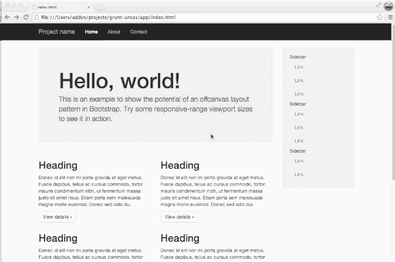

# 5 项你不想错过的繁重任务！

> 原文：<https://www.sitepoint.com/five-grunt-tasks-wont-want-miss/>

除非你在过去的几个月里生活在石头下，否则你肯定听说过 Grunt 或其他像 Gulp.js 这样的任务运行器(在我们的文章[gulp . js 简介](https://www.sitepoint.com/introduction-gulp-js/)中有更多关于这个主题的内容)。这个工具家族已经席卷了前端领域，彻底改变了成千上万的开发人员处理诸如连接、缩小、图像优化等繁琐活动的方式。

如果你是任务运行者的新手，尤其是 Grunt，你可以参考文章[用 Grunt 自动完成重复性任务](https://www.sitepoint.com/automate-recurring-tasks-grunt/)或者 [Grunt 入门指南](http://gruntjs.com/getting-started)。

在这篇文章中，我将向你展示五个你不想错过的单调任务(有时被称为单调插件)!

## 咕噜-自动预混器

如果你最近花了一些时间写 CSS，你知道我们必须处理许多实验性的属性和厂商前缀。这种活动是如此痛苦，以至于促成了诸如[我能用](http://caniuse.com/)和 [CSS3 拜托](http://css3please.com/)等网站的成功。多亏了 grunt-autoprefixer，这项活动将不再是一件痛苦的事情。

[grunt-autoprefixer](https://github.com/nDmitry/grunt-autoprefixer) 是一个基于 [Autoprefixer](https://github.com/ai/autoprefixer) 库的任务，它解析 CSS 并添加厂商前缀的 CSS 属性。确定一个属性是否需要一个或多个前缀的数据是从[我可以使用](http://caniuse.com/)数据库中提取的。在 grunt-autoprefixer 中，我们可以指定几个选项，但是最重要的一个肯定是`browsers`。后者接受一组值，允许我们指定项目中的目标浏览器和版本。我们的目标是只添加我们真正需要的前缀，这样我们的 CSS 就会尽可能的轻量级。

此任务的基本配置示例如下所示。在这个配置中，我们指定了一个名为`main.css`的解析文件。输出将被写入一个名为“main-prefixed.css”的文件。此外，输出将包含每个受支持浏览器的最后两个版本的前缀，以及 Internet Explorer 8、Internet Explorer 9 和 Opera 12.1(使用 Presto 引擎的最后一个版本)。

```
grunt.initConfig({
  autoprefixer: {
    options: {
      browsers: ['last 2 version', 'ie 8', 'ie 9', 'Opera 12.1']
    },
    dist: {
      src: 'src/css/main.css',
      dest: 'dest/css/main-prefixed.css'
    }
  }
});
```

## 咕噜-uncss

当我们谈论 CSS 的时候，让我们来看看 [grunt-uncss](https://github.com/addyosmani/grunt-uncss) 。这个任务基于 [UnCSS](https://github.com/giakki/uncss) ，由令人敬畏的 Addy Osmani 开发，从项目中移除未使用的 CSS。当在项目中使用 CSS 框架时，这项任务特别有用，因为我们不太可能使用框架的所有组件。使用 grunt-uncss 允许我们减少最终 css 文件的大小，从而缩短下载时间。

不幸的是，UnCSS 模块有两个重要的限制，grunt-uncss 反映了这一点。第一个问题是，UnCSS 不能识别运行时由 JavaScript 或用户交互(通过悬停、单击等)添加的 CSS 类。我们可以通过在一个名为`ignore`的选项中指定我们不想删除的类来部分解决这个问题，该选项既接受字面名称又接受正则表达式模式。第二个问题是解析器不能处理复杂的选择器。发生这种情况时，会引发一个错误。解决这个问题的最好方法是将有问题的选择器移到解析器不会处理的单独的样式表中。

下面的图片来自官方存储库，显示了正在运行的任务。



## grunt-wiredep(以前称为 grunt-bower-install)

Grunt 的名气是在 Bower 和 yo(他们组成了 Yeoman 工作流程)的帮助下增长的。Bower 是 JavaScript 和 CSS 的依赖管理器。如果你曾经使用过它，你会知道一旦下载，我们必须手动添加项目的组件到我们的主 HTML 文件中。如果我们有多个依赖项，那么这可能是一项单调乏味的工作。幸运的是，我们可以使用一个简单的任务，叫做 grunt-wiredep ( [以前叫做 grunt-bower-install](https://github.com/stephenplusplus/grunt-wiredep/commit/ed3ce38a76b8da4ecc1594c8a9a9d4a2bea61e68) )。grunt-wiredep 找到我们项目的组件，并根据我们的设置将它们注入到我们的源代码中。

该任务的基本配置如下:

```
grunt.initConfig({
  wiredep: {
    app: {
      src: [
        'index.html'
      ]
    }
  }
});
```

有了这个配置，为了管理我们项目的 JavaScript 依赖项，我们必须将这段代码放在我们的主 HTML 文件中(上面代码之后的`index.html`):

```
<!-- bower:js -->
<!-- endbower -->
```

现在，每当我们想要注入或更新依赖项时，我们可以简单地运行命令`grunt-widep`。该命令的结果将生成如下所示的结果:

```
<!-- bower:js -->
<script src="bower_components/jquery/jquery.js"></script>
<!-- endbower -->
```

## 咕哝-现代

当谈到 grunt-autoprefixer 时，我们提到了 CSS 中实验特性的概念。当我们想要使用现代的 JavaScript 功能时，我们需要测试浏览器来检查它是否支持给定的特性。为了完成这个任务(同时也为了测试 CSS 实验属性)，我们可以使用的最好的库是 [Modernizr](http://modernizr.com/) 。 [grunt-modernizr](https://github.com/Modernizr/grunt-modernizr) 是一个基于 modernizr 的任务，它解析我们项目的文件，搜索对 Modernizr 的引用。然后，它输出一个缩小版的库，只包含正在使用的特性。这个过程允许我们进一步减轻项目的重量。

grunt-modernizr 通过它提供的许多选项可以进行高度定制。下面是一个非常基本的配置示例:

```
grunt.initConfig({
  modernizr: {
    dist: {
      devFile: 'path/to/modernizr.js',
      outputFile: 'path/to/distribution-folder/custom-modernizr.js',
      files: {
        src: [
          'path/to/scripts/**/*.js',
          'path/to/styles/**/*.css',
        ]
      }
    }
  }
});
```

这个配置设置了 Modernizr 源文件的路径以及定制构建的创建位置。此外，它还指定了要扫描的文件，以查找 Modernizr 的引用。在我们的例子中，这些文件是分别位于`path/to/scripts`和`path/to/styles`文件夹中的所有`.js`和`.css`文件。

## 咕哝-并发

如果你使用的是一台带有强大处理器的电脑，运行`Gruntfile.js`的任务可能只需要几秒钟。但是，如果这个过程超过一分钟呢？我们如何加快这个过程？咕噜声-救援并发！grunt-concurrent 允许您并发地运行 grunt 任务，显著地改进构建时间。下面显示了一个配置示例。

```
grunt.initConfig({
  concurrent: {
    test: [
      'copy',
      'autoprefixer'
    ],
    build: [
      'concat',
      'uncss'
    ]
  }
});
```

在这个例子中，当执行`test`任务时，我们同时运行复制和自动修复任务*，当执行`build`任务时，我们同时运行 concat 和 uncss 任务*。**

 **## 结论

在本文中，我向您介绍了 Grunt 的一些最有趣的任务，至少在我看来是这样。这些任务比我们通常在项目中使用的非常基本的任务要高一点，比如 grunt-contrib-clean、grunt-contrib-copy 和 grunt-contrib-concat。这绝对不是有趣任务的完整列表，因为还有很多其他有用的任务。

现在轮到你了。你对提出的任务有什么看法？你知道他们吗？有什么任务是你热爱并想分享的吗？我们开始讨论吧。

## 分享这篇文章**