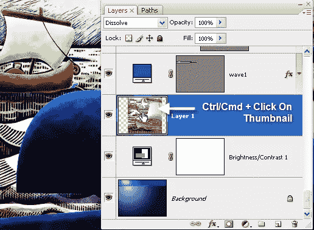
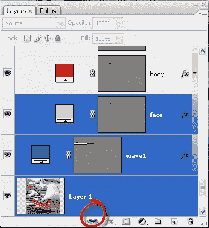
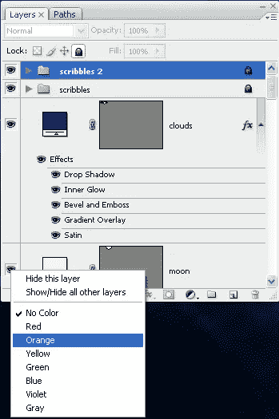

# 五个 Photoshop 图层速度技巧

> 原文：<https://www.sitepoint.com/five-photoshop-layers-speed-tricks/>

这里有一些提示和技巧可以帮助你在 Photoshop 中加快设计工作。除了第一眼看到的，还有更多层次…

**点击选择图层上的所有内容**

您可以通过按住 Ctrl 键(pc)或 Cmd 键(mac)并单击图层面板上的图层缩略图图标来快速选择图层上的所有对象。即使图层上有多个单独的对象，它们也会被全部选中。

**将每一层导出为单独的文件**

如果您在 Photoshop 中处理具有多个图层的文档，可以将这些图层中的每个图层导出为单独的文档。我使用它的一个例子是，当我用几层照片组成一个文档时，当我完成时，我可以快速地将它们分割成单独的文档。

你所需要做的就是选择**文件>脚本>导出图层到文件**。

**快速浏览混合模式**

当你试图通过混合模式混合两个图层来获得好的效果时，在图层面板的混合模式下拉菜单中来回切换会有点痛苦。这里的一个真正的省时方法是选择你的第一个混合模式，切换到移动工具，简单地按住 Shift 键并按下+(加号)。每次按下加号，它会进入下一个混合模式。

**一次将多个层从一个文档移动到另一个文档**

如果你想将一些图层从一个 Photoshop 文档移动到另一个文档，首先要做的是将图层链接在一起，方法是在图层面板中选择它们，然后单击图层面板底部的链接图标。然后从文档本身中拖动图层，而不是从图层面板中拖动。这将把所有的层带到第二个文档中。

##### 

#####  **颜色编码你的图层**

您可以在您的图层上使用颜色编码以进行组织。要为图层添加颜色，请右键单击(pc)或按住 Ctrl 单击(mac)要进行颜色编码的图层旁边的眼睛图标。会出现一个弹出菜单，你可以选择你想要的颜色。

对于使用图层面板和图层，你还有什么其他的技巧吗？

## 分享这篇文章