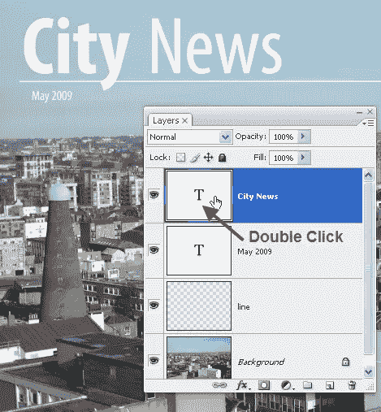
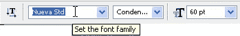
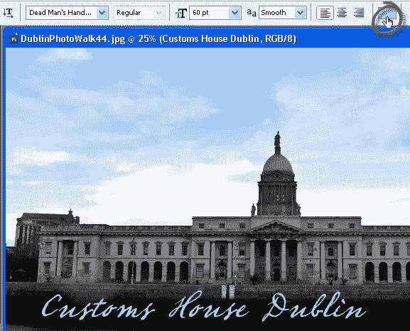
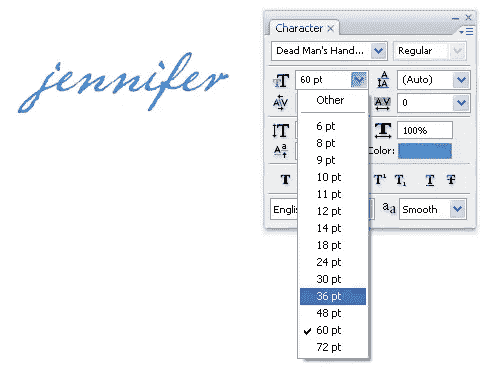
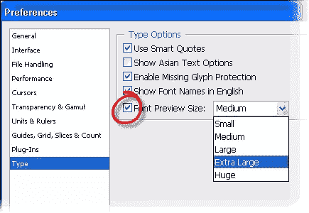
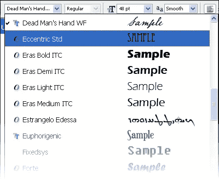

# 五个 Photoshop 类型的速度提示

> 原文：<https://www.sitepoint.com/five-photoshop-type-speed-tips/>

随着你在 Photoshop 中的技能提高，你会发现你想做任何事都更快，点击次数更少。幸运的是，Photoshop 为我们提供了不止一种方法来做许多事情。这里有五个加快打字速度的技巧和窍门。

**1。快速突出显示您的文本**

如果您正在处理图像，并且想要高亮显示文本，同时切换到文字工具，请双击图层面板中的“T”图标。现在你可以编辑了。

**2。改变你的字体，而不必回到字体下拉框**

突出显示图像中要更改的类型，然后按 Ctrl+ H (PC)或 Cmd+H (Mac)隐藏突出显示。然后，在工具选项栏中，在字体字段中单击一次，现在使用键盘上的上下箭头键来滚动已安装的字体。这大大节省了时间。

**3。查看您的血型的正确颜色**

如果您在 Photoshop 中选择文字，然后使用工具栏上的拾色器更改颜色，您将看不到正确的颜色，而是看到一种相反的颜色。然后，您需要取消选择突出显示的文本，以正确查看颜色。

以下是加快这一过程的方法。添加并提交类型后，只需点击屏幕顶部工具选项栏上的色样。从这里改变颜色可以让你看到动态的类型更新。

**4。编辑文本而不突出显示首先** 在图层面板中点击你的文字图层。然后打开角色面板(如果没有打开，选择窗口>角色)。现在你可以从角色面板中选择任何你想要的选项，改变会立即发生。

**5。放大文本预览。**
当你从工具选项栏的下拉列表中选择字体时，Photoshop 会显示字体的名称，旁边还有一个小样本。如果你发现样品太小而无法实际辨认，你可以通过**编辑>首选项>键入**来改变它的大小。
选择小、中、大、超大或巨大来改变字体预览大小。

这就是特大号的样子；

所以你有它！如果你开始使用这些技巧，你应该是一个 Photoshop 类型的速度恶魔。

你还会用什么其他类型的把戏？

## 分享这篇文章