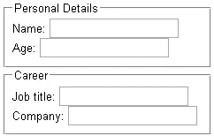
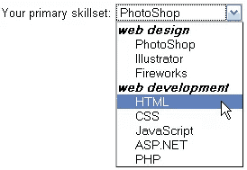

# 5 个最不常用的 HTML 标签

> 原文：<https://www.sitepoint.com/five-under-used-html-tags/>

 HTML 只有几十个元素，但是我们忙碌的开发人员经常忘记为手头的工作使用正确的标签。当有更多合适的选择时，添加一个`<div>`或一个`<span>`就太容易了。

这里有五个标签可能是你的 HTML 武库中所缺少的…

**1。`<label>`**
你的`<form>`中每一个可见字段都应该有一个`<label>`，例如

```
<label for="email" title="enter your email">email:</label>
<input type="text" id="email" name="email" />
```

对于属性，使用**将`<label>`与字段的 ID 相关联。如果需要，可选的**标题**属性可用于提供进一步的信息。**

标签对于可访问性很有用，单击它们可以将焦点设置到字段上。在复选框和单选按钮的情况下，点击标签将改变字段的状态，例如

```
<p>Choose your preferred newsletter format:</p>

<input type="radio" id="format_1" name="format" value="html" checked="checked" />

<label for="format_1">HTML format</label>

<input type="radio" id="format_2" name="format" value="plain" />

<label for="format_2">plain text format</label>
```

任意数量的标签可以与单个字段相关联。这在显示验证错误消息时可能很有用。

**2。使用`<fieldset>`，可以将`<fieldset>`和`<legend>`**
表单字段分组为一个或多个逻辑部分。需要注意的是，像`<input>`、`<select>`和`<textarea>`这样的字段应该包装在一个像`<fieldset>`这样的块级元素中，而不是包装在`<form>`元素本身中。

元素给一个`<fieldset>`添加一个标题。示例:

```
<form action="formhandler.php" method="post">

<fieldset>

<legend>Personal Details</legend>

<label for="name">Name:</label>

<input type="text" id="name" name="name" />

<label for="age">Age:</label>

<input type="text" id="age" name="age" />

</fieldset>

<fieldset>

<legend>Career</legend>

<label for="job">Job title:</label>

<input type="text" id="job" name="job" />

<label for="company">Company:</label>

<input type="text" id="company" name="company" />

</fieldset>

</form>
```



**3。`<optgroup>`**
`<select>`框`<option>`元素可以使用`<optgroup>`标签分组为一个或多个逻辑部分。**标签**属性为 optgroup 分配一个标题。

```
<label for="skillset">Your primary skillset:</label>

<select id="skillset" name="skillset">

<optgroup label="web design">

<option value="ps">PhotoShop</option>

<option value="il">Illustrator</option>

<option value="il">Fireworks</option>

</optgroup>

<optgroup label="web development">

<option value="html">HTML</option>

<option value="css">CSS</option>

<option value="js">JavaScript</option>

<option value="net">ASP.NET</option>

<option value="php">PHP</option>

</optgroup>

</select>
```



**4。使用`<dl>`可以创建`<dl>`、`<dt>`和`<dd>`、**、
定义列表，例如字典或联系人详细信息。每个列表应包含至少一个定义术语`<dt>`和定义描述`<dd>`，例如

```
 <dl>

<dt>HTML</dt>

<dd>Your content is defined in Hyper-Text Mark-up Language</dd>

<dt>CSS</dt>

<dd>Your layout is defined using Cascading Style Sheets</dd>

<dt>JavaScript</dt>

<dd>Client-side functionality is implemented using JavaScript</dd>

</dl> 
```

**5。`<q>`和`<cite>`**
`<q>`与`<blockquote>`类似，但用于短报价。`<cite>`包含对其他来源的引用或参考，例如

```
<p><cite>Bill Gates</cite> said <q>640K ought to be enough for anybody</q>.</p>
```

另见: [HTML:被遗忘的 5 大元素](https://www.sitepoint.com/html-the-top-five-forgotten-elements/)。

我错过了你最喜欢的未使用标签吗？

## 分享这篇文章