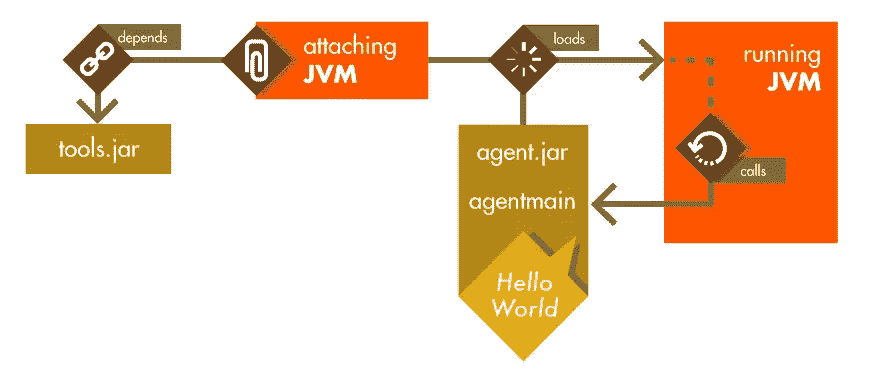

# 使用动态附加修复运行 Java 代码中的错误

> 原文：<https://www.sitepoint.com/fixing-bugs-in-running-java-code-with-dynamic-attach/>

### 目录 

*   [Attach API:用动态附件渗透另一个 JVM](#attachapiinfiltratinganotherjvmwithdynamicattachment)
*   [插装 API:改变目标虚拟机的程序](#instrumentationapichangingthetargetvmsprogram)
*   [与字节伙伴一起跟踪内存泄漏](#trackingmemoryleakswithbytebuddy)
*   [字节码操作](#bytecodemanipulation)
*   [分析泄漏的应用程序](#analyzingaleakingapplication)
*   [总结](#summary)
*   [评论](#comments)

大多数开发人员都知道 [Java 的 HotSwap 特性](https://docs.oracle.com/javase/8/docs/technotes/guides/jpda/enhancements1.4.html#hotswap)是内置于大多数 JVM 中的调试工具。使用这个特性，可以在不重新启动 Java 进程的情况下更改 Java 方法的实现，而 Java 进程通常是在开发代码时通过 IDE 使用的。然而，热交换在生产环境中也同样适用。这样，它可以用来扩展一个正在运行的应用程序，或者在没有中间中断的情况下修复正在运行的程序中的小错误。在本文中，我想展示动态附件，用附件和插装 API 应用运行时代码更改，并介绍 [Byte Buddy](http://bytebuddy.net) ，这是一个库，它提供了使这种代码更改更加方便的 API。

例如，考虑一个正在运行的应用程序，它检查一个名为`X-Priority`的 HTTP 头是否出现在请求中，以便接受服务器的特殊处理。该检查由以下实用程序类应用:

```
class HeaderUtility {

    static boolean isPriorityCall(HttpServletRequest request) {
        return request.getHeader("X-Pirority") != null;
    }

} 
```

你发现印刷错误了吗？诸如此类的错误太常见了，尤其是当常量值被分解为测试代码中重用的静态字段时。在一个不幸的例子中，这个错误只会在生产设置中被发现，在生产设置中，标题是由另一个没有拼写错误的应用程序生成的。

修复像上面这样的错误可能不是问题。在持续交付的时代，重新部署一个新版本可能只需要点击一个按钮。在其他情况下，更改可能不那么容易，重新部署可能是一个复杂的过程，宕机是不可接受的，忍受错误是更好的选择。然而，对于 HotSwap，有另一种选择来应用小的改变，同时避免应用程序重启。

## Attach API:用动态附件渗透另一个 JVM

为了改变一个活动的 Java 程序，我们首先需要一种与正在运行的 JVM 通信的方法。由于 Java 虚拟机实现了一个托管环境，幸运的是有一个标准的 API 来实现这一点。正在讨论的 API 也被称为*附件 API* ，它是官方 Java 工具的一部分。使用正在运行的 JVM 公开的这个 API，第二个 Java 进程就有可能与之通信。

事实上，我们都已经使用过这个 API:它被任何调试和监控工具如 [*VisualVM*](https://github.com/visualvm) 或[*Java Mission Control*](http://www.oracle.com/technetwork/java/javaseproducts/mission-control/java-mission-control-1998576.html)所应用。然而，用于应用这种附件的 API 没有与我们日常工作中熟知和使用的标准 Java APIs 捆绑在一起。相反，API 被捆绑在一个特殊的文件中，即 *tools.jar* ，它只包含在虚拟机的 JDK 捆绑发行版中。更糟糕的是，这个 JAR 文件的位置没有设置，它在 Windows、Linux 和特别是 Macintosh 的虚拟机上是不同的，文件不仅在不同的位置，而且在某些发行版上还被命名为 *classes.jar* 。最后，IBM 决定甚至通过将所有的`com.sun`类移到`com.ibm`名称空间来重命名这个 JAR 中包含的一些类，这又增加了一个麻烦。在 Java 9 中，这种混乱最终得到了清理，其中 *tools.jar* 被[Jigsaw 模块*JDK . attach*所取代。](http://download.java.net/java/jigsaw/docs/jdk/api/attach/spec/jdk.attach-summary.html)



找到 API JAR(或模块)后，我们必须让它对连接的*进程可用。在 OpenJDK 上，用于连接到另一个虚拟机的类被命名为`VirtualMachine`，它提供了一个入口点，可以访问由 JDK 运行的任何虚拟机或同一物理机上的常规 HotSpot JVM。通过进程 id 连接到另一个虚拟机进程后，我们能够在目标虚拟机的指定线程中运行 JAR 文件:*

```
// the following strings must be provided by us
String processId = processId();
String jarFileName = jarFileName();
VirtualMachine virtualMachine = VirtualMachine.attach(processId);
try {
    virtualMachine.loadAgent(jarFileName, "World!");
} finally {
    virtualMachine.detach();
} 
```

在接收到 JAR 文件时，目标虚拟机查找 JAR 的清单并在`Premain-Class`属性下定位该类。这与虚拟机执行`main`方法的方式非常相似。然而，使用 Java 代理，具有指定进程 id 的 VM 会寻找一个名为`agentmain`的方法，然后由远程进程在一个专用线程中执行该方法:

```
public class HelloWorldAgent {

    public static void agentmain(String arg) {
        System.out.println("Hello, " + arg);
    }

} 
```

使用这个 API，我们现在能够在任何 JVM 上打印一条`Hello, World!`消息，只要我们知道它的进程 id。为了访问 *tools.jar* ，甚至可以与不属于 JDK 发行版的 JVM 通信，只要附加的 VM 是 JDK 安装。

## 检测 API:更改目标虚拟机的程序

到目前为止，一切顺利。但是尽管与目标虚拟机进行了成功的通信，我们仍然无法在目标虚拟机上更改代码，错误仍然存在。对于后一种变化，Java 代理可以定义第二个参数，采用一个`Instrumentation`类型的实例。后一个接口的实现提供了对几个低级功能的访问，其中之一是改变加载代码的能力。

为了修复`"X-Pirority"`的错别字，让我们首先假设我们在下面开发的`BugFixAgent`旁边的代理的 JAR 文件中为`HeaderUtility`包含了一个固定的类文件，名为 *typo.fix* 。此外，我们需要给我们的代理添加`Can-Redefine-Classes: true`到它的清单文件来替换现有的类。有了这个预置，我们现在可以使用 instrumentation API 重新定义正在讨论的类，该 API 接受成对的加载类和字节数组来执行类的重新定义:

```
public class BugFixAgent {

    public static void agentmain(String arg, Instrumentation inst)
            throws Exception {
        // only if header utility is on the class path; otherwise,
        // a class can be found within any class loader by iterating
        // over the return value of Instrumentation::getAllLoadedClasses
        Class<?> headerUtility = Class.forName("HeaderUtility");

        // copy the contents of typo.fix into a byte array
        ByteArrayOutputStream output = new ByteArrayOutputStream();
        try (InputStream input =
                BugFixAgent.class.getResourceAsStream("/typo.fix")) {
            byte[] buffer = new byte[1024];
            int length;
            while ((length = input.read(buffer)) != -1) {
                output.write(buffer, 0, length);
            }
        }

        // Apply the redefinition
        instrumentation.redefineClasses(
                new ClassDefinition(headerUtility, output.toByteArray()));
    }

} 
```

运行上面的代码后，`HeaderUtility`类被重新定义来表示它的补丁版本。对`isPrivileged`的任何后续调用现在都将读取正确的头。作为一个小小的警告，JVM 可能会在应用类重定义时执行完整的垃圾收集，并且还需要重新优化任何受影响的代码。总的来说，这导致了应用程序性能的一个小的瓶颈。然而，在大多数情况下，与完全重启一个进程相比，这仍然是一个更好的选择。

当应用代码更改时，确保新类定义了与它所替换的类完全相同的字段、方法和修饰符是很重要的。尝试修改任何此类属性的类重定义会导致`UnsupportedOperationException`。然而，HotSpot 团队正试图在某一天解决这个限制。同样，基于 OpenJDK 的[动态代码进化虚拟机](https://java.net/projects/dcevm)允许预览这个特性。


## 用字节伙伴跟踪内存泄漏

当熟悉检测 API 时，上面例子中的简单的 bug 修复代理很容易实现。然而，只需稍加努力，就可以在不手动创建修补的类文件的情况下，而是通过在运行代理时重写现有的类文件，来应用更一般的代码更改。

### 字节码操作

编译后的 Java 代码被表示为一列字节码指令。从这个意义上说，Java 方法只不过是一个字节数组，其中的每个字节要么代表运行时的一个指令，要么代表最近指令的一个参数。任何字节到其含义的映射是在 Java 虚拟机规范中定义的[，其中字节`0xB1`例如指示 VM 从具有 void 返回类型的方法返回。因此，增强字节码只不过是扩展一个方法的字节数组，以包含表示我们想要应用的附加逻辑的附加指令。](https://docs.oracle.com/javase/specs/jvms/se8/html/)

当然，逐字节的代码操作既麻烦又容易出错。为了避免手动过程，各种库提供了不需要立即处理 Java 字节代码的高级 API。一个这样的库是 [Byte Buddy](https://github.com/raphw/byte-buddy) (我是它的作者)。它的特性之一是能够定义在方法的原始代码之前和之后执行的模板方法。

### 分析泄漏的应用程序

例如，假设一个已经运行了一段时间的应用程序在生产几周后被发现泄漏资源。像这样的错误很难追踪，因为在一个可观察的测试环境中很难重现类似的糟糕状态。因此，我们可以更改应用程序代码来跟踪当前进程中的泄漏，而不是简单地重新启动损坏的应用程序来解决问题(就目前而言)。为了找出应用程序在哪里泄漏了句柄，我们想要跟踪任何[对象](https://docs.oracle.com/javase/8/docs/api/java/io/Closeable.html)的生命周期。使用 Java 代理，我们可以改变任何此类对象的任何构造或关闭。有了这些信息，我们就有希望确定在什么情况下什么对象会泄漏。

#### 使用模板进行操作

为了实现这种行为，我们首先定义模板，其中包含我们想要添加到任何`Closeable`对象的构造函数或`close`方法调用中的代码。为了了解泄漏对象是在哪里创建或关闭的，我们希望打印每个此类事件的堆栈跟踪。此逻辑的模板方法如下所示:

```
class ConstructionTemplate {

    @Advice.OnMethodExit
    static void exit(@Advice.This Object self) {
        new RuntimeException("Created: " + self).printStackTrace();
    }

}

class CloseTemplate {

    @Advice.OnMethodEnter
    static void enter(@Advice.This Object self) {
        new RuntimeException("Closed: " + self).printStackTrace();
    }

} 
```

模板方法用`OnMethodExit`和`OnMethodEnter`标注，以通知 Byte Buddy 我们何时需要调用它们。它们的任何参数都被注释，以指示它在重新定义的方法中表示的值。当应用模板时，Byte Buddy 将任何访问映射到一个参数，以加载注释的值，就像通常用`this`表示的方法实例一样。

为了将这种改变应用于任何实现`Closable`接口的类，Byte Buddy 提供了一种特定于域的语言，用于创建一个与类型和方法相匹配的 Java 代理，并应用上述模板(如果它们适用的话):

```
public class TracingAgent {

    public static void agentmain(String arg, Instrumentation inst) {
        new AgentBuilder.Default()
                // by default, JVM classes are not instrumented
                .ignore(none())
                .disableClassFormatChanges()
                .with(AgentBuilder.RedefinitionStrategy.RETRANSFORMATION)
                .type(isSubTypeOf(Closable.class))
                .transform((builder, type, loader) -> builder
                        .visit(Advice
                                .to(ConstructionTemplate.class)
                                .on(isConstructor()))
                        .visit(Advice
                                .to(CloseTemplate.class)
                                .on(named("close").and(takesArguments(0)))
                        ))
                .installOn(inst);
    }

} 
```

默认情况下，Byte Buddy 不会插入在`java.*`名称空间中定义的类，这个名称空间是通过设置一个不活动的忽略匹配器来改变的。此外，在我们应用重新转换时，需要指示 Byte Buddy 永远不要改变前面讨论过的类文件格式。这样做时，Byte Buddy 会自动检测任何实现了`Closable`接口的现有或未来类型，并将上述模板代码添加到其构造函数和 close 方法中。

#### 连接代理

Byte Buddy 还提供了在运行时连接代理的便利方法。为了处理不同的 *tools.jar* 位置和`VirtualMachine`类型，Byte Buddy 为附件添加了一个抽象，其中正确的设置被自动检测。将上述代理打包到 JAR 文件中后，可以通过调用以下命令将它附加到资源泄漏进程:

```
File jarFile = getAgent();
String processId = getProcessId();
ByteBuddyAgent.install(jarFile, processId); 
```

当然，上面的代理会很快为手工处理创建太多的输出。为了提供更多的便利，收集所有创建的对象直到它们被释放会更有意义。然而，通过创建 Java 代理，这就像编写实现这种行为的 Java 应用程序一样简单。

## 摘要

在本文中，我们研究了 attach API，它使得将 Java 代理按顺序注入任何正在运行的 JVM 进程成为可能。代理由一个 JAR 文件表示，该文件包含一个带有`agentmain`方法的类，远程进程在一个专用线程中执行该方法。作为一个参数，这个方法接收一个`Instrumentation`接口的实例，该接口允许重新定义加载的类。通过用补丁版本替换整个类文件或者通过动态修改现有类的字节码来重新定义代码，这可以通过使用诸如[字节伙伴](http://bytebuddy.net)之类的库来简化。

## 分享这篇文章