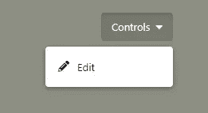
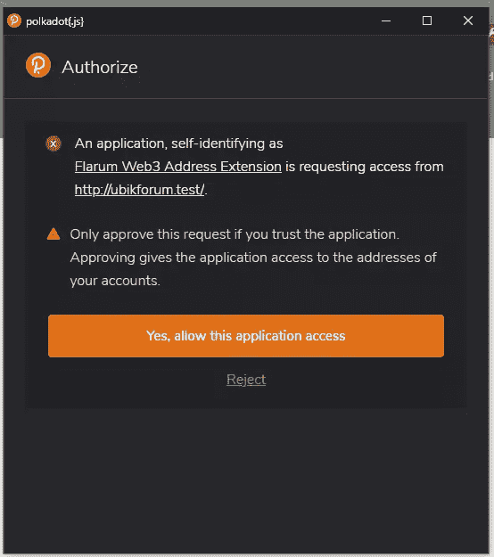
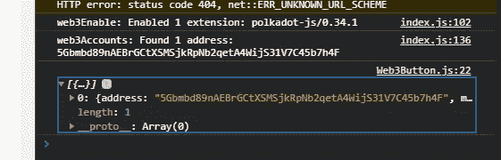
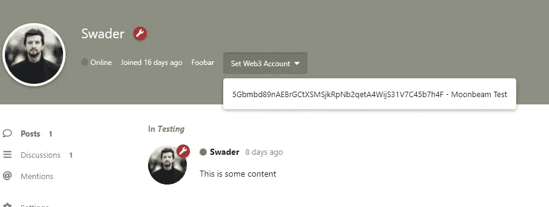
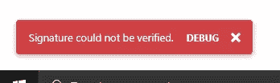

# 扩展 Flarum:向用户配置文件添加 Web3 地址

> 原文：<https://www.sitepoint.com/flarum-add-web3-address-to-user-profile/>

**在我们的第一个 Flarum 教程——“[编写 Flarum 扩展:构建自定义字段](https://www.sitepoint.com/writing-a-flarum-extension-building-a-custom-field/)”中，我们介绍了如何在一个名为 [Flarum](https://flarum.org) 的速度极快且极具可扩展性的开源论坛软件中向用户的个人资料添加一个新的自定义字段。我们添加的字段是`web3address`，一个用户的 Web3 身份的账户。**

在第二个教程中，我们更进一步，允许用户将 Web3 地址添加到他们的个人资料中。

ℹ:注意到，Web3 生态系统是一个新的分散托管、自有数据和抗审查通信的互联网。关于 Web3 的入门，请参见[在 FOSDEM](https://www.youtube.com/watch?v=St8x8hewc30) 的 15 分钟演讲。

## 加密添加 Web3

在这一点上，我们的自定义字段工作，可由用户设置，并可由论坛管理员编辑。现在让我们确保用户能够以加密的方式添加他们的地址。

这意味着用户只能添加他们已经证明拥有的地址。您可以通过用地址的私钥签署消息来证明对该地址的所有权。只有拥有公-私密钥对的私钥的人才被认为是该密钥对的所有者。公共-私有密钥对的公共部分是 Web3 地址数学推导的基础。

要拥有一些地址，用户应该安装 [Polkadot JS 扩展](https://github.com/polkadot-js/extension)并创建一个帐户。用户界面应该是不言自明的，但是如果需要的话，这里有更详细的指南。

我们在上一个教程中添加的字段目前允许用户手动设置任何值，但这意味着用户可以输入任何人的地址，甚至一些胡言乱语。我们希望他们只添加他们自己的，所以我们将替换为一个按钮，它将:

*   请求允许访问包含帐户的浏览器扩展
*   加载帐户，并提供下拉菜单选择其中一个
*   要求用户用该地址签署消息并验证签名
*   将该帐户注册为用户的 Web3 地址

让我们开始吧。

### 纽扣

首先，我们需要将我们的 Web3 输入字段更改为一个下拉列表。让我们来创造`components/Web3Dropdown.js`:

```
import Component from "flarum/Component";
import Dropdown from "flarum/components/Dropdown";

export default class Web3Dropdown extends Component {
  view() {
    return (
      <Dropdown
        buttonClassName="Button"
        onclick={this.handleClick.bind(this)}
        label="Add Web3 Account"
      >
      </Dropdown>
    );
  }

  handleClick(e) {
    console.log("Pick something");
  }
} 
```

我们以之前创建的样式`Web3Field.js`创建一个新组件，但是现在我们返回 Dropdown 组件的一个实例。Dropdown 组件是 Flarum 中几个标准 JS 组件之一。你可以在这里找到完整的名单[。我们还给它一个类“Button ”,使它的风格与论坛的其他部分相匹配。点击时，我们打印一条信息。](https://api.docs.flarum.org/js/v0.1.0-beta.14/identifiers.html#common-components)

该组件是一个按钮，能够从传入的项目中调用下拉菜单，很像论坛管理员可以在用户配置文件中看到的“控制”菜单:



### 属国

在扩展的 JS 文件夹中，我们将添加两个依赖项:

```
yarn add @polkadot/util-crypto @polkadot/util @polkadot/extension-dapp 
```

*注意，⚠:，如果你还在运行`yarn dev`，不要忘记停止进程，也不要忘记在安装完这些依赖项后重新启动它！*

`util-crypto`包含一些用于加密操作的实用函数。包含一些基本的工具，比如将字符串转换成字节等等。(这里有[两者的文档](https://github.com/polkadot-js/common/tree/master/packages/util-crypto)。)`extension-dapp`是一个助手层，让我们编写的 JS 与我们安装的 Polkadot JS 扩展交互。(点击访问[文档。)](https://github.com/polkadot-js/extension)

### 请求许可和获取帐户

现在让我们修改下拉菜单，询问用户访问其 Web3 帐户的权限:

```
 import { web3Accounts, web3Enable } from "@polkadot/extension-dapp";

  // ...

  async handleClick(e) {
    await web3Enable("Flarum Web3 Address Extension");
    const accounts = await web3Accounts();
    console.log(accounts);
  } 
```

注意我们把`handleClick`函数改成了`async`！我们需要这个能够`await`在法典中的承诺。否则，我们会被嵌套的`then`调用所困。

首先我们调用`web3Enable`，它请求我们允许访问扩展。然后，我们获取用户的所有帐户，并在控制台中输出它们。如果您已经安装了 Polkadot JS 扩展并加载了一些帐户，现在可以随意尝试一下了。





但是如果有人没有安装扩展怎么办？我们可以有一个管理员级别的设置，让我们选择是否隐藏按钮，如果扩展不在，或者重定向用户到它的网址，但现在，让我们选择后者:

```
 import { web3Accounts, web3Enable, isWeb3Injected } from "@polkadot/extension-dapp";

  // ...

  async handleClick(e) {
    await web3Enable("Flarum Web3 Address Extension");
    if (isWeb3Injected) {
      const accounts = await web3Accounts();
      console.log(accounts);
    } else {
      window.location = "https://github.com/polkadot-js/extension";
    }
  } 
```

### 挑选客户

下一步是让用户选择一个帐户，同时要求他们用它签署一条消息。一旦被验证，该签名无可辩驳地证明了帐户的所有权。

Dropdown 组件接受一个要显示的项目的`items`数组。这通常是一个由`Button`元素组成的数组，其中[按钮](https://api.docs.flarum.org/js/v0.1.0-beta.14/class/src/common/components/button.js~button)是一个常见的 Flarum 组件。为了给我们的组件一个组件范围的数据属性，我们可以操纵它并基于它进行更改，我们在`oninit`中定义了它:

```
 oninit() {
    this.web3accounts = [];
  } 
```

我们将`accounts`设置为这个新属性，而不是仅仅`console.log`设置`accounts`:

```
this.web3accounts = accounts;
m.redraw(); 
```

*注意⚠:我们在这里使用`redraw`让`mithril` ( `m`)重新渲染我们的组件。如果我们不这样做，组件将首先呈现一个空的下拉列表(它还没有帐户)，并需要再次关闭-打开下拉列表以显示帐户(这将触发重绘)。我们希望帐户在下拉列表**中被加载** strong >，即使下拉列表已经打开并且没有任何元素，这样就可以了。每当您需要在没有 UI 触发器的情况下动态地将更改应用到组件时，通常基于一些远程数据获取或数据处理，您可以使用`m.redraw()`。*

最后，我们让负责渲染的函数`view`对这一变化做出反应:

```
 view() {
    const items = [];
    if (this.web3accounts.length) {
      for (let i = 0; i < this.web3accounts.length; i++) {
        items.push(
          <Button
            value={this.web3accounts[i].address}
            onclick={this.handleAccountSelect}
          >
            {this.web3accounts[i].address}
            {this.web3accounts[i].meta.name
              ? ` - ${this.web3accounts[i].meta.name}`
              : ""}
          </Button>
        );
      }
    }
    return (
      <Dropdown
        buttonClassName="Button"
        onclick={this.handleClick.bind(this)}
        label="Set Web3 Account"
      >
        {items}
      </Dropdown>
    );
  } 
```

首先，我们定义一个空的占位符数组。然后，如果这个组件中存储了多于零个的`web3accounts`,我们遍历它们，为每个帐户创建一个按钮，将值设置为帐户的地址，将标签设置为地址和 in-extension 定义的标签的组合。最后，我们将这些按钮传递给 Dropdown 组件。

我们还需要导入按钮组件:

```
import Button from "flarum/components/Button"; 
```

*注意ℹ:注意到我们没有将`this`绑定到每个按钮的`onclick`事件处理程序。这是因为`this`会将按钮的上下文更改为父 Dropdown 组件，而不是被单击的按钮，并且会使获取按钮的值变得不那么简单。*

接下来，我们需要对用户点击菜单中的一个地址做出反应:

```
 handleAccountSelect() {
    console.log(this.value);
  } 
```

测试后会发现，我们确实可以从我们的扩展中选择一个 Web3 帐户，并且在选择后它会登录到控制台中。




### 验证帐户

最后，我们需要要求用户签署一条消息。假设信息是“极端所有权”。这将提示他们在扩展弹出窗口中提交密码，并返回一条签名消息。

首先，一些进口:

```
import {
  web3Accounts,
  web3Enable,
  isWeb3Injected,
  web3FromAddress,  // <-- this is new
} from "@polkadot/extension-dapp";
import { stringToHex } from "@polkadot/util"; // <-- this is new 
```

`web3FromAddress`是一种构建 Web3 对象的简便方法，Web3 对象是 web 3 交互的标准对象，以给定的地址作为“主角”。`stringToHex`用于将字符串转换为十六进制表示，这是签名者期望的数据格式(字节):

```
 async handleAccountSelect() {
    const address = this.value;
    const web3 = await web3FromAddress(address);
    const signer = web3.signer;
    const hexMessage = stringToHex("Extreme ownership");
    try {
      const signed = await signer.signRaw({
        type: "bytes",
        data: hexMessage,
        address: address,
      });
      console.log(signed);
    } catch (e) {
      console.log("Signing rejected");
      return;
    }
  } 
```

我们首先将函数转换成一个`async`函数，这样我们就可以使用`await`。然后我们从我们的地址创建一个`web3`实例，如上所述，并提取签名者。签名器是一种加密工具，它会自动从地址中提取公钥，并对给定的消息进行签名，以字节为单位。(这就是我们需要`hexMessage`的目的——将我们的字符串转换成以十六进制表示的字节。)

得到`signed`的唯一方法就是签字；其他所有事情都会导致抛出一个错误。

### 保存帐户

最后，我们按照与前面相同的过程处理`Web3Field.js`——将地址传入`save`:

```
 async handleAccountSelect() {
    const address = this.value;
    const web3 = await web3FromAddress(address);
    const signer = web3.signer;
    const hexMessage = stringToHex("Extreme ownership");
    try {
      const signed = await signer.signRaw({
        type: "bytes",
        data: hexMessage,
        address: address,
      });
      console.log(signed);
      const user = app.session.user;
      user
        .save({
          web3address: address,
        })
        .then(() => m.redraw());
    } catch (e) {
      console.log("Signing rejected");
      return;
    }
  } 
```

*注意ℹ:我们添加`m.redraw`以在保存后刷新屏幕上的值。redraw 将触发扩展的 JavaScript 的刷新，并从保存操作返回的用户实例中读入数据，如果保存成功，显示我们更新的地址。*

### 服务器端验证

这相当安全。即使有人绕过我们的 JS，插入一个不属于他们的 Web3 地址，他们也不能真正做什么。他们只能把自己伪装成另外一个人。不过，我们也可以通过做一些服务器端验证来解决这个问题。

因为目前还没有针对我们正在使用的加密函数的 PHP 工具包，所以我们需要创新。具体来说，我们将用 TypeScript 编写一个命令行脚本，我们将从 PHP 内部调用它。

在`js/src/forum`中，创建`scripts`文件夹，添加文件`verify.js`:

```
let util_crypto = require("@polkadot/util-crypto");

util_crypto
  .cryptoWaitReady()
  .then(() => {
    const verification = util_crypto.signatureVerify(
      process.argv[2], // message
      process.argv[3], // signature
      process.argv[4] // address
    );
    if (verification.isValid === true) {
      console.log("OK");
      process.exitCode = 0;
    } else {
      console.error("Verification failed");
      process.exitCode = 1;
    }
  })
  .catch(function (e) {
    console.error(e.message);
    process.exit(1);
  }); 
```

加密工具包包含了我们需要的所有帮助方法。等待加密操作初始化——特别是，我们在这里使用的 sr25519 需要一片 WASM 来预热。然后，我们通过处理提供的参数，使用`signatureVerify`函数来验证签名。

我们可以在本地测试这一点(在下拉列表中设置地址后，从保存请求的有效负载中获取值，或者通过在 [Polkadot UI](https://ipfs.io/ipns/kusama.dotapps.io/#/signing) 中手动签署“极端所有权”消息):

```
$ node src/forum/scripts/verify.js "Extreme ownership" 0x2cd37e33c18135889f4d4e079e69be6dd32688a6bf80dcf072b4c227a325e94a89de6a80e3b09bea976895b1898c5acb5d28bccd2f8742afaefa9bae43cfed8b 5EFfZ6f4KVutjK6KsvRziSNi1vEVDChzY5CFuCp1aU6jc2nB
> OK 
```

```
$ node src/forum/scripts/verify.js "Wrong message" 0x2cd37e33c18135889f4d4e079e69be6dd32688a6bf80dcf072b4c227a325e94a89de6a80e3b09bea976895b1898c5acb5d28bccd2f8742afaefa9bae43cfed8b 5EFfZ6f4KVutjK6KsvRziSNi1vEVDChzY5CFuCp1aU6jc2nB
> Verification failed 
```

我们的验证脚本有效。

*注意ℹ:由相同地址签名的相同消息每次都会给出不同的散列。不要指望他们是一样的。比如这三个有效载荷是同一个地址 3 次签名的“极端所有权”:*

```
// {"web3address":"5EFfZ6f4KVutjK6KsvRziSNi1vEVDChzY5CFuCp1aU6jc2nB","signedMessage":"0x0c837b9a5ba43e92159dc2ff31d38f0e52c27a9a5b30ff359e8f09dc33f75e04e403a1e461f3abb89060d25a7bdbda58a5ff03392acd1aa91f001feb44d92c85"}""
// {"web3address":"5EFfZ6f4KVutjK6KsvRziSNi1vEVDChzY5CFuCp1aU6jc2nB","signedMessage":"0x3857b37684ee7dfd67304568812db8d5a18a41b2344b15112266785da7741963bdd02bb3fd92ba78f9f6d5feae5a61cd7f9650f3de977de159902a52ef27d081"}""
// {"web3address":"5EFfZ6f4KVutjK6KsvRziSNi1vEVDChzY5CFuCp1aU6jc2nB","signedMessage":"0xa66438594adfbe72cca60de5c96255edcfd4210a8b5b306e28d7e5ac8fbad86849311333cdba49ab96de1955a69e28278fb9d71076a2007e770627a9664f4a86"}""
```

我们还需要在`Dropdown`组件中修改我们的`app.session.user.save`调用，这样它实际上将签名的消息发送到后端:

```
 user
    .save({
      web3address: address,
      signedMessage: signed.signature,
    })
    .then(() => console.log("Saved")); 
```

当我们的`web3address`值被保存到一个用户上时，我们需要拦截该操作，只有当保存的是用户而不是管理员时才验证签名**，如果可以就保存，如果不行就拒绝(最好带有一条错误消息)。**

让我们修改掉`SaveUserWeb3Address.php`中的`handle`功能:

```
if (isset($attributes['web3address'])) {
    if (!$isSelf) {
        $actor->assertPermission($canEdit);
    }

    chdir(__DIR__ . "/../../js");
    $command = "node src/forum/scripts/verify.js \"Extreme ownership\" " . $attributes['signedMessage'] . " " . $attributes['web3address'] . " 2>&1";
    exec($command, $out, $err);

    if ($err) {
        return false;
    }
    $user->web3address = $attributes['web3address'];
    $user->save();
} 
```

我们添加了第 6 行到第 12 行:我们将目录更改为包含我们的验证脚本的目录。然后，我们通过传入所需的参数来编写对脚本的命令行调用，最后，如果错误代码`$err`不是 *falsy* (如果一切顺利，将是`0`)，我们将停止保存过程。

这不允许管理员随意更改值，所以让我们添加它。根据[文档](https://api.docs.flarum.org/php/master/flarum/user/user)，一个`$actor`有一个`isAdmin`助手。我们的`handle`方法的最终版本现在是:

```
public function handle(Saving $event)
{
    $user = $event->user;
    $data = $event->data;
    $actor = $event->actor;

    $isSelf = $actor->id === $user->id;
    $canEdit = $actor->can('edit', $user);
    $attributes = Arr::get($data, 'attributes', []);

    if (isset($attributes['web3address'])) {
        if (!$isSelf) {
            $actor->assertPermission($canEdit);
        }

        if (!$actor->isAdmin()) {
            chdir(__DIR__ . "/../../js");
            $command = "node src/forum/scripts/verify.js \"Extreme ownership\" " . $attributes['signedMessage'] . " " . $attributes['web3address'] . " 2>&1";
            exec($command, $out, $err);

            if ($err) {
                return false;
            }
        }
        $user->web3address = $attributes['web3address'];
        $user->save();
    }
} 
```

### 误差清晰度

如果地址验证失败，我们应该做的最后一件事就是使错误对 UX 更加友好。一个`return false`不是很有用；用户界面将什么也不做。由于这是一个验证错误(我们未能验证用户对该地址的所有权)，我们可以抛出一个`ValidationException`:

```
if ($err) {
    throw new Flarum\Foundation\ValidationException(["Signature could not be verified."]);
} 
```

现在，如果我们的验证失败，我们将在一个方便的错误消息中看到这一点:



### 部署前警告

因为我们处于开发模式，所以我们的扩展可以访问节点和纱线，并且可以安装加密所需的 Polkadot 依赖项。然而，在生产环境中，没有简单的方法可以在 Composer 安装的包中自动运行`yarn install`,所以如果没有大量的用户干预，我们的 verify 脚本将无法工作。我们需要将`verify.js`脚本捆绑到一个无需包管理器就可以由 NodeJS 直接运行的文件中。这仍然意味着我们的生产服务器必须安装 NodeJS，但这就是它所需要的——至少在我们使用的加密功能也出现在 PHP 版本之前是如此。

为了捆绑我们的脚本，在扩展的 JS 文件夹中，我们可以运行:

```
npx browserify src/forum/scripts/verify.js > dist/verify.js 
```

这将运行 [Browserify](http://browserify.org/) 而不安装它，捆绑所有的依赖项并输出一个单独的 JS blob，我们保存到`dist/verify.js`中。现在我们可以将这个文件提交到扩展的 repo 中，如果它存在的话，就将它作为目标。事实上，我们可以让我们的扩展检测论坛是否处于`debug`模式，并基于该标志定位源文件和分布文件:

```
if (!$actor->isAdmin()) {
    chdir(__DIR__ . "/../../js");
    if (app(\Flarum\Foundation\Config::class)->inDebugMode()) {
        $command = "node src/forum/scripts/verify.js \"Extreme ownership\" " . $attributes['signedMessage'] . " " . $attributes['web3address'] . " 2>&1";
    } else {
        $command = "node dist/verify.js \"Extreme ownership\" " . $attributes['signedMessage'] . " " . $attributes['web3address'] . " 2>&1";
    }
    exec($command, $out, $err);

    if ($err) {
        throw new ValidationException(["Signature could not be verified."]);
    }
} 
```

如果`inDebugMode`返回 true，我们的监听器将读取源版本，否则返回`dist/verify.js`。

## 结论

我们的论坛用户现在可以将他们的 Web3 地址添加到他们的个人资料中。你可以在 [swader/web3address](https://packagist.org/packages/swader/web3address) 找到发布的扩展。

因为一些用户可能不使用 Chrome 或 Firefox，也不会有可用的扩展，而且因为一些用户可能更喜欢替代的帐户生成方法，如本文[所述](https://wiki.polkadot.network/docs/en/learn-account-generation)，我们允许管理员手动输入特定用户帐户的地址，前提是这些用户证明其地址的所有权。然而，由于这是一个手动过程，证明过程超出了本教程的范围。

这为将来使用这些地址奠定了基础。它们将用于支付论坛上用户活动的参与点(加密令牌)，鼓励活跃的讨论和高质量的参与。我们将在随后的指南中看到这一点。

对这篇文章有任何反馈吗？需要澄清什么吗？请随时联系作者。

## 分享这篇文章