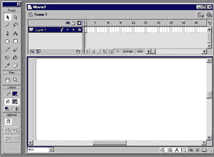
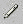
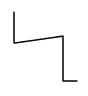
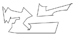
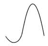
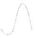
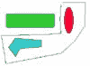
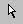

# flash 101–第 1 部分:锤子和凿子

> 原文：<https://www.sitepoint.com/flash-101-1-hammer-chisel/>

**欢迎学习 Flash 101 部分教程，保证让您从 Flash 新手快速成为万事通！**

在第 1 部分中，我们将介绍基础知识 Flash 工具和功能。

[第 2 部分](http://www.webmasterbase.com/article/713)着眼于 flash 符号、框架和库，然后向您展示如何导出 flash 文件并将其嵌入到网页中。

在第 3 部分中，你将学习补间技术——一种替代逐帧开发 Flash 动画的简便方法。

第 4 部分以你的技能为基础，探索如何将补间技术与 Flash 文本结合使用，以创建一些非常酷的效果。

[接下来，第 5 部分](http://www.webmasterbase.com/article/736)深入研究 Flash 动作，探索激活它们的鼠标和键盘触发器。

最后，[在第 6 部分](http://www.webmasterbase.com/article/737)中，您将学习如何将音频文件集成到您的 Flash 电影中，包括同步、循环淡入淡出等等！

我们开始吧！

##### 华丽的跑车

基于 Flash 的网站与昂贵的跑车有一个共同点——每次你看到一辆车，你都会有一种淡淡的嫉妒，你的车看起来没有那么好…

好了，不要再嫉妒了。

本教程专为新用户设计，将帮助您快速掌握开始设计自己的 Flash 动画和电影所需的一切知识。过不了多久，你就会成为全镇的大红人，人们会对你投怀送抱(更不用说一袋袋绿色的东西了)，希望你能屈尊将你的 Flash 魔法应用到他们无聊乏味的网站上。

##### 闪光的奇迹

在我们开始之前，有一件非常重要的事情你应该知道。Flash 是一个设计用于创建、编辑和动画矢量图形的程序。矢量图形不同于传统的位图图形，它使用直线和/或曲线而不是像素来定义图像；这提供了一个优点，即基于矢量的图形可以独立于显示设备的分辨率而显示。

这是什么意思？这意味着无论你的 Flash 文件是在分辨率为 320×240 的 7 英寸屏幕上播放，还是在分辨率为 1024×768 的 21 英寸显示器上播放，它们看起来都是一样的——这一特性应该会立即使该程序受到数百万正在为依赖于浏览器和分辨率的界面设计而奋斗的 Web 开发人员的喜爱。

这里还应该提到的是，您创建的 Flash 文件将在任何装有 Flash 播放器的浏览器中完全按照宣传的那样运行(可从位于[http://www.macromedia.com/](http://www.macromedia.com/)的 Macromedia 网站免费获得)。

说完了，让我们开始吧。当你第一次启动程序时，你会看到一个类似这样的界面。

目前，不要太担心您看到的所有控制面板和按钮，此时最重要的两个区域是左侧的工具箱和舞台，前者包含各种绘图和绘画工具，后者是中间的主要工作区域。在接下来的几页中，我将向您展示各种工具的用途，以便您大致了解可以(和不可以)使用它们做什么。

##### 像铅笔一样工作

Flash 5 中可用的绘图工具大致可分为四类。你有选择工具，像套索和部分选择工具；绘图工具，如线条、钢笔和画笔工具；填充工具，如墨水瓶和油漆桶工具；以及视图工具，如缩放工具。

如果你仔细看看工具栏，你还会注意到几个“颜色选择器”——它们用于为当前活动的工具选择描边颜色和填充颜色——以及底部的一个部分，它会改变以显示工具特定的选项。

让我们从绘图工具开始，除了自由形状和不规则曲线之外，这些工具还允许您绘制线条、圆形和方形等定义清晰的几何形状。

铅笔工具主要用于绘制线条和多边形(除了圆形和矩形)——你也可以用键盘快捷键 y 激活它。

只需选择它，然后在舞台上拖动鼠标指针来画一条线。注意 Flash 是如何自动拉直你的线条的——这种行为可以用铅笔工具修改器来控制，下面会讨论。

版权所有[梅龙菲尔](http://www.melonfire.com/)，2000 年。保留所有权利。

你可以一直画线，直到你得到你梦想中的多边形。

如你所见，我的梦有点…奇怪。

如果你看一下工具栏的选项部分，你会注意到铅笔工具也有几个修改器——事实上，有三种不同的绘图模式会影响铅笔工具的行为。“拉直”修改器尝试自动将您的绘图转换为几何形状；“平滑”修改器允许你绘制平滑的曲线；当您不想对绘图应用任何自动校正时，可以使用“Ink”修饰符。

铅笔工具的一个变体是线条工具，专门用于绘制线条。你可以用快捷键 n 激活它。

与铅笔工具一样，使用它是一个简单的点击和拖动操作。

如果你特别想画圆形和矩形，Flash 提供了椭圆形和矩形工具，它们的工作方式非常相似。

请注意，如果您已经选择了填充颜色，Flash 将自动使用该颜色填充圆形或矩形。

关于椭圆和矩形工具，有一些有趣的事情你应该知道。例如，“圆角矩形”修改器允许你给矩形加圆角(你能说圆角半径吗？)，使用该工具时按住 Shift 键可以画出完美的圆形或正方形。

想看矩形工具变成圆形工具吗？设置一个高的圆角半径-50-看着你的矩形开始像圆！

##### 曲线在所有正确的地方

如果你喜欢曲线，Flash 有一个新的功能强大的钢笔工具，可以让你在很大程度上控制绘制曲线。你可以用快捷键 p 来激活它。

钢笔工具可用于绘制直线和曲线路径。这两种类型的路径都是先在舞台上设置锚点，然后用直线或曲线将它们连接起来。

用钢笔工具画直线本身就很简单——只需点击设置第一个锚点，然后再次点击设置下一个锚点，Flash 就会自动用直线连接两点。

您可以通过单击舞台上的不同位置来继续设置锚点。完成后，您可以通过双击最后一个点来关闭对象。

请注意 Flash 是如何用当前选定的填充颜色自动填充闭合的对象的。

绘制曲线路径稍微复杂一些——您需要首先将鼠标指针放在曲线的起点，然后在曲线的方向上单击并拖动指针。鼠标指针将改变以显示曲线的切线。

一旦您满意地绘制了曲线的第一段，将光标定位在曲线应该结束的点上，按住鼠标按钮，并在相反的方向上单击并拖动指针。Flash 将为您完成曲线路径。

您可以随时通过单击曲线(或直线)并修改锚点和切线来改变它。

版权所有[梅龙菲尔](http://www.melonfire.com/)，2000 年。保留所有权利。

##### 看着油漆变干

正如你已经看到的，Flash 有两个颜色选择器，一个用于填充颜色，另一个用于描边颜色。通过键盘快捷键 K 访问的油漆桶工具允许您用当前选定的填充颜色填充选定的形状。

要填充指定的对象，您需要首先在填充颜色选择器中选择颜色，然后用油漆桶工具单击该对象 Flash 会自动用所选的颜色填充它(您也可以从窗口->面板->描边面板的填充选项卡中控制填充)。

你也可以使用渐变填充，你可以在填充颜色选择器的底部找到一堆渐变填充。

现在试着点击填充对象的不同部分，你会看到 Flash 根据你点击的位置改变渐变的角度。

要更改指定对象的填充颜色，只需在拾色器中选择一种新的填充颜色，然后将油漆桶工具应用于所选对象。

油漆桶工具附带了一个“间隙大小”修改器，允许您使用填充关闭打开的对象。您可以决定是“小”、“中”还是“大”的差距被关闭。

正如油漆桶工具可以让你控制对象的填充，墨水瓶工具也可以控制对象的轮廓。您可以使用快捷键 s 来激活它。

墨水瓶工具允许您控制对象轮廓的样式和颜色。所有重要的选项都隐藏在“窗口”->“面板”->“描边面板”中，在“描边”选项卡上，您可以从各种不同的样式中进行选择，修改轮廓的粗细，以及选择合适的颜色。完成后，只需在墨水瓶工具处于活动状态时单击某个对象，Flash 就会将您的设置应用到该对象。

##### 毕加索当心！

如果你不喜欢简洁的线条，Flash 还提供了画笔工具，允许你用鼠标画出笔触。画笔工具可以用键盘快捷键 b 激活。

一旦你选择了画笔工具，你也应该从工具集下面的颜色选择器中选择一种填充颜色——这是你的画笔描边将出现的颜色。这也是从可用选项中选择笔刷类型和大小修改器的好时机。

完成了吗？您可以使用画笔工具进行绘画，就像使用铅笔工具一样–按住鼠标按钮的同时拖动鼠标指针。

画笔工具最强大的功能之一是它有选择地绘制图像区域的能力。这种能力来自于“笔刷模式”修改器，它允许您在以下位置工作:

*   “正常”模式(也称为“覆盖一切”模式)；
*   “内部绘画”模式(将笔触限制在特定区域)；
*   “在后面绘画”模式(将笔触限制在对象后面的空白区域，使对象不受影响)；
*   或“绘制填充”模式(绘制填充和空白区域，不影响线条)。

版权所有[梅龙菲尔](http://www.melonfire.com/)，2000 年。保留所有权利。

##### 抹去过去的错误

人非圣贤，孰能无过 Flash 尤其宽容错误。橡皮擦工具让你擦掉过去的错误，可以用快捷键 e 激活。

橡皮擦工具有许多与您刚才在笔刷工具中看到的相同的修改器，它允许您擦除填充或线条，擦除所有内容，或者擦除选定对象内部，而不影响图像的其余部分。按住鼠标并在您希望擦除的区域上拖动鼠标即可完成擦除，请看:

你也可以选择橡皮擦的“笔刷大小”——当你需要精确控制你要擦掉的东西时，这是完美的选择(他们在《沙漠风暴》中不是也使用了这项技术吗？).

橡皮擦工具的一个有趣的特性是它的“水龙头”修改器，它允许你通过单击来擦除特定区域内的所有内容——试试看，你就会明白我的意思了。

当然，Flash 还提供了一个撤销工具，可以让你在任何时候恢复到以前的版本。

##### 牛仔都去哪里了？

现在，这基本上涵盖了 Flash 5 中可用的各种绘图工具，但还有一些其他工具你也应该知道。例如，当您需要在舞台上选择一个或一组对象时，箭头和套索工具(分别为键盘上的 V 和 L)都很方便。

箭头工具允许您通过用鼠标单击来选择对象；您也可以使用它来选择一组对象，方法是单击并拖动，用矩形选择框将它们包围起来。

套索工具以类似的方式工作-它允许您通过在对象周围绘制手绘或多边形框来选择对象组。

套索工具带有一个“多边形模式”修改器，允许您以类似于钢笔工具的方式使用套索工具-单击以设置线段的起点，然后单击以设置终点。继续操作，直到对象被完全包围，双击关闭框并选择其中的项目。

或者，您可以通过在对象周围拖动套索工具，在对象周围绘制一个手绘框。

如果您需要查看或修改线段或曲线上的控制点，Flash 提供了部分选择工具，通过键盘快捷键 a 激活。

“部分选择”工具提供了一种简单而优雅的方法，可以使线段或曲线上的所有重要控制点可见，以便于修改它们。要使用它，只需单击舞台上的一个对象，并观察它的控制点立即变得可见。然后，您可以操纵这些控制点来改变对象的大小、形状或位置。

版权所有[梅龙菲尔](http://www.melonfire.com/)，2000 年。保留所有权利。

##### 伸展你自己

到目前为止，你读到的所有东西都是关于画不同的形状并用颜色填充它们。但是一旦你画了一个对象，Flash 还允许你通过缩放、旋转或与其他对象组合来进一步修改它。

为了修改一个对象(或一组对象)，您需要首先使用箭头或套索工具选择它(它们)(您可以在选择时按住 Shift 键选择多个对象。)您还可以选择将多个对象视为一个“组”——这允许您一次操作多个对象。您可以通过选择对象并使用“修改”->“分组”菜单项对其进行分组(分组后的项目将出现在一个封闭的框中。)

一旦您的对象或群组符合您的要求，您就可以:

*   **点击删除键删除**对象(或组);
*   **通过点击拖动选中的对象(或组)来移动**对象(或组)；
*   **按住 Alt 键并点击拖动选中的对象(或组)，复制**对象(或组)；
*   **通过窗口- >面板- >变换面板缩放**对象(或组)。您也可以通过右键单击对象(或组)，选择“缩放”选项，并拖动出现在对象角上的缩放手柄来缩放对象。拖动角部手柄可沿 X 轴和 Y 轴缩放对象，而不会影响纵横比，拖动任何其他手柄可仅沿该轴缩放对象。
*   **通过窗口- >面板- >变换工具面板，或通过右键菜单中的“旋转”选项，旋转**对象(或组)；
*   **通过窗口- >面板- >变换工具面板来倾斜**对象(或组)；
*   **通过修改- >变换- >垂直翻转和修改- >变换- >垂直翻转菜单项翻转**对象；

##### 缩小

和其他图像处理软件一样，Flash 也有一个缩放工具，可以通过快捷键 Z 来使用，还有一个抓手工具，可以通过点击 h 来使用。

缩放工具允许您增加或减少查看 Flash 场景的放大级别–您可以使用工具栏上的“放大”和“缩小”修改器来放大或缩小场景。

手形工具允许您通过移动可见区域来改变场景视图，这样您就可以查看合成的不同部分，而无需求助于滚动条-如果您的合成跨越多个屏幕，这将非常方便。

如您所见，工具栏提供了相当多的功能——对于大多数需求来说绰绰有余。现在，您应该稍微使用一下它，并熟悉每个工具的功能。与此同时，我要离开这里——但下周我会带着本教程的第二部分回来，在那里我将谈论 Flash 动画的基本组成部分。

乖乖的，现在！

*注意:本文中的所有示例都已经在 Macromedia Flash 5 上测试过。这些示例仅用于说明，并不适用于生产环境。*

版权所有[梅龙菲尔](http://www.melonfire.com/)，2000 年。保留所有权利。

## 分享这篇文章