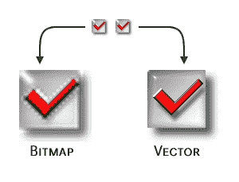
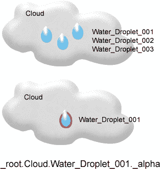
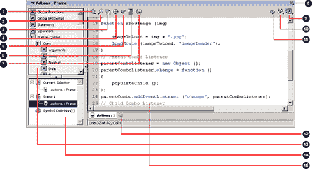
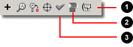
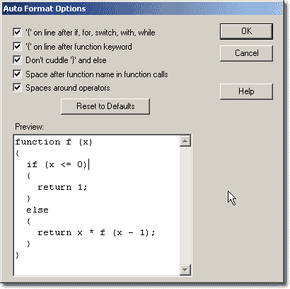
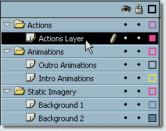
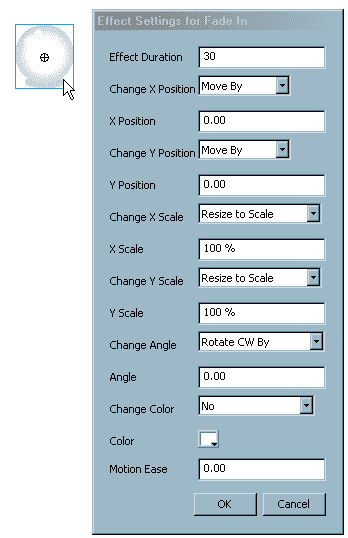

# Flash 选集:酷炫的效果和实用的动作脚本——第一章:Flash 精华

> 原文：<https://www.sitepoint.com/flash-anthology-1/>

没有闪光灯的生活将会索然无味，平淡无奇。Flash 站点之于静态 HTML 站点，就像一个家庭大小的、有各种配料的厚皮比萨饼之于一片烤面包。当今许多影响巨大的网站要么是成熟的富互联网应用程序(RIA ),要么是 HTML 和 Flash 的谨慎混合。这种小心翼翼的技术融合，加上无缝集成，意味着惊人的在线体验和完全遗忘的体验之间的差异。

使用 Flash 作为传递信息的唯一媒介的站点，以及使用几个微型 Flash 应用程序来强化静态 HTML 的站点，都有一个共同的潜在主题:它们都利用 Flash 的能力来创建基于矢量(或坐标)的轻量级界面、应用程序和动画。Flash 已经成为交流思想的强大工具，其功能激发了大量热情的忠实用户。

本系列首先解释了任何设计人员或开发人员为了使用该软件包而需要了解的基本知识，然后继续详细探讨动画和声音领域。它由 3 条组成:

第一章:Flash 基础知识
如果你是 Flash 新手，本章将为你提供程序界面的坚实基础，以及对 ActionScript 点符号的基本理解。还包括使用 ActionScript 和时间轴的提示和技巧。最后，我将向您介绍一些组织准则。本章从下面开始。

第 3 章:动画效果
每个 Flash 开发人员都会问，是使用基于时间轴的动画还是脚本动画。我们将探索这些效果背后的原理，并试图一劳永逸地结束时间线与剧本的争论。本章提供的基本构建模块将让你立刻创作出时尚的动画！

第五章:声音效果
声音是一个项目中最未被充分利用，但却是最有效的附加物之一。合适的音效可以增强运动的冲击力，为用户交互提供反馈，营造氛围。在这一章中，我们将分析何时应该使用声音，如何为工作选择正确的声音剪辑，以及如何轻松导入和导出剪辑。我们探索音量和声相，然后建立一个迷你声音播放器，随机轨道音序器，等等。

##### 这本书

这三章摘自我的新书《闪光选集:酷炫效果&实用动作脚本。这本书总共包含 60 多个针对 Flash 中常见问题的 ActionScipt 解决方案。这本 455 页的参考资料涵盖了 Flash 项目所需的所有解决方案，从文本和视频效果，到在应用程序中调试和使用外部数据。书中包含的所有代码都可以在免费下载的档案中找到。

如果你喜欢阅读 Adobe Acrobat PDF 版本的信息，你可以[免费下载这三章](https://www.sitepoint.com/show-modal-popup-after-time-delay/)。

##### 您的反馈

如果您对本系列中涉及的任何信息有疑问，快速回复的最佳机会是在 [SitePoint 论坛](https://www.sitepoint.com/forums/)中发布您的问题。特别欢迎您提出改进建议以及您可能发现的任何错误(可能有一两个错误被遗漏了)——将这些提交给 [SitePoint 图书支持](https://www.sitepoint.com/books/contact.php)。

现在，让我们在学习 Flash 的基础知识时动手实践一下吧！

##### 为什么要用 Flash？

新用户可以从许多不同的角度接触 Flash。设计师可能会对 Flash 在界面设计、美学和功能方面的能力印象深刻。如果你有很强的编码背景，数学实验和学习新编码技术的机会可能会激起你的兴趣。无论您从哪个方向着手，这项技术都会为每一位初露头角的 Flash 开发人员提供一些帮助。

Flash 固有的创建超紧凑、基于矢量的动画的能力，加上强大的脚本语言(ActionScript)，使用户能够相对轻松地开发复杂的效果、过渡和界面——使用传统的 HTML 和 DHTML 编码方法，这将花费更多的时间，或者是完全不可能的。

在 Macromedia 收购现在无处不在的插件和创作工具之前，Flash 已经有了几个版本，并且随着 Flash MX 2004 Professional 的最新发布，开发工作一直持续到今天。在过去的几年中，Flash 技术的使用已经从黑色艺术转变为主流 Web 开发实践，因为该软件的每个新版本都为用户提供了额外的功能，从动画、声音和交互性，到应用服务器访问和视频包含。

如果一个完全的 Flash 新手要购买最新版本的 Flash 并安装它，他或她可能会被过多的面板、下拉菜单和用户选项所淹没。然而，经过一些实验，花一点时间阅读手册和在线教程，事情会开始有意义。如果你在这条船上，如果这是你最近购买 Flash 后买的第一本书，那么恭喜你！你在一个好公司里。另一方面，如果您了解应用程序及其界面，知道您想做什么，但不确定如何去做，那么您也来对地方了。在本书中，我将尝试介绍解决在线论坛和新闻组中最常见问题的方法和步骤。当然，我可以向你展示成千上万的例子，但我在这里包括的解决方案都是精选的。一旦您理解了本书中的示例是如何组合在一起的，您就能够将它们应用到许多不同的实例和情况中，并将它们用作您可能创建的其他 Flash 应用程序的构建块。

Flash 的力量源于它的活力和多功能性。您可以用它做很多事情，从创建包含在 Web 应用程序中的简单动画，到构建健壮的 SQL 和 XML 数据馈送超级应用程序。很难确定从哪一点开始或停止。你可以决定为你的网站创建一个低带宽的动画标题；您可以选择将整个网站构建为一个 Flash 应用程序或一系列 Flash 应用程序。选择完全取决于你。本书提供了涉及 Flash 不同方面的真实示例和前沿技术。在每个例子之后，修改将被呈现，这将允许你扩展那个例子以适合你的特殊需要。

我假设您使用的是 Flash MX 或更高版本，并且对该软件有所了解。这本书不会带你浏览界面，告诉你它能做什么；相反，我希望你已经掌握了基础知识，并且你渴望开始使用这个程序来充分发挥它的潜力。本书中的一些示例特定于 Flash MX 2004，展示了在最短时间内充分利用该版本的强大技术，但大多数示例适用于 Flash MX 和更高版本。

该系好安全带，打开点火开关了。让我们看看闪存能提供什么！

另请注意，如果您喜欢离线阅读此内容，您可以[下载 pdf 格式的本章内容](https://www.sitepoint.com/show-modal-popup-after-time-delay/)。

##### Flash MX 2004 有什么新功能？

Flash MX 2004 比以前的版本更上一层楼。它不仅提供了大量的增强功能和新功能，而且该软件有两种“风格”:Flash MX 2004 和 Flash MX Professional 2004。您的需求将决定哪个版本适合您。Flash MX 2004 是开发多媒体内容或向项目中添加视频、音频、图形或数据的理想工具。另一方面，Flash MX 2004 Professional 包含其他功能，如基于表单的编程(与 Microsoft Visual Studio 非常相似)、用于将 XML 和 Web 服务绑定到项目的数据连接器以及项目管理工具。

如果您打算创建包含少量 ActionScript 之外的任何内容的项目，您需要连接到外部数据源，或者想要利用高级组件的功能，那么我强烈建议您购买 Flash MX Professional 2004。这一天将会到来——可能比你预期的要早——那时你将需要它提供的额外马力。不要捉襟见肘！

***Flash MX 2004 功能一览***

让我们看一下 2004 版本提供的主要改进和新功能。标有(PRO)的功能仅在专业版中可用。

ActionScript 2.0
action script 2.0 是对 action script 模型的面向对象的重大改进，它允许按照 ECMA 规范进行强类型化和继承。如果这些术语对您来说是新的，请不要担心，我们稍后会详细讨论它们。

性能
新版 Flash Player 进行了大幅改进，提高了播放速度和响应能力。

错误报告
在这个版本的软件中，内部预览 Flash 电影时生成的错误报告得到了很大的改进。报告提供了更多描述性信息，这使得修复节目停止错误变得更加容易。更多信息见第 9 章，调试。

*安全模型*
Flash Player 安全模型已经得到了显著改进，现在可以为您的应用程序提供更加严密的安全性。

*导入*
Flash 开发者现在可以导入几种新的格式，包括 Adobe PDF 和 Adobe Illustrator 10。Flash MX 2004 还包括一个视频导入向导，使导入视频格式更加容易。有关此功能的详细信息，请参见第 6 章，视频效果。

拼写检查
拼写检查是一个奇妙的新功能，它可以让你在电影中搜索文本，找出打字错误。

*帮助面板*
帮助面板包括基于上下文的帮助以及一个完整的 ActionScript 参考，单击一个按钮即可更新 Macromedia 的最新内容。

新模板
2004 年发布的 Flash 中提供了一系列新模板，旨在帮助快速开发 Flash 应用程序。这些模板包括:

*   广告
*   表单应用程序(专业版)
*   移动设备
*   照片幻灯片
*   报告
*   恶作剧
*   幻灯片演示(专业版)
*   视频(专业版)

要访问模板，请选择文件>新建，然后单击模板选项卡。

*时间轴特效*
时间轴特效可以让你快速创建可编辑的常用特效，如爆炸文本、模糊动画、不透明过渡等。由于在 2004 版中扩展了 Flash 的 API，许多第三方软件供应商现在创建了这些效果用于 Flash。Macromedia 的在线商店提供了一系列优秀的第三方时间轴效果，包括由 Red Giant Software 开发的扭曲效果、像素效果和文本效果。这些可以让您在 Flash 中创建一些令人难以置信的视觉效果。

*行为*
行为允许您快速将基本的 ActionScript 命令添加到影片中。它们可以为您的代码构成构建块，或者您可以简单地使用它们来添加交互性，而不会弄脏 ActionScript。

要访问“行为”面板，请选择“窗口”>“开发面板”>“行为”。

*高级组件(PRO)*
Flash MX 2004 Professional 包括一系列新的组件，有助于开发复杂的应用程序。

Flash Form Presentation(PRO)
Flash Form Presentation 反映了一种新的开发系统，很像微软的 Visual Studio。例如，它允许快速创建联系和注册表单。详见第 7 章，Flash 表单。

*Flash 幻灯片演示(PRO)*
创建基于幻灯片的应用程序变得前所未有的简单，这得益于内置的导航功能，可以帮助用户浏览幻灯片。

*数据绑定和数据连接对象(PRO)*
Flash MX 2004 Professional 引入了内置的数据连接器来连接外部数据源，如 Web 服务和 XML。随着数据绑定的引入，ComboBoxes 等组件可以相对容易地用外部数据填充。

*源代码管理(PRO)*
现在，通过将 Flash 与 Microsoft Visual SourceSafe 集成，您可以在您的 Flash 项目中轻松利用源代码管理。这确保您不会通过“签入/签出”方法覆盖其他团队成员在关键项目上的工作。

##### 比较矢量和位图

在网页设计的早期，带宽总是一个问题——页面内容越多，图像数量越多，页面在浏览器中呈现的时间就越长。

漫长的下载时间被证明是许多冲浪者的一大障碍。然而，随着网络的发展和高速连接在家庭和工作场所变得越来越普遍，人们越来越不重视创建具有超薄图像的超紧凑页面。当然，最好的做法仍然是编写简洁的代码，并确保图像尽可能小，以便将下载时间降到最低。借助 Flash 基于矢量的图形系统，您可以始终如一地生成 Web 优化图像，并创建低带宽应用程序。在 Flash 中创建图像的美妙之处在于，当您放大电影时，不会出现传统位图中出现的清晰度下降或像素化现象。如图 1.1 所示，这产生了一个更清晰的外观和感觉。


图 1.1。比较位图和矢量图像文件格式。

您可以将传统位图导入 Flash，但这些显然会增加最终电影的大小。例如，如果您将在 Flash 中创建的基于矢量的界面与从多个位图和 HTML 构建的界面进行比较，Flash 开发的界面文件大小会比页面的位图和 HTML 版本小得多，下载速度也快得多。

##### 互动无限

Flash 使用名为 ActionScript 的面向对象编程语言，它与 JavaScript 共享许多主题和功能。由于 JavaScript 为许多网页设计师所熟悉，理解 ActionScript 语法可能相对容易。事实上，即使是没有编程背景的人也是如此。随后的章节提供了应用程序如何组合在一起的完整解释，以及 ActionScript 代码背后的推理。

在 Flash 中设计交互效果难倒了许多开发人员。他们可能知道自己想要做什么，但他们不知道如何去做，什么可以编写脚本，或者哪些效果需要正常的时间轴交互和补间。创建脚本效果的主要优势在于，仅仅改变几个变量或函数引用的方式就能对最终的电影产生巨大的影响。使用传统方法创建效果意味着改变时间线、关键帧和补间，这可能会令人望而生畏，尤其是当您处理大量帧和层时。除非另有说明，本书中概述的技术将涉及脚本效果。

当一个新用户把目光投向几行 ActionScript 时，典型的反应是目光呆滞。几乎任何编程语言都会吓跑初学者，但重要的是要记住 ActionScript 并不难理解；它的学习曲线相对平缓。事件有三种触发方式:单击界面中的按钮、满足特定条件或时间轴的播放头到达特定帧。

虽然 ActionScript 可能会变得非常复杂，但有许多方法可以用最少的努力创建快速、令人满意的效果。您创建的每一行 ActionScript 都将帮助您进一步理解该语言的复杂性，以及如何修改它来满足您的需要。你写的每一行都会让你更有信心承担越来越复杂、回报越来越大的项目。

记住这一点，让我们继续探索 ActionScript 的通用术语、编程接口，以及如何将它们结合在一起以创建您想要的效果。
动作脚本被发现

ActionScript 是一种面向对象的编程(OOP)语言，它与影片的对象进行交互并控制影片的播放头。ActionScript 符合 ECMA 262 标准，这意味着它符合 JavaScript 的国际标准。

虽然我们将研究 ActionScript 的许多方面，但涵盖每个内置函数和对象超出了本出版物的范围。下面列出的书籍涵盖了 JavaScript 和 ActionScript 的大部分扩展功能，是任何 Flash 开发人员都应该拥有的宝贵参考资料。

*   动作脚本:权威指南(第二版，奥莱利)
*   *专业 JavaScript* (第二版，SAMS)

在本书中，我将解释为什么我们要使用特定的代码片段；在适当的地方，我还将展示如何通过时间轴操作来实现类似的功能，以及为什么在大多数情况下编写它们的脚本是最佳实践。

这里有一个简单的例子，说明了 ActionScripting 的好处，并表明操纵 ActionScript 的某些部分来改变最终结果是多么容易。

要制作对象从 A 点到 B 点移动的动画，您可以创建要移动的对象的影片剪辑，在时间轴上创建两个关键帧，并在它们之间进行补间以产生移动。虽然这是创建动画的合法方法，但是您可以用几行简单的代码编写这个过程的脚本。

假设我们有一个名为 myMC 的电影剪辑。如果水平位置(_x)小于 500，将以下 ActionScript 代码添加到主时间轴会将影片剪辑向右移动:

```
myMC.onEnterFrame = function ()   

{   

  if (this._x < 500)   

  {   

    this._x++;   

  }   

};
```

很简单，不是吗？

编写动画和其他效果脚本的好处是，脚本可以存储在您自己的脚本库(或共享库)中，随时可以包含在您的 Flash 应用程序中。改变脚本以适应你的需要，而不是改变嵌套的时间线，在你自己的生产力和帮助你开发参考库方面有明显的好处。要改变上面例子中的运动范围，我们可以简单地将数值从 500 改变为其他值。

让我们快速看一下 ActionScript 可以实现的一些目标，记住这些只是它的许多用途中的一部分。在后面的章节中，我们将涵盖更多，包括一些可能会让你吃惊的内容。

*   简单或复杂的动画效果
*   过渡效果
*   交互式用户界面
*   不能用任何其他媒体制作的菜单系统
*   实验数学效应
*   简单或复杂的互动游戏
*   通过中间层(ASP、ColdFusion、PHP 或 Macromedia 数据连接组件)连接到数据库或外部文件

##### ActionScript 点符号

ActionScript 使用一种特殊的方法来引用出现在舞台上并嵌入到影片剪辑和按钮中的对象。如果您熟悉 JavaScript，那么您将熟悉在 Flash 电影中引用对象的 ActionScript 点符号。根据这种表示法，`document.layer1.form1.checkbox1.value`指的是当前文档中包含的层内表单中复选框的值。

如果你不熟悉这种引用对象的方法，不要担心——这就像从自行车上摔下来一样简单。你很快就会学会的！

ActionScript 中有三个特殊的关键字可用于在舞台上寻址对象:

*   `this`–指脚本所附加的实际对象(即其本身)
*   `_parent`–指的是*包含*的电影剪辑，该对象是附加脚本的对象
*   `_root`–指主 Flash 电影，包含对象的整个层次结构

在这个讨论中，我们集中讨论一下`_root`。假设您创建了一个 Flash 电影，其中包含一个名为`Cloud`的电影剪辑，而这个剪辑又包含另一个名为`Water_Droplet_001`的电影剪辑。要查找`Water_Droplet_001`剪辑的 alpha 属性值(不透明度),可以使用以下 ActionScript 表达式:

```
_root.Cloud.Water_Droplet_001._alpha
```

这段代码是如何工作的？看看下面的图 1.2。请注意，水滴包含在云中(即它们是父云的子云)。我们引用一个单独的水滴——为了简单起见，第一个水滴(`water_droplet_001`)—在那片云中。我们在对象前使用术语`_root`的原因是告诉 Flash 从舞台内电影层次的最顶端开始查看。


图 1.2。了解 ActionScript 点符号的影响。

获取`Water_Droplet_001`电影剪辑的 alpha 属性的值，并将其存储在名为`Water_Droplet_001_Alpha`的变量中，就像下面这样简单:

```
Water_Droplet_001_Alpha = _root.Cloud.Water_Droplet_001._alpha;
```

放置在画布上的对象可以有许多属性，这些属性可以从对象本身的内部和外部进行控制，所有这些都增加了实验和学习的乐趣。

##### 动作面板散开

动作是执行指定功能的 ActionScript 代码片段。常用于在 Flash 中创建基本操作的功能包括:

**`getURL`**
将浏览器发送到您指定的 HTML 页面

**`stop`**
停止时间轴的播放头

**`play`**
启动时间轴的播放头

**`gotoAndPlay, gotoAndStop`**
将时间轴的播放头跳转到已标记的帧或帧号

这些核心 ActionScript 函数是导航到电影不同部分最常用的函数。您可能已经在接触 Flash 5 或更高版本的软件时遇到过它们。这只是 ActionScript 的冰山一角。正如您稍后将看到的，它提供了许多方式来增加互动，并为您的工作添加特殊效果。

ActionScript 通过“动作”面板添加到舞台中。如果您曾经创建过脚本动画，或者使用这些基本方法的任何效果，您将会看到“动作”面板。在本书中，它将是你的武器库中最重要的武器，所以现在让我们来看看它，以确保你理解这个工具为你所用的一切。您可以通过窗口>开发面板>操作或按 F9 键来访问面板。


图 1.3。Flash MX 2004 中的动作面板是您最重要的武器。

图 1.3 显示了带有以下组件的动作面板:

1.  向脚本窗口添加新项目

3.  查找代码

5.  查找和替换(非常有用)

7.  插入目标路径浏览器

9.  检查语法

11.  自动格式化代码(您可以从选项菜单中更改格式首选项)

13.  显示代码提示(在相关点时)

15.  选项菜单(用于配置代码提示、代码颜色等。)

17.  视图选项(行号、自动换行、Esc 快捷键)

19.  调试选项(见第 9 章，调试)

21.  ActionScript 参考

23.  在动作面板中锁定活动脚本

25.  动作工具箱

27.  脚本导航器

29.  脚本窗格

##### 动作面板框架

在 Flash MX 2004 或 Flash MX 2004 Professional 中，动作面板不提供专家模式和普通模式。在早期版本中，动作面板可以在这两种模式中的一种模式下运行，从其选项菜单中切换到。在正常模式下，只能通过菜单系统插入动作；专家模式允许开发人员直接在动作面板中输入动作。在 2004 版中，您只能通过直接输入、动作工具箱或脚本窗格上方的+按钮将 ActionScript 添加到脚本窗格。

如果你还在“摸索”动作面板，那么你还没有完全独立。Flash 的代码提示功能将尝试自动完成您的代码，或者根据您已经键入的内容为您提供语法选择。例如，如果您在动作面板中键入“Math ”,您将看到一个可用于`Math`类的方法列表，按字母顺序从`abs`到`tan`排序。然后，您可以从下拉菜单中选择所需的方法，或者继续自己键入脚本。

##### 优化动作面板

在 Flash 中高效工作并减少脚本效果开发时间的一个重要因素是高效舒适的工作环境。现在，我不打算告诉你打扫你的房间和擦亮你的桌子(尽管我不得不承认，在我坐下来参加脚本会议之前，我确实整理了我的文件并试图清理我的工作空间)。但是请记住:整洁的环境反映了整洁的思维，当你以后再回头看时，整洁的代码更容易理解。


图 1.4。了解动作面板中的重要选项。

在动作面板中有三个主要的选项可以节省大量的时间，并且可以帮助你追求编码的完美。这些按钮如图 1.4 所示:

1.  **显示代码提示**:当你直接在动作面板中输入时，Flash 会建议语法来完成你的代码，你会注意到如果你不接受这个建议，过一会儿它就会从屏幕上消失。在其他时候，你可能正在愉快地编码，只是为了让 ActionScript 小精灵跑进来，从你的大脑中窃取思想-突然，你忘记了你在键入什么！在这两种情况下，单击此按钮可让程序显示与您在脚本中的当前位置相关的代码提示。

3.  **自动格式化**:在大量的代码编辑、添加和删除之后，代码中的注释和格式可能会变得有点混乱。一个简单的点击 Auto Format 按钮将会很好的格式化你的代码，基于预设的规则或者你设置的自定义规则，如下一节所述。这是我的 Flash 版本中最常点击的按钮之一——这是 Flash MX 和更高版本的一个受欢迎的附加功能。

5.  **检查语法**:当你检查一段脚本对最终电影的影响时，你最不想看到的就是一个错误百出的输出窗口。要在不导出电影或在内置 Flash 播放器中观看电影的情况下检查代码错误，请单击“检查语法”按钮(在 Mac 上为`Ctrl-T`或`Command-T`)。这将立即报告任何错误，这可以在初始开发阶段节省大量时间。

##### 配置自动格式

如果你的代码被有效地格式化和注释，回到你六个月前开发的一段代码会是一次愉快的经历；否则，这将是一场名副其实的噩梦。

“自动格式化”按钮有助于将代码保持在最佳状态。虽然它不会为您注释代码，但它确实使代码可读——当您再次访问编译代码库时，这绝对是一个额外的收获。要根据您的喜好更改自动格式选项，请从“动作”面板一角的“选项”下拉菜单中选择“自动格式选项…”。为了保持您的代码处于原始状态，我建议您选中所有的复选框，这将产生类似于图 1.5 所示的结果。


图 1.5。调整自动格式化选项以生成更清晰的代码。

##### 代码注释

在每个项目中，无论是大项目还是小项目，都会有这样的时候，当你回到一行或一段代码时，你会想‘嗯……那段代码又是做什么的？’没有什么比不知道你的代码是做什么的更糟糕的了，你需要从头再来进行修改或者在另一个项目中重用它。注释会使你的代码更易读，更容易浏览，如果你是团队的一员，更容易通过公共库传输或共享。
注意

电影运行时，不执行 ActionScript 中的注释；事实上，Flash 完全忽略了它们。它们是为了*你的*利益，用来描述你的代码或者暂时禁用它的某些部分。

作为一个例子，下面是我写的每个函数的第一行。我将它作为文本文件保存在硬盘上的 ActionScript 库中，这样我就不需要每次使用它时都重新键入它。它包含了丰富的信息，使我(或任何其他开发人员)很容易看到代码做了什么，它将接受和/或输出什么变量，以及相关的修订数据:

```
//-----------------------------    

//Function Name: Name of Your Function    

//Function Date: 15/09/2003    

//Input:         Input Variables (e.g  Color Variable (String))    

//Output:        Output Variables (e.g  Hex Color Reference)    

//Revision Date: 28/09/2003: Added Non Numeric Error Checking    

//-----------------------------
```

双斜线(`//`)告诉 Flash 忽略一行代码的剩余部分。在上面的例子中，注释的每一行都以双斜杠开始。您还可以使用这个技巧来临时禁用一行代码，如下所示:

```
// var TestVar = _root.parentMovieClip.childMovieClip.value;
```

您可以创建多行注释，以`/*`开始，以`*/`结束。下面是使用这种注释风格的函数描述:

```
/*-----------------------------    

  Function Name: Name of Your Function    

  Function Date: 15/09/2003    

  Input:         Input Variables (e.g  Color Variable (String))    

  Output:        Output Variables (e.g  Hex Color Reference)    

  Revision Date: 28/09/2003: Added Non Numeric Error Checking    

  -----------------------------*/
```

这种风格的注释可以用来“注释掉”整个代码块，就像这样:

```
/*    

_root.Option_Button.onPress = function ()    

{    

  getURL ("http://www.google.com");    

};    

*/
```

从长远来看，花一点额外的时间来注释代码会节省你和其他人的时间。一旦你养成了评论的习惯，你会想没有它你是怎么过的。

##### ActionScript 编码技巧

关于在动作面板中创建函数和动作，有几个要点需要记住。这些绝不是 Flash 中最佳编码实践的全部；它们仅仅是一些标准，会让你花更多的时间去开发，花更少的时间去寻找和消除错误。

***动作脚本区分大小写***

就像它所基于的 JavaScript 一样，如果写错了大小写，ActionScript 就不会像预期的那样工作。但是也有一些例外。例如，考虑以下函数:

```
function TestTrace () {    

  trace ("hello");    

}
```

这个函数是完全没有错误的，当它被调用时，将输出' hello '到输出窗口。现在，即使函数名大写(`TestTrace`)，你也可以调用不大写(`testtrace`)的函数，Flash 也不会抱怨:

```
myButon.onRollOver = function ()    

{    

  testtrace ();    

}
```

***注意:*** 在 Flash MX 中，ActionScript 编译例程相当宽容——不区分大小写。如果将`#strict pragma`作为脚本的第一行，ActionScript 将区分大小写。

仅仅因为 ActionScript 对您自己的函数和变量名比较宽容，就不要指望它对您的内置名称也是如此。这些错误会阻止您的代码执行，并且当您在项目中引入更多的代码时，这些错误通常是最令人讨厌和最难发现的。因此，最好的策略是始终注意使用正确的大写字母。

***具体化动作脚本***

将大块 ActionScript 外部化是分离项目元素的好方法，有助于保持代码整洁和简洁。想象一下，例如，我们有一段 50 行长的导航代码。我们可以将代码块剪切并粘贴到记事本(Windows)或 BBEdit (Macintosh)中，并将其保存为`navigation.as`。然后，我们将用下面的代码替换电影中的代码:

```
#include "navigation.as"
```

这个`.as`文件将在编译时包含在 SWF 文件中，不需要与它一起分发。

***提示:*** 要快速将 ActionScript 导出到外部文件中，请从“动作”面板的“选项”菜单中选择“导出脚本…”。

***脚本锁定***

因为您可以将 ActionScript 动作与 Flash 电影的几乎任何元素相关联，所以您可能正在处理一个脚本片段，并且需要在其他地方引用另一个脚本片段。单击其他元素将显示其他片段；如果您需要返回到您正在处理的片段，您可能会很容易丢失您的位置。

为了帮助开发人员在多个脚本片段之间跳转时避免混淆，Macromedia 提供了脚本锁定。只需单击动作面板中的“锁定脚本”按钮，Flash 就会在动作面板底部的选项卡中保持当前显示的脚本片段打开。然后，您可以导航到另一个元素来查看它的脚本，而不用担心丢失您在原始脚本中的位置——只需在需要时单击选项卡即可切换回固定脚本。当情况需要时，您甚至可以固定多个脚本片段。

***注意:*** Flash MX 2004 在动作面板中引入了一个额外的窗格——脚本导航器窗格。这个新的面板位于动作工具箱的正下方，可以方便地浏览影片中的所有代码。

***抬起并锁定***

可以将动作添加到时间轴的关键帧中，或者分配给舞台上的对象。但是，不管您创建的是哪种类型的动作，最好的做法是创建一个新层，给它一个有意义的名称，如“ActionScript ”,并在放置 ActionScript 之前锁定该层。这样，您可以轻松地看到包含 ActionScript 的对象并导航到它们，而不必打开电影浏览器。
命名惯例

当您编写代码、创建函数或命名层和文件夹时，有一组您应该尝试实现的最佳实践。其中有些是常识；其他的就没那么明显了。这些惯例都不是必不可少的，但是通过遵循这些简单的指南和本章中的其他建议，您应该能够成功地组织您的 Flash 项目。

*做*

*   创建与 Flash 项目的目的或目标相关的文件名
*   为函数和变量创建名称，以表明它们在项目中的角色
*   使用下划线分隔单词；避免连字符
*   在应用你决定使用的命名系统时要保持一致

*不要*

*   使用没有意义的首字母缩写词
*   缩短文件名
*   创建需要粒子科学硕士学位才能解密的函数、文件或变量名
*   使用空格或合并单词

***时间轴，简体***

在我们的现实中，时间只能向前(尽管有些人可能会有不同的说法！);在 Flash 中就不是这样了。时间线中的播放头可以前后移动，甚至可以跳帧。

Flash 时间轴是创建效果不可或缺的一部分，所有 Flash 电影都使用时间轴，即使只是第一帧。Flash MX 2004 中时间轴效果的引入使得在项目中创建快速动画和过渡效果变得非常容易。使用 basic ActionScript，您可以启动播放头，播放动画，然后将播放头返回到时间轴的开始处重新播放。而且，只需稍加修改，您就可以添加一个自动递增计数器，以便有条件地跳转到时间轴上的另一个点，或者返回到时间轴的起点。创建基本效果并将其构建成非凡的东西是很简单的。

时间线效果也使得开发可转移到其他项目或合作者的复杂效果变得更加容易。事实上，这个可伸缩性的概念应该在项目开始时就考虑到。在你开始之前，问问你自己，“我能轻易地在同一部电影或另一个项目中再次使用这种效果，而不需要大量的重新编码吗？”如果答案是否定的，那么您需要找到使其可伸缩的方法。

实现可伸缩性最简单的方法是花一点时间编写常见任务的脚本。如果您可以使用四行 ActionScript 来制作一个对象的动画，这四行 action script 代表一个可重用的函数或代码片段，那就去做吧！与包含多个重复的嵌套电影剪辑的脚本相比，这种方法更易于维护，因为其中的变量可能会发生冲突。

在创建新效果或开始任何项目之前，问自己以下问题:

1.  舞台上会同时出现多种效果吗？

3.  我会在电影中不止一次使用相同的效果吗？

5.  我可以编写我想要创建的效果吗？

7.  我能让效果在项目间轻松移植吗？

9.  我可以很容易地添加新的功能到效果中吗？

11.  如果客户或我不喜欢这个效果，我可以很容易地调整它吗？

您可以使用时间轴创建复杂的效果-事实上，在 Flash 5 和更高版本发布之前，这是唯一的方法。即使在今天，我们看到的大多数动画效果都依赖于帧之间的时间轴补间来创建动画、运动和不透明度渐变。时间轴效果和 ActionScript 的结合可能是一种强大的方法，但这种方法也有技术优势。以这种方式开发的效果更加“可调整”在很短的时间内，到处更改一些设置会对最终产品产生相当大的影响。

不应低估时间表的重要性。每个对象，从层到影片剪辑，在添加到舞台时都会出现在时间轴中。花些时间熟悉使用时间线的最佳实践原则。

***给我贴标签***

在一个周末或假期后，你需要多长时间来适应你留下的 Flash 项目？组织是最大限度减少“重新熟悉”时间的关键。马虎的代码或混乱的 Flash 项目没有任何借口。在一个项目开始时投入一点额外的时间，小心翼翼地添加元素，当你离开一段时间后回到这个项目或者把它交给你的同事时，你会收获回报。

我主张创建一个名为“标签”的层来保存评论、条件和时间线上每一步发生的事情的指针。这个过程非常简单，只需从时间轴中选择一个帧，然后在属性检查器中添加一个帧标签。维护这些滚动标签可以让您看到电影中发生了什么——例如，您甚至可以添加小注释来提醒自己代码需要更改，或者图形需要交换。

***注意:*** Flash MX 2004 可以让您高效地更改帧标签类型。要在时间轴中更改名称、标签或锚点的表示形式，只需在属性检查器中单击显示在帧标签下方的下拉框。

添加标签层可以将这些信息分开，并帮助您组织关于时间线规划的想法。

***组织你的图层***

在 Flash 版本 5 和更早版本中，用户能够在时间轴内将工作组织到不同的层中。这个工具对于在阶段中分离出设计组件非常有帮助。对这些层进行一点规划和组织，无论是在最初的开发过程中，还是在以后重新访问项目时，都会让您受益匪浅。

在 Flash MX 和 Flash MX 2004 中，您可以将这些层组织到离散的文件夹中。让我向您展示这个看似很小的改进如何改进您的工作流程。

假设您已经在一个项目上工作了一段时间，该项目在舞台上有许多电影剪辑、按钮和位图。您正在使用许多层，尽管它们没有被组织成任何特定的格式，并且您可以上下滚动时间线窗口来访问它们。更糟糕的是，项目变得越来越复杂，这意味着更多的层，甚至更多的滚动。不要害怕，这一切都将改变！图 1.6 显示了如何创建和组织文件夹到不同的区间中，在每个区间中放置相关的层。当您编辑完一个文件夹后，只需单击它旁边的箭头即可将其卷起，从而在时间线内给自己留出更多空间。随着您承担的项目变得越来越复杂和越来越大，您可以从这种方法中获得的改进的效率将变得不言而喻。

在向项目添加组件时，我通常从标准框架开始。我有一个包含两层的文件夹，一层用于 ActionScript，另一层用于 labels。我有另一个文件夹放动画，然后再细分成相关的部分，还有一个文件夹放静态图像。显然，您可以更改这种结构，以适应您的开发需求和个人偏好。


图 1.6。在 Flash MX 和 Flash MX 2004 中轻松组织文件夹和图层。

##### 时间轴效果(Flash MX 2004 中的新功能)

Flash MX 2004 中的新功能是经验丰富的程序员和非程序员都期待已久的新功能:时间轴效果。从舞台中选择一个对象后，可以从“插入”菜单中找到这些选项。您可以在以下位置访问它们:插入>时间轴效果>效果。

有几个效果类别，每个类别包含许多可能的选择:

*   虚化
*   发展
*   激增
*   渐显
*   淡出
*   降落
*   飞出去
*   生长
*   收缩
*   向左旋转
*   向右旋转
*   擦入
*   彻底摧毁

我们将在第 4 章“文本效果”中深入讨论这些，看看它们如何被用来创造引人入胜的效果。

传统上，要将对象的不透明度从完全透明渐变到完全不透明，我会访问影片剪辑的两个实例之间的时间轴和补间，相应地更改 alpha 值。虽然这种技术很实用，但可能相当耗时且复杂，尤其是如果您希望构建一种效果，其中多个影片剪辑以步进方式淡入，以产生模糊效果。时间线效果的添加为开发人员提供了对设置参数的很大程度的控制。有了这么多可供您使用的工具，您可以快速轻松地为自己或向客户演示创建作品。

图 1.7 显示了淡入命令中的许多属性。开箱即用，效果可以在几秒钟内应用和预览，节省了旧技术的大量时间，特别是如果您使用同一效果的多次迭代。组合时间轴效果通常会产生意想不到但令人满意的结果。一如既往，创造性成功的关键是不断尝试，直到你对结果满意为止。


图 1.7。在 Flash MX 2004 中编辑淡入时间轴效果参数。

##### 总结基础知识

我们已经介绍了 ActionScript 和时间轴的基础知识，并讨论了两者的最佳实践。现在是时候应用这些策略来创建令人惊叹的效果了，这些效果是有吸引力的，容易在项目之间转移，并且探索和扩展起来很有趣。在接下来的几章中，我们将涵盖一系列主题，包括示例、建议和对技术的解释，这些将在您的日常 Flash 项目中证明是非常宝贵的。

如果你等不及下一期，[现在就下载全部三个免费章节](https://www.sitepoint.com/show-modal-popup-after-time-delay/)。查看[Flash 选集:酷炫效果&实用动作脚本](https://www.sitepoint.com/premium/library)的细节。

## 分享这篇文章