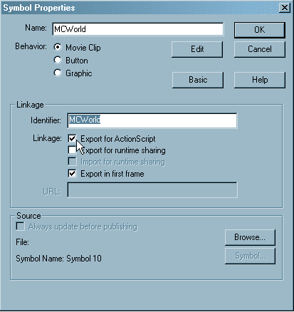
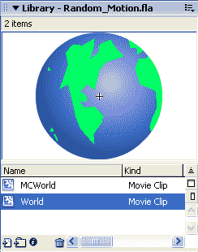
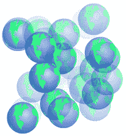
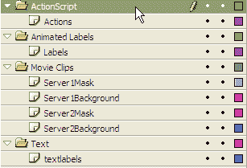
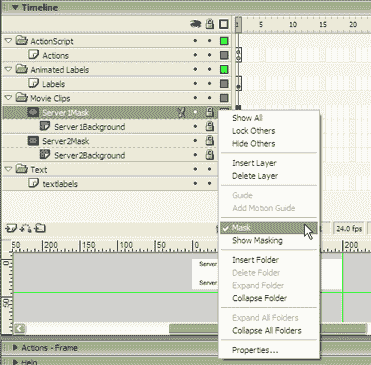
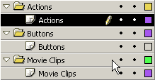
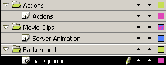
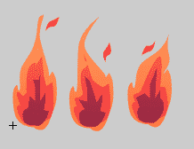

# Flash 选集:酷炫效果和实用动作脚本-第 3 章:动画效果

> 原文：<https://www.sitepoint.com/flash-anthology-3/>

互联网设计的时尚可能来来去去，但有一点永远不会改变，那就是你的 Flash 作品越有活力，就越能吸引用户。这种动态在某些情况下可能会适得其反，尤其是当多个效果争夺用户的注意力，或者效果过于花哨的时候。识别有效动画的关键就像寻找圣杯一样。一些用户认为这是一个很酷的效果，而另一些用户则觉得毫无兴趣——反之亦然。永远不要忽视在你试图制作的界面和动画之间取得平衡的重要性。

Flash 的核心一直是动画和运动。毕竟，这是 Flash 最初创建的目的——对象随时间变化的动画。随着新版本的发布和技术的发展，Flash 脚本语言的功能也在发展。我们曾经只能通过关键帧和补间来实现的事情现在可以通过几行 ActionScript 来完成。一些开发者发现这个现实很难把握，但是正如我们在第 2 章导航系统中看到的，一旦你理解了基础，你就可以在基础上进行新的实验。

除了极少数例外，关键帧补间可以实现的功能也可以通过 ActionScript 实现。但是，脚本的优势是什么？答案很简单:可移植性、可扩展性和可管理性。您可以通过调整 ActionScript 中的一个等式或几个变量来显著影响动画。这个过程比费力地编辑补间动画要容易得多，补间动画有时会在大型动画效果中出现数百个。

然而，这并不意味着补间动画已经消亡——绝不是。如果您创建简单的补间动画(例如，显示对象大小增加的效果)，然后多次编写该效果的脚本并通过 ActionScript 进行试验，您可以用最少的努力创建一些非常惊人的效果。

有了 Flash MX 2004 和时间轴效果的引入，创建这些补间动画构建块所需的工作比以前更少，我们将在下一章中看到这一点。我会给你你需要的信息来开发你可以自豪的经典效果和令人兴奋的新动画。您还将学习创建创新的时间线效果所涉及的技术。从现在开始，几乎都是动作脚本，所以准备好你的计算器和铅笔吧！如果您需要复习一下 Flash 的基本知识，请不要错过本系列的第 1 章。

另请注意，如果您喜欢离线阅读内容，您可以[下载 pdf 格式的本章内容](https://www.sitepoint.com/show-modal-popup-after-time-delay/)。

##### 动画原理

如果你正在阅读这本书，那么我可以非常肯定你有 Flash MX 或更高版本的副本。您购买 Flash 可能是因为其核心的动画功能。在 Flash 动画的最基本形式中，我们可以通过在时间轴内的关键帧处改变对象的属性，将对象的位置或形状从点/形状 A 平滑地过渡到点/形状 B。这在以前的 Flash 版本中是一个繁琐的过程，但现在更容易实现了。通过对 ActionScript 和运动动力学的深入了解，您可以快速创建动画效果，而在以前的版本中，创建这些效果需要花费数小时。

***砸书！***

当你离开学校的时候，你怎么处理你的旧物理和数学课本？你把它们扔掉了吗？如果你这样做了，你应该感到羞耻——它们可以成为在 Flash 中创建数学和运动相关的脚本动画的宝贵灵感来源。我有点囤积癖，这可能解释了为什么我还留着我的！

Flash 在制作动画时有许多用途。也许您想要创建一个简单的动画，将对象从 A 点移动到 b 点。也许您渴望构建一个更复杂的具有“真实世界”感觉的动画，将对象放松到位或让它们展现弹性特征。在 Flash 中，简单和高级动画都可以通过不同的方法实现:手动、使用复杂的关键帧和补间动画，或者借助 ActionScript。

虽然动画的 ActionScript 方法最初可能看起来很难，但一旦您熟悉了它的运动方法并了解了它快速有效的方法的细微差别，您很快就会在现有知识的基础上创建越来越复杂的动画。如果这是您第一次使用 ActionScript，您很快就会惊讶地发现创建脚本动画是多么容易。这应该会激发你探索自己的想法和实验，并将 ActionScript 发挥到极致。

***动画过载***

在 Flash 电影中轻松包含动画技术和效果的能力通常是人们使用这项技术进行动画开发的原因。然而，没有经验的用户可能会屈服于“动画狂怒”，因为他们变得有点*太*被 Flash 触手可及的强大功能冲昏了头脑。夸张的动画效果是结果——在同一部电影中不小心复制的效果，至少可以说，只会成功地创造一种不愉快的体验！

人们很容易变得喜欢扣动扳机，让显示器的每个元素都充满活力，但这种方法会带来灾难。你开始创造的效果很快就会消失，被周围所有的其他东西淹没。

有效动画的关键在于保持你试图传达的信息和屏幕上发生的事情之间的平衡。即使稍微改变一下平衡也会破坏你的效果，所以采用下面的指导方针作为创建成功动画的经验法则:

***驯服动画***

“因为你可以”并不是一个足够好的理由来制作动画。用户倾向于认为过多的动画是业余爱好者的标志——尽管你的网站肯定会给人留下印象，但它不会是一个好网站！

***稳妥微妙***

夸张或花哨的效果会惹恼用户，尤其是当动画是主界面或导航的一部分时。努力创造赏心悦目的效果，而不是侵扰。

***考虑用户***

试着与你创造的任何效果保持距离；假设你是第一次观看它的用户。如果你认为它“太多”，那么它可能是。如果你不喜欢，你的用户也不会喜欢。当然，你不可能一直取悦所有的人，所以试着找到一个让大多数访问者满意的折中方案。

***退后！***

预览电影时，请尝试站在离显示器几英尺远的地方。信不信由你，这能让你清楚地感受到动画在屏幕上的移动。如果你懒得走到房间的另一边，试着眯着眼，让屏幕模糊一点。你将能够在没有令人分心的细节的情况下检测到屏幕上的运动，这将有助于你识别电影是否动画过度。

***用动画保守***

是的，你可以用 ActionScript 创建很酷的动画，但你不应该把它们都包含在一个页面、界面或效果中。你可能会因为在设计中加入太多其他动画而失去焦点。尝试在你的设计中加入动画，而不是用动画风暴淹没用户。

##### 补间还是不补间？

几年前，Flash 开发人员别无选择。为了在 Flash 中创建动画效果，我们使用了关键帧和运动或形状补间。现在，我们有了选择的奢侈；我们可以编写动作脚本，或者通过传统路线创建动作。当我们将脚本动画与传统补间方法进行比较时，我们很快就会看到，这两种方法都有好处。

然而，值得注意的一点是，有了动作脚本，整部电影不需要比一帧更长。控制动画的是 ActionScript，而不是时间轴，这样就可以制作出结构简单、组织良好的电影。

让我们来看看一个你可能已经熟悉的简单动画技术:线性运动。您可以创建的最基本的效果是从一点移动到另一点，事实上，这可能是您第一次打开 Flash 时尝试的效果之一。现在让我们重温一下。

##### 时间轴动画示例

在时间轴上很容易制造出这种效果。让我们看一下相关的步骤。

1.  在舞台上绘制一个简单的形状(如圆形)，并将其转换为名为`Timeline_Animation`的电影剪辑元件。将元件实例放置在舞台上的(0，0)位置。

3.  在主时间轴中选择第 10 帧，右键单击，然后选择“插入关键帧(F6)”。请注意，影片剪辑实例被复制到新的关键帧中。

5.  选择第 10 帧中影片剪辑的实例，并将其移动到(100，100)。

7.  选择第 1 帧，右键单击，然后选择“创建补间动画”。

预览您的电影。您已经创建了一个简单的动画，将剪辑从一个点移动到另一个点。这是一个简单的动画；如果效果更复杂，时间线可能会很快变得混乱，难以处理。

以这种方式使用时间轴创建简单的运动也可以在 Flash MX 2004 和更高版本中通过时间轴效果来完成(在第 4 章“文本效果”中有详细介绍)。

##### 动作脚本动画示例

让我们再来看看这个动画，但这一次，让我们在 ActionScript 中构建它。

1.  在舞台上绘制一个简单的形状(如圆形)，并将其转换为名为`Scripted_Animation`的电影剪辑元件。将元件实例放置在舞台上的(0，0)处，并将实例命名为`scripted_animation`。

3.  打开“动作”面板并选择主时间轴的第一帧，添加以下代码:

```
var endX = scripted_animation._x + 100; 

var endY = scripted_animation._y + 100; 

var stepX = (endX - scripted_animation._x) / 10; 

var stepY = (endY - scripted_animation._y) / 10; 

scripted_animation.onEnterFrame = function () 

{ 

  if (this._x < endX) this._x += stepX; 

  if (this._y < endY) this._y += stepY; 

};
```

首先，我们为`x`和`y`端点(`endX`和`endY`)设置变量，使其等于起始坐标加上每个轴上的 100 个像素。然后，我们使用这些值来计算对象每帧需要沿着每个轴(`stepX`和`stepY`)移动多少才能在十帧内到达目的地。然后，我们引入一个事件处理程序，它将对象沿着两个轴移动计算好的距离，直到它到达目的地。

不过，这段代码将前面的示例向前推进了一步，因为您可以将该影片剪辑放在舞台上的任何位置。无论剪辑的起始位置在哪里，剪辑都将从起始位置沿每个轴移动 100 个像素。

你可能会寻找更多的代码来完成效果，但仅此而已！很简单，不是吗？当然，当您添加更多有趣的效果时，ActionScript 会变得更加复杂，但这种方法无疑会减少时间轴上的混乱。

使用时间轴和补间动画构建的动画对于测试和作为较大动画的一部分实现非常有用(例如，为加载动画创建简单的旋转)。使用 ActionScript 开发动画的真正好处是可伸缩性和响应用户输入或其他变量的动态移动机会。

一旦你开始用 ActionScript 制作动画，就很难停下来——这种方法确实是你创造力的跳板。此外，不要忘记保存您的实验 FLA 文件，即使您不直接使用它们。你永远不知道什么时候你可能需要它们！

##### 创建函数库

一旦 ActionScript bug 咬了你，你就会被永久感染，而且没有已知的解药！随着时间的推移，您将创建许多 Fla，并且毫无疑问将构建您自己的核心脚本和方法集。但是，与其每次需要执行特定功能时都要重新发明轮子，为什么不将脚本保存在`.as` (ActionScript)文件中呢？这些文件可以在您需要时动态地包含在您的作品中。

我维护着过去几年创建的核心脚本，并定期备份。我总是很小心地将我的 ActionScript 文件分类到一个逻辑文件夹结构中。这样，当我开始一个新项目时，我可以毫不费力地获取现有的脚本文件。

任何仍在开发中的脚本，或者我没有时间完成的脚本，我都放在一个名为`unfinished.as`的文件中。这样，我就不会丢失代码或不小心删除了代码，并且我可以稍后再回来完成或进一步开发它。

***Hotmail 进行备份***

如果我丢失了所有的代码片段，我会很不高兴的！而且，即使我定期执行备份，我也永远无法确定它们的完整性。出于这个原因，我用 Hotmail 建立了一个免费邮件帐户，并创建了一个存档文件夹。现在，每个月，我都会给自己邮寄一份我的。作为文件。这可能看起来有点极端，但是如果您曾经在硬盘或备份故障中丢失过您的工作，您就会理解为什么我要如此努力地保护我的代码。

##### 创建简单的函数库

一个简单的动画库可以帮助你清理你的时间线，使事情更容易管理。要创建自己的库，请遵循以下步骤，或者只需在代码归档中找到`Simple_Motion.fla`和`Simple_Motion.as`:

1.  查看您在上面完成的 ActionScript 动画示例的代码；具体来说，看看 onEnterFrame 事件处理程序。我们可以编写一个函数，给定`stepX`、`stepY`、`endX`和`endY`值，为指定的`clip`做同样的工作:

**例 3.1。`Simple_Motion.as`**

```
function SimpleMovement (stepX, stepY, endX, endY, clip) 

{ 

  if (clip._x < endX) clip._x += stepX; 

  if (clip._y < endY) clip._y += stepY; 

}
```

`SimpleMovement`函数的结构类似于事件处理程序，除了它接受参数来告诉它具体做什么(以及对什么剪辑做)，而不是依赖预定义的变量。

将此功能的代码输入文本编辑器(如 PC 上的记事本或 Mac 上的 BBEdit)并另存为`Simple_Motion.as`。

*   要使用此文件，请将下面一行 ActionScript 添加到任何电影的根目录中的第一帧

**例 3.2。`Simple_Motion.fla`行动:1(节选)**

```
#include "Simple_Motion.as"
```

当 SWF 文件被创建时，它将把来自`Simple_Motion.as`文件的代码编译成 SWF 文件，提供对我们上面创建的`SimpleMovement`函数的访问。

*   更改 onEnterFrame 事件处理程序以使用导入的函数，如下所示:

**例 3.3。`Simple_Motion.fla`行动:1(节选)**

```
scripted_animation.onEnterFrame = function () 

{ 

  SimpleMovement(stepX, stepY, endX, EndY, this); 

};
```

在这里，我们创建了一个简单的函数调用，传递时间轴根上定义的四个变量，以及我们希望制作动画的电影剪辑。

*   在 Flash 中预览您的电影，您会看到它完全像以前一样工作。

在另一个项目中包含该函数非常简单，只需将`.as`文件保存到包含您正在处理的 FLA 的目录中，并将`#include`指令添加到项目中。然后，您可以随时使用该功能。

##### 创建主库

当您处理一系列共享相似主题的项目时，您可能会发现它们还共享位图、矢量和声音对象。如果您忘记了这些共享对象驻留在哪个 FLA 中，您只能在耗时的搜索和费力的复制之间做出选择。

为了避免这种情况，我为我的按钮、电影剪辑和动画创建了我称之为*的主库*，我根据它们的内容给它们命名。例如，我可能会创建一个 FLA 文件，其中包含所有塑料或光滑外观的按钮，并将其命名为`Buttons - Plastic_Gloss.fla`。然后，我会将它保存在主目录中。当我需要它们时，我只需选择文件>导入>导入到库…，找到我的 FLA 文件，然后，很快！这些按钮出现在“库”面板中，供当前项目使用。

甚至在几个月之后，你可能会回到一个项目来增强它或者添加额外的功能。如果你不记得源文件在哪里，你会浪费很多时间。使用此过程可以让您更明智地使用时间和资源，并在项目间保持一致的外观和感觉。

我认为，到目前为止，我们已经介绍了在使用 Flash 时提高工作效率的大多数最佳实践和方法。我在这里概述的实践只是让你的生活变得更轻松的指南；它们不是硬性规定。所以，你可以随心所欲地拥抱他们中的任何一个。

现在是时候再次“收起枪套”，准备与一些非常酷的动作脚本效果摊牌了！

##### 随机运动

你曾经想要为一个或多个物体创造随机运动吗？有一个简单的技术，它将采用一个单独的电影剪辑，创建对象的许多副本，并随机地将它们放在画布上。然后，它创造了不断随机运动的幻觉。最重要的是，这种技术很容易扩展，例如，允许您动态地改变对象的许多属性，包括不透明度和缩放。

如果您想在继续之前播放成品，请查看代码档案中的`Random_Motion.fla`。

<object bgcolor="black" data="https://i2.sitepoint.com/flash/Random_Motion.swf" height="400" type="application/x-shockwave-flash" width="400"><param name="movie" value="https://i2.sitepoint.com/flash/Random_Motion.swf"></object>

##### 设置场景

首先，您需要创建一个新的 Flash 电影来展示您的效果。

1.  选择“文件”>“新建”以创建新的 Flash 电影。

3.  选择“修改”>“文档”，并将影片的宽度和高度都设置为 300 像素。

为了随机放置和移动对象的副本，您首先需要一个要使用的对象。在这个例子中，我们将创建一个名为`MCWorld`的电影剪辑容器，它将包含另一个名为`World`的电影剪辑。

*   选择“插入”>“新建元件”,选择影片剪辑，并将剪辑命名为`MCWorld`。点击高级按钮查看剪辑的链接参数，选择为 ActionScript 导出，并将标识符命名为`MCWorld`，如图 3.1 所示。


图 3.1。设置父电影剪辑的链接属性。

***注意:*** 我们选择“为 ActionScript 导出”按钮，因为稍后我们将动态使用 ActionScript 创建该剪辑的实例。为此，我们需要通过选择此选项并为剪辑分配一个唯一的标识符来使它对 ActionScript 可用。

*   创建一个图形元件，其中包含要分配随机移动的对象或图像。选择插入>新符号…并选择图形。将此符号命名为`World`，然后使用绘图工具或通过从外部源导入图像或其他对象来创建对象。

库面板现在应该包含一个名为`World`的图形符号，如图 3.2 所示。


图 3.2。添加子电影剪辑。

*   双击`MCWorld`电影剪辑将其打开。将`World`符号的一个实例拖入其中，并将该实例命名为`World`。

##### 添加动作脚本

太好了！我们已经创建了一个名为`MCWorld`的剪辑，其中包含一个名为`World`的图形。现在，我们可以开始添加 ActionScript，它将控制舞台上发生的事情:

*   在主时间轴中选择图层 1，并将其命名为 ActionScript。展开动作面板(选择“窗口”>“开发面板”>“动作”或按下 **F9** )。*   在“动作”面板中添加以下代码。这段代码创建了三十个`MCWorld`剪辑的实例，并将它们随机放在画布上。它还随机改变剪辑的不透明度。

**例 3.4。动作脚本:1**

```
var numObjects = 30;  

for (i = 0; i < numObjects; i++)  

{  

  var randomObject = attachMovie ('MCWorld', 'MCWorld' + i, i);  

  randomObject._x = random (300);  

  randomObject._y = random (300);  

  randomObject._alpha = random (100);  

}
```

这里的关键是`attachMovie`方法，它允许您向当前电影添加一个新的电影剪辑。我们传递给该方法的参数是:我们给库中剪辑的标识符(`MCWorld`)、每个剪辑实例的唯一名称(在本例中为`MCWorld`并附加了一个数字)，以及一个指示剪辑在堆叠顺序中的位置的数字。

这段代码中还需要注意的是`random`函数，它返回一个介于 0(包括 0)和指定数字(不包括 0)之间的随机整数。所以`random (300)`返回一个从 0 到 299 的数字。我们使用这个函数为我们创建的每个实例生成舞台上的位置和不透明度。

随着我们的舞台充满了随机放置的图形，现在是时候移动它们了。

*   双击“库”面板中的`MCWorld`影片剪辑将其打开。选择图层 1，并将其重命名为 ActionScript。*   在“动作”面板中添加以下代码。它使用`setInterval`(一个标准的 JavaScript 函数)每十分之一秒将图形符号实例(World)移动到当前位置两个像素内的一个新的随机位置。

**例 3.5。动作脚本:1**

```
setInterval (Randomizer, 100);  

function ()  

{  

  var xShift = random (5) - 2;  

  var yShift = random (5) - 2;  

  World._x += xShift;  

  World._y += yShift;  

}
```

我们可以使用一个`onEnterFrame`事件处理程序来做这件事，但是`setInterval`允许我们独立于电影的帧速率来定义运动的速度，这在很多情况下是有用的。

##### 测试电影

您已经创建了您的电影剪辑；现在，让我们试驾一下这部电影。

*   选择“控制”>“测试影片”以预览您的影片。


图 3.3。在 Flash 中预览电影。

如果一切都按计划进行，您应该会看到一个类似于图 3.3 所示的动画随机电影，其中图形的 x 和 y 坐标每十分之一秒改变一次。

使用这里概述的基本构件，可以很容易地实现随机运动。通过实验，你会意识到这种技术的应用是无限的。

##### 修改

很容易修改`Randomizer`函数来改变电影的表现。正如我们将要看到的，在代码的不同点改变对象的各种属性会产生非常戏剧性的效果。

<object bgcolor="black" data="https://i2.sitepoint.com/flash/Random_Motion_Alpha.swf" height="400" type="application/x-shockwave-flash" width="400"><param name="movie" value="https://i2.sitepoint.com/flash/Random_Motion_Alpha.swf"></object>

***闪烁不透明***

回到`Randomizer`函数，让我们添加一条额外的线来改变图形的不透明度。

1.  在`MCWorld`影片剪辑的第一帧中找到`Randomizer`功能，并按如下方式进行调整:

**例 3.6。`Random_Motion_Alpha.fla MCWorld`:动作脚本:1(节选)**

```
function ()  

{  

  var xShift = random (5) - 2;  

  var yShift = random (5) - 2;  

  World._x += xShift;  

  World._y += yShift;  

  World._alpha = random(100);  

}
```

*   保存并预览电影。

每十分之一秒，在每个图形被轻推的同时，不透明度现在被重置为 0 到 99%之间的随机值，产生闪烁效果。有多简单？

您甚至可以插入其他对象属性，例如，改变对象的水平和垂直比例。在上面的代码中添加以下几行将随机缩放图形对象:

`World._xscale = random(100);  
 World._yscale = random(100);`

***增加重绘率***

正如我前面提到的，使用`setInterval`来触发我们的图形的变化会使这个动画脱离电影的帧速率。要提高动画的速率，只需改变调用`setInterval`时指定的延迟:

**例 3.7。`Random_Motion.fla MCWorld`:动作脚本:1(节选)**

```
setInterval(Randomizer, 100);
```

减小该值将增加重绘率(调用`Randomizer`函数的频率)。请记住，这些值是以毫秒计的。要将重绘速率更改为一秒，可以将值设置为`1000`。请记住，减少重绘之间的时间会增加 CPU 的负载。如果您的影片使用大量对象或复杂的对象，用户的电脑可能很难跟上这些变化。

***增加物体数量***

要增加屏幕上最初绘制的对象数量，只需更改主时间线代码中的`numObjects`变量:

**例 3.8。动作脚本:1(节选)**

```
var numObjects = 30;  

for (i = 0; i < numObjects; i++)  

{
```

循环的**使用这个变量来控制创建的对象的数量，所以改变对象的数量再简单不过了！**

如果这些对象很复杂，CPU 负载也会相应增加。小心点！

***改变随机移位值***

在对象最初被随机放置在画布上之后，`Randomizer`函数每十分之一秒移动图形的 x 和 y 坐标，以给出一种紧张不安的外观。要提高或降低质量，只需在`Randomizer`函数中找到并编辑以下几行:

**例 3.9。`Random_Motion.fla MCWorld`:动作脚本:1(节选)**

`var xShift = random(5) - 2;  
 var yShift = random(5) - 2;`

为了防止您的图形离开舞台，请确保每行的第一个数字是第二个数字的两倍加一。这种关系确保了计算出的偏移值趋于平均为零。当然，维护这种关系的最简单的方法是在代码中将其显式化:

`var nervousness = 2;  
 var xShift = random(nervousness * 2 + 1) - nervousness;  
 var yShift = random(nervousness * 2 + 1) - nervousness;`

正如你所看到的，一旦你熟悉了编辑对象的属性，并随机化它们的值，你就可以创建一些非常有趣的效果。找出你能做什么的关键是试验价值观，探索 ActionScript 参考，并从中获得乐趣！

##### 简单的脚本屏蔽

在这个例子中，我们将根据我们提供的输入参数，从一个点到另一个点制作一个遮罩动画。我创建这个例子是为了说明托管多个网站的两个 Web 服务器所接收的流量。影片接受两个输入参数，然后相应地制作遮罩动画。对于这个简单的例子，我们将通过在时间轴的根中声明变量来静态填充变量。更真实的场景是将电影嵌入到数据库驱动的网页中，并将变量动态传递给电影。我们将在《第 8 章，外部数据》中讨论导入外部数据。

<object bgcolor="black" data="https://i2.sitepoint.com/flash/Simple_Animation_Masking.swf" height="400" type="application/x-shockwave-flash" width="400"><param name="movie" value="https://i2.sitepoint.com/flash/Simple_Animation_Masking.swf"></object> 
图 3.4。这个简单的脚本遮罩效果可以在两点之间制作遮罩动画。

成品如图 3.4 所示。让我们看看这个效果是如何完成的。要直接跳到修改效果，请在代码归档中找到名为`Simple_Animation_Masking.fla`的文件。

1.  创建一个 200 像素宽、40 像素高的新电影。将帧速率更改为 24 fps，以获得流畅的动画效果。

*   创建如下图 3.5 所示的文件夹和层。


图 3.5。组织图层和文件夹以实现脚本化遮罩效果。

我们现在需要创建背景酒吧，我们将掩盖。在本例中，我创建了一个左边为白色，右边逐渐变红的条形，表示服务器负载随着流量的增加而增加。

*   在`textlabels`层中添加两个静态文本字段，并输入文本`Server 1`和`Server 2`，让用户知道每个条形代表什么。我们不需要将它们转换成电影剪辑，因为我们不会在 ActionScript 中引用它们。将它们分别移动到(1，0)和(1，25)。*   在`Server1Background`图层中，新建一个 100 像素宽 9 像素高的矩形。选择一种渐变填充，该填充从矩形左侧的白色，经过黄色和橙色，到右侧的红色。选择矩形，然后选择插入>转换成符号…选择创建一个名为`Background`的图形。*   将现有的实例命名为`Background backg1`，并将其移动到(50，3)。将图形的第二个实例从“库”面板拖动到 Server2Background 层，将其命名为`backg2`，并将其移动到(50，29)。锁住这两层；我们不需要进一步修改它们。

现在我们已经创建了背景，我们可以通过 ActionScript 来创建我们要控制的遮罩:

*   创建一个新的矩形，没有笔触，纯白填充，宽 5 像素，高 9 像素(这正好与我们要遮罩的电影剪辑的高度相匹配)。将矩形转换为名为`ServerAnimation`的图形符号，并将图形实例放置在 Server1Mask 和 Server2Mask 图层中。

分别命名实例`server1Mask`和`server2Mask`。(这很重要，因为我们稍后将在 ActionScript 中引用这些剪辑。)将它们移动到(50，3)和(50，29)，使它们与 backg1 和 backg2 影片剪辑的左边缘齐平。

*   为了达到想要的效果，我们需要设置`server1Mask`和`server2Mask`图形，使它们作为下面背景图形的*遮罩*。找到 Server1Mask 和 Server2Mask 图层，右键单击每个图层，然后选择 Mask(参见图 3.6)。


图 3.6。将动态电影剪辑转换为遮罩。

电影播放时，只有服务器 1 背景和服务器 2 背景中的`Background`图形被服务器 1 掩模和服务器 2 掩模中的`ServerAnimation`图形覆盖的部分才可见。

*   我们现在需要制作两个遮罩图形的动画，以便它们显示出`Background`图形的适当部分。选择“动作”层，在“动作”面板打开的情况下，将以下代码添加到第一帧中:

**例 3.10。`Simple_Animation_Masking.fla`行动:1(节选)**

```
var server1load = 25;   

var server2load = 75;   

function animate (server, serverload)   

{   

  server.onEnterFrame = function ()   

  {   

    if (this._width <= serverload)   

      this._width += 2;   

  };   

}   

animate (server1Mask, server1load);   

animate (server2Mask, server2load);
```

这就是我们更改矩形以使两个条形图增长到指定长度所需的全部代码。我们来看看是怎么做的。

首先，我们创建两个变量，它们的值表示(以百分比表示)我们希望为每台服务器显示多少`Background`图形。数学很简单，因为`backg1`和`backg2`图形正好是 100 像素宽。

`animate`函数引用了我们的一个遮罩图形，并设置了一个 onEnterFrame 事件处理程序，将它的宽度每帧增加两个像素，直到达到指定的值。代码通过为两个遮罩图形中的每一个调用`animate`来结束，传递两个服务器负载值中的每一个。

保存您的电影并预览。注意这两个遮罩是如何增长到由`server1load`和`server2load`变量决定的大小的。这是一个非常酷的效果，您可以轻松地将它包含在您的项目中，创建条形图或其他随时间推移而发生的增长的可视化显示。

##### 添加文本标签

到目前为止，我们已经设法随着时间的推移动画遮罩，以创建一个光滑的，动画条形图。这很好，但是我们不知道条形代表什么值。让我们为每个图形添加一个文本标签来完成效果:

*   创建一个名为`serverinfo`的新图形符号，其中包含一个 34 像素宽、15 像素高的动态文本字段。在文本字段的属性检查器中，将变量名称设置为`serverload`(我们将使用它来设置为每个服务器显示的值)。此外，在属性检查器中，单击“字符…”并确保“嵌入字体轮廓”设置为“基本拉丁文”(或“Flash MX 中的所有字符”)。*   将此新元件的两个实例拖到动画标签文件夹的标签层的第一帧中。将实例命名为`server1info`和`server2info`。将它们分别放置在(54，1)和(54，27)处。*   导航回影片根目录中动作层的第一帧。在前两个变量下插入以下代码:

**例 3.11。`Simple_Animation_Masking.fla`行动:1(节选)**

```
server1info.serverload = server1load + "%";   

server2info.serverload = server2load + "%";
```

这段代码在两个 serverinfo 符号内设置 serverload 变量，控制它们显示的文本。

*   保存并预览您的工作。

您会注意到，每个条形的值现在就在我们放置它们的地方。考虑到正在发生的运动，它们看起来有点不合适。我们最好给它们制作动画，这样它们就能融入其中。

*   仍然在 Actions 层的第一帧中，添加以下函数声明:

**例 3.12。`Simple_Animation_Masking.fla`行动:1(节选)**

```
function moveText (serverinfo, serverload)   

{   

  var startPos = serverinfo._x;   

  serverinfo.onEnterFrame = function ()   

  {   

    if (this._x <= startPos + serverload)   

      this._x += 2;   

  };   

}
```

这个函数的工作方式就像`animate`函数一样，但是它将我们传递给它的图形水平移动，而不是设置它的宽度。

***尝试一些快速的文本***
为了增加电影视觉吸引力的稍微不同的效果，你可以通过将移动的步长从两个增加到四个来使文本移动得比条形更快。

剩下的就是为我们的每个文本标签调用这个函数来启动它们的动画。

*   添加以下代码:

**例 3.13。`Simple_Animation_Masking.fla`行动:1(节选)**

```
moveText (server1info, server1load);   

moveText (server2info, server2load);
```

*   保存您的电影并预览。

就是这样！这个文本字段的脚本动画完成了这个效果，看起来非常酷！

##### 修改

您可以轻松修改此效果，以包含更多项目。只需创建更多的条形，并在电影加载时引用它们，以生成有趣的图形。这种效果也可以生成移动条，当电影被加载时，移动条滑动到位。你选择哪一个方向来实现这一效果真的取决于你。

##### 雨点不断落在我头上

创建动画效果的最快方法之一是在舞台上多次复制动画。这种技术的成功依赖于原始动画足够酷以保证这种复制。在本例中，我们将通过在画布上多次复制电影剪辑来创建快速降雨效果。听起来简单吗？我们来看看是怎么做的。

要跳过细节直接进入效果，在代码归档中找到`Duplication.fla`文件。

<object bgcolor="black" data="https://i2.sitepoint.com/flash/Duplication.swf" height="400" type="application/x-shockwave-flash" width="400"><param name="movie" value="https://i2.sitepoint.com/flash/Duplication.swf"></object> 
图 3.7。这个简单的雨滴效果是使用复制创建的。

##### 设置场景

首先，我们需要创建我们将在控制代码中引用的电影剪辑。

1.  创建一个 350 像素宽、400 像素高的新电影。将帧速率提高到 18 fps。创建三层，命名为动作，雨滴和背景。

*   创建一个名为雨滴的图形符号，并使用绘图工具绘制一滴水。*   创建新的影片剪辑元件，也命名为`Raindrop`。确保它已打开进行编辑，然后将`Raindrop`图形的一个实例从“库”面板拖到舞台上。命名实例`Raindrop`。将其定位在剪辑中的(0，0)处。*   在影片剪辑的第 40 帧创建一个新的关键帧。选择第 1 帧，右键单击，然后选择“补间动画”。移回第 40 帧，将雨滴图形移动到舞台底部，大约(0，390)。*   在“库”面板中，复制您创建的`Raindrop`影片剪辑，并将该副本命名为`RaindropSlow`。编辑`RaindropSlow`影片剪辑，在时间轴中抓取结束关键帧，并将其拖出到第 80 帧。这将产生一个较慢的动画。

稍后我们将使用这两个雨滴剪辑来创建一个微妙的效果。现在让我们组装主场景:

*   将`Raindrop`和`RaindropSlow`电影剪辑各一个实例拖入雨滴层。分别命名为`raindrop`和`raindropSlow`。*   移动两个剪辑，使它们位于舞台顶部附近，但在其左边缘之外。我把它们放在(-45，10)和(-30，10)。如果您看不到舞台边缘以外的地方，您可能必须先选取“视图”>“工作区”。这里的目标是让水滴成为场景的一部分，但在舞台上看不到。*   选择背景层，使用绘图工具添加一些起伏的山丘和风暴云。要完成，锁定这一层。

##### 添加控制代码

所有的图形都被创建并放置在舞台上；我们只需要复制几次。如果你现在预览这部电影，你会看到两个单独的雨滴，一个比另一个落得快，落在舞台的一边。我认为我们最好用一点动作脚本来增加点趣味。

*   导航到时间轴中动作层的第一帧，并添加以下代码:

**例 3.14。`Duplication.fla`行动:1**

```
for (i = 0; i < 50; i++)    

{    

  var newDrop = raindrop.duplicateMovieClip ("raindrop" + i,    

      i);    

  newDrop._x = random (350);    

  newDrop._y = random (20);    

}
```

这里，我们使用`duplicateMovieClip`方法创建位于时间轴根的`raindrop`片段的 50 个副本。如果你想要更多的雨滴，你可以把循环中**的数字`50`改成你喜欢的。但是，要小心大量电影剪辑带来的 CPU 负载增加。**

与我们在本章前面看到的`attachMovie`方法一样，`duplicateMovieClip`需要参数来设置新影片剪辑的实例名(在本例中为`raindrop`加上一个数字)及其在堆叠顺序中的位置。

复制影片剪辑后，我们为每个副本分配一个介于零和舞台右侧(x=350)之间的随机水平位置。我们还使用 0 到 20 之间的随机值垂直移动剪辑的每个实例，使其看起来好像雨滴从云的不同部分落下。

*   保存您的电影并在 Flash 中预览。你会注意到，尽管雨滴看起来沿着 x 轴和 y 轴随机分布，但它们是以直线下落的。我家附近肯定不会下这样的雨！我们可以通过在代码中引入更多的随机元素来快速补救这种情况。*   将“动作”面板中的代码替换为以下内容:

**例 3.15。`Duplication.fla`行动:1(节选)**

```
for (i = 0; i < 50; i++)    

{    

  var newDrop = raindrop.duplicateMovieClip ("raindrop" + i,    

      i);    

  newDrop._x = random (350);    

  newDrop._y = random (20);    

  newDrop.gotoAndPlay(random(40) + 1);    

}
```

注意这个块中额外的一行代码，用粗体显示。这个小片段可能看起来无关紧要，但它使动画变得生动。使用每个新剪辑的`gotoAndPlay`方法，动画前进到 1 到 40 之间的随机帧(记住，`random(40)`生成从 0 到 39 的值)，然后从该点播放。

*   保存并预览您的电影。你会注意到现在的雨滴比以前落下时自然多了。

虽然这个动画很容易完成，但在执行过程中很有效。有很多方法可以扩展这个例子，使它更有趣。现在让我们花一点时间来检查一下。

##### 增加一些随机性

为了使这种效果更引人入胜，我们可以在创建时修改每一滴雨的水平比例和 alpha 值:

*   修改动作层中的代码，如下所示:

**例 3.16。`Duplication.fla`行动:1(节选)**

```
for (i = 0; i < 50; i++)    

{    

  var newDrop = raindrop.duplicateMovieClip ("raindrop" + i,    

      i);    

  newDrop._x = random (350);    

  newDrop._y = random (20);    

  newDrop._xscale = random (100);    

  newDrop._alpha = random (50);    

  newDrop.gotoAndPlay (random (40) + 1);    

}
```

保存并预览电影。你会看到不同宽度的雨滴——从细小的雨滴到巨大的雨滴。每个液滴的不透明度值也是在 0 到 50%之间随机选取的。

##### 天空打开了…

还记得我们之前创作的比原来的雨滴还慢的电影剪辑吗？我们现在用得上它了！并非所有的雨滴都以相同的速度落下，我们可以使用该剪辑使我们的动画更加真实。让我们添加一些代码，在我们的动画中包含第二个雨滴电影剪辑。

<object bgcolor="black" data="https://i2.sitepoint.com/flash/Duplication_Modification.swf" height="400" type="application/x-shockwave-flash" width="400"><param name="movie" value="https://i2.sitepoint.com/flash/Duplication_Modification.swf"></object>

要根据自己的需要编辑这个效果，请在代码归档中找到`Duplication_Modification.fla`。

*   将以下代码添加到 Actions 层第一帧中现有代码的下方:

**例 3.17。`Duplication_Modification.fla`行动:1(节选)**

```
for (j = i; j < i + 100; j++)    

{    

  var newDrop = raindropSlow.duplicateMovieClip (    

      "raindropSlow" + j, j);    

  newDrop._x = random (350);    

  newDrop._y = random (20);    

  newDrop._xscale = random (100);    

  newDrop._alpha = random (25);    

  newDrop.gotoAndPlay (random (80) + 1);    

}
```

这就像前面的代码块一样:循环的**创建电影剪辑的多个副本，然后使用 random 函数设置副本的各种属性值。下面是第二段代码的不同之处:**

*   我们的循环的**计数为 100，而不是 50，所以我们将创建两倍的副本。**
*   这一次，我们创建了雨滴缓慢剪辑的副本。
*   我们为这个循环使用一个新的计数器变量(`j`)，并在设置新副本的堆叠顺序时，将它添加到上一个循环结束时的计数中(`i`)。这确保了所有的液滴在堆叠顺序中有自己的位置。(否则，舞台上的慢速雨滴会取代快速雨滴！)
*   我们将慢速雨滴的 alpha 值设置在 0 到 25%之间，使它们看起来更远。
*   因为`RaindropSlow`的长度是 80 帧而不是 40 帧，所以我们调整了传递给最后一行的`random`的值。

雨滴就是这样！现在让我们看看是否可以用一些更复杂的效果来进一步增强场景。

##### 创建视差云结构

像雨滴一样，云的运动也是非常随机的——每朵云的运动速度都不一样。通过一些巧妙的数学和一些简单的云电影剪辑，你可以创建一个有趣的效果，增加场景的深度(见图 3.8)。

<object bgcolor="black" data="https://i2.sitepoint.com/flash/Duplication_Modification_Clouds.swf" height="400" type="application/x-shockwave-flash" width="400"><param name="movie" value="https://i2.sitepoint.com/flash/Duplication_Modification_Clouds.swf"></object> 
图 3.8。通过选择正确的随机值，您可以创建这种平滑的云运动。

我们将从上一节中离开示例的地方开始。要直接跳到成品，在代码档案中定位。

1.  创建两个新的影片剪辑元件，命名为`LargeCloud`和`SmallCloud`，并在每个元件中放置一个类似云的图像。使`SmallCloud`剪辑中的云大约只有`LargeCloud`中的一半大小。

*   在雨滴图层上方创建一个名为云的新图层，并将两个新影片剪辑的实例拖动到该图层中。根据它们的主影片剪辑为它们命名(分别为`largeCloud`和`smallCloud`)。同样，把它们放在舞台的一边。

我们将使用这两朵云，就像我们使用两个雨滴一样，用 ActionScript 代码复制它们来创建一个随机场景。为了给我们的云结构增加深度感，我们将创建一个*视差*效果。这包括让远处的物体(我们的小云)比附近的物体(我们的大云)移动得更慢，这就产生了透视感和深度感。

*   将以下代码添加到 Actions 层的第 1 帧，位于现有代码的下方:

**例 3.18。`Duplication_Modification_Clouds.fla`行动:1(节选)**

```
for (i = j; i < j + 60; i++)    

{    

  var newCloud = smallCloud.duplicateMovieClip (    

      "smallCloud" + i, i);    

  newCloud._alpha = random (100);    

  newCloud._x = random (450) - 100;    

  newCloud._y = random (60) + 10;    

  newCloud.step = random(4);    

  newCloud.onEnterFrame = cloudStep;    

}    

for (j = i; j < i + 30; j++)    

{    

  var newCloud = largeCloud.duplicateMovieClip (    

      "largeCloud" + j, j);    

  newCloud._alpha = random (100);    

  newCloud._x = random (450) - 100;    

  newCloud._y = random (40) - 20;    

  newCloud.step = random(4) + 2;    

  newCloud.onEnterFrame = cloudStep;    

}    

function cloudStep()    

{    

  if (this._x >= 350) this._x = -100;    

  this._x += this.step;    

}
```

通过检查代码，您可能会发现，我们创建了 60 个小型云的副本和 30 个大型云的副本。我们的循环继续使用`i`和`j`变量，以便云被添加到堆叠顺序的顶部，雨滴看起来来自它们的后面或内部。

对于每个云，我们分配一个 0%到 99%之间的随机不透明度，以及一个-100 到 350 之间的随机水平位置。请记住，这是云的左边缘的位置，所以我们需要这些负值来考虑到被舞台左边缘部分遮挡的云。

为了进一步发展深度感，并确保我们的小云不会被大云遮住，我们让我们的小云在舞台上坐得比大云(从-20 到 19)低(随机垂直位置从 10 到 69)。随着小云朵越来越靠近地平线，它们会看起来越来越远。

现在是我们视差效应的关键:云的运动。我们所有的云将从左向右穿过舞台。每个云将有自己随机分配的步长，这表明每帧它应该移动的像素数。对于小云，我们生成从零到三个像素的步长，而大云将得到从二到五个像素的步长。我们将每个云的步长存储到云的电影剪辑(`newCloud.step`)中的一个名为`step`的变量中。

最后，我们为每个云添加一个 onEnterFrame 事件处理程序，所有这些都将使用一个名为`cloudStep`的公共函数。这使用剪辑的步长将其向右移动，直到它到达 350 像素的水平位置，此时它被发送回-100。

*   保存电影并预览。要查看没有对象离开舞台时的效果，请将影片导出为 SWF 文件，然后双击它以在 Flash Player 中查看影片。

这是一个非常酷的效果！所有的云以不同的速度移动，所以这种效果看起来不像是“人造的”但是我们还可以给这个场景添加更多的东西…

##### 制造闪电

我们刚刚创造的风暴看起来相当不错，但它可以用一些片状闪电来添加点睛之笔。

<object bgcolor="black" data="https://i2.sitepoint.com/flash/Duplication_Modification_Clouds_And_Flash.swf" height="400" type="application/x-shockwave-flash" width="400"><param name="movie" value="https://i2.sitepoint.com/flash/Duplication_Modification_Clouds_And_Flash.swf"></object>

我们将从上一节讲到的地方继续。要直接跳到本例的结尾，请从代码档案中找到`Duplication_Modification_Clouds_And_Flash.fla`。

1.  创建一个名为`LightningFlash`的新影片剪辑，并添加一个填充舞台的矩形(350×400 像素)。给它一个白色渐变填充，从矩形中心的 100%不透明度渐变到矩形底部边缘的 0%不透明度。

*   回到主时间轴，在云图层上创建一个名为 Flash 的新图层，并将新影片剪辑的一个实例拖动到其中。将实例命名为`flash`。你可以锁定和隐藏层-我们将不再需要编辑它。

现在我们已经创建了电影剪辑，我们可以添加控制代码:

*   再次将以下代码添加到动作层的第 1 帧的末尾:

**例 3.19。`Duplication_Modification_Clouds_And_Flash.fla`行动:1(节选)**

```
flash._alpha = 0;     

flash.onEnterFrame = function ()     

{     

  var flashControl = random (10);     

  if (flashControl >= 9 ||     

      flash._alpha > 0 && flashControl >= 5)     

  {     

    flash._alpha += random (65);     

    if (flash._alpha > 65)     

    {     

      flash._alpha = 0;     

    }     

  }     

};
```

我们首先将`flash`电影剪辑的不透明度设置为零，这样闪电就不会出现，直到我们希望它出现。

接下来，我们处理 onEnterFrame 事件处理程序，它将控制电影每一帧的闪电的不透明度。

即使在最恶劣的暴风雨中，闪电也是一种间歇性的东西。经过一番摆弄，我决定我希望在任何给定的帧中有 10%的机会出现闪电。所以我使用 random 来生成一个介于 0 和 9 之间的数字(`flashControl`)，并编写我的代码，这样每当这个数字为 9 时，它就会发出一道闪电。

在 **if** 语句的主体中，代码继续向`flash`影片剪辑的不透明度添加一个 0 到 64 之间的随机值。一旦发生这种情况，我们希望闪电的亮度继续增长，直到它达到闪电的最大亮度(经过一些实验，我决定是 65%的不透明度。在这一点上，我们设置不透明度回零，并等待下一个闪电。

当闪电出现时，我们不想等待十分之一的闪电机会来使现有的闪电变得更亮。同时，我们可以通过不让闪电在每一帧都变得更亮来增加闪电的多样性。这就是为什么【T2 if 语句中的条件如此复杂——如果闪电正在发生(我们通过检查`flash._alpha`是否大于零来检测)，那么我们允许闪电在 50%的时间里变得更亮(每当`flashControl`大于或等于 5 时)。

*   保存电影并在 Flash 中预览。

我们在这里使用的条件，包括随机值的使用，导致 flash 电影剪辑的 _alpha 值时隐时现，产生了一个暴风雨般的场景。你可以随意试验我设定的概率，让风暴变得更强或更弱。

##### 创建用户驱动的运动

在这个例子中，我们将基于用户输入创建运动。当用户点击一个按钮时，物体滑动到位；当点击另一个按钮时，对象滑回到它们的起点(见图 3.9)。这个例子建立在前面的动画例子的基础上，并且是完全脚本化的——看不到任何补间动画！

<object bgcolor="black" data="https://i2.sitepoint.com/flash/User_Drive_Motion.swf" height="200" type="application/x-shockwave-flash" width="400"><param name="movie" value="https://i2.sitepoint.com/flash/User_Drive_Motion.swf"></object> 
图 3.9。这种效果由用户输入驱动。

如果你不想从头开始创建这个效果，可以在代码档案中找到`User_Drive_Motion.fla`。

##### 设置场景

1.  首先创建一个 400 像素宽、185 像素高的新电影，其文件夹和层结构如图 3.10 所示。


图 3.10。为用户驱动的运动效果创建文件夹结构。

*   创建一个名为`Animation_Base`的新电影剪辑。在其中，放置一个 190×10 像素的矩形。你可以随意替换这个矩形，因为我们只是用它来演示这个动画的效果。*   将`Animation_Base`影片剪辑的四个实例拖动到影片剪辑层，命名为`line1`、`line2`、`line3`和`line4`，并分别将其定位在(10，10)、(10，20)、(10，30)和(10，40)。*   将每个`Animation_Base`实例的颜色设置为 0%的 Alpha 值，以便剪辑开始时不可见。*   创建两个名为`Trigger_Show`和`Trigger_Hide`的新按钮符号，并分别在名为`trigger_show`和`trigger_hide`的按钮层中创建它们的实例。不要太在意它们的样子——你可以在以后修改自己使用的效果时重新设计它们。

##### 添加动作脚本

现在，我们将创建一个函数来处理这个效果中的所有移动，包括对象移入和移出位置的速度:

*   选择动作层的第一帧，并在“动作”面板中添加以下代码:

**例 3.20。`User_Drive_Motion.fla`行动:1(节选)**

```
function MoveTo (clip, fadeType, xTo, yTo, speed)     

{     

  clip.onEnterFrame = function ()     

  {     

    this._x += (xTo - this._x) * speed;     

    this._y += (yTo - this._y) * speed;     

    if (fadeType == "in" && this._alpha < 100)     

    {     

      this._alpha += 5;     

    }     

    else if (fadeType == "out" && this._alpha > 0)     

    {     

      this._alpha -= 5;     

   co
 }     

  };     

}
```

`MoveTo`函数接受以下参数:

```
clip - The clip we're animating

fadeType - The type of fade effect to display ("in" or "out")

xTo - The final horizontal position for the animation

yTo - The final vertical position for the animation

speed - The speed of the clip's movement (between 0 and 1 for smooth animation)
```

查看代码，应该很清楚`MoveTo`做了什么。它为指定的影片设置了一个 onEnterFrame 事件处理程序，该处理程序将剪辑减缓到指定的坐标，同时淡入或淡出其不透明度。

该效果将由`trigger_show`按钮触发，并由`trigger_hide`按钮反转。所以我们真正需要做的就是每当点击这些按钮中的一个时，用适当的参数值调用`MoveTo`。

##### 添加按钮触发器代码

现在，我们将添加按钮触发代码，它将使函数工作。

*   在我们在上一节中创建的函数声明下添加以下代码:

```
trigger_show.onPress = function ()     

{     

  MoveTo (line1, "in", 50, 10, 0.3);     

  MoveTo (line2, "in", 100, 20, 0.3);     

  MoveTo (line3, "in", 150, 30, 0.3);     

  MoveTo (line4, "in", 200, 40, 0.3);     

};
```

当按下`trigger_show`按钮时，将调用`MoveTo`功能，将夹子移动到新位置。在此示例中，我们水平移动电影剪辑，因为垂直坐标与它们在舞台上的起始位置相匹配。

现在让我们添加当按下`trigger_hide`按钮时将被调用的代码，将剪辑返回到它们的静止状态:

*   添加以下代码:

```
trigger_hide.onPress = function()     

{     

  MoveFromTo(line1, "out", 10, 10, 0.3);     

  MoveFromTo(line2, "out", 10, 20, 0.3);     

  MoveFromTo(line3, "out", 10, 30, 0.3);     

  MoveFromTo(line4, "out", 10, 40, 0.3);     

};
```

*   保存并预览您的工作。

你看到的效果是顺滑爽脆。单击第一个按钮会将对象移动到位，而单击第二个选项会将它们收起。

***对我来说就像菜单！***
你可以通过在电影剪辑中嵌套按钮并改变传递的参数来满足你的需要，从而轻松地将这种效果构建到导航元素中。

##### 微妙的火焰动画

通过微妙动画的正确平衡，您可以创建既有趣又具有视觉吸引力的效果。在这个例子中，我们将为我们的 hot-rod 服务器创建一个真实的火焰动画(图 3.11)。

<object bgcolor="black" data="https://i2.sitepoint.com/flash/Flaming_Server.swf" height="200" type="application/x-shockwave-flash" width="400"><param name="movie" value="https://i2.sitepoint.com/flash/Flaming_Server.swf"></object> 
图 3.11。使用随机移动来创建微妙的动画效果。

您可以通过在代码归档中找到`Flaming_Server.fla`来获取这个示例的最终版本，并根据自己的需要进行编辑。

1.  创建 600 像素宽、300 像素高的新电影；将帧速率设置为 24 fps。

*   创建如图 3.12 所示的层和文件夹结构。


图 3.12。使用此文件夹和层结构。

*   创建一个背景图形，作为背景层中效果的背景。在图 3.11 中，我使用了大峡谷背景。*   创建一个名为`Flame`的新电影剪辑，并创建三个关键帧。使用钢笔工具，创建三个不同的火焰，每个关键帧一个，如图 3.13 所示。我们将使用这些来创建随机火焰效果。


图 3.13。为微妙的动画效果创建三种不同的火焰。

*   将三个实例拖到服务器动画层的第一帧，将它们命名为`flame1`、`flame2`和`flame3`。*   将以下代码添加到时间轴根上 Actions 层的第一帧中:

```
function randomBetween (a, b)     

{     

  return Math.min (a, b) + random (Math.abs (a - b) + 1);     

};
```

这里我们有一个有用的函数，它将提供两个给定数字之间的一个随机整数。如果你喜欢的话，可以进行数学运算——`Math.min`返回两个数字中较小的一个，而`Math.abs`返回一个数字的绝对值(正的)。我们将在整个例子中使用这个函数来创建额外的微妙和随机性。

*   添加以下代码:

```
Flame1.gotoAndPlay (randomBetween (1, 3));     

Flame2.gotoAndPlay (randomBetween (1, 3));     

Flame3.gotoAndPlay (randomBetween (1, 3));
```

这将在第一帧和第三帧之间随机启动每个火焰的动画。

现在，我们有一个微妙的交替效果。下一段代码增加了一点随机性——在现实世界中，火焰并不总是等长的。让我们随机改变每个火焰的大小。

*   添加以下代码:

```
Flame1.onEnterFrame = function ()     

{     

  this._yscale = randomBetween (100, 140);     

  this._alpha = randomBetween (60, 100);     

};     

Flame2.onEnterFrame = function ()     

{     

  this._yscale = randomBetween (100, 180);     

  this._alpha = randomBetween (60, 100);     

};     

Flame3.onEnterFrame = function ()     

{     

  this._yscale = randomBetween (100, 200);     

  this._alpha = randomBetween (60, 100);     

};
```

这将为每个火焰分配一个 onEnterFrame 事件处理程序。这些处理程序随机修改动画每一帧剪辑的不透明度和垂直比例。给`randomBetween`输入不同的值给每个火焰不同的质量。

*   你完了！在 Flash 中预览电影。

在我为您创建的完整示例中，我将火焰电影剪辑放在三个排气管图形的后面，并旋转它们，使它们在固定到服务器机箱侧面时看起来更真实，这是一个简单的图形符号。

##### 结论

这一章是 ActionScript 动画技术的一次冒险，我们已经涉及了很多领域——从简单的动画，到脚本遮罩和复杂的复制技术。我希望你能从代码档案中抓取源文件并把它们撕碎！使用您在这里学到的技术来改进您自己的项目并创建新的效果。

在第 4 章“文本效果”中，我们将应用这些相同的技术来创建一些真正有趣的文本效果——这些效果真正利用了 Flash MX 2004 的新功能！

如果你等不及下一期，[现在就下载全部三个免费章节](https://www.sitepoint.com/show-modal-popup-after-time-delay/)。

## 分享这篇文章