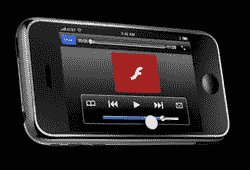

# Flash 可能会出现在 iPhone 上…如果苹果同意的话

> 原文：<https://www.sitepoint.com/flash-coming-to-iphone-maybe-if-apple-says-okay/>

在目前正在英国布莱顿举行的[海滩上的 Flash](https://www.flashonthebeach.com/)会议上，据报道 Adobe 高级工程总监 Paul Betlem [告诉观众](https://www.flashmagazine.com/news/detail/flash_for_the_iphone_confirmed_at_fotb/)Adobe 正在为 iPhone 开发一个版本的 Flash player，并表示如果苹果批准，它将“在很短的时间内”上市，据 Flash 杂志报道。在过去的八个月里，Flash for iPhone 的谣言一直在激烈地传播，但现在 Adobe 似乎把球踢到了苹果的球场上，基本上是说 iPhone 上的 Flash 是否会成为现实取决于他们。

二月份，Flash”就在眼前。然而在三月份，对苹果公司的史蒂夫·乔布斯来说,“T2”太慢了，Flash Lite 太有限了。几周后，Adobe 首席执行官尚塔努·纳拉延表示，尽管苹果不情愿，Adobe 仍在向前推进。“我们认为闪存是互联网体验的同义词，我们致力于将闪存引入苹果手机。我们已经评估了(软件开发工具)，我们认为我们可以自己开发一款苹果闪存播放器，”他[在电话会议](https://www.engadget.com/2008/03/19/adobe-says-flash-is-coming-to-the-iphone/) 

毫无疑问，开发者希望 iPhone 上有 Flash(就此而言，还有 Java)。根据 Adobe 的内部统计，Flash 是 RIA 的关键技术之一，在支持互联网的桌面上有 99%的采用率。Adobe 的数字据说还包括相当隐晦的“各种设备”，但由于 iPhone 在智能手机市场占[超过 10%的份额，并且苹果公司预计到今年年底将售出 1000 万部手机，iPhone 上的 Flash 显然对 Adobe 很重要。](https://blog.changewave.com/2008/07/apple_3g_iphone.html)

真正的问题是，如果 Flash 正在路上，AIR 什么时候会来 iPhone？我们上周[报道了目前正在开发的两个 iPhone 应用程序，这两个应用程序将允许网络开发人员在 iPhone 上“离线”使用他们的网络应用程序，并使用 JavaScript API 访问 iPhone 的原生功能，如 GPS、摄像头和加速度计。我们希望看到 Adobe 为 iPhone 推出 Flex 和 AIR 版本，以及 Flash，这将允许 web 应用程序开发人员轻松地为 iPhone 应用程序商店打包他们的 web 应用程序。我们也很乐意看到苹果让这一切发生。](https://www.sitepoint.com/two-apps-that-lower-the-iphone-development-barrier/)

<object width="425" height="344"><param name="movie" value="https://www.youtube.com/v/bjgXnMVMimg&amp;hl=en&amp;fs=1&amp;rel=0"><param name="allowFullScreen" value="true"><embed src="https://www.youtube.com/v/bjgXnMVMimg&amp;hl=en&amp;fs=1&amp;rel=0" type="application/x-shockwave-flash" allowfullscreen="" width="425" height="344"></object>

## 分享这篇文章