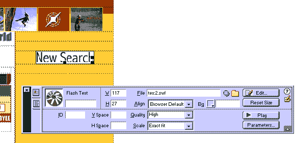
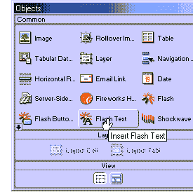
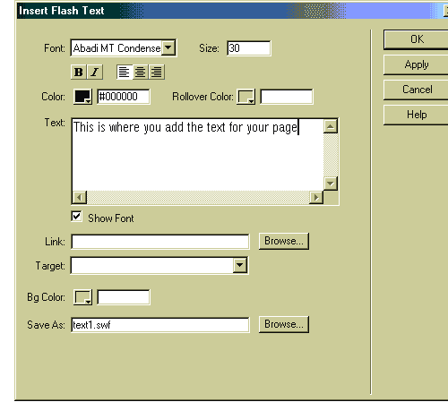
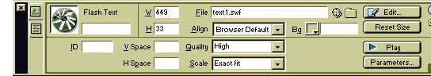
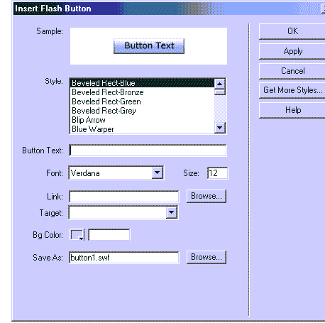

# 使用 Dreamweaver 轻松制作 Flash

> 原文：<https://www.sitepoint.com/flash-dreamweaver/>

似乎你在网上访问的每个页面都以某种方式使用了 Flash——无论是介绍电影，还是时髦的按钮，Flash 无处不在。但是如果你没有 Flash，是不是意味着你不能使用这个设施呢？你有 Dreamweaver 4 吗？如果你回答“是”，那么你就准备好了！Dreamweaver 4 为您提供了将简单的 Flash 电影直接快速添加到网页中的工具。

Dreamweaver 4 附带了两个方便的工具:Flash 文本和 Flash 按钮，这两个工具都允许您非常容易地将 Flash 添加到页面中。没有必要乱七八糟地安排或创造设计——它们都是内置的。

*“新搜索”按钮是用 Dreamweaver 4 的 Flash 文本工具创建的*

##### Flash 文本

正如您对 Macromedia 的期望，向您的网页添加 Flash 文本和按钮非常容易。管理此过程的所有控件都显示在下面的对象面板中。默认面板是公共对象。如果您没有看到此面板，请选择对象面板右上角的箭头，并从下拉列表中选择“常用”。

*Flash 文本和 Flash 按钮对象位于常用对象面板上*

首先，我们将探索 Flash 文本功能。打开一个新页面，并将其保存为 FlashText.htm 注意:在添加 Flash 文本和 Flash 按钮之前，您必须先保存一个页面。

选择 Flash 文本按钮。这将打开 Flash 文本控件的对话框。您将在下图中看到，该窗口与 Dreamweaver 中其他对象控件的对话框窗口非常相似。Flash 文本窗口分为一系列框，您需要填写这些框来创建 Flash 文本电影。

*Flash 文本维护控制 Flash 文本在 Web 浏览器中显示方式的属性。*

我总是先在“文本”框中填入我想在页面上看到的文本。Flash 文本功能对于页面上的小段落文本非常有用，尽管文本有 1024 个字符的限制。

Flash 文本可以使用许多您可能在“属性”面板中用来编辑文本的工具进行修改，例如粗体、斜体、对齐和文本颜色按钮。您对文本所做的所有修改将应用于整段文本。不过，你不会在文本窗口中看到变化。只有当您选择“确定”并查看页面上的 Flash 文本时，它们才会出现。但首先，让我们看看其他一些功能。

与传统的 HTML 文本相比，Flash 文本的一个优势是可以使用任何字体和字体大小。下拉字体列表显示所有注册到您的计算机的字体。选取字体时，您会看到文本区域中的文本更改为新字体的样式(取消选择“显示字体”复选框会关闭此功能)。

众所周知，HTML 不允许太多的字体控制——这不再是一个问题。除了选择任何字体，您还可以选择字体的确切大小。在上面的例子中,“大小”被设置为 30，这相当于网页上的 30 磅。HTML 中的字体大小只能在级联样式表的帮助下更改。

对我来说，一个很大的优势是能够让我的 Flash 文本具有交互性。在文本框下方，您可以添加到另一个网页的链接。写下你自己的链接，或者选择浏览按钮，从你的网站中选择一个链接。该控件非常类似于“属性”面板上用于文本和图形的“浏览文件”功能。此外，如果你的网站是基于框架的，你可以通过目标下拉框引导你的链接在“目标窗口”中打开。这与属性面板上的 Tar-get 窗口的工作和行为方式完全相同。

默认情况下，所有 Flash 电影的背景颜色都是白色的，但是背景颜色选项可以将背景颜色更改为几乎任何颜色。选择此选项打开色板，您可以从中选择所需的颜色。

网站是用文件集合创建的。有图形文件(GIF 和 JPG)，网页(HTML)，现在你有 Flash 电影。每个 Flash 文件都以。swf(读作 SWiF)。Flash 文本必须是这种格式，才能在网页中查看。因此，当您保存 Flash 电影时，请记住从“另存为文件”选项中选择此选项。默认情况下，您创建的第一个 Flash 文本将被命名为 text1.swf。如果您不更改文件的名称，并决定向页面添加第二个 Flash 文本电影，则第二个文件将被命名为 text2.swf。第三个文件将被命名为 text3.swf，依此类推。将文件重新命名为 words.swf。选择“确定”并在页面上查看文本。要测试您可能添加的任何链接，您需要在浏览器中预览页面，或者通过选择属性面板上的绿色“播放”按钮来播放电影。

##### Flash 文本属性面板

针对 Dreamweaver 中 Flash 文本的具体情况,“属性”面板略有修改。图 D 显示了 Flash 文本属性面板特有的功能。

*Flash 文本属性面板*

总的来说，该面板看起来非常类似于 Flash 属性面板，因为我们正在处理 Flash 电影。最显著的区别是编辑按钮。选择“编辑”按钮将打开 Flash 文本窗口，其中将显示您选择的所有选项。您可以修改文本、字体或任何选项，然后单击“确定”重新保存文件，更改将立即生效。为什么这如此令人兴奋？这很令人兴奋，因为 Flash SWF 文件格式是一种锁定格式。也就是说，当 SWF 文件被创建时，您不能修改它:用于创建 SWF 的原始源文件必须被修改。Dreamweaver 通过利用 Flash Generator 构建和修改 SWF 文件来解决这个棘手的问题，它允许您非常容易地创建和编辑 Flash 文本。

##### 闪光按钮

如果 Flash 文本好玩；闪光按钮非常酷。您会在通用对象面板上找到一个名为“闪光按钮”的按钮。选择此项打开闪光按钮窗口。

*闪光按钮窗口*

大多数 Flash 按钮窗口都复制了 Flash 文本窗口:您可以添加文本、应用任何类型或大小的字体、插入链接、更改电影的背景颜色以及修改最终 SWF 文件的名称。区别在于我们创建的 Flash 电影的类型。电影现在是一个风格化的互动按钮。你知道吗？你有将近 40 多种款式可供选择。向下滚动样式菜单列表以预览样式。您将看到，当您滚动时，顶部窗口中的样本会不断变化。如果您想看到按钮动画，只需将光标滚动到示例上。例如，如果您选择“星形旋转器”样式并将光标滚动到它上面，当您滚动时会看到星形旋转。

您添加到“按钮文本”字段的文本将被添加到按钮中。每种样式都会将字体默认为最适合该按钮的字体，但是您仍然可以自己修改字体

让我们创建一个新的 Flash 按钮。打开窗口并应用以下设置:

*   样式:滑块
*   按钮文本:站点点
*   字体:影响
*   尺寸:16
*   链接:http://www.sitepoint.com
*   另存为:sitepoint.swf

好的，这个按钮会把你带到 SitePoint，但是重点是你可以看到配置一个 Flash 按钮是多么容易。选择“确定”,按钮将被嵌入到您的网页中。按 F12 在浏览器中预览网页。当你将光标滚动到按钮上时，你会看到它会动起来，并允许你点击它——当你这样做时，你会被带到 SitePoint。

任何闪光灯按钮可以从闪光灯按钮属性面板修改。在 Dream-weaver 的页面上突出显示 Flash 按钮，从属性面板中选择“编辑”。将打开 Flash 按钮窗口，可以修改按钮的所有参数。

##### 一些 Flash 小技巧

总有时间耍一两个花招。我之前提到的一件事是每个 Flash 电影的默认背景色是白色。如果您的用户使用 Microsoft 的 Internet Explorer 4.0+查看您的网站，这种情况可以改变

选择一个 Flash 电影，如您之前创建的 Flash 文本，并打开该电影的属性面板。如果您完全展开面板，您会在右下角看到一个名为“参数”的按钮。选择参数按钮。“参数”窗口打开。此窗口允许您将特定于 Internet Explorer 的附加参数添加到影片中(这是因为 Netscape 和 Microsoft 处理 Web 插件的方式不同)。如图 g 所示，为参数添加“wmode ”,为值添加“transparent”。

*参数窗口*

选择“确定”。直到您在浏览器中预览该页面时，您所做的操作才会显现出来，您会看到附加参数使 Flash 影片的背景颜色变得透明。这允许背景颜色(或图像)以透明 GIF 文件允许背景显示的相同方式显示出来。此外，这允许将 Flash 电影放置在 Dreamweaver 层中，并相互堆叠。

Flash 按钮和文本的添加允许任何非 Flash 设计者自由地将 Flash 添加到他们的网站，并给他们的网站带来多媒体驱动的提升。

## 分享这篇文章