# Flash MX 与 LiveMotion 2.0 的对比

> 原文：<https://www.sitepoint.com/flash-mx-livemotion-2-0/>

Adobe 和 Macromedia 是两个最受欢迎的网页 Flash 制作工具的开发者，他们发布了这些令人兴奋的产品的新版本。它们如何比较，哪个适合你？

借助 **Flash MX** ，Macromedia 改进了用户界面，为绘图工具集添加了一些新功能，并增强了编写 ActionScript 脚本的功能。一组 Flash UI 组件，如滚动条、单选按钮和列表框(以及添加第三方组件或创建自己的组件的能力)，有助于创建具有熟悉界面的基于 Web 的应用程序。

与此同时，自从他们的竞争 Flash 工具 LiveMotion 首次发布以来，Adobe 也没有闲着。 **LiveMotion 2.0** 增加了对脚本的全面支持，不仅包括电影片段的元素，还包括整个 LiveMotion 用户界面！除了可与 Macromedia Flash 媲美的矢量绘图和动画工具之外，LiveMotion 还提供了对位图效果的强大支持以及与 Adobe Photoshop 的强大集成。

虽然这两种产品都可以让您轻松地创建简单的 Flash 动画，但它们都提供了一套独特的技术供设计师掌握。每种产品的高级功能也针对不同的目的而专门设计。最后，两者之间有相当大的价格差异。在本文中，我将检查所有这些因素，以便您可以决定哪个产品适合您！

#### Macromedia Flash MX

Flash MX 是 Macromedia 新 MX 系列产品中的第一款，将于 2002 年发布。虽然有点模糊，但这一新产品系列的既定目标是实现下一代互联网内容和应用的开发。我怀疑“下一代”的定义可能会稍作改变，以适应 MX 系列中的每个产品，但产品之间的集成一直是并将无疑继续是 Macromedia 的一个重要关注点。

撇开陈腐的两个字母的品牌方案不谈，这个领先的 Flash 创作包的新版本有很多令人喜欢的地方，尤其是用户界面。光滑，改进的用户界面具有可停靠，可折叠的面板，有助于减少屏幕混乱，同时保持所有您需要的工具在您的指尖(见图 1)。

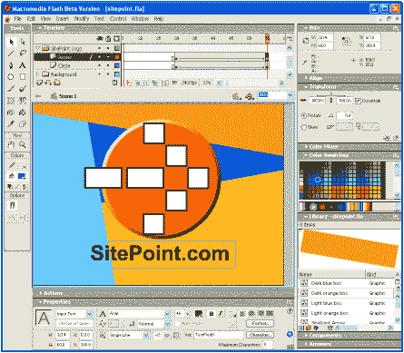*Figure 1: The Flash MX user interface*

Dreamweaver 样式的属性检查器显示所选对象的属性，可以是形状、元件实例、框架或文本(请参见图 2)。这使您可以更快更有效地工作，因为您需要的工具总是在同一个地方(在 Flash 5 中，这些工具分散在总是可见的浮动面板中，因此浪费了屏幕上宝贵的空间)。

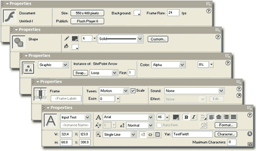*Figure 2: The Properties Inspector gives direct acess to the selected object’s properties*

在这个版本中，时间线再次被更新，以提供更多的视图选项和编辑功能；然而，最显著的增加是将层分组到文件夹中的能力(见图 3)。层文件夹实际上不会以任何方式增加层的行为(就像 LiveMotion 中的对象组一样)，但它们肯定有助于在复杂的项目中保持时间线有序。

*Figure 3: The timeline now lets you group layers into folders to keep them organized*

然而，Flash MX 不仅仅是调整用户界面；至少可以说，Flash MX 中的新功能分为面向设计人员和面向开发人员的项目，令人印象深刻！

##### 新的设计特点

对于设计师来说，改变始于创作一部新电影。Flash 文档现在可以保存为分类模板，您可以从中创建共享公共元素的新文档。Flash MX 附带了许多预构建的模板，您可以使用这些模板立即生成专业的结果。

Flash MX 中的绘图工具也包含一些新的惊喜。新的自由变换工具允许你用扭曲和包络模式编辑矢量形状。扭曲模式允许您在独立的方向上拉出形状的角，而包络模式则更进一步，允许您在边界框上的 8 个点处使用贝塞尔手柄弯曲形状的轮廓。图 4 显示了运行中的包络模式。

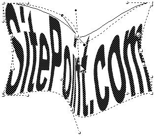*Figure 4: Editing a shape with the Free Transform tool in Envelope mode*

不幸的是,“扭曲”和“封套”对符号、位图、视频对象、渐变填充、对象组或文本不起作用。为了获得图中的效果，文本必须转换为矢量形状，因此不再可编辑。一旦将包络或变形应用到形状，就无法进一步编辑该包络或变形，您必须应用全新的变换。有了所有这些限制，这个新工具远没有它可能有的用处，但是它仍然允许你实现一些独特的效果。

相比之下，一个非常实用的新功能是“对齐像素”选项。启用时，会调整对象的形状和大小，使其边缘正好落在像素边界上。这使您可以避免由沿您想要清晰显示的边缘进行抗锯齿而导致的模糊边缘。当您以 400%或以上的放大率工作时，此功能还会在背景中显示一个可见的像素网格。在图 5 中，我使用这个网格来确定“I”的大小和位置，使它们沿着像素边界，这将确保形状的边缘看起来清晰明确。

*Figure 5: Positioning a shape precisely along pixel boundaries with Snap to Pixels*

Flash MX 中设计人员最喜欢的功能是支持视频元素。您在一段时间内不会在其他 Flash 创作软件中找到此功能，因为支持压缩视频是 Flash Player 6.0 的新功能。一步，你可以导入任何视频文件(QuickTime，Windows 视频，MPEG 视频等。)在您的 Flash 电影中使用(参见图 6)。

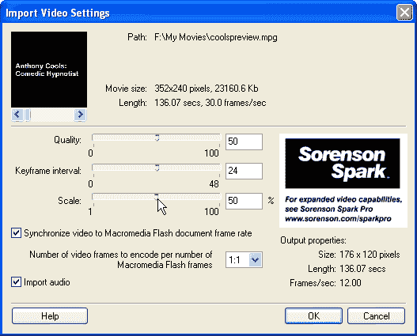*Figure 6: Use the Import Video to set compression options and preview your video*

Flash MX 提供的内置视频压缩仅使用恒定比特率(CBR)编码，这足以满足大多数用途。如果您需要更高质量的视频和更小的文件大小，您可以购买 Sorenson Spark Pro for Flash MX，它支持视频的多通道、可变比特率(VBR)编码。

一个视频对象的行为可以完全由 ActionScript 控制，例如，您可以创建播放、停止、暂停、倒带和快进按钮来控制电影中的视频对象。我预计网络上的视频将会因此大量增加，不是因为 Flash 比微软和 Real Networks 这样的公司做得更好，而是因为 Flash 太受欢迎了，而且很容易制作！

##### 新的开发功能

尽管我在上面提到了所有新的设计特性，Macromedia 希望将 Flash MX 定位为构建下一代 Web 应用程序的 Web 界面的平台。今年晚些时候发布的 ColdFusion MX 以及 Application Server Gateway 和 Communication Server for Flash MX 将为实现这一目标提供大量服务器端支持，但 Flash MX 中面向开发人员的增强功能只是第一步。

如果你最近做过任何严肃的 Flash 开发，你可能不得不写一些动作脚本。随着脚本编辑器和调试器的增强，Flash MX 对这种受 JavaScript 启发的脚本语言的支持得到了进一步改进。

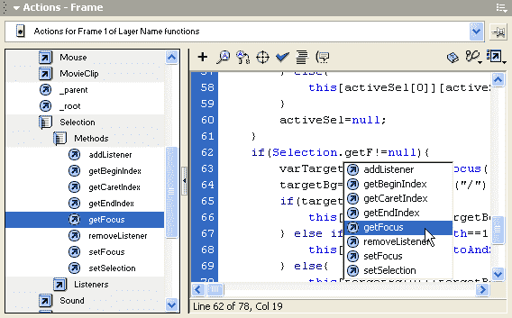*Figure 7: The new Actions editor includes full code highlighting and hinting*

编辑器(参见图 7)现在突出显示 ActionScript 代码中的关键字和值，并在您编码时在弹出列表中提供有用的属性和方法列表。对于初学者，可以将编辑器留在正常模式下，该模式提供了脚本清单中每个命令的向导式视图。完整的 ActionScript 参考以参考面板的形式内置在编辑器中，可以随时调用该参考面板来查找选定代码段的描述，而不必启动浏览器来查看完整的联机帮助。最重要的是，编辑器现在只是界面中的另一个可停靠、可折叠的面板，所以你不需要每次想要编辑脚本时都打开一个新窗口！

严肃的动作脚本编写者也会对新的脚本调试器感到高兴(见图 8)，它允许您在代码中设置断点，并在电影以预览模式运行时一次一行地单步调试脚本。

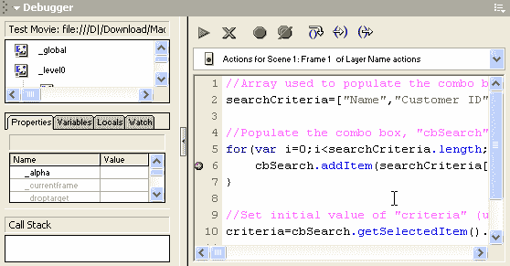*Figure 8: The new ActionScript debugger lets you step through your code as it runs*

如果所有这些额外的脚本工具还不足以让您相信 Macromedia 希望您用 Flash 设计应用程序界面，那么新的基于组件的创作功能肯定会让您信服！图 9 显示了 Flash MX 附带的一组基本用户界面组件。

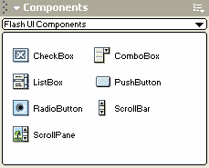*Figure 9: Flash MX includes a set of components, and lets you create and distribute your own*

此外，您可以创建自己的组件来做您喜欢的任何事情。组件本质上表现为电影剪辑，但具有由组件开发人员定义的一组自定义属性和方法。预计很快就会在 Macromedia Flash Exchange 上看到大量这些方便的小部件可供下载。

除了这些主要的开发功能，Flash MX 还包括对许多非常高级的功能的支持，这些功能看起来像是为补充 ColdFusion MX、Flash MX 的应用服务器网关和 Flash MX 的通信服务器而构建的，所有这些功能都将于今年晚些时候发布。增强了对加载和解析 XML 文档以及与 ColdFusion MX、J2EE 或交换消息的支持。NET 应用服务器似乎只是冰山一角。

这些产品和功能将使您的 Flash 电影能够以轻松的方式与您的 Web 服务器实时交换数据，并利用 Web 服务和其他服务器端资源。Flash Player 6.0 甚至支持从麦克风录制音频和从安装在用户计算机上的网络摄像头录制视频；与即将推出的通信服务器结合使用，这些功能似乎将使 Flash 成为明年视频会议的首选工具！

##### 汇总闪存 MX

对于 Flash 5 的用户来说，Flash MX 确实是一个值得的升级。仅改进后的用户界面就将极大地提高您的工作效率，新的设计和开发功能为您在简单的电影和成熟的基于 Web 的应用程序界面中使用增添了大量功能。

Macromedia 几乎每年都会推出 Flash 的新版本。令人欣慰的是，他们不断提高标准，每次发布都足以证明升级的成本是合理的。由于这种持续的创新，Flash 设计和开发的世界每天都变得更加精彩！

**完整版:499 美元**

**升级:199 美元**

从 Macromedia.com 可以免费下载 30 天的试用版。

请继续阅读，了解 Adobe LiveMotion 2.0 的优势！

#### Adobe LiveMotion 2.0

尽管市场上有许多产品可以让你设计 Flash 动画(见我们对 [SWiSH 2.0](http://www.webmasterbase.com/article/681) 和 [Swift3D 2.0](http://www.webmasterbase.com/article/380http://www.webmasterbase.com/article/681) 的评论)，Adobe LiveMotion 却是 Macromedia Flash 的唯一直接竞争对手，这一荣誉令人怀疑。虽然 Adobe 似乎注定要赶上 Macromedia 推出的最具创新性的功能(毕竟，只要 SWF 文件格式不支持他们想要添加的功能，Macromedia 就可以自由地向 Flash Player 添加新功能)，但在我对 LiveMotion 2.0 的测试中，我发现了一种产品，它真正采用了一种不同的方法来制作 Flash 动画，并使其工作正常——在某些情况下，比 Macromedia 更好！

##### 用户界面

LiveMotion 的用户界面(见图 10)与 Adobe 的其他图形产品(如 Photoshop 和 Illustrator)非常相似。如果你尝试过 LiveMotion 1.0，你会发现 2.0 中的界面相对来说没什么变化。Macromedia Flash 用户会发现它与 Flash 5.0 的界面非常相似。

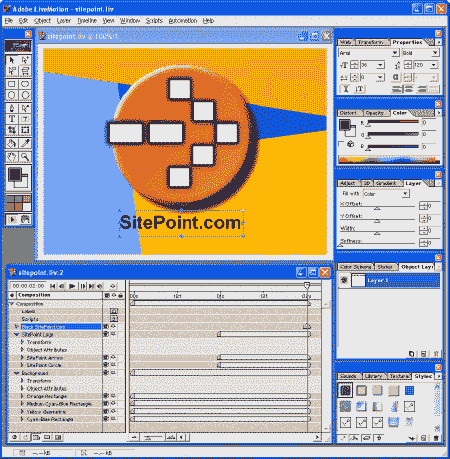*Figure 10: The LiveMotion 2.0 user interface*

更适合 Macintosh 平台的 UI 不会在 PC 上赢得任何设计奖项。合成和时间线窗口被限制在程序的主窗口中显示，而浮动工具箱和面板可以在屏幕上自由定位。

你可能会想一直最大化地使用 LiveMotion，因为在屏幕上拖动窗口时发现自己忘记了工具箱和所有面板，这是非常令人不安的。我通常喜欢使用平铺的合成和时间轴窗口来占据整个屏幕，并大量使用 Tab 热键，它可以立即隐藏/显示所有浮动面板。

##### 绘图工具

LiveMotion 的绘图工具与 Macromedia Flash 5 的基本相同，但除了那些基本的矢量工具之外，LiveMotion 还添加了许多位图对象效果。

例如，LiveMotion 允许你对一个文本对象应用 Photoshop 质量的投影。这是通过向文本对象添加第二个对象层，将该层偏移几个像素，为其指定一个平滑度值，并稍微降低层的不透明度来实现的(参见图 11)。应用所有这些设置后，文本仍然完全可编辑。

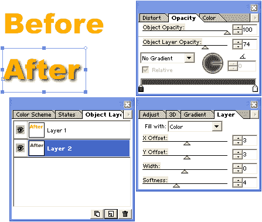*Figure 11: LiveMotion lets you add drop shadows without using a separate graphics app*

在 Macromedia Flash 中实现这种效果的唯一方法是创建一个文本对象，并在 Fireworks 等图形程序中应用所有效果，然后将该图像导入到 Flash 电影中。如果您随后想要编辑文本，您需要返回到 Fireworks 并编辑原始文件，然后在 Flash 中重新导入它。

像这样的许多位图效果在 LiveMotion 中是可能的，您可以将预置存储在“样式”调板中，以便您可以轻松地将它们应用到相同或其他合成中的其他对象。比较图 12 中的两个 SitePoint 徽标。要在 Macromedia Flash 中制作出图 12(b)的质量，需要使用一个单独的图形程序，如 Fireworks，此外还需要做更多的工作，然而这个例子只使用了 LiveMotion 中最基本的效果。

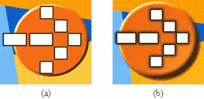*Figure 12: A SitePoint logo created in (a) Macromedia Flash, and (b) LiveMotion 2.0\. The LiveMotion version benefits from the bitmapped effects that LiveMotion provides.*

在您过度使用 LiveMotion 位图效果之前，请注意使用它们的对象将在完成的 Flash 电影文件中导出为图像。就文件大小(因此下载时间)而言，图像比纯矢量图像大得多。例如，图 12(a)中的动画产生了一个 4KB 的 SWF 文件，而图 12(b)产生了一个 20.88KB 的 SWF！

认识到 LiveMotion 用户可能会比普通 Flash 设计人员使用更多的位图效果，Adobe 对其导出的位图对象的质量提供了复杂的控制。“导出”面板(见图 13)允许您为文档中的所有位图对象设置全局质量选项，以及为特定对象设置特定设置。

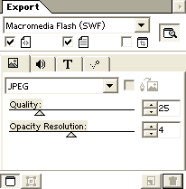*Figure 13: The Export panel lets you set bitmap quality options*

通过将对象中所有位图元素的质量降低到 25%并将不透明度分辨率降低到 4 位，我可以将上面的动画大小削减到 16.1KB。

##### 基于对象的时间轴

在我看来，LiveMotion 中的时间轴大大优于 Macromedia Flash 中的时间轴，即使它看起来不那么漂亮(见图 14)。

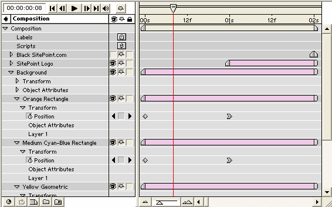*Figure 14: The LiveMotion timeline is based on objects and time, not layers and frames*

与 Macromedia Flash 不同，Macromedia Flash 显示一个层列表，并根据帧网格绘制这些层的变化，LiveMotion 时间轴显示一个*对象*的列表，并控制每个对象的*属性*如何随*时间*变化。这些设计选择有许多优点:

*   在 Macromedia Flash 中，您需要花时间为文档中要制作动画的每个元素创建一个层。在 LiveMotion 中，每个对象都可以在时间轴上独立地设置动画，因此不需要人为的图层概念！
*   Macromedia Flash MX 引入了层文件夹，允许您将层分组到可折叠的集合中，以保持时间轴有序。在 LiveMotion 中，群组显示为可折叠的对象列表。这可以让你动画的单个对象以及整个组，如果你愿意，同时提供相同的组织优势的“层文件夹”。
*   因为可以制作动画的每个对象属性都出现在时间轴的单独一行中，所以消除了 Macromedia Flash 中存在的在可能重叠的时间段内制作单个对象的两个不同属性的动画的困难。
*   因为 LiveMotion 中时间轴的水平刻度是时间，而不是帧(尽管帧也会显示)，所以您可以更改影片的帧速率设置，而不必重新进行影片中的所有计时。在 LiveMotion 中，两秒钟的动画需要两秒钟，无论它对应的是 24 帧还是 48 帧。

LiveMotion 2.0 的新功能是“时间缩放”功能。通过在时间轴上调整分段大小时按住 ALT，可以重新定位这些分段中的关键帧，以便缩放现有动画以适应新的时间段。例如，如果一个对象在时间轴上存在了 5 秒，并且在 1 秒和 3 秒处有关键帧，那么如果您在按住 ALT 的同时将对象的时间轴调整为 10 秒，关键帧将在 2 秒和 6 秒处重新定位—动画已经“时间缩放”为其原始长度的两倍。Macromedia Flash 没有这样的东西。

##### 完整的脚本支持

虽然 LiveMotion 1.0 只包含少量可以分配给对象和帧的基本行为，但 LiveMotion 2.0 提供了对脚本的全面支持，在大多数情况下超过了对手！)Macromedia Flash 中 ActionScript 的功能！

像 Macromedia Flash 中的 ActionScript 一样，LiveMotion 的脚本语言也是基于 JavaScript 的，实际上更接近于完全支持 JavaScript 语言。LiveMotion 的 JavaScript 版本、Macromedia ActionScript(从 Flash 5 开始)和 ECMA 标准 JavaScript 之间的所有差异都记录在 LiveMotion 脚本指南的前几页中。

除了基本的 JavaScript 语法，LiveMotion 还支持与 ActionScript 相同的大多数方法和属性名称，因此在大多数情况下，有经验的 ActionScript 开发人员不需要学习任何新知识就可以在 LiveMotion 中编写脚本。

LiveMotion 中的脚本编辑器和程序的其他部分一样，简单但功能强大(见图 15)。它提供了基本的语法突出显示，以及所有支持的对象和方法的列表，以及组合中的所有对象和标签。

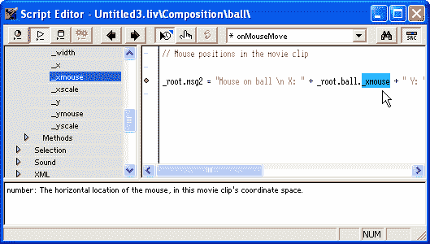*Figure 15: The LiveMotion script editor provides code highlighting and a reference panel*

在 Macromedia Flash 中，与特定对象相关的所有脚本都显示在一起，而在 LiveMotion 中，对象支持的每个事件都是单独处理的。例如，要编写当鼠标进入和退出 Macromedia Flash 中的按钮时执行的脚本，您可以编写一个带有 *on(翻转)*和 *on(卷展)*部分的脚本。LiveMotion 通过允许您为 *onButtonRollOver* 和*on button rollover*事件编写单独的脚本，将这两个脚本分开。

编辑器还允许您设置断点，这些断点将冻结代码的执行，并使用 LiveMotion 的全功能脚本调试器单步调试代码(参见图 16)。

*Figure 16: LiveMotion includes a full-featured script debugger*

然而，Adobe 并不满足于添加与 Macromedia Flash 不相上下的脚本支持。在 LiveMotion 中，不仅您的 Flash 电影完全可以编写脚本，您的设计环境也是如此！LiveMotion 附带了许多示例脚本，可以在一个步骤中自动执行繁琐的任务或对对象应用复杂的特殊效果！

为了使这一功能对设计者更加友好，LiveMotion 支持在称为 LiveTabs 的友好界面中包装脚本。LiveMotion 也提供了其中的一些功能。当您打开 LiveTab 时，会出现一个简单的界面，让您设置脚本选项并运行它。图 17 显示了 TextFX LiveTab，它允许您快速方便地将复杂的动画效果应用于文本对象。

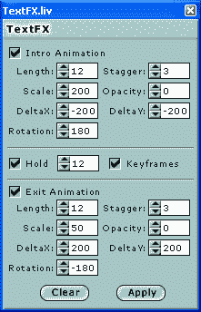*Figure 17: The TextFX LiveTab*

很明显，Adobe 正在押注 LiveMotion 社区将开发自己的自动化脚本和 LiveTabs，用于 live motion；可能性真的是无穷无尽！

##### 与其他产品的集成

对于其他 Adobe 产品的用户来说，LiveMotion 是一个特别有吸引力的选择。LiveMotion 2.0 具有一系列令人印象深刻的与 Photoshop、Illustrator、After Effects 和 GoLive 等产品的集成功能。

例如，如果您将 Photoshop 或 Illustrator 图像放入 LiveMotion 合成中，您可以将其拆分，以获得原始文档中每个图层(或图层组)的对象。对应于层组的对象也可以进一步分解。然后，您可以单独制作 Photoshop/Illustrator 图像各层的动画。

您可以随时单击源自 Photoshop/Illustrator 文件的任何对象，然后选择“编辑原件”在相关程序中打开原始图像。你可以做任何你喜欢的改变，然后回到 LiveMotion。您对文件所做的更改会反映在合成中找到的该文件的所有部分中，即使它们已经被分解并制作了动画！

##### 弱点

然而，消息并不都是好的。与设计领域的 Macromedia Flash 相比，LiveMotion 确实在几个方面存在不足。这些是大委屈还是小烦恼，就看你个人风格和喜好了。

首先，Macromedia Flash 的一个功能是渐入渐出，它允许您创建非常流畅的动画。在 Macromedia Flash 中，您可以调整任何补间动画，使其“缓入”(由慢到快)或“缓出”(由快到慢)动画。“缓动”影响动画的程度在 Macromedia Flash 中是可配置的。另一方面，LiveMotion 只提供固定量的“放松”——而且数量相当少！效果的强度是不可配置的，并且在许多情况下不足以被看到。

第二个问题实际上似乎是 LiveMotion 坐标系的一个副作用，它是严格基于像素的。当您拆分对象时(例如，将 Photoshop 图像拆分成图层，或将一段文本拆分成字母)，这些片段会移动到一个精确的像素位置，即使它们不在原始对象的该位置。要查看实际效果，请创建一个大字体的文本对象(72 pt Times New Roman 在这里效果很好)，然后选择“对象”>“转换为”>“对象”。请注意，有几个字母稍微移动了位置。在一般情况下，这不是一个严重的问题，但在特殊情况下(例如，当你在图层非常仔细对齐的情况下拆分 Photoshop 图像时)，这确实很麻烦。

##### LiveMotion 2.0 概述

我必须承认，在我自己尝试 LiveMotion 之前，我几乎认为它是 Macromedia Flash 的苍白模仿。男孩是我弄错了！LiveMotion 2.0 不仅与竞争对手比肩，实际上在几个领域都超过了竞争对手。

仅基于对象的时间轴和位图效果就足以让任何 Macromedia 用户羡慕不已，但当您添加 Photoshop 和 Illustrator 集成等创新功能时(只需等到您创建第一部动画 Photoshop 电影！)，LiveMotion 2.0 才是真正的赢家！

如果这还不足以说服你，看看价格！LiveMotion 的常规价格比 Flash MX 低 100 美元，如果您提前购买，您可以获得整整 300 美元的优惠！

**完整版:2002 年 5 月 7 日前为 199 美元(此后为 399 美元)**

**升级:99 美元**

Adobe.com 免费提供 LiveMotion 2.0 的 30 天试用版。

##### 它们是如何堆积起来的

你选择哪一款产品，实际上取决于哪一款产品具有对你来说更重要的特性。以下是一些指导原则:

**购买 Flash MX 如果……**

*   您可以构建基于 Web 的应用程序界面，这些界面将受益于 Flash MX 基于组件的开发以及即将推出的服务器交互和通信功能。
*   您需要在 Flash 电影中支持流式视频。
*   您是 Macromedia Flash 的长期用户，不想学习新的工作方式。

**购买 LiveMotion 2.0，如果……**

*   你是一个新的或相对缺乏经验的预算 Flash 设计师。
*   您可以使用其他 Adobe 应用程序，如 Photoshop、Illustrator、GoLive 和 After Effects。
*   Macromedia Flash 时间线让你烦不胜烦。
*   你喜欢完全脚本化的设计环境。

## 分享这篇文章