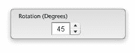
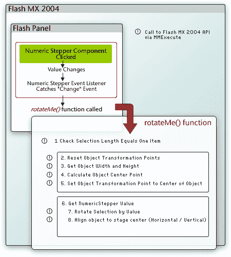
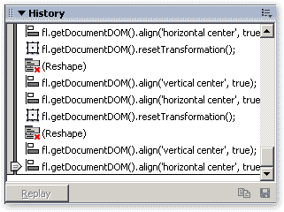
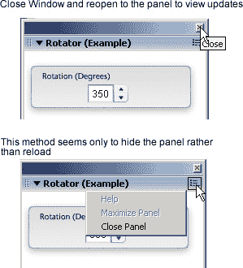

# 闪光板——灵感、创造和实施

> 原文：<https://www.sitepoint.com/flash-panels/>

在本文中，我将解释 Flash 面板如何适应扩展 Flash MX 2004 的大计划。我们还将讨论在日常工作中使用 Flash 面板时可能遇到的一些好处和陷阱。



通过本教程，您将使用标准的 Flash MX 2004 组件、大量的 ActionScript 以及一些提示和技巧来创建自己的 Flash 面板，以控制舞台上电影剪辑的旋转。我希望您在完成本教程后，能够创建自己的 Flash 面板，并探索 Flash MX 2004 的功能和可能性，以及您自己的想法！

在我们开始这次可扩展性之旅之前，让我指出几个在您追求闪存面板卓越的过程中非常有价值的资源:

*   [Flash MX 2004 JavaScript Dictionary](http://www.macromedia.com/support/documentation/en/flash/#flashjsdict):一本无价的圣经，几乎包含了你需要的所有 Flash API 信息。
*   [JSFL 文件 API](http://www.macromedia.com/devnet/mx/flash/articles/jsapi.html) (不包含在 Flash MX 2004 JavaScript 字典中；Flash MX 2004 7.2 更新程序中添加的功能)。

在 Flash MX 2004 中使用的 Flash 面板的创建基本上取决于对 JSAPI (JavaScript API)的理解和使用。它基于文档对象模型(DOM)，允许通过简单的基于 JavaScript 的命令访问 Flash 文档和 Flash MX 2004 的内部功能。

自 Flash MX 2004 发布以来，已经创建了许多 JSFL (Flash JavaScript)命令、Flash 面板和自定义工具来帮助自动化任务，并向直接影响 Flash 创作环境中的反馈的复杂控件添加自定义界面。其中一些可以在 [SitePoint 的 Flash 博客](https://www.sitepoint.com/blog/)中找到；其他的很容易通过搜索找到(使用“JSFL 命令”或“Flash 面板”作为关键字)。

如果你对 ActionScript 很熟悉，突破界限去开发你自己的定制命令和面板并不是一种信仰的飞跃，而是向前迈出的一小步。由于 JSAPI 基于 Netscape JavaScript API 和 Flash 的文档对象模型，开发和编写 Flash JavaScript 应该是一个自然的过程。

就其本质而言，Flash 面板是导出的 SWF 文件。然而，它们与用于创建命令的标准 JSFL 文件略有不同，因为它们利用了名为`MMExecute()`的包装函数。这允许编译的 SWF 和 Flash MX 2004 API 之间的交互。

考虑下面的 JSFL 代码行，它返回舞台上第一个选定项的当前宽度:

```
var objectWidth= fl.getDocumentDOM().selection[0].width;
```

为了在 SWF 面板中获得相同的功能，需要对代码进行如下更改:

```
var objectWidth=MMExecute("fl.getDocumentDOM().selection[0].width");
```

如果我们检查包含在`MMExecute("JavaScript String")`中的代码，我们会注意到它与我们上面看到的 Flash JavaScript 完全相同。唯一的区别是它现在被封装在包装器中。`MMExecute()`函数将 Flash JavaScript 字符串作为单个参数，并将其传递给 Flash API。然后对其进行处理，并可选地给出一个返回值。然后可以将该值赋给一个变量。

##### 闪光灯面板位置

在创作环境中，所有主要的 Flash 面板都可以在一个简单的位置找到。只需选择“窗口>其他面板>”即可在 Flash MX 2004 中访问它。

当您创建 Flash 面板并在真实环境中进行测试时，请记住以下位置。这些是 Flash MX 2004 定位自定义面板的文件夹:

*Windows 2000 或 Windows XP*

驱动器:文档和设置用户本地设置应用程序数据 DataMacromediaFlash MX 语言配置 windows swf

*视窗 98*

驱动器:windows 应用程序数据 DataMacromediaFlash MX 语言配置 WindowSWF

麦克·OS X

驱动器:/用户/用户名/库/应用程序支持/Macromedia/Flash MX 2004/语言/配置/WindowSWF

我们将在稍后测试和部署扩展时使用这些目录位置。

##### 灵感

有时当你在工作的时候，你会突然想‘哎呀，如果我能自动化[在此插入任务]不是更快吗？’通常情况下，答案通常是，“是的，自动化这项任务会很棒……但是我到底该怎么做呢？”'

输入:Flash 面板…实际上，不仅仅是任务的自动化保证了 Flash 面板的创建；对的需求可能源于以下任何一项(以及一些其他)要求:

*   **自动化:**在 Flash MX 2004 中自动化通常费力且耗时的任务(代码添加、时间轴效果)
*   **快速访问:**快速访问菜单隐藏命令
*   **GUI 控制:**添加一个 GUI 来控制实时效果(旋转、缩放、位置等)

创建 Flash 面板可能是一项艰巨的任务，这就是为什么在开始之前你需要为面板设定一个明确的目标。一旦您明确决定了想要面板做什么，您就已经完成了创建面板的大部分工作(除了明显的编码和与界面挂钩)。

下一步是在纸上或在您选择的文本编辑器中勾画出命令的流程(它是如何工作的)。

*注意:*当我在 Flash 中工作时，我总是在身边放一个笔记本，专门记录想法/解决方法。有时，当你正在工作的时候，一个需求或想法会突然出现在你的脑海中，你可以自动化、加速或添加一个界面，以使你和你的同事的生活更轻松。把这些想法列成一个清单，这样那些稍纵即逝的想法就不会丢失，每个人都可以从创建你的省时小组中受益！

在我们将要创建的示例中，我们将使用 NumericStepper 组件的单个实例来控制电影剪辑的旋转。请看下图，它显示了我们即将在 Flash MX 2004 中创建的命令的命令流程:



为此，我们将添加一个 change 事件处理程序来捕捉 NumericStepper 组件的值何时增加或减少。当值改变时，事件处理程序将触发一个名为`rotateMe()`的函数，该函数包含封装在`MMExecute()`包装函数中的所有 Flash JavaScript，这是该函数执行其给定任务所必需的。

##### 有人想上历史课吗？

“历史记录”面板(“窗口”>“其他面板”>“历史记录”)有助于深入了解 Flash MX 2004 的内部工作原理。当您希望通过脚本方法重新创建效果时，历史面板可能是一个很好的起点。

在用户与舞台上的应用程序进行大部分交互的过程中，如果打开了“历史记录”面板，您会注意到其中出现的事件。这是 JSFL 用户和应用程序之间的通信历史的可视化表示。



历史记录中的大部分元素都可以复制到剪贴板，并粘贴到您最喜欢的文本编辑器中进行研究，除了旁边出现一个红叉的元素。
如果您试图确定相关的 API 引用来执行您试图自动化的给定的基于 stage 的任务，并且您在[Flash MX 2004 JavaScript Dictionary](http://www.macromedia.com/support/documentation/en/flash/#flashjsdict)中找不到它，请在 stage 上执行该任务，并简单地从“历史记录”面板中进行复制和粘贴。它为您自己的定制命令提供了一个极好的起点！


您也可以将选定的步骤(但不是标有红色“x”的步骤)保存为命令，只要不需要任何用户交互，就可以从“命令”菜单中获得该命令。创建带有接口的一次性命令的过程是另一个主题——我们将在另一篇文章中回到这个话题。

##### 创造

介绍够了！让我们开始创建一个旋转电影剪辑的命令。
创建旋转器闪光面板

我已经在本文的可下载代码档案中为面板提供了代码。RotatorStart.fla 包含时间轴层结构和面板的背景图像。本例中完成的 FLA 名为 RotatorFinal.fla。

如果任何时候您需要查找该功能的流程，请参考上图。

##### 设置场景

我们的第一步是添加控制效果的组件；由于背景和图层已经设置好，我们只需在插入控制 ActionScript 之前向舞台添加一个组件。

当然，不言而喻，面板越复杂，你在屏幕上同时拥有的控件就越多。在您创建了这个简单而有效的示例之后，我将让您尝试自己的创作。

1.  打开起点 FLA(代码归档中的 RotatorStart.fla ),将 NumericStepper 组件的一个实例从“组件”面板的“UI 组件”部分拖动到“界面”层的第一帧上。将实例命名为 stepSizer。

3.  将 NumericStepper 组件实例居中放置在圆角矩形背景上，并将默认参数值更改为以下值:
    *   最高:360
    *   最小值:0
    *   步长:5
    *   价值:45 英镑

5.  将您的 Flash 文档保存到您选择的位置。

7.  将 JXLFLAPI.as 文件从代码归档复制到保存 FLA 的位置(这是一个 JSFL 包装器，用于简化一些任务)。

现在我们已经创建了界面，我们需要添加控制 ActionScript 来实现效果。

##### 添加动作脚本

很明显，但是你的面板试图完成的事情越多，ActionScript 和封装的 JSFL 就变得越复杂。

在此示例中，代码非常简单且线性，但是当您创建自己的 Flash 面板并开始扩展 Flash MX 2004 时，事情会变得稍微复杂一些。出于这个原因，正如我前面提到的，勾画出命令的数据流通常非常有帮助。你不会后悔的！

*   选择动作层的第一帧，并在“动作”面板中添加以下代码:

```
//Stage Controls 

Stage.align = "TC"; 

Stage.scaleMode = "noScale"; 

Stage.showMenu = false; 

//Flash API Wrapper (Courtesy Jesse Warden) 

#include "JXLFLAPI.as" 

//Main Rotation Function 

function rotateMe() 

{ 

  var selectionChecker = MMExecute("fl.getDocumentDOM().selection.length"); 

  if (selectionChecker == 1) 

  { 

    //Reset Transformation Points to allow easy rotation 

    MMExecute("fl.getDocumentDOM().resetTransformation()"); 

    //Get Selection Width and Height 

    var objectWidth =  MMExecute("fl.getDocumentDOM().selection[0].width"); 

    var objectHeight = MMExecute("fl.getDocumentDOM().selection[0].height"); 

    //Calculate Center Points 

    var objCenterHorz = int(objectWidth / 2); 

    var objCenterVert = int(objectHeight / 2); 

    //Move Transformation Point to Dead Center (Helps when rotating) 

    MMExecute("fl.getDocumentDOM().setTransformationPoint({x:" + Math.floor(objCenterHorz) + ", y:" + Math.floor(objCenterVert) + "})"); 

    //Get Rotation Value 

    var incrementer = stepSizer.value; 

    //Rotate Selection 

    MMExecute("fl.getDocumentDOM().rotateSelection(" + incrementer + ")"); 

    //Align H/V to Center of Stage 

    MMExecute("fl.getDocumentDOM().align('vertical center', true)"); 

    MMExecute("fl.getDocumentDOM().align('horizontal center', true)"); 

    //Update Preview Information 

  } else 

  { 

    break; 

  } 

} 

//========================== 

//Miscellaneous Functions 

//========================== 

//Middle Mouse Wheel Support 

//========================== 

var mouseListener:Object = new Object(); 

mouseListener.onMouseWheel = function(delta) 

{ 

  stepSizer.value += delta; 

}; 

Mouse.addListener(mouseListener); 

//========================== 

//Create Event Handler / Dispatcher for Numeric Stepper 

//========================== 

stepsListener = new Object(); 

stepsListener.change = function() 

{ 

  rotateMe(); 

}; 

stepSizer.addEventListener("change", stepsListener); 

//Numeric Stepper Event Handler Ends
```

让我们一步一步地看代码，看看它是如何组合在一起的。首先，我们设置主舞台设置，将舞台内容与 TC(顶部中心)对齐。我们关闭了放大功能，并阻止了右键菜单的出现。

```
//Stage Controls 

Stage.align = "TC"; 

Stage.scaleMode = "noScale"; 

Stage.showMenu = false;
```

然后我们包含了一个来自[杰西·沃顿](http://www.jessewarden.com)的漂亮的 JSFL 包装器，它允许我们封装一些 JSFL 风味，而不需要担心在`MMExecute()`函数中有时复杂的单双转义字符串。

```
#include "JXLFLAPI.as"
```

*注意:*使用 JSFL 包装器，我们可以简化下面的跟踪语句:

```
MMExecute("fl.trace("Tracing to the Output Panel")"); 

The JSFL wrapper simplifies the code as follows: 

flapi.trace("Tracing to the Output Panel")
```

继续面板的流程，我们必须考虑舞台上的 NumericStepper 组件实例的侦听器对象。我们使用 change 事件，以便当用户单击 NumericStepper 的向上或向下控制器时，调用`rotateMe()`函数:

```
stepsListener = new Object(); 

stepsListener.change = function() { 

  rotateMe(); 

}; 

stepSizer.addEventListener("change", stepsListener);
```

每当 listener 对象检测到 NumericStepper 组件的选定值已经更改时，就会调用`rotateMe()`函数。如果我们参考前面的流程图，我们可以清楚地看到发生的一连串事件。

首先，我们检查用户是否只从 stage 中选择了一个项目:

```
var selectionChecker =       MMExecute("fl.getDocumentDOM().selection.length"); 

if (selectionChecker == 1) {
```

然后，我们将对象的变形点重置到中心位置。原因很简单:当我们旋转对象时，它会围绕这个变换点旋转。如果转换点偏离中心，就很难判断发生了什么。使用对象的宽度和高度将变形点重置为对象的中心点，可以更容易地观察旋转并保持整洁。

```
//Reset Transformation Points to allow easy rotation 

MMExecute("fl.getDocumentDOM().resetTransformation()"); 

//Get Selection Width and Height 

var objectWidth = 

    MMExecute("fl.getDocumentDOM().selection[0].width"); 

var objectHeight =     MMExecute("fl.getDocumentDOM().selection[0].height"); 

//Calculate Center Points 

var objCenterHorz = int(objectWidth/2); 

var objCenterVert = int(objectHeight/2); 

//Move Transformation Point to Dead Center (Helps when rotating) 

MMExecute("fl.getDocumentDOM().setTransformationPoint({x:"+Math.floor(objCenterHorz)+", y:"+Math.floor(objCenterVert)+"})");
```

然后，我们获取 NumericStepper 组件的当前值，将其存储在 incrementer 变量中，并使用`rotateSelection(value)`相应地旋转选择。由于 NumericStepper 组件通过按住方向按钮来促进连续反馈的使用，这可以产生令人满意的功能效果。

```
//Get Rotation Value 

var incrementer = stepSizer.value; 

//Rotate Selection 

MMExecute("fl.getDocumentDOM().rotateSelection("+incrementer+")");
```

最后，我们在旋转对象的同时，将它与舞台中心对齐。加这个代码是我个人的选择。如果省略，Flash MX 2004 应用集中变形点的方式会导致对象漂移(参见前面的讨论)。

```
//Align H/V to Center of Stage 

MMExecute("fl.getDocumentDOM().align('vertical center', true)"); 

MMExecute("fl.getDocumentDOM().align('horizontal center', true)");
```

为了旋转选定的对象，这就是我们需要做的全部工作；但是，ActionScript 的一个附加片段将为 Flash 面板提供鼠标中键滚轮支持。这允许我们通过点击上下箭头或者上下滚动鼠标滚轮来增加或减少旋转值。这使用了与 NumericStepper 组件的事件处理程序相同的方法，但是使用了`onMouseWheel`事件处理程序来增加或减少组件的值。

```
var mouseListener:Object = new Object(); 

mouseListener.onMouseWheel = function(delta) {  stepSizer.value += delta; 

}; 

Mouse.addListener(mouseListener);
```

*   保存您的 Flash 文档，并使用合适的名称将 SWF 导出到您的 Flash MX 2004“windows wf”目录，如下所示。

*Windows 2000 或 Windows XP*

驱动器:文档和设置用户本地设置应用程序数据 DataMacromediaFlash MX 语言配置 windows swf

*视窗 98*

驱动器:windows 应用程序数据 DataMacromediaFlash MX 语言配置 WindowSWF

麦克·OS X

驱动器:/用户/用户名/库/应用程序支持/Macromedia/Flash MX 2004/语言/配置/WindowSWF

*   重新启动 Flash 并从“窗口”>“其他面板”>[导出的 SWF 的名称]
    访问面板。要使用该命令，只需从舞台中选择一个对象，然后使用 Flash 面板中的控件来控制对象的旋转。现在你有了一个功能齐全的闪光面板，可以快速、明确、及时地控制你的物体的旋转！

*注意:*在开发阶段，我通常使用 Flash JSFL 包装器将信息跟踪到输出面板。例如，在这种情况下，如果我想在鼠标中轮滚动时跟踪 NumericStepper 组件的当前值，我会在代码中添加粗体显示的行。

```
var mouseListener:Object = new Object(); 

mouseListener.onMouseWheel = function(delta) { 

  flapi.trace("Object rotation is now "+stepSizer.value+ " degrees"); 

  stepSizer.value += delta; 

};
```

还要注意的是，我在本文的末尾添加了几个额外的函数来帮助你！

现在剩下的就是把 SWF 打包成一个可管理的 MXP 文件，可以安装到你的机器上，或者你的同事或者任何你想安装的人的电脑上！

##### 履行

在我们将 Flash Panel 打包成可分发的格式之前，我们需要检查几个“问题”!

***在 Flash MX 2004 中更新面板***

当您对 Flash Panel 项目的界面进行更改或向其中添加代码时，显然需要将更新后的 SWF 导出到“WindowSWF”文件夹中。但是，为了查看更新，您需要在面板未停靠时单击窗口“x”按钮来关闭面板，并从“窗口>其他面板>”菜单中重新打开它，而不是从选项弹出菜单中选择“关闭面板”。这背后的原因是，点击“关闭面板”选项似乎只是隐藏面板，而不是正确地关闭它并从内存中释放它。



***命名导出的 SWF***

在为 Flash MX 2004 开发扩展时，我遇到了几个“名称冲突”问题，至少可以说，它们可能有点令人恼火！有时，当您将 SWF 导出到“WindowSWF”目录并尝试在 Flash MX 2004 中打开面板时，会打开一个不同的面板！

显然没有解决方法，您只需更改 SWF 的名称，直到它在您从“窗口”>“其他面板”>“您的面板”中选择面板时打开正确的面板。在我看来，Flash MX 2004 的内置目录解析使用了一个简单的正则表达式来遍历目录，很容易混淆！希望这将在 Flash MX 2004 的下一个次要(或主要)版本中得到纠正。

***包你的面板***

为了使您闪亮的新面板易于共享，您需要创建一个可以用 Macromedia 扩展管理器安装的 MXP 文件。第一步是创建一个 MXI 文件，扩展管理器可以用它来编译 MXP 文件。MXI 本质上是一个 XML 文件，包含关于扩展的简单信息:版本信息、扩展名和描述，以及要编译的文件。

注意一个例子。mxi 文件包含在文章源代码中，因此您可以根据需要修改它。

虽然描述那些创建可分发 mxp 的人可用的所有选项超出了本文的范围，但是我将在这里介绍一些基础知识来帮助您入门。

为了给我们刚刚创建的 Flash 面板创建一个 MXI 文件，打开你最喜欢的文本编辑器，添加如下内容:

```
<?xml version="1.0" encoding="UTF-8"?> 

<macromedia-extension 

   name="Rotator Panel for Flash MX 2004" 

   version="1.0.1" 

   type="Command" 

   requires-restart="true"> 

  <author name="Phireworx" /> 

  <products> 

    <product name="Flash" version="7" primary="true" /> 

  </products> 

  <description> 

  <![CDATA[ 

  Happily rotate your objects in Flash MX 2004 using this Simple     Panel 

  ]]> 

  </description> 

  <ui-access> 

  <![CDATA[ 

  Access to the command panel is by selecting 'Window > Other Panels     > Rotator Panel' in Flash MX 2004\.  

  ]]> 

  </ui-access> 

  <license-agreement> 

  <![CDATA[ 

  ]]> 

  </license-agreement> 

  <files> 

  <file source="Rotator Panel.swf" destination="$flash/WindowSWF" /> 

  </files> 

</macromedia-extension>
```

MXI 文件包含不同的信息，所有这些都可以很容易地理解和编辑，以适应自己的需要。以下是信息所在位置的快速概述:

*   **作者姓名:`<author>`标签内的**姓名属性

*   **描述:`<description>`标签内的**
*   **访问和使用说明:`<UI-access>`标签内的**
*   **源文件:`<file>`标签内的**源属性
*   **文件目的地:**您应该安装文件的位置在`<file>`标签目的地属性内

最重要的部分是我们要添加的 SWF 文件的名称:

```
 <file source="Rotator Panel.swf" destination="$flash/WindowSWF" />
```

我们只需将导出的 SWF 的名称放入“文件源”部分，并添加“WindowSWF”目录作为目标(`$flash/WindowSWF`)。

请注意，您在扩展中包含的导出的 SWF 文件的名称将出现在 Flash MX 2004 菜单系统中的“其他面板”下。

根据需要编辑选项后，用扩展名保存文件。mxi(例如旋转面板；。mxi)。

现在，您可以双击 MXI 文件，并且(如果安装了 Macromedia Extension Manager ),系统会提示您输入要打包的扩展(MXI)。您还将被要求输入一个名称，以便保存扩展包(MXP)。Macromedia Extension Manager 会自动创建 MXP 文件，然后您可以根据需要分发该文件！

在这篇文章中，我只是浏览了创建你自己的自定义 Flash 面板的表面，但是我当然希望这些信息已经给了你创建你自己的 Flash 面板的动力！如果您确实创建了任何令人兴奋的 Flash 面板，您可以通过在 [Flash 论坛](https://www.sitepoint.com/forums/forumdisplay.php?f=150)中发帖来与 SitePoint 社区共享它们。

不要害怕尝试你自己对面板和命令的酷效果和想法。我们论坛上见！

##### 额外功能

这里有几个额外的函数来帮助你开发 Flash 面板。

***显示警报***

当从编译的 SWF 中调用时，这段简单的代码将在 Flash MX 2004 中产生一个警告。

```
errMsg = "alert('Please Save Your FLA before Applying the Effect');"; 

MMExecute(errMsg);
```

***检查文件是否保存***

下一段代码将检查当前文档是否已保存，并执行一个条件函数:

```
function checkDocumentIsSaved() { 

  var fileDestinationTemp = MMExecute("fl.getDocumentDOM().path"); 

  if (fileDestinationTemp != "undefined") { 

    //Document is Saved, do something 

  } else { 

    //Document is NOT Saved, do something 

  } 

}
```

***遍历选中的舞台对象***

这个简单的代码将遍历舞台上当前选定对象的数组。这对于整体更改选定对象组的属性非常有用:

```
var objLength = MMExecute("fl.getDocumentDOM().selection.length"); 

  for (var i = 0; i<objLength; i++)  

      { 

      //Do Something to the selected object here 

      flapi.trace(i); 

      }
```

## 分享这篇文章