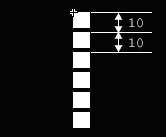
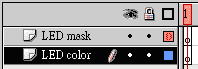
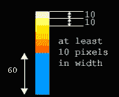
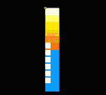
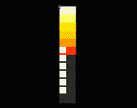
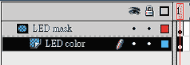
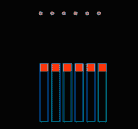
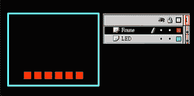

# Flash 脚本–LED 显示屏

> 原文：<https://www.sitepoint.com/flash-script-led-display/>

 **<object type="application/x-shockwave-flash" data="https://i2.sitepoint.com/flash/led.swf" width="400" height="400" bgcolor="black"><param name="movie" value="https://i2.sitepoint.com/flash/led.swf"></object>**

[在此下载示例文件](https://www.sitepoint.com/examples/flashscript/led.zip)。

**1。**打开一个新电影，给它宽度 200，高度 150。将背景颜色设置为黑色。

**2。**新建一个正方形的图形符号(姑且称之为“gr_square”)，高度和宽度为 8 个像素。选择一种可以在黑色背景下看到的颜色。

**3。**创建一个 movieclip 符号(姑且称之为“mv_bar”)。将 gr_square 的 6 个实例拖到 movieclip 中。将它们垂直对齐，使每个方块的左上角与其下一个方块相隔 10 个像素。

最上面的正方形的左上角应该在坐标 x=0，y=0 处。



**4。**新建一个 movieclip 符号(姑且称之为“mv _ led bar”)2 层。将上层命名为“LED 遮罩”，下层命名为“LED 颜色”。现在，将 mv_bar 的一个实例拖动到上层，并将其定位在 x=0，y=50。



**5。**将下面的 movieclip 动作添加到 mv_bar 的实例中。

```
onClipEvent (enterFrame) { 

indicator = Math.round(Math.random() * 100); 

if (indicator > 55 && this._y > 5) { 

this._y -= 10; 

} else if (indicator < 45 && this._y < 55) { 

this._y += 10; 

} 

}
```

**6。**在底层，用这里显示的尺寸画出下面的图形——选择你喜欢的任何颜色！



**7。**将图形与 mv_bar 实例对齐，如下所示:



**8。**将最低块的颜色设置为黑色(使其与电影背景颜色相同)。



**9。**设置图层属性，使上层成为蒙版，下层成为蒙版图层。



10。回到场景 1，将图层 1 重命名为“LED”。将 mv_LEDbar 的几个实例拖到舞台上。如下所示对齐实例。



**11。**在 LED 图层上方添加一层，命名为“框架”。画一个矩形，然后删除填充颜色，以便您可以看到下面的 LED 实例。



我们完了！测试电影，你会看到你的闪光 LED 显示屏。

## 分享这篇文章