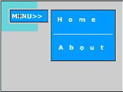

# Flash 脚本–弹出菜单

> 原文：<https://www.sitepoint.com/flash-script-popup-menu/>

 **<object type="application/x-shockwave-flash" data="https://i2.sitepoint.com/flash/popup.swf" width="400" height="400" bgcolor="black"><param name="movie" value="https://i2.sitepoint.com/flash/popup.swf"></object>**

在 Flash 中创建一个弹出菜单并不像看起来那么困难。在这里，我们将逐步完成创建 yoru won Flash 弹出菜单的过程。

请注意，本教程假设您知道如何创建一个不可见的按钮。

**1。**创建一个按钮对象。我把我的按钮叫做“菜单”。

**2。**选择按钮对象，按 f8，并选中 radio movieclip 将其转换为 movieclip。将此电影剪辑命名为“popup”。

**3。**现在，进入弹出式电影剪辑的时间线。选择当前层，并命名为“按钮”。

**4。**在按钮层创建两个关键帧。选择第一个关键帧并插入:

```
stop ();
```

**5。**选择第二个关键帧，插入同样的动作:

```
stop ();
```

**6。**现在选择第一个关键帧。将此操作赋予菜单按钮:

```
on (rollOver) 

{ 

gotoAndStop (2); 

}
```

**7。**锁定按钮层。

**8。**接下来，在按钮层上方新建一层，命名为“popup”。

**9。**创建一个弹出窗口，在这一层创建两个关键帧。

10。现在，选择弹出层的第一个关键帧，按 delete 键。然后，锁定弹出层。

**11。在弹出层上新建一层。将其命名为“invisiblebutton”。**



**12。**创建一个不可见的按钮，然后选中 invisible button 图层，将其延伸两帧。最后，插入以下内容:

```
on (rollOver) 

{ 

gotoAndStop (1); 

}
```

完成后，锁定图层。

这是最基本的！现在，您可以继续自定义弹出窗口，并根据需要包含单独的按钮。祝你好运！

[在此下载示例文件](https://www.sitepoint.com/examples/flashscript/popup.zip)。

## 分享这篇文章