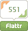

# 这是一个平淡的季节

> 原文：<https://www.sitepoint.com/flattr-social-micropayment-donations/>

在网上发布文章、视频、照片、音乐、播客、代码或任何其他内容都是一项艰苦的工作。努力得到回报是件好事，但财务选择仍然有限:

*   广告。这并不适合所有情况，如果你在第三方网站上托管内容，这可能会很棘手。也不能保证有人会点击你的横幅。
*   捐赠按钮。使用 PayPal 等系统进行小额支付是可能的，但实际上，捐赠者必须送几美元才能使其有价值，这需要花费他们几分钟的时间。

如果几百个人决定每人出几分钱不是更好吗？

Flattr 是一个来自瑞典的另类“社交小额支付”系统。它是这样工作的:

1.  在[Flattr.com](http://flattr.com/register)注册一个用户账户
2.  选择通过 PayPal 或 Moneybookers 每月向 Flattr 支付一笔费用——保持注册状态每月至少需要支付 2 欧元。
3.  只要在您喜欢的内容上看到 Flattr 按钮，就点按它。

每个月底，你捐款的 10%会被收取费用，剩下的部分会分给你交过房租的每个人。如果你支付 2.00 欧元并点击了 18 个 Flattr 按钮，Flattr 将收取 0.20 欧元，每个作者将获得 0.10 欧元。如果你什么都没付，你的钱会捐给慈善机构。

作者可以自由地给任何内容添加 Flattr 按钮。受欢迎的项目出现在 Flattr 目录的顶部，因此可能会获得更多的观众和更多的收入。然而，在你能得到之前，你必须愿意给予:除非你捐献并给予他人，否则你不可能加入这个网络。

Flattr 是一个有趣的想法。它让微支付捐款变得快速、简单和实用，而无需借助广告。最大的问题是:这行得通吗？只有当成员达到临界质量时，该系统才能成功。

你会报名吗？

## 分享这篇文章