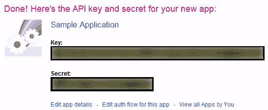
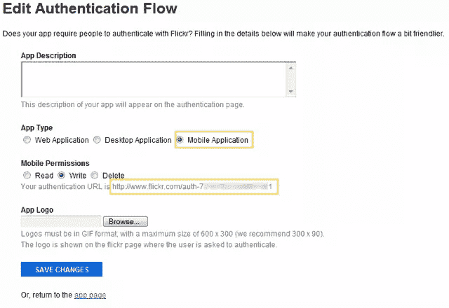
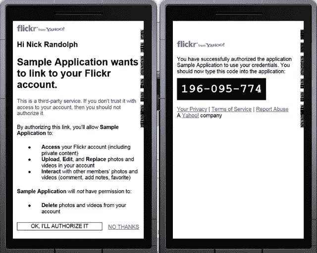

# Windows Phone 应用程序中的 Flickr

> 原文：<https://www.sitepoint.com/flickr-from-a-windows-phone-app/>

认证等级的下一个出租车是 [Flickr](http://www.flickr.com/) 。在前面的文章中，您已经看到了 OAuth 1 的几个实现。不幸的是，虽然 Flickr 声称他们实现了 [OAuth Core 1.0 Revision A](http://oauth.net/core/1.0a/) ，但 Windows Phone 应用程序似乎并非如此。相反，您目前需要使用他们的传统身份验证流程。这将为您提供一个身份验证令牌，您可以使用它来调用 Flickr API。每次调用时，您还需要使用这个令牌进行身份验证，同样使用传统的身份验证过程。这已经被 [Dennis Delimarsky 在他的关于与 Flickr 合作的系列文章](http://dennisdel.com/?p=482)中很好地记录了下来。

在这篇文章中，我不是简单地重复 Dennis 的工作，而是想展示一旦你有了一个遗留的认证令牌，你如何把它换成 OAuth 令牌。这意味着您可以使用 Flickr 新的认证系统对其进行所有的服务调用。将来，当 Flickr 整理出他们的 OAuth 实现时，你所要做的就是去掉初始认证，用你的 OAuth 代码替换它。

### 步骤 1:注册一个 Flickr 应用程序

让我们开始吧——首先，你必须向 Flickr 注册一个应用程序。除了他们的 OAuth 实现不能正常工作之外，他们的文档是猪早餐，很难找到你想要的。从去[http://developer.flickr.com](http://developer.flickr.com)开始。在那里，单击标题下的 API 链接，然后单击请求 API 密钥链接，这应该是入门下的第 1 步。我们快到了。单击 Request an API Key 链接(是的，这是另一个同名的链接，这次是在 App Garden 页面上)。如果你迷路了，直接去 http://www.flickr.com/services/apps/create/apply[注册你的申请。](http://www.flickr.com/services/apps/create/apply)

Flickr 提供非商业或商业注册过程。注册过程中的最大区别是商业注册可能需要一些时间来处理(还要注意关于填写所有字段的警告，以确保他们认为您的申请有效)。图 1 展示了我们的示例应用程序的非商业注册。

[](https://www.sitepoint.com/wp-content/uploads/2011/08/sp0012_01.png)

图 1

输入申请信息后，点击“提交”按钮。在非商业应用程序的情况下，您将立即被分配一个密钥和秘密，如图 2 所示。

[](https://www.sitepoint.com/wp-content/uploads/2011/08/sp0012_02.png)

数字

有一件事你必须改变你的应用程序，以使其可访问你的 Windows Phone 应用程序。单击编辑此应用程序的授权流链接。这将把您带到一个新的页面，在这里您可以为您的应用程序定制认证流程(图 3)。


[](https://www.sitepoint.com/wp-content/uploads/2011/08/sp0012_03.png)

数字

在应用程序类型下，选择移动应用程序。请确保您复制了移动权限下列出的身份验证 URL，因为您将需要此链接来启动应用程序中的身份验证过程。单击“保存更改”按钮提交此更改。

### 步骤 2:创建应用程序

正如我们在以前的文章中所做的，我们将创建一个简单的应用程序来演示 Flickr 集成。下面的 XAML 显示了一个`Button`，用于触发身份验证过程，还显示了两个`TextBlock`元素，用于在身份验证完成后显示用户名和 ID。关于`WebBrowser`控件需要注意的一点是，它没有`IsScriptEnabled`属性——将该属性设置为 True 似乎会导致 Flickr 认证过程失败。

```
<phone:PhoneApplicationPage 
  x:Class="FlickrTestApp.MainPage"

  xmlns:x="http://schemas.microsoft.com/winfx/2006/xaml"
  xmlns:phone="clr-namespace:Microsoft.Phone.Controls;assembly=Microsoft.Phone">
  <Grid>
      <StackPanel x:Name="LayoutRoot"
                  Background="Transparent">
          <Button Content="Authenticate"
                  Click="AuthenticateClick" />
          <TextBlock x:Name="UserNameText" />
          <TextBlock x:Name="UserIdText" />
      </StackPanel>
      <phone:WebBrowser x:Name="AuthenticationBrowser"
                        Visibility="Collapsed"
                        Navigated="BrowserNavigated"
                        />
  </Grid>
</phone:PhoneApplicationPage>
```

### 步骤 3:启动 Flickr 认证

现在你可能会猜测这就是我们要去 Flickr 并获取一个请求令牌的地方，我们将用它来创建登录 URL。不幸的是，如果你这样做，将会显示登录 URL，用户将会输入他们的凭证，然后`WebBrowser`进入 la-la-land，永远不会进入用户应该授权应用程序的下一页。相反，这是您使用在步骤 1 中记下的身份验证 URL 的地方。

```
private const string AuthenticationUrl = "http://m.flickr.com/auth-7xxxxxxxxxxxxxxxxxxx1";
private void AuthenticateClick(object sender, RoutedEventArgs e) {
    AuthenticationBrowser.Navigate(new Uri(AuthenticationUrl));
    AuthenticationBrowser.Visibility = Visibility.Visible;
}
```

这里需要注意的一点是，这里定义的`AuthenticationUrl`常量使用 m.flickr.com 而不是 www.flickr.com(即在您的认证 URL 中将`www`改为`m`)。这确保 Flickr 呈现一个移动页面供您的用户登录。

### 步骤 4:用户登录并授权您的应用程序

当用户点击 Authenticate 按钮时(图 4，第一张图片)，他们将看到 Yahoo/Flickr 登录页面(第二张图片)，然后是授权屏幕(第三张图片)。点击“确定，我将授权”按钮后，他们会看到一个带有 PIN 码的页面。这类似于 OAuth 1 过程，它以验证者 PIN 结束，所以你可以猜到接下来会发生什么……


[](https://www.sitepoint.com/wp-content/uploads/2011/08/sp0012_04b1.png)

图 4a

[](https://www.sitepoint.com/wp-content/uploads/2011/08/sp0012_04c1.png)

图 4b

### 步骤 5:提取迷你令牌(PIN)

在`BrowserNavigated`方法中(每次浏览器导航到一个页面时都会调用该方法)，您需要提取出迷你令牌(即 PIN，如图 4 所示)。下面的代码再次使用正则表达式来提取迷你令牌。

```
private const string RedirectUrl = "http://m.flickr.com/services/auth/";
private string miniToken;
private void BrowserNavigated(object sender, NavigationEventArgs e) {
    if (e.Uri.AbsoluteUri.ToLower() == RedirectUrl) {
        var htmlString = AuthenticationBrowser.SaveToString();
        var pinFinder = new Regex(@"(?<minitoken>[A-Za-z0-9-]+)</span>", RegexOptions.IgnoreCase);
        var match = pinFinder.Match(htmlString);

        if (match.Length > 0) {
            var group = match.Groups["minitoken"];
            if (group.Length > 0){
                miniToken = group.Captures[0].Value;
                if (!string.IsNullOrEmpty(miniToken)) {
                    RetrieveAuthenticationToken ();
                }
            }
        }
        if (string.IsNullOrEmpty(miniToken)) {
            Dispatcher.BeginInvoke(() => MessageBox.Show("Authorization denied by user"));
        }
        // Make sure PIN is reset to null
        miniToken = null;

        AuthenticationBrowser.Visibility = Visibility.Collapsed;
    }
}
```

### 步骤 6:检索身份验证令牌

迷你令牌本身不能用来认证对 Flickr APIs 的调用。相反，您需要通过调用`flickr.auth.getFullToken`方法将其转换成认证令牌。为此，您需要生成适当的 web 请求，该请求将由方法名、参数和签名组成。签名需要是请求参数的 MD5 散列。

不幸的是，Windows Phone 没有 MD5 的实现。幸运的是，在 http://archive.msdn.microsoft.com/SilverlightMD5 的[有一个。转到下载选项卡，将`MD5.cs`文件下载到您的应用程序中。](http://archive.msdn.microsoft.com/SilverlightMD5)

**重要提示**:在撰写本文时，该文件的第 109 行有一个 bug。按照本站首页评论的建议，将 if (cbSize < = 56)替换为 if (cbSize < 56)。

如`RequestAuthenticationToken`方法所示，创建 web 请求的过程相对简单。不要忘记用第一步中的密钥和秘密值更新`ConsumerKey`和`ConsumerSecret`。

```
private const string ConsumerKey = "<your key for your flickr application>";
private const string ConsumerSecret = "<your secret for your flickr application>";

private const string Flickr_GetFullToken = "flickr.auth.getFullToken";

private const string MethodKey = "method";
private const string ApiKeyKey = "api_key";
private const string MiniTokenKey = "mini_token";
private const string ApiSignatureKey = "api_sig";

private void RetrieveAuthenticationToken() {
    var parameters = new Dictionary<string, string>();
    parameters[MethodKey] = Flickr_GetFullToken;
    parameters[ApiKeyKey] = ConsumerKey;
    parameters[MiniTokenKey] = miniToken;

    parameters[ApiSignatureKey] = GenerateSignature(parameters);

    var queryString = BuildParameterString(parameters);
    var reqUrl = "http://api.flickr.com/services/rest/?" + queryString;
    var request = WebRequest.CreateHttp(reqUrl);
    request.BeginGetResponse(result => {
        var req = result.AsyncState as HttpWebRequest;
        using (var resp = req.EndGetResponse(result))
        using (var strm = resp.GetResponseStream()) {
            var xml = XElement.Load(strm);
            var authenticationToken = xml.Descendants("token").Select(x => x.Value).FirstOrDefault();

            RetrieveAccessToken(authenticationToken);
        }
    }, request);
}

private string GenerateSignature(IDictionary<string,string> queryParameters) {
    var parameterList = new List<KeyValuePair<string, string>>(queryParameters);
    parameterList.Sort((kvp1, kvp2) => {
        if (kvp1.Key == kvp2.Key) {
            return string.Compare(kvp1.Value, kvp2.Value);
        }
        return string.Compare(kvp1.Key, kvp2.Key);
    });

    var signatureBase = new StringBuilder(ConsumerSecret);
    foreach (var kvp in parameterList) {
        signatureBase.Append(kvp.Key + kvp.Value);
    }

    return MD5Core.GetHashString(signatureBase.ToString());
}

private static string BuildParameterString(IEnumerable<KeyValuePair<string, string>> parameters) {
    var sb = new StringBuilder();
    foreach (var parameter in parameters) {
        if (sb.Length > 0) sb.Append('&amp;');
        sb.AppendFormat("{0}={1}", parameter.Key, parameter.Value);
    }
    return sb.ToString();
}
```

### 步骤 7:将认证令牌转换为访问令牌

在前面的步骤中，您会注意到，一旦我们检索到认证令牌，就会调用`RetrieveAccessToken`。这是我们用 OAuth 访问令牌(和相应的令牌秘密)交换身份验证令牌(即传统身份验证系统)的过程。它只是对`flickr.auth.oauth.getAccessToken`方法的一个方法调用，如下所示:

```
private const string Flickr_GetAccessToken = "flickr.auth.oauth.getAccessToken";
private const string AuthenticationTokenKey = "auth_token";

private string token;
private string tokenSecret;

private void RetrieveAccessToken(string authenticationToken) {
    var parameters = new Dictionary<string, string>();
    parameters[MethodKey] = Flickr_GetAccessToken;
    parameters[ApiKeyKey] = ConsumerKey;
    parameters[AuthenticationTokenKey] = authenticationToken;

    parameters[ApiSignatureKey] = GenerateSignature(parameters);
    var queryString = BuildParameterString(parameters);
    var reqUrl = "http://api.flickr.com/services/rest/?" + queryString;

    var request = WebRequest.CreateHttp(reqUrl);
    request.BeginGetResponse(result => {
                                        var req =result.AsyncState as HttpWebRequest;
                                        using (var resp = req.EndGetResponse(result))
                                        using (var strm = resp.GetResponseStream()) {
                                            var xml = XElement.Load(strm);
                                            var access =
                                                xml.Descendants("access_token").FirstOrDefault();
                                            token = access.Attribute("oauth_token").Value;
                                            tokenSecret = access.Attribute("oauth_token_secret").Value;

                                            RetrieveProfile();
                                        }
                                    }, request);
}
```

### 步骤 8:检索用户的配置文件

实际上，如果您查看与身份验证令牌一起返回的 XML 响应，您会注意到用户的 ID 包含在该响应中。然而，OAuth 实现的情况并非如此，因此为了使这种方法经得起未来的考验，我们将调用`flickr.test.login`方法，该方法将返回关于经过身份验证的用户的信息。现在我们已经有了 OAuth 访问令牌和密码，我们又回到了熟悉的领域，我们只需要以类似于我们在以前关于 OAuth 的文章中所做的方式创建相应的请求。

```
private const string Flickr_TestLogin = "flickr.test.login";
private const string NoJsonCallBackKey = "nojsoncallback";
private const string FormatKey = "format";

private const string NoCallBack = "1";
private const string JsonResponseFormat = "json";
private void RetrieveProfile() {
    var requestParameters = new Dictionary<string, string>();
    requestParameters[NoJsonCallBackKey] = NoCallBack;
    requestParameters[FormatKey] = JsonResponseFormat;
    requestParameters[MethodKey] = Flickr_TestLogin;

    var profileUrl = "http://api.flickr.com/services/rest";
    var request = CreateRequest("GET", profileUrl, requestParameters);

    request.BeginGetResponse(result => {
        try {
            var req2 = result.AsyncState as HttpWebRequest;
            if (req2 == null) throw new ArgumentNullException("result", "Request parameter is null");
            using (var resp = req2.EndGetResponse(result))
            using (var strm = resp.GetResponseStream()) {
                var serializer = new DataContractJsonSerializer(typeof(FlickrLoginResponse));
                var user = serializer.ReadObject(strm) as FlickrLoginResponse;
                Dispatcher.BeginInvoke(() => {
                                                    UserIdText.Text = user.User.Id;
                                                    UserNameText.Text = user.User.Username.Name;
                                                });
            }
        }
        catch (Exception ex) {
            Dispatcher.BeginInvoke(() => MessageBox.Show("Unable to access profile"));
        }
    }, request);
}

[DataContract]
public class FlickrLoginResponse {
    [DataMember(Name = "user")]
    public FlickrUser User { get; set; }

    [DataContract]
    public class FlickrUser {
        [DataMember(Name = "id")]
        public string Id { get; set; }
        [DataMember(Name = "username")]
        public FlickrUsername Username { get; set; }

        [DataContract]
        public class FlickrUsername {
            [DataMember(Name = "_content")]
            public string Name { get; set; }
        }
    }
}
```

现在，差不多就是这样了。为了确保您不会弄不清从哪篇以前的文章中复制 OAuth 实现(更不用说支持 Flickr 实现所需的一些小调整)，我在这篇文章的末尾包含了 OAuth 代码的其余部分。关于认证帖子的这个系列我们已经接近尾声了——如果有我们没有涉及的社交网络，而你希望在这个系列中看到，请确保你留下评论。

```
private const string OAuthConsumerKeyKey = "oauth_consumer_key";
private const string OAuthVersionKey = "oauth_version";
private const string OAuthSignatureMethodKey = "oauth_signature_method";
private const string OAuthSignatureKey = "oauth_signature";
private const string OAuthTimestampKey = "oauth_timestamp";
private const string OAuthNonceKey = "oauth_nonce";
private const string OAuthTokenKey = "oauth_token";
private const string OAuthTokenSecretKey = "oauth_token_secret";
private const string OAuthVerifierKey = "oauth_verifier";
private const string OAuthPostBodyKey = "post_body";

private const string OAuthVersion = "1.0";
private const string Hmacsha1SignatureType = "HMAC-SHA1";
private string pin;
private WebRequest CreateRequest(string httpMethod, string requestUrl, IDictionary<string, string> requestParameters = null)
{
    if (requestParameters == null)
    {
        requestParameters = new Dictionary<string, string>();
    }

    var secret = "";
    if (!string.IsNullOrEmpty(token))
    {
        requestParameters[OAuthTokenKey] = token;
        secret = tokenSecret;
    }

    if (!string.IsNullOrEmpty(pin))
    {
        requestParameters[OAuthVerifierKey] = pin;
    }

    var url = new Uri(requestUrl);
    var normalizedUrl = requestUrl;
    if (!string.IsNullOrEmpty(url.Query))
    {
        normalizedUrl = requestUrl.Replace(url.Query, "");
    }

    var signature = GenerateSignature(httpMethod, normalizedUrl, url.Query, requestParameters, secret);
    requestParameters[OAuthSignatureKey] = UrlEncode(signature);

    var sb = new StringBuilder();
    sb.Append(url.Query);
    foreach (var param in requestParameters)
    {
        if (sb.Length > 0) sb.Append("&amp;");
        sb.Append(string.Format("{0}={1}", param.Key, param.Value));
    }
    if (sb[0] != '?') sb.Insert(0, "?");
    var request = WebRequest.CreateHttp(normalizedUrl + sb.ToString());
    request.Method = httpMethod;
    request.Headers[HttpRequestHeader.Authorization] = GenerateAuthorizationHeader(requestParameters);
    return request;
}

public string GenerateSignature(string httpMethod, string normalizedUrl, string queryString, IDictionary<string, string> requestParameters, string secret = null)
{
    requestParameters["oauth_callback"] = "oob";
    requestParameters[OAuthConsumerKeyKey] = ConsumerKey;
    requestParameters[OAuthVersionKey] = OAuthVersion;
    requestParameters[OAuthNonceKey] = GenerateNonce();
    requestParameters[OAuthTimestampKey] = GenerateTimeStamp();
    requestParameters[OAuthSignatureMethodKey] = Hmacsha1SignatureType;

    string signatureBase = GenerateSignatureBase(httpMethod, normalizedUrl, queryString, requestParameters);

    var hmacsha1 = new HMACSHA1();
    var key = string.Format("{0}&amp;{1}", UrlEncode(ConsumerSecret),
                            string.IsNullOrEmpty(secret) ? "" : UrlEncode(secret));
    hmacsha1.Key = Encoding.UTF8.GetBytes(key);

    var signature = ComputeHash(signatureBase, hmacsha1);
    return signature;
}

private static readonly Random Random = new Random();
public static string GenerateNonce()
{
    // Just a simple implementation of a random number between 123400 and 9999999
    return Random.Next(123400, 9999999).ToString();
}

public static string GenerateTimeStamp()
{
    var now = DateTime.UtcNow;
    TimeSpan ts = now - new DateTime(1970, 1, 1, 0, 0, 0, 0);
    return Convert.ToInt64(ts.TotalSeconds).ToString();
}

public static string GenerateSignatureBase(string httpMethod, string normalizedUrl, string queryString, IDictionary<string, string> requestParameters)
{
    var parameters = new List<KeyValuePair<string, string>>(GetQueryParameters(queryString))
                            {
                                new KeyValuePair<string, string>(OAuthVersionKey, requestParameters[OAuthVersionKey]),
                                new KeyValuePair<string, string>(OAuthNonceKey, requestParameters[OAuthNonceKey]),
                                new KeyValuePair<string, string>(OAuthTimestampKey,
                                                                requestParameters[OAuthTimestampKey]),
                                new KeyValuePair<string, string>(OAuthSignatureMethodKey,
                                                                requestParameters[OAuthSignatureMethodKey]),
                                new KeyValuePair<string, string>(OAuthConsumerKeyKey,
                                                                requestParameters[OAuthConsumerKeyKey]),
                                new KeyValuePair<string, string>("oauth_callback",
                                                                requestParameters["oauth_callback"])
                            };

    if (requestParameters.ContainsKey(OAuthVerifierKey))
    {
        parameters.Add(new KeyValuePair<string, string>(OAuthVerifierKey, requestParameters[OAuthVerifierKey]));
    }

    if (requestParameters.ContainsKey(OAuthTokenKey))
    {
        parameters.Add(new KeyValuePair<string, string>(OAuthTokenKey, requestParameters[OAuthTokenKey]));
    }

    foreach (var kvp in requestParameters)
    {
        if (kvp.Key.StartsWith("oauth_") || kvp.Key == OAuthPostBodyKey) continue;
        parameters.Add(kvp);
    }

    parameters.Sort((kvp1, kvp2) =>
    {
        if (kvp1.Key == kvp2.Key)
        {
            return string.Compare(kvp1.Value, kvp2.Value);
        }
        return string.Compare(kvp1.Key, kvp2.Key);
    });

    var parameterString = BuildParameterString(parameters);

    if (requestParameters.ContainsKey(OAuthPostBodyKey))
    {
        parameterString += "&amp;" + requestParameters[OAuthPostBodyKey];
    }

    var signatureBase = new StringBuilder();
    signatureBase.AppendFormat("{0}&amp;", httpMethod);
    signatureBase.AppendFormat("{0}&amp;", UrlEncode(normalizedUrl));
    signatureBase.AppendFormat("{0}", UrlEncode(parameterString));

    return signatureBase.ToString();
}

private static IEnumerable<KeyValuePair<string, string>> GetQueryParameters(string queryString)
{
    var parameters = new List<KeyValuePair<string, string>>();
    if (string.IsNullOrEmpty(queryString)) return parameters;

    queryString = queryString.Trim('?');

    return (from pair in queryString.Split('&amp;')
            let bits = pair.Split('=')
            where bits.Length == 2
            select new KeyValuePair<string, string>(bits[0], bits[1])).ToArray();
}

/// <summary>
/// The set of characters that are unreserved in RFC 2396 but are NOT unreserved in RFC 3986.
/// </summary>
private static readonly string[] UriRfc3986CharsToEscape = new[] { "!", "*", "'", "(", ")" };
private static readonly char[] HexUpperChars = new[] { '0', '1', '2', '3', '4', '5', '6', '7', '8', '9', 'A', 'B', 'C', 'D', 'E', 'F' };

public static string UrlEncode(string value)
{
    // Start with RFC 2396 escaping by calling the .NET method to do the work.
    // This MAY sometimes exhibit RFC 3986 behavior (according to the documentation).
    // If it does, the escaping we do that follows it will be a no-op since the
    // characters we search for to replace can't possibly exist in the string.
    var escaped = new StringBuilder(Uri.EscapeDataString(value));

    // Upgrade the escaping to RFC 3986, if necessary.
    foreach (string t in UriRfc3986CharsToEscape)
    {
        escaped.Replace(t, HexEscape(t[0]));
    }

    // Return the fully-RFC3986-escaped string.
    return escaped.ToString();
}

public static string HexEscape(char character)
{
    var to = new char[3];
    int pos = 0;
    EscapeAsciiChar(character, to, ref pos);
    return new string(to);
}

private static void EscapeAsciiChar(char ch, char[] to, ref int pos)
{
    to[pos++] = '%';
    to[pos++] = HexUpperChars[(ch &amp; 240) >> 4];
    to[pos++] = HexUpperChars[ch &amp; 'x000f'];
}

private static string ComputeHash(string data, HashAlgorithm hashAlgorithm)
{
    byte[] dataBuffer = Encoding.UTF8.GetBytes(data);
    byte[] hashBytes = hashAlgorithm.ComputeHash(dataBuffer);

    return Convert.ToBase64String(hashBytes);
}

public static string GenerateAuthorizationHeader(IDictionary<string, string> requestParameters)
{
    var paras = new StringBuilder();
    foreach (var param in requestParameters)
    {
        if (!param.Key.StartsWith("oauth_")) continue;
        if (paras.Length > 0) paras.Append(",");
        paras.Append(param.Key + "="" + param.Value + """);
    }
    return "OAuth " + paras;
}

private IEnumerable<KeyValuePair<string, string>> ExtractTokenInfo(string responseText)
{
    if (string.IsNullOrEmpty(responseText)) return null;

    var responsePairs = (from pair in responseText.Split('&amp;')
                            let bits = pair.Split('=')
                            where bits.Length == 2
                            select new KeyValuePair<string, string>(bits[0], bits[1])).ToArray();
    token = responsePairs.Where(kvp => kvp.Key == OAuthTokenKey).Select(kvp => kvp.Value).FirstOrDefault();
    tokenSecret = responsePairs.Where(kvp => kvp.Key == OAuthTokenSecretKey).Select(kvp => kvp.Value).FirstOrDefault();

    return responsePairs;
}
```

## 分享这篇文章